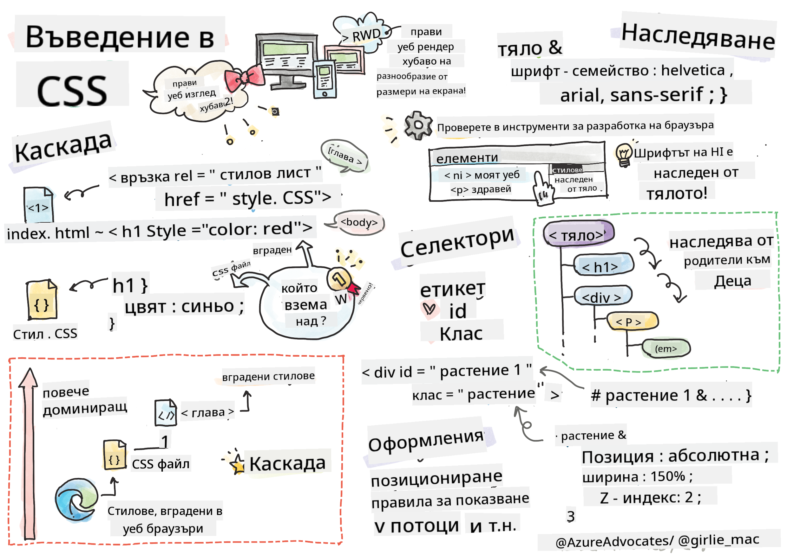
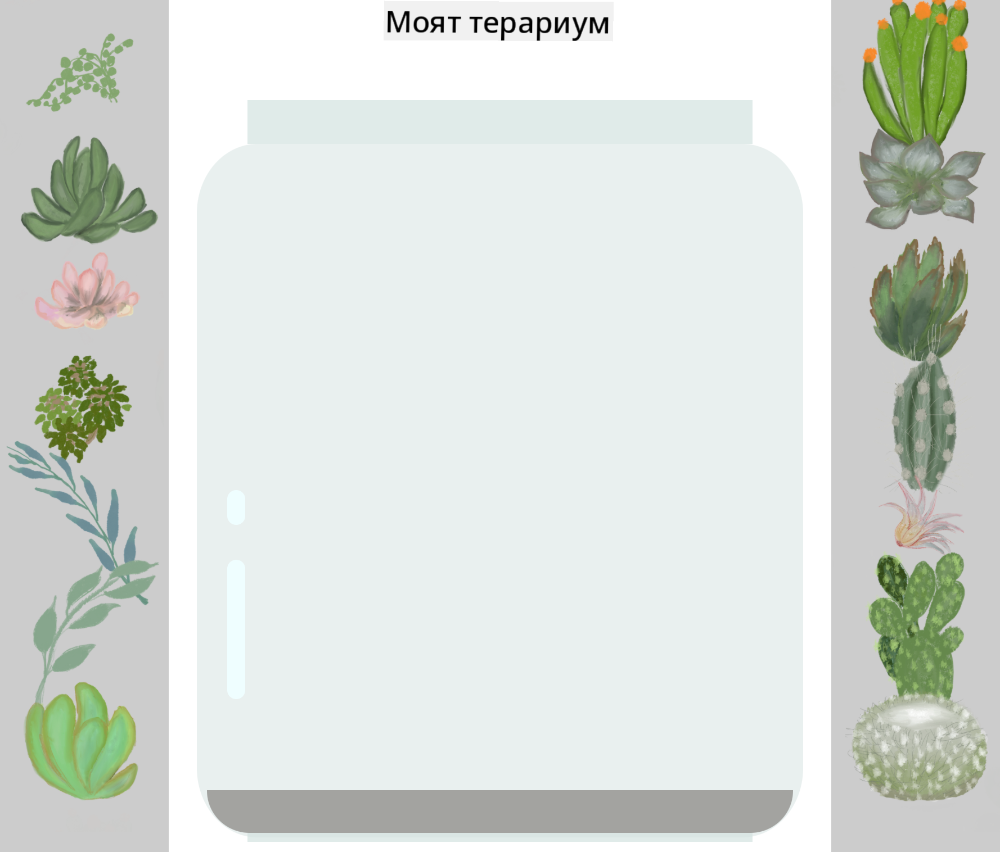

<!--
CO_OP_TRANSLATOR_METADATA:
{
  "original_hash": "acb5ae00cde004304296bb97da8ff4c3",
  "translation_date": "2025-08-29T11:55:15+00:00",
  "source_file": "3-terrarium/2-intro-to-css/README.md",
  "language_code": "bg"
}
-->
# Проект Терариум Част 2: Въведение в CSS


> Скица от [Tomomi Imura](https://twitter.com/girlie_mac)

## Предварителен тест

[Предварителен тест](https://ff-quizzes.netlify.app/web/quiz/17)

### Въведение

CSS, или Cascading Style Sheets, решава важен проблем в уеб разработката: как да направите вашия уебсайт да изглежда добре. Стилизирайки вашите приложения, те стават по-удобни за използване и по-привлекателни; можете също да използвате CSS за създаване на Responsive Web Design (RWD) - позволявайки на вашите приложения да изглеждат добре независимо от размера на екрана, на който се показват. CSS не е само за визуалната част; спецификацията му включва анимации и трансформации, които могат да създадат сложни взаимодействия за вашите приложения. Работната група за CSS помага за поддържането на актуалните спецификации на CSS; можете да следите тяхната работа на [сайта на World Wide Web Consortium](https://www.w3.org/Style/CSS/members).

> Забележка: CSS е език, който се развива, както всичко в уеб пространството, и не всички браузъри поддържат по-новите части от спецификацията. Винаги проверявайте вашите реализации, като се консултирате с [CanIUse.com](https://caniuse.com).

В този урок ще добавим стилове към нашия онлайн терариум и ще научим повече за няколко концепции на CSS: каскадата, наследяването, използването на селектори, позиционирането и използването на CSS за изграждане на оформления. В процеса ще оформим терариума и ще създадем самия терариум.

### Предпоставки

Трябва да имате HTML за вашия терариум, който е готов за стилизиране.

> Вижте видеото

> 
> [](https://www.youtube.com/watch?v=6yIdOIV9p1I)

### Задача

В папката на вашия терариум създайте нов файл, наречен `style.css`. Импортирайте този файл в секцията `<head>`:

```html
<link rel="stylesheet" href="./style.css" />
```

---

## Каскадата

Cascading Style Sheets включват идеята, че стиловете "каскадират", така че приложението на стил се ръководи от неговия приоритет. Стиловете, зададени от автора на уебсайта, имат приоритет пред тези, зададени от браузъра. Стиловете, зададени "inline", имат приоритет пред тези, зададени във външен стилов файл.

### Задача

Добавете inline стил "color: red" към вашия `<h1>` таг:

```HTML
<h1 style="color: red">My Terrarium</h1>
```

След това добавете следния код към вашия файл `style.css`:

```CSS
h1 {
 color: blue;
}
```

✅ Кой цвят се показва във вашето уеб приложение? Защо? Можете ли да намерите начин да отмените стиловете? Кога бихте искали да направите това или защо не?

---

## Наследяване

Стиловете се наследяват от стил на предшественик към потомък, така че вложените елементи наследяват стиловете на своите родители.

### Задача

Задайте шрифта на тялото на даден шрифт и проверете шрифта на вложен елемент:

```CSS
body {
	font-family: helvetica, arial, sans-serif;
}
```

Отворете конзолата на браузъра в таба 'Elements' и наблюдавайте шрифта на H1. Той наследява своя шрифт от тялото, както е посочено в браузъра:


✅ Можете ли да направите вложен стил да наследи различно свойство?

---

## CSS Селектори

### Тагове

Досега вашият файл `style.css` има само няколко стилизирани тага и приложението изглежда доста странно:

```CSS
body {
	font-family: helvetica, arial, sans-serif;
}

h1 {
	color: #3a241d;
	text-align: center;
}
```

Този начин на стилизиране на таг ви дава контрол върху уникални елементи, но трябва да контролирате стиловете на много растения в терариума. За да направите това, трябва да използвате селектори на CSS.

### Ids

Добавете стил за оформяне на левия и десния контейнер. Тъй като има само един ляв контейнер и само един десен контейнер, те са получили ids в маркировката. За да ги стилизирате, използвайте `#`:

```CSS
#left-container {
	background-color: #eee;
	width: 15%;
	left: 0px;
	top: 0px;
	position: absolute;
	height: 100%;
	padding: 10px;
}

#right-container {
	background-color: #eee;
	width: 15%;
	right: 0px;
	top: 0px;
	position: absolute;
	height: 100%;
	padding: 10px;
}
```

Тук сте позиционирали тези контейнери с абсолютно позициониране в крайната лява и дясна част на екрана и сте използвали проценти за тяхната ширина, така че да могат да се мащабират за малки мобилни екрани.

✅ Този код е доста повторен, което не е "DRY" (Don't Repeat Yourself); можете ли да намерите по-добър начин за стилизиране на тези ids, може би с id и клас? Ще трябва да промените маркировката и да рефакторирате CSS:

```html
<div id="left-container" class="container"></div>
```

### Класове

В горния пример сте стилизирали два уникални елемента на екрана. Ако искате стиловете да се прилагат към много елементи на екрана, можете да използвате CSS класове. Направете това, за да оформите растенията в левия и десния контейнер.

Забележете, че всяко растение в HTML маркировката има комбинация от ids и класове. Ids тук се използват от JavaScript, който ще добавите по-късно, за да манипулирате разположението на растенията в терариума. Класовете обаче дават на всички растения определен стил.

```html
<div class="plant-holder">
	
</div>
```

Добавете следното към вашия файл `style.css`:

```CSS
.plant-holder {
	position: relative;
	height: 13%;
	left: -10px;
}

.plant {
	position: absolute;
	max-width: 150%;
	max-height: 150%;
	z-index: 2;
}
```

Забележително в този фрагмент е смесването на относително и абсолютно позициониране, което ще разгледаме в следващия раздел. Обърнете внимание на начина, по който височините се обработват чрез проценти:

Задавате височината на държача на растенията на 13%, добро число, за да гарантирате, че всички растения се показват във всеки вертикален контейнер без нужда от превъртане.

Премествате държача на растенията наляво, за да позволите растенията да бъдат по-центрирани в техния контейнер. Изображенията имат голямо количество прозрачен фон, за да бъдат по-лесни за влачене, така че трябва да бъдат изместени наляво, за да се впишат по-добре на екрана.

След това самото растение получава максимална ширина от 150%. Това му позволява да се мащабира надолу, когато браузърът се мащабира надолу. Опитайте да промените размера на браузъра си; растенията остават в контейнерите си, но се мащабират, за да се впишат.

Също така е забележително използването на z-index, който контролира относителната височина на елемент (така че растенията да седят върху контейнера и да изглеждат сякаш са вътре в терариума).

✅ Защо ви трябват както държач на растенията, така и CSS селектор за растенията?

## CSS Позициониране

Смесването на свойства за позициониране (има статично, относително, фиксирано, абсолютно и лепкаво позициониране) може да бъде малко сложно, но когато е направено правилно, ви дава добър контрол върху елементите на вашите страници.

Абсолютно позиционираните елементи се позиционират спрямо най-близките позиционирани предшественици, а ако няма такива, те се позиционират спрямо тялото на документа.

Относително позиционираните елементи се позиционират въз основа на указанията на CSS за коригиране на тяхното разположение спрямо първоначалната им позиция.

В нашия пример, `plant-holder` е елемент с относително позициониране, който е позициониран в контейнер с абсолютно позициониране. Резултатното поведение е, че страничните контейнери са фиксирани вляво и вдясно, а `plant-holder` е вложен, коригирайки се в рамките на страничните контейнери, давайки пространство за растенията да бъдат поставени във вертикален ред.

> Самото `plant` също има абсолютно позициониране, необходимо за да бъде влачено, както ще откриете в следващия урок.

✅ Експериментирайте с промяна на типовете позициониране на страничните контейнери и `plant-holder`. Какво се случва?

## CSS Оформления

Сега ще използвате наученото, за да изградите самия терариум, изцяло с CSS!

Първо, стилизирайте децата на `.terrarium` div като заоблен правоъгълник с помощта на CSS:

```CSS
.jar-walls {
	height: 80%;
	width: 60%;
	background: #d1e1df;
	border-radius: 1rem;
	position: absolute;
	bottom: 0.5%;
	left: 20%;
	opacity: 0.5;
	z-index: 1;
}

.jar-top {
	width: 50%;
	height: 5%;
	background: #d1e1df;
	position: absolute;
	bottom: 80.5%;
	left: 25%;
	opacity: 0.7;
	z-index: 1;
}

.jar-bottom {
	width: 50%;
	height: 1%;
	background: #d1e1df;
	position: absolute;
	bottom: 0%;
	left: 25%;
	opacity: 0.7;
}

.dirt {
	width: 60%;
	height: 5%;
	background: #3a241d;
	position: absolute;
	border-radius: 0 0 1rem 1rem;
	bottom: 1%;
	left: 20%;
	opacity: 0.7;
	z-index: -1;
}
```

Обърнете внимание на използването на проценти тук. Ако намалите размера на браузъра си, можете да видите как бурканът също се мащабира. Също така забележете ширините и височините в проценти за елементите на буркана и как всеки елемент е абсолютно позициониран в центъра, фиксиран към дъното на изгледа.

Използваме и `rem` за радиуса на границата, дължина, относителна към шрифта. Прочетете повече за този тип относително измерване в [CSS спецификацията](https://www.w3.org/TR/css-values-3/#font-relative-lengths).

✅ Опитайте да промените цветовете и прозрачността на буркана спрямо тези на пръстта. Какво се случва? Защо?

---

## 🚀Предизвикателство

Добавете "балон" блясък в долната лява част на буркана, за да изглежда по-стъклен. Ще стилизирате `.jar-glossy-long` и `.jar-glossy-short`, за да изглеждат като отразен блясък. Ето как би изглеждало:



За да завършите теста след лекцията, преминете през този модул в Learn: [Стилизирайте вашето HTML приложение с CSS](https://docs.microsoft.com/learn/modules/build-simple-website/4-css-basics/?WT.mc_id=academic-77807-sagibbon)

## Тест след лекцията

[Тест след лекцията](https://ff-quizzes.netlify.app/web/quiz/18)

## Преглед и самостоятелно обучение

CSS изглежда измамно лесен, но има много предизвикателства при опитите да стилизирате приложение перфектно за всички браузъри и всички размери на екрана. CSS-Grid и Flexbox са инструменти, които са разработени, за да направят задачата малко по-структурирана и по-надеждна. Научете за тези инструменти, като играете [Flexbox Froggy](https://flexboxfroggy.com/) и [Grid Garden](https://codepip.com/games/grid-garden/).

## Задание

[CSS Рефакториране](assignment.md)

---

**Отказ от отговорност**:  
Този документ е преведен с помощта на AI услуга за превод [Co-op Translator](https://github.com/Azure/co-op-translator). Въпреки че се стремим към точност, моля, имайте предвид, че автоматичните преводи може да съдържат грешки или неточности. Оригиналният документ на неговия изходен език трябва да се счита за авторитетен източник. За критична информация се препоръчва професионален превод от човек. Не носим отговорност за каквито и да е недоразумения или погрешни интерпретации, произтичащи от използването на този превод.