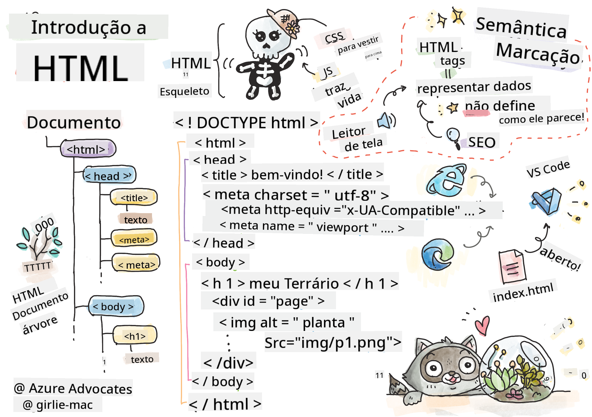
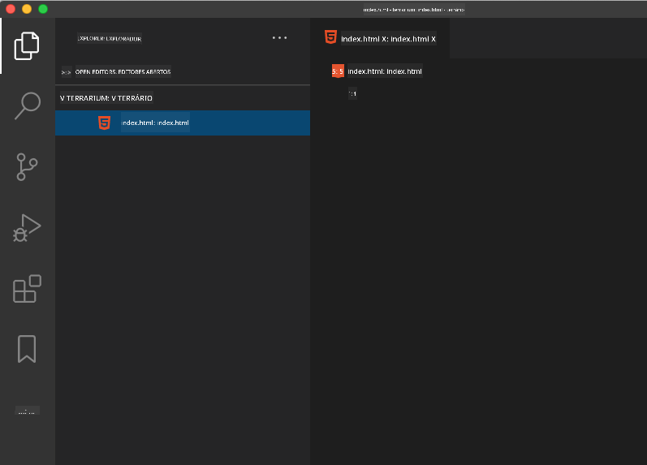

<!--
CO_OP_TRANSLATOR_METADATA:
{
  "original_hash": "89f7f9f800ce7c9f149e98baaae8491a",
  "translation_date": "2025-08-28T23:55:37+00:00",
  "source_file": "3-terrarium/1-intro-to-html/README.md",
  "language_code": "br"
}
-->
# Projeto Terrário Parte 1: Introdução ao HTML


> Sketchnote por [Tomomi Imura](https://twitter.com/girlie_mac)

## Questionário Pré-Aula

[Questionário pré-aula](https://ff-quizzes.netlify.app/web/quiz/15)


> Assista ao vídeo

> 
> [](https://www.youtube.com/watch?v=1TvxJKBzhyQ)

### Introdução

HTML, ou HyperText Markup Language, é o 'esqueleto' da web. Se o CSS 'veste' seu HTML e o JavaScript dá vida a ele, o HTML é o corpo da sua aplicação web. A sintaxe do HTML reflete essa ideia, pois inclui tags como "head", "body" e "footer".

Nesta lição, vamos usar HTML para estruturar o 'esqueleto' da interface do nosso terrário virtual. Ele terá um título e três colunas: uma coluna à direita e outra à esquerda onde ficarão as plantas arrastáveis, e uma área central que será o terrário com aparência de vidro. Ao final desta lição, você será capaz de ver as plantas nas colunas, mas a interface ainda parecerá um pouco estranha; não se preocupe, na próxima seção você adicionará estilos CSS para melhorar a aparência da interface.

### Tarefa

No seu computador, crie uma pasta chamada 'terrarium' e, dentro dela, um arquivo chamado 'index.html'. Você pode fazer isso no Visual Studio Code após criar a pasta do terrário, abrindo uma nova janela do VS Code, clicando em 'abrir pasta' e navegando até sua nova pasta. Clique no pequeno botão 'arquivo' no painel do Explorer e crie o novo arquivo:



Ou

Use estes comandos no seu Git Bash:
* `mkdir terrarium`
* `cd terrarium`
* `touch index.html`
* `code index.html` ou `nano index.html`

> Arquivos index.html indicam ao navegador que são o arquivo padrão em uma pasta; URLs como `https://anysite.com/test` podem ser construídas usando uma estrutura de pastas que inclui uma pasta chamada `test` com `index.html` dentro dela; `index.html` não precisa aparecer na URL.

---

## O DocType e as tags html

A primeira linha de um arquivo HTML é o seu doctype. É um pouco surpreendente que você precise ter essa linha no topo do arquivo, mas ela informa aos navegadores mais antigos que a página deve ser renderizada em modo padrão, seguindo a especificação atual do HTML.

> Dica: no VS Code, você pode passar o mouse sobre uma tag e obter informações sobre seu uso a partir dos guias de referência do MDN.

A segunda linha deve ser a tag de abertura `<html>`, seguida imediatamente pela sua tag de fechamento `</html>`. Essas tags são os elementos raiz da sua interface.

### Tarefa

Adicione estas linhas no topo do seu arquivo `index.html`:

```HTML
<!DOCTYPE html>
<html></html>
```

✅ Existem alguns modos diferentes que podem ser determinados configurando o DocType com uma string de consulta: [Modo Quirks e Modo Padrão](https://developer.mozilla.org/docs/Web/HTML/Quirks_Mode_and_Standards_Mode). Esses modos eram usados para suportar navegadores muito antigos que não são mais usados atualmente (Netscape Navigator 4 e Internet Explorer 5). Você pode usar a declaração padrão do doctype.

---

## O 'head' do documento

A área 'head' do documento HTML inclui informações cruciais sobre sua página web, também conhecidas como [metadados](https://developer.mozilla.org/docs/Web/HTML/Element/meta). No nosso caso, informamos ao servidor web, que renderizará esta página, as seguintes quatro coisas:

-   o título da página
-   metadados da página, incluindo:
    -   o 'conjunto de caracteres', que informa qual codificação de caracteres é usada na página
    -   informações do navegador, incluindo `x-ua-compatible`, que indica que o navegador IE=edge é suportado
    -   informações sobre como o viewport deve se comportar ao ser carregado. Configurar o viewport para ter uma escala inicial de 1 controla o nível de zoom quando a página é carregada pela primeira vez.

### Tarefa

Adicione um bloco 'head' ao seu documento entre as tags de abertura e fechamento `<html>`.

```html
<head>
	<title>Welcome to my Virtual Terrarium</title>
	<meta charset="utf-8" />
	<meta http-equiv="X-UA-Compatible" content="IE=edge" />
	<meta name="viewport" content="width=device-width, initial-scale=1" />
</head>
```

✅ O que aconteceria se você configurasse uma tag meta de viewport assim: `<meta name="viewport" content="width=600">`? Leia mais sobre o [viewport](https://developer.mozilla.org/docs/Web/HTML/Viewport_meta_tag).

---

## O `body` do documento

### Tags HTML

No HTML, você adiciona tags ao seu arquivo .html para criar elementos de uma página web. Cada tag geralmente tem uma tag de abertura e uma de fechamento, como esta: `<p>olá</p>` para indicar um parágrafo. Crie o corpo da sua interface adicionando um conjunto de tags `<body>` dentro do par de tags `<html>`; seu código agora ficará assim:

### Tarefa

```html
<!DOCTYPE html>
<html>
	<head>
		<title>Welcome to my Virtual Terrarium</title>
		<meta charset="utf-8" />
		<meta http-equiv="X-UA-Compatible" content="IE=edge" />
		<meta name="viewport" content="width=device-width, initial-scale=1" />
	</head>
	<body></body>
</html>
```

Agora, você pode começar a construir sua página. Normalmente, você usa tags `<div>` para criar os elementos separados em uma página. Vamos criar uma série de elementos `<div>` que conterão imagens.

### Imagens

Uma tag HTML que não precisa de uma tag de fechamento é a ``, porque ela possui um elemento `src` que contém todas as informações necessárias para renderizar o item na página.

Crie uma pasta no seu aplicativo chamada `images` e, dentro dela, adicione todas as imagens da [pasta de código-fonte](../../../../3-terrarium/solution/images); (são 14 imagens de plantas).

### Tarefa

Adicione essas imagens de plantas em duas colunas entre as tags `<body></body>`:

```html
<div id="page">
	<div id="left-container" class="container">
		<div class="plant-holder">
			
		</div>
		<div class="plant-holder">
			
		</div>
		<div class="plant-holder">
			
		</div>
		<div class="plant-holder">
			
		</div>
		<div class="plant-holder">
			
		</div>
		<div class="plant-holder">
			
		</div>
		<div class="plant-holder">
			
		</div>
	</div>
	<div id="right-container" class="container">
		<div class="plant-holder">
			
		</div>
		<div class="plant-holder">
			
		</div>
		<div class="plant-holder">
			
		</div>
		<div class="plant-holder">
			
		</div>
		<div class="plant-holder">
			
		</div>
		<div class="plant-holder">
			
		</div>
		<div class="plant-holder">
			
		</div>
	</div>
</div>
```

> Nota: Spans vs. Divs. Divs são considerados elementos 'block', enquanto Spans são 'inline'. O que aconteceria se você transformasse esses divs em spans?

Com esse código, as plantas agora aparecem na tela. A aparência ainda está ruim, porque elas ainda não foram estilizadas com CSS, e faremos isso na próxima lição.

Cada imagem possui um texto alternativo (alt) que aparecerá mesmo que você não consiga ver ou renderizar uma imagem. Esse é um atributo importante para acessibilidade. Aprenda mais sobre acessibilidade em lições futuras; por enquanto, lembre-se de que o atributo alt fornece informações alternativas para uma imagem caso um usuário, por algum motivo, não consiga visualizá-la (devido a uma conexão lenta, um erro no atributo src ou se o usuário usar um leitor de tela).

✅ Você percebeu que cada imagem tem o mesmo texto alternativo? Isso é uma boa prática? Por quê? Você pode melhorar esse código?

---

## Marcação semântica

Em geral, é preferível usar 'semântica' significativa ao escrever HTML. O que isso significa? Significa usar tags HTML para representar o tipo de dado ou interação para o qual foram projetadas. Por exemplo, o texto principal de um título em uma página deve usar uma tag `<h1>`.

Adicione a seguinte linha logo abaixo da sua tag de abertura `<body>`:

```html
<h1>My Terrarium</h1>
```

Usar marcação semântica, como ter cabeçalhos como `<h1>` e listas não ordenadas como `<ul>`, ajuda leitores de tela a navegar por uma página. Em geral, botões devem ser escritos como `<button>` e listas como `<li>`. Embora seja _possível_ usar elementos `<span>` especialmente estilizados com manipuladores de clique para simular botões, é melhor para usuários com deficiência que usam tecnologias assistivas determinar onde está um botão em uma página e interagir com ele, se o elemento aparecer como um botão. Por essa razão, tente usar marcação semântica sempre que possível.

✅ Dê uma olhada em um leitor de tela e [como ele interage com uma página web](https://www.youtube.com/watch?v=OUDV1gqs9GA). Você consegue perceber por que uma marcação não semântica pode frustrar o usuário?

## O terrário

A última parte desta interface envolve criar uma marcação que será estilizada para criar um terrário.

### Tarefa:

Adicione esta marcação acima da última tag `</div>`:

```html
<div id="terrarium">
	<div class="jar-top"></div>
	<div class="jar-walls">
		<div class="jar-glossy-long"></div>
		<div class="jar-glossy-short"></div>
	</div>
	<div class="dirt"></div>
	<div class="jar-bottom"></div>
</div>
```

✅ Mesmo que você tenha adicionado essa marcação à tela, nada aparece. Por quê?

---

## 🚀Desafio

Existem algumas tags 'antigas' no HTML que ainda são divertidas de usar, embora você não deva usar tags obsoletas como [essas tags](https://developer.mozilla.org/docs/Web/HTML/Element#Obsolete_and_deprecated_elements) no seu código. Ainda assim, você consegue usar a antiga tag `<marquee>` para fazer o título `<h1>` rolar horizontalmente? (se fizer isso, não se esqueça de removê-la depois)

## Questionário Pós-Aula

[Questionário pós-aula](https://ff-quizzes.netlify.app/web/quiz/16)

## Revisão e Autoestudo

HTML é o sistema de construção 'testado e aprovado' que ajudou a construir a web como a conhecemos hoje. Aprenda um pouco sobre sua história estudando algumas tags antigas e novas. Você consegue descobrir por que algumas tags foram descontinuadas e outras adicionadas? Que tags podem ser introduzidas no futuro?

Saiba mais sobre como criar sites para a web e dispositivos móveis em [Microsoft Learn](https://docs.microsoft.com/learn/modules/build-simple-website/?WT.mc_id=academic-77807-sagibbon).

## Tarefa

[Pratique seu HTML: Crie um mockup de blog](assignment.md)

---

**Aviso Legal**:  
Este documento foi traduzido utilizando o serviço de tradução por IA [Co-op Translator](https://github.com/Azure/co-op-translator). Embora nos esforcemos para garantir a precisão, esteja ciente de que traduções automatizadas podem conter erros ou imprecisões. O documento original em seu idioma nativo deve ser considerado a fonte autoritativa. Para informações críticas, recomenda-se a tradução profissional realizada por humanos. Não nos responsabilizamos por quaisquer mal-entendidos ou interpretações equivocadas decorrentes do uso desta tradução.