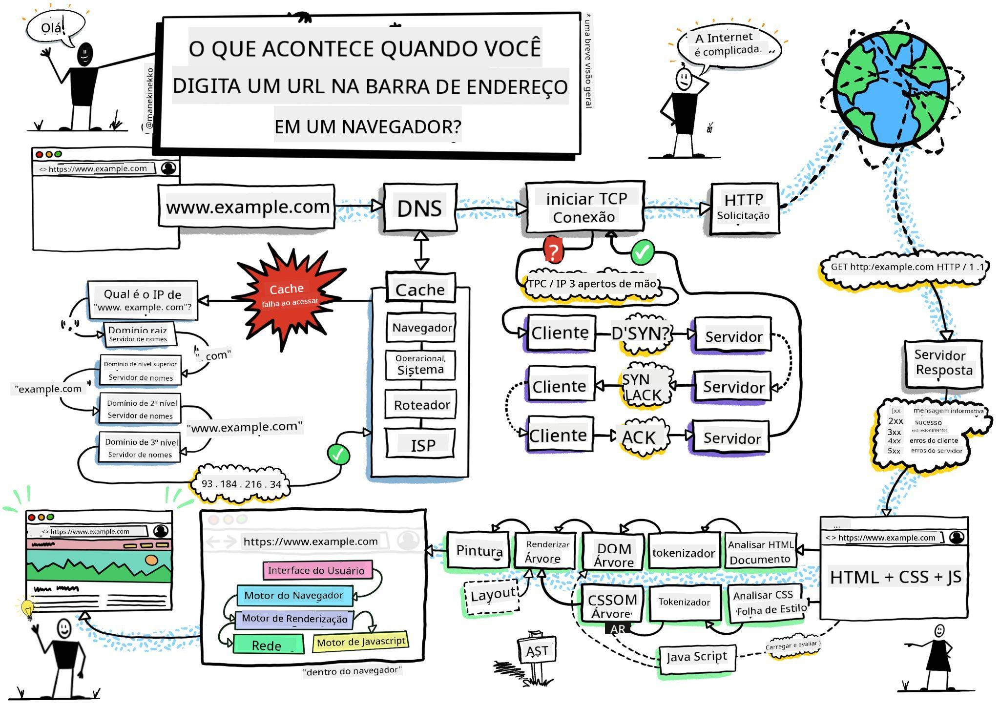
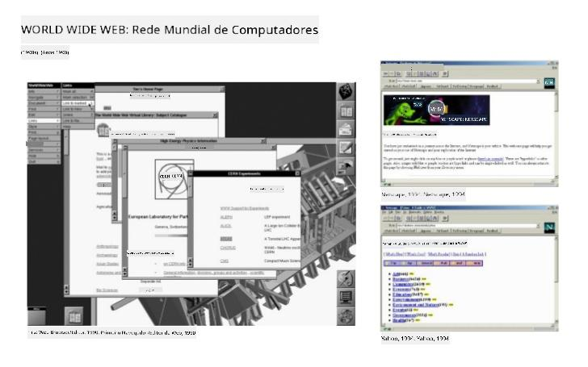
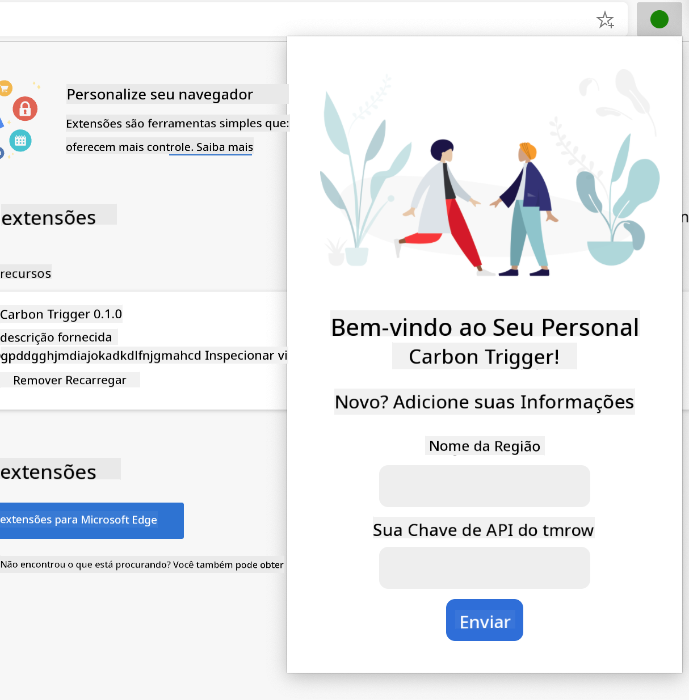

<!--
CO_OP_TRANSLATOR_METADATA:
{
  "original_hash": "2326d04e194a10aa760b51f5e5a1f61d",
  "translation_date": "2025-08-28T23:50:00+00:00",
  "source_file": "5-browser-extension/1-about-browsers/README.md",
  "language_code": "br"
}
-->
# Projeto de Extensão de Navegador Parte 1: Tudo sobre Navegadores


> Esboço por [Wassim Chegham](https://dev.to/wassimchegham/ever-wondered-what-happens-when-you-type-in-a-url-in-an-address-bar-in-a-browser-3dob)

## Quiz Pré-Aula

[Quiz pré-aula](https://ff-quizzes.netlify.app/web/quiz/23)

### Introdução

Extensões de navegador adicionam funcionalidades extras a um navegador. Mas antes de criar uma, é importante entender um pouco sobre como os navegadores funcionam.

### Sobre o navegador

Nesta série de lições, você aprenderá a criar uma extensão de navegador que funcionará nos navegadores Chrome, Firefox e Edge. Nesta parte, você descobrirá como os navegadores funcionam e estruturará os elementos da extensão de navegador.

Mas o que é exatamente um navegador? É um aplicativo de software que permite ao usuário acessar conteúdo de um servidor e exibi-lo em páginas da web.

✅ Um pouco de história: o primeiro navegador foi chamado 'WorldWideWeb' e foi criado por Sir Timothy Berners-Lee em 1990.


> Alguns navegadores antigos, via [Karen McGrane](https://www.slideshare.net/KMcGrane/week-4-ixd-history-personal-computing)

Quando um usuário se conecta à internet usando um endereço URL (Uniform Resource Locator), geralmente utilizando o protocolo de transferência de hipertexto via um endereço `http` ou `https`, o navegador se comunica com um servidor web e busca uma página da web.

Nesse momento, o mecanismo de renderização do navegador exibe a página no dispositivo do usuário, que pode ser um celular, desktop ou laptop.

Os navegadores também têm a capacidade de armazenar em cache o conteúdo para que ele não precise ser recuperado do servidor toda vez. Eles podem registrar o histórico de navegação do usuário, armazenar 'cookies', que são pequenos pedaços de dados que contêm informações usadas para registrar a atividade do usuário, e muito mais.

Uma coisa muito importante a lembrar sobre navegadores é que eles não são todos iguais! Cada navegador tem seus pontos fortes e fracos, e um desenvolvedor web profissional precisa entender como fazer as páginas da web funcionarem bem em diferentes navegadores. Isso inclui lidar com telas pequenas, como as de celulares, bem como usuários que estão offline.

Um site muito útil que você provavelmente deveria salvar nos favoritos do navegador que prefere usar é [caniuse.com](https://www.caniuse.com). Quando você estiver criando páginas da web, é muito útil usar as listas de tecnologias suportadas do caniuse para oferecer o melhor suporte aos seus usuários.

✅ Como você pode saber quais navegadores são mais populares entre os usuários do seu site? Verifique suas análises - você pode instalar vários pacotes de análise como parte do seu processo de desenvolvimento web, e eles informarão quais navegadores são mais usados pelos usuários.

## Extensões de navegador

Por que você gostaria de criar uma extensão de navegador? É algo prático para anexar ao navegador quando você precisa de acesso rápido a tarefas que tende a repetir. Por exemplo, se você frequentemente precisa verificar cores nas várias páginas da web que interage, pode instalar uma extensão de navegador para seleção de cores. Se você tem dificuldade em lembrar senhas, pode usar uma extensão de navegador para gerenciamento de senhas.

Criar extensões de navegador também é divertido. Elas geralmente gerenciam um número limitado de tarefas que executam bem.

✅ Quais são suas extensões de navegador favoritas? Quais tarefas elas realizam?

### Instalando extensões

Antes de começar a criar, dê uma olhada no processo de construção e implantação de uma extensão de navegador. Embora cada navegador varie um pouco na forma como gerencia essa tarefa, o processo é semelhante no Chrome e Firefox ao exemplo no Edge:


> Nota: Certifique-se de ativar o modo desenvolvedor e permitir extensões de outras lojas.

Essencialmente, o processo será:

- construir sua extensão usando `npm run build` 
- navegar no navegador até o painel de extensões usando o botão "Configurações e mais" (o ícone `...`) no canto superior direito
- se for uma nova instalação, escolher `load unpacked` para carregar uma extensão nova a partir da pasta de build (no nosso caso é `/dist`) 
- ou, clicar em `reload` se estiver recarregando uma extensão já instalada

✅ Essas instruções se referem às extensões que você mesmo cria; para instalar extensões que foram lançadas na loja de extensões do navegador associado a cada navegador, você deve navegar até essas [lojas](https://microsoftedge.microsoft.com/addons/Microsoft-Edge-Extensions-Home) e instalar a extensão de sua escolha.

### Comece

Você vai criar uma extensão de navegador que exibe a pegada de carbono da sua região, mostrando o uso de energia e a fonte dessa energia. A extensão terá um formulário que coleta uma chave de API para acessar a API do CO2 Signal.

**Você precisa:**

- [uma chave de API](https://www.co2signal.com/); insira seu e-mail na caixa desta página e uma será enviada para você
- o [código da sua região](http://api.electricitymap.org/v3/zones) correspondente ao [Electricity Map](https://www.electricitymap.org/map) (em Boston, por exemplo, eu uso 'US-NEISO').
- o [código inicial](../../../../5-browser-extension/start). Baixe a pasta `start`; você completará o código nesta pasta.
- [NPM](https://www.npmjs.com) - NPM é uma ferramenta de gerenciamento de pacotes; instale-a localmente e os pacotes listados no arquivo `package.json` serão instalados para uso em seus ativos web

✅ Saiba mais sobre gerenciamento de pacotes neste [excelente módulo de aprendizado](https://docs.microsoft.com/learn/modules/create-nodejs-project-dependencies/?WT.mc_id=academic-77807-sagibbon)

Reserve um momento para examinar a base de código:

dist
    -|manifest.json (configurações padrão aqui)
    -|index.html (marcação HTML do front-end aqui)
    -|background.js (JS de fundo aqui)
    -|main.js (JS compilado)
src
    -|index.js (seu código JS vai aqui)

✅ Assim que tiver sua chave de API e código de região em mãos, guarde-os em uma nota para uso futuro.

### Crie o HTML para a extensão

Esta extensão tem duas visualizações. Uma para coletar a chave de API e o código da região:



E a segunda para exibir o uso de carbono da região:


Vamos começar criando o HTML para o formulário e estilizando-o com CSS.

Na pasta `/dist`, você criará um formulário e uma área de resultados. No arquivo `index.html`, preencha a área do formulário delineada:

```HTML
<form class="form-data" autocomplete="on">
	<div>
		<h2>New? Add your Information</h2>
	</div>
	<div>
		<label for="region">Region Name</label>
		<input type="text" id="region" required class="region-name" />
	</div>
	<div>
		<label for="api">Your API Key from tmrow</label>
		<input type="text" id="api" required class="api-key" />
	</div>
	<button class="search-btn">Submit</button>
</form>	
```
Este é o formulário onde suas informações salvas serão inseridas e armazenadas no armazenamento local.

Em seguida, crie a área de resultados; sob a tag final do formulário, adicione alguns divs:

```HTML
<div class="result">
	<div class="loading">loading...</div>
	<div class="errors"></div>
	<div class="data"></div>
	<div class="result-container">
		<p><strong>Region: </strong><span class="my-region"></span></p>
		<p><strong>Carbon Usage: </strong><span class="carbon-usage"></span></p>
		<p><strong>Fossil Fuel Percentage: </strong><span class="fossil-fuel"></span></p>
	</div>
	<button class="clear-btn">Change region</button>
</div>
```
Neste ponto, você pode tentar uma construção. Certifique-se de instalar as dependências do pacote desta extensão:

```
npm install
```

Este comando usará o npm, o Gerenciador de Pacotes do Node, para instalar o webpack para o processo de construção da sua extensão. O webpack é um empacotador que lida com a compilação de código. Você pode ver o resultado desse processo olhando em `/dist/main.js` - verá que o código foi empacotado.

Por enquanto, a extensão deve ser construída e, se você implantá-la no Edge como uma extensão, verá um formulário exibido de forma organizada.

Parabéns, você deu os primeiros passos para criar uma extensão de navegador. Nas próximas lições, você a tornará mais funcional e útil.

---

## 🚀 Desafio

Dê uma olhada em uma loja de extensões de navegador e instale uma no seu navegador. Você pode examinar seus arquivos de maneiras interessantes. O que você descobre?

## Quiz Pós-Aula

[Quiz pós-aula](https://ff-quizzes.netlify.app/web/quiz/24)

## Revisão & Autoestudo

Nesta lição, você aprendeu um pouco sobre a história do navegador web; aproveite esta oportunidade para aprender sobre como os inventores da World Wide Web imaginaram seu uso lendo mais sobre sua história. Alguns sites úteis incluem:

[The History of Web Browsers](https://www.mozilla.org/firefox/browsers/browser-history/)

[History of the Web](https://webfoundation.org/about/vision/history-of-the-web/)

[Uma entrevista com Tim Berners-Lee](https://www.theguardian.com/technology/2019/mar/12/tim-berners-lee-on-30-years-of-the-web-if-we-dream-a-little-we-can-get-the-web-we-want)

## Tarefa 

[Redefina o estilo da sua extensão](assignment.md)

---

**Aviso Legal**:  
Este documento foi traduzido utilizando o serviço de tradução por IA [Co-op Translator](https://github.com/Azure/co-op-translator). Embora nos esforcemos para garantir a precisão, esteja ciente de que traduções automatizadas podem conter erros ou imprecisões. O documento original em seu idioma nativo deve ser considerado a fonte autoritativa. Para informações críticas, recomenda-se a tradução profissional realizada por humanos. Não nos responsabilizamos por quaisquer mal-entendidos ou interpretações equivocadas decorrentes do uso desta tradução.