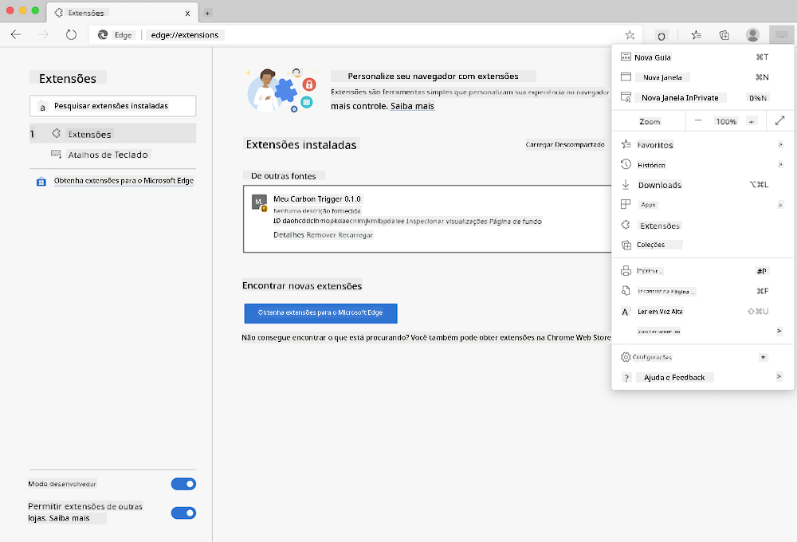

<!--
CO_OP_TRANSLATOR_METADATA:
{
  "original_hash": "3f5e6821e0febccfc5d05e7c944d9e3d",
  "translation_date": "2025-08-26T00:02:01+00:00",
  "source_file": "5-browser-extension/solution/translation/README.ja.md",
  "language_code": "br"
}
-->
# Extensão de Navegador Carbon Trigger: Código Finalizado

Com a API CO2 Signal da tmrow, você pode criar uma extensão de navegador que exibe lembretes sobre o consumo de energia na sua região diretamente no navegador. Essa extensão permite que você acompanhe o uso de energia e tome decisões informadas com base nessas informações.


## Introdução

Certifique-se de ter o [npm](https://npmjs.com) instalado. Baixe uma cópia deste código para uma pasta no seu computador.

Instale todos os pacotes necessários.

```
npm install
```

Use o webpack para compilar a extensão.

```
npm run build
```

Para instalar no Edge, encontre o painel "Extensões" no menu de "três pontos" no canto superior direito do navegador. A partir daí, selecione "Carregar sem compactação" e carregue a nova extensão. Quando solicitado, abra a pasta "dist" para carregar a extensão. Para utilizá-la, você precisará de uma chave de API da CO2 Signal ([obtenha uma aqui por e-mail](https://www.co2signal.com/) - insira seu e-mail na caixa dessa página) e do [código correspondente à sua região](http://api.electricitymap.org/v3/zones) no [Electricity Map](https://www.electricitymap.org/map) (em Boston, por exemplo, use 'US-NEISO').



Depois de inserir a chave de API e a região na interface da extensão, um ponto colorido aparecerá na barra de extensões do navegador. Esse ponto mudará de cor para refletir o consumo de energia na sua região, ajudando você a decidir quais atividades que demandam energia são mais apropriadas naquele momento. O conceito desse sistema de "pontos" foi inspirado na extensão [Energy Lollipop](https://energylollipop.com/) para emissões na Califórnia.

**Aviso Legal**:  
Este documento foi traduzido utilizando o serviço de tradução por IA [Co-op Translator](https://github.com/Azure/co-op-translator). Embora nos esforcemos para garantir a precisão, esteja ciente de que traduções automatizadas podem conter erros ou imprecisões. O documento original em seu idioma nativo deve ser considerado a fonte autoritativa. Para informações críticas, recomenda-se a tradução profissional realizada por humanos. Não nos responsabilizamos por quaisquer mal-entendidos ou interpretações equivocadas decorrentes do uso desta tradução.