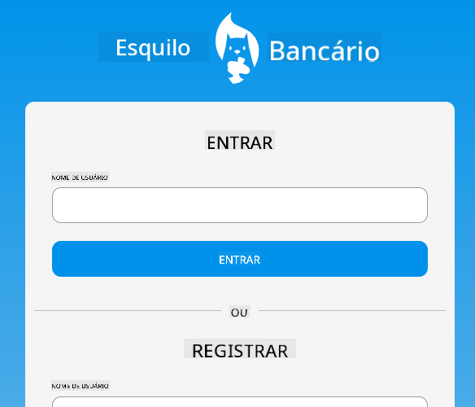

<!--
CO_OP_TRANSLATOR_METADATA:
{
  "original_hash": "830359535306594b448db6575ce5cdee",
  "translation_date": "2025-08-26T00:03:32+00:00",
  "source_file": "7-bank-project/README.md",
  "language_code": "br"
}
-->
# :dollar: Construa um Banco

Neste projeto, você aprenderá como construir um banco fictício. Estas lições incluem instruções sobre como estruturar um aplicativo web e fornecer rotas, criar formulários, gerenciar estado e buscar dados de uma API da qual você pode obter as informações do banco.

|  |  |
|--------------------------------|--------------------------------|

## Lições

1. [Templates HTML e Rotas em um Aplicativo Web](1-template-route/README.md)
2. [Criação de um Formulário de Login e Registro](2-forms/README.md)
3. [Métodos para Buscar e Utilizar Dados](3-data/README.md)
4. [Conceitos de Gerenciamento de Estado](4-state-management/README.md)

### Créditos

Estas lições foram escritas com :hearts: por [Yohan Lasorsa](https://twitter.com/sinedied).

Se você estiver interessado em aprender como construir a [API do servidor](/7-bank-project/api/README.md) usada nestas lições, pode seguir [esta série de vídeos](https://aka.ms/NodeBeginner) (em particular os vídeos 17 a 21).

Você também pode dar uma olhada neste [tutorial interativo do Learn](https://aka.ms/learn/express-api).

**Aviso Legal**:  
Este documento foi traduzido utilizando o serviço de tradução por IA [Co-op Translator](https://github.com/Azure/co-op-translator). Embora nos esforcemos para garantir a precisão, esteja ciente de que traduções automatizadas podem conter erros ou imprecisões. O documento original em seu idioma nativo deve ser considerado a fonte autoritativa. Para informações críticas, recomenda-se a tradução profissional realizada por humanos. Não nos responsabilizamos por quaisquer mal-entendidos ou interpretações equivocadas decorrentes do uso desta tradução.