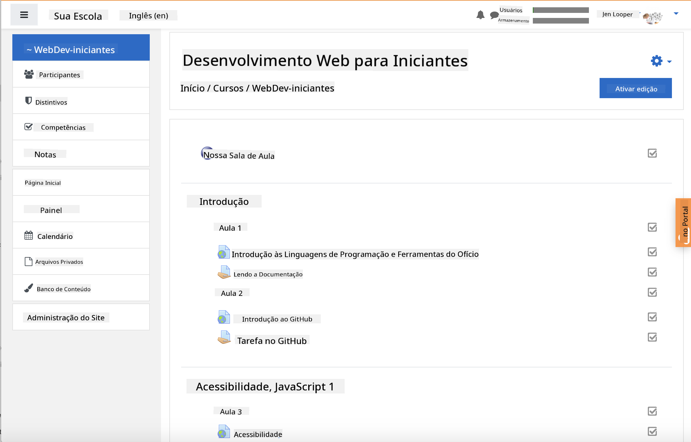
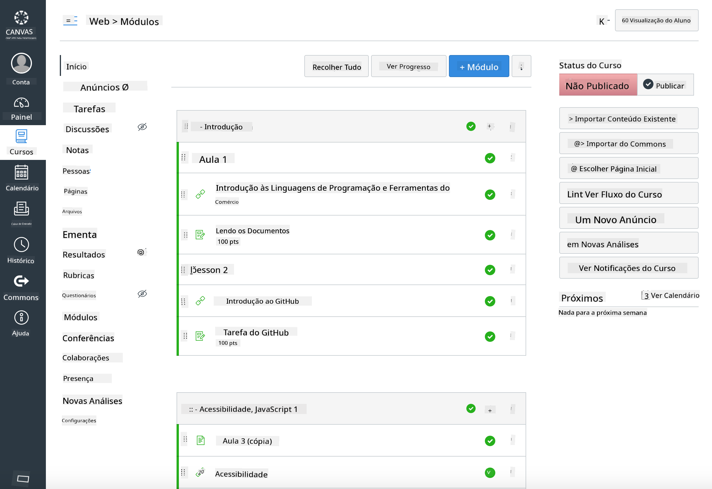

<!--
CO_OP_TRANSLATOR_METADATA:
{
  "original_hash": "75cb51f7ca9ea0b097ef4a1287e9290c",
  "translation_date": "2025-08-25T20:57:12+00:00",
  "source_file": "for-teachers.md",
  "language_code": "br"
}
-->
## Para Educadores

Gostaria de usar este currículo em sua sala de aula? Fique à vontade!

Na verdade, você pode utilizá-lo diretamente no GitHub, usando o GitHub Classroom.

Para isso, faça um fork deste repositório. Você precisará criar um repositório para cada aula, então será necessário extrair cada pasta em um repositório separado. Dessa forma, [GitHub Classroom](https://classroom.github.com/classrooms) poderá identificar cada aula individualmente.

Estas [instruções completas](https://github.blog/2020-03-18-set-up-your-digital-classroom-with-github-classroom/) vão te ajudar a configurar sua sala de aula.

## Usando no Moodle, Canvas ou Blackboard

Este currículo funciona bem nesses Sistemas de Gerenciamento de Aprendizagem! Use o [arquivo de upload do Moodle](../../../../../../../teaching-files/webdev-moodle.mbz) para o conteúdo completo ou experimente o [arquivo Common Cartridge](../../../../../../../teaching-files/webdev-common-cartridge.imscc), que contém parte do conteúdo. O Moodle Cloud não suporta exportações completas de Common Cartridge, então é preferível usar o arquivo de download do Moodle, que pode ser carregado no Canvas. Por favor, nos informe como podemos melhorar essa experiência.

> O currículo em uma sala de aula no Moodle

> O currículo no Canvas

## Usando o repositório como está

Se você preferir usar este repositório no formato atual, sem utilizar o GitHub Classroom, isso também é possível. Você precisará comunicar aos seus alunos qual aula trabalhar juntos.

Em um formato online (Zoom, Teams ou outro), você pode formar salas de discussão para os questionários e orientar os alunos para ajudá-los a se preparar para aprender. Depois, convide os alunos para os questionários e peça que enviem suas respostas como 'issues' em um horário determinado. Você pode fazer o mesmo com as tarefas, caso queira que os alunos trabalhem colaborativamente de forma aberta.

Se preferir um formato mais privado, peça aos seus alunos para fazerem fork do currículo, aula por aula, para seus próprios repositórios privados no GitHub e concederem acesso a você. Assim, eles podem completar os questionários e tarefas de forma privada e enviá-los para você via issues no repositório da sua sala de aula.

Existem várias maneiras de fazer isso funcionar em um formato de sala de aula online. Por favor, nos informe o que funciona melhor para você!

## Por favor, compartilhe suas opiniões!

Queremos que este currículo funcione para você e seus alunos. Conecte-se conosco no [Teacher corner](https://github.com/microsoft/Web-Dev-For-Beginners/discussions/categories/teacher-corner) e abra uma [**nova issue**](https://github.com/microsoft/Web-Dev-For-Beginners/issues/new/choose) para quaisquer solicitações, bugs ou feedback.

**Aviso Legal**:  
Este documento foi traduzido utilizando o serviço de tradução por IA [Co-op Translator](https://github.com/Azure/co-op-translator). Embora nos esforcemos para garantir a precisão, esteja ciente de que traduções automatizadas podem conter erros ou imprecisões. O documento original em seu idioma nativo deve ser considerado a fonte autoritativa. Para informações críticas, recomenda-se a tradução profissional realizada por humanos. Não nos responsabilizamos por quaisquer mal-entendidos ou interpretações equivocadas decorrentes do uso desta tradução.