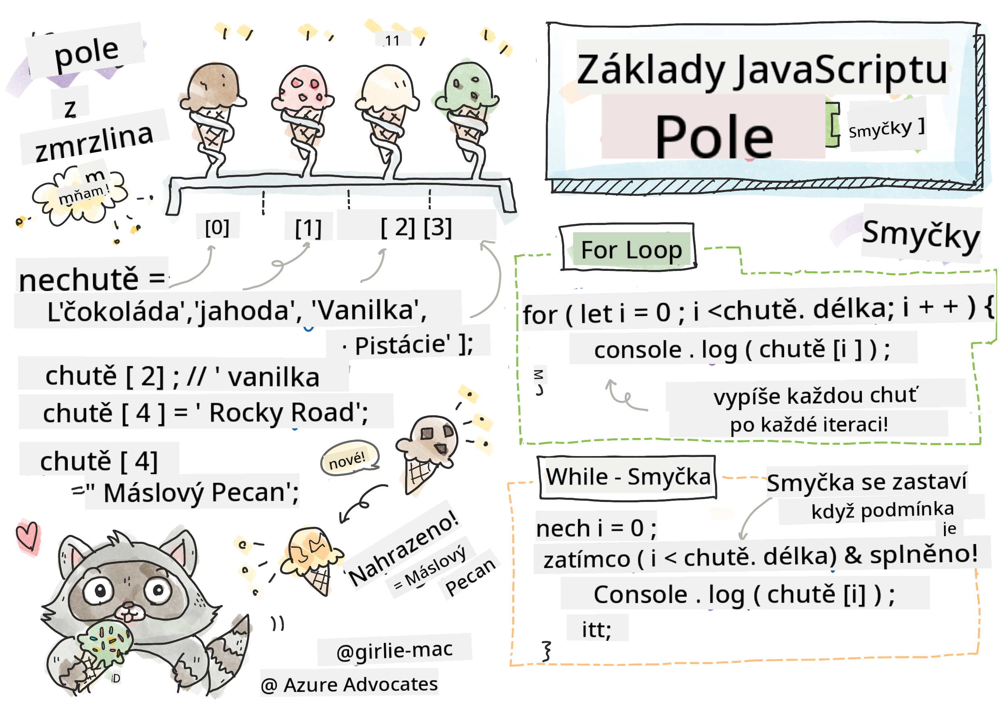

<!--
CO_OP_TRANSLATOR_METADATA:
{
  "original_hash": "9029f96b0e034839c1799f4595e4bb66",
  "translation_date": "2025-08-29T10:54:39+00:00",
  "source_file": "2-js-basics/4-arrays-loops/README.md",
  "language_code": "cs"
}
-->
# Základy JavaScriptu: Pole a cykly


> Sketchnote od [Tomomi Imura](https://twitter.com/girlie_mac)

## Kvíz před lekcí
[Kvíz před lekcí](https://ff-quizzes.netlify.app/web/quiz/13)

Tato lekce se zabývá základy JavaScriptu, jazyka, který zajišťuje interaktivitu na webu. V této lekci se naučíte o polích a cyklech, které se používají k manipulaci s daty.

[](https://youtube.com/watch?v=1U4qTyq02Xw "Pole")

[](https://www.youtube.com/watch?v=Eeh7pxtTZ3k "Cykly")

> 🎥 Klikněte na obrázky výše pro videa o polích a cyklech.

> Tuto lekci si můžete projít na [Microsoft Learn](https://docs.microsoft.com/learn/modules/web-development-101-arrays/?WT.mc_id=academic-77807-sagibbon)!

## Pole

Práce s daty je běžný úkol v každém programovacím jazyce, a je mnohem jednodušší, když jsou data organizována ve strukturovaném formátu, jako jsou pole. V polích jsou data uložena ve struktuře podobné seznamu. Jednou z hlavních výhod polí je, že můžete uložit různé typy dat do jednoho pole.

✅ Pole jsou všude kolem nás! Dokážete si představit příklad pole z reálného života, například pole solárních panelů?

Syntaxe pole je dvojice hranatých závorek.

```javascript
let myArray = [];
```

Toto je prázdné pole, ale pole mohou být deklarována již naplněná daty. Více hodnot v poli je odděleno čárkou.

```javascript
let iceCreamFlavors = ["Chocolate", "Strawberry", "Vanilla", "Pistachio", "Rocky Road"];
```

Hodnotám v poli je přiřazena jedinečná hodnota nazývaná **index**, což je celé číslo, které je přiřazeno na základě jeho vzdálenosti od začátku pole. V příkladu výše má řetězcová hodnota "Chocolate" index 0 a index "Rocky Road" je 4. Použijte index s hranatými závorkami k získání, změně nebo vložení hodnot pole.

✅ Překvapuje vás, že pole začínají na indexu nula? V některých programovacích jazycích začínají indexy na 1. Existuje zajímavá historie kolem tohoto, kterou si můžete [přečíst na Wikipedii](https://en.wikipedia.org/wiki/Zero-based_numbering).

```javascript
let iceCreamFlavors = ["Chocolate", "Strawberry", "Vanilla", "Pistachio", "Rocky Road"];
iceCreamFlavors[2]; //"Vanilla"
```

Pomocí indexu můžete změnit hodnotu, například takto:

```javascript
iceCreamFlavors[4] = "Butter Pecan"; //Changed "Rocky Road" to "Butter Pecan"
```

A můžete vložit novou hodnotu na daný index takto:

```javascript
iceCreamFlavors[5] = "Cookie Dough"; //Added "Cookie Dough"
```

✅ Běžnější způsob, jak přidat hodnoty do pole, je použití operátorů pole, jako je array.push()

Chcete-li zjistit, kolik položek je v poli, použijte vlastnost `length`.

```javascript
let iceCreamFlavors = ["Chocolate", "Strawberry", "Vanilla", "Pistachio", "Rocky Road"];
iceCreamFlavors.length; //5
```

✅ Vyzkoušejte si to sami! Použijte konzoli svého prohlížeče k vytvoření a manipulaci s polem podle svého návrhu.

## Cykly

Cykly nám umožňují provádět opakující se nebo **iterativní** úkoly a mohou ušetřit spoustu času a kódu. Každá iterace se může lišit svými proměnnými, hodnotami a podmínkami. V JavaScriptu existují různé typy cyklů, které mají drobné rozdíly, ale v podstatě dělají totéž: procházejí data.

### For cyklus

Cyklus `for` vyžaduje 3 části k iteraci:
- `counter` Proměnná, která je obvykle inicializována číslem, které počítá počet iterací
- `condition` Výraz, který používá operátory porovnání k zastavení cyklu, když je `false`
- `iteration-expression` Spouští se na konci každé iterace, obvykle se používá ke změně hodnoty counteru
  
```javascript
// Counting up to 10
for (let i = 0; i < 10; i++) {
  console.log(i);
}
```

✅ Spusťte tento kód v konzoli prohlížeče. Co se stane, když provedete malé změny v counteru, podmínce nebo iterativním výrazu? Dokážete ho spustit pozpátku, vytvořit odpočítávání?

### While cyklus

Na rozdíl od syntaxe cyklu `for` vyžadují cykly `while` pouze podmínku, která zastaví cyklus, když se podmínka stane `false`. Podmínky v cyklech obvykle závisí na jiných hodnotách, jako jsou countery, a musí být spravovány během cyklu. Počáteční hodnoty counterů musí být vytvořeny mimo cyklus a jakékoli výrazy pro splnění podmínky, včetně změny counteru, musí být udržovány uvnitř cyklu.

```javascript
//Counting up to 10
let i = 0;
while (i < 10) {
 console.log(i);
 i++;
}
```

✅ Proč byste si vybrali for cyklus místo while cyklu? 17 tisíc uživatelů mělo stejnou otázku na StackOverflow a některé názory [by vás mohly zajímat](https://stackoverflow.com/questions/39969145/while-loops-vs-for-loops-in-javascript).

## Cykly a pole

Pole se často používají s cykly, protože většina podmínek vyžaduje délku pole k zastavení cyklu a index může být také hodnotou counteru.

```javascript
let iceCreamFlavors = ["Chocolate", "Strawberry", "Vanilla", "Pistachio", "Rocky Road"];

for (let i = 0; i < iceCreamFlavors.length; i++) {
  console.log(iceCreamFlavors[i]);
} //Ends when all flavors are printed
```

✅ Experimentujte s procházením pole podle svého návrhu v konzoli prohlížeče. 

---

## 🚀 Výzva

Existují i jiné způsoby procházení polí než pomocí for a while cyklů. Existují [forEach](https://developer.mozilla.org/docs/Web/JavaScript/Reference/Global_Objects/Array/forEach), [for-of](https://developer.mozilla.org/docs/Web/JavaScript/Reference/Statements/for...of) a [map](https://developer.mozilla.org/docs/Web/JavaScript/Reference/Global_Objects/Array/map). Přepište svůj cyklus pole pomocí jedné z těchto technik.

## Kvíz po lekci
[Kvíz po lekci](https://ff-quizzes.netlify.app/web/quiz/14)

## Přehled & Samostudium

Pole v JavaScriptu mají mnoho metod, které jsou velmi užitečné pro manipulaci s daty. [Přečtěte si o těchto metodách](https://developer.mozilla.org/docs/Web/JavaScript/Reference/Global_Objects/Array) a vyzkoušejte některé z nich (jako push, pop, slice a splice) na poli podle svého návrhu.

## Úkol

[Procházení pole](assignment.md)

---

**Prohlášení**:  
Tento dokument byl přeložen pomocí služby pro automatický překlad [Co-op Translator](https://github.com/Azure/co-op-translator). I když se snažíme o co největší přesnost, mějte prosím na paměti, že automatické překlady mohou obsahovat chyby nebo nepřesnosti. Původní dokument v jeho původním jazyce by měl být považován za závazný zdroj. Pro důležité informace doporučujeme profesionální lidský překlad. Neodpovídáme za žádná nedorozumění nebo nesprávné výklady vyplývající z použití tohoto překladu.