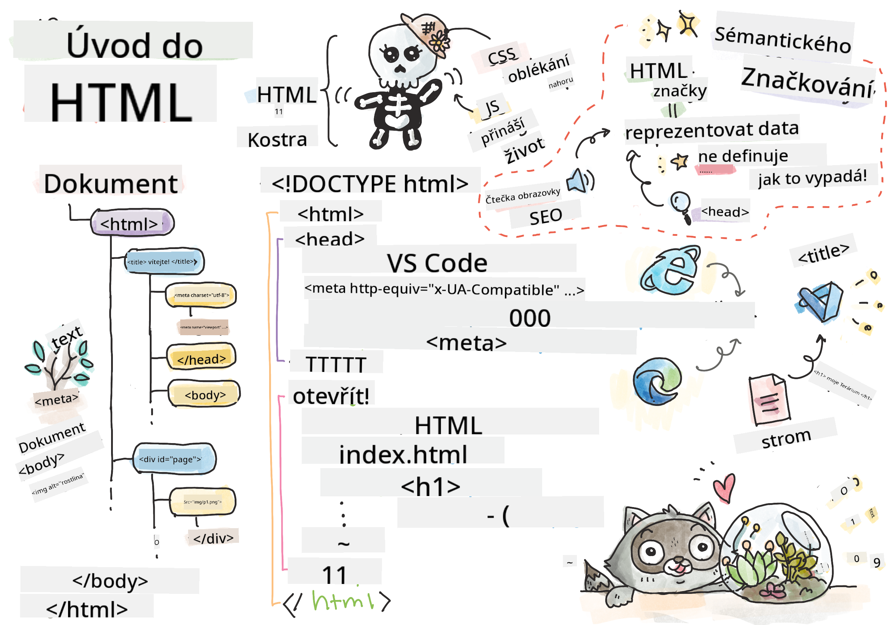
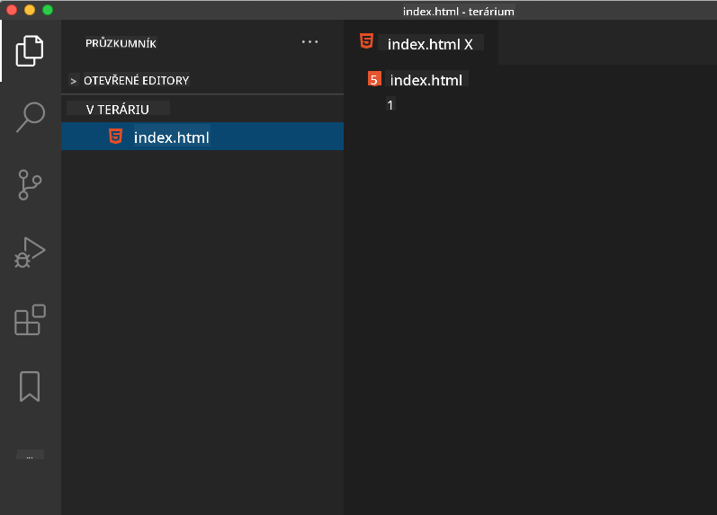

<!--
CO_OP_TRANSLATOR_METADATA:
{
  "original_hash": "89f7f9f800ce7c9f149e98baaae8491a",
  "translation_date": "2025-08-29T10:55:04+00:00",
  "source_file": "3-terrarium/1-intro-to-html/README.md",
  "language_code": "cs"
}
-->
# Projekt Terárium Část 1: Úvod do HTML


> Sketchnote od [Tomomi Imura](https://twitter.com/girlie_mac)

## Kvíz před lekcí

[Kvíz před lekcí](https://ff-quizzes.netlify.app/web/quiz/15)

> Podívejte se na video

> 
> [](https://www.youtube.com/watch?v=1TvxJKBzhyQ)

### Úvod

HTML, neboli HyperText Markup Language, je „kostra“ webu. Pokud CSS „obléká“ váš HTML a JavaScript mu vdechuje život, HTML je tělo vaší webové aplikace. Syntaxe HTML tuto myšlenku dokonce odráží, protože obsahuje značky jako „head“, „body“ a „footer“.

V této lekci použijeme HTML k vytvoření „kostry“ rozhraní našeho virtuálního terária. Bude mít název a tři sloupce: pravý a levý sloupec, kde budou umístěny přetahovatelné rostliny, a střední oblast, která bude představovat samotné skleněné terárium. Na konci této lekce uvidíte rostliny ve sloupcích, ale rozhraní bude vypadat trochu zvláštně; nebojte se, v další části přidáte do rozhraní CSS styly, aby vypadalo lépe.

### Úkol

Na svém počítači vytvořte složku s názvem 'terrarium' a uvnitř ní soubor s názvem 'index.html'. Můžete to udělat ve Visual Studio Code po vytvoření složky terária tak, že otevřete nové okno VS Code, kliknete na 'open folder' a přejdete do své nové složky. Klikněte na malé tlačítko 'file' v panelu Explorer a vytvořte nový soubor:



Nebo

Použijte tyto příkazy v git bash:
* `mkdir terrarium`
* `cd terrarium`
* `touch index.html`
* `code index.html` nebo `nano index.html`

> Soubory index.html označují prohlížeči, že se jedná o výchozí soubor ve složce; URL jako `https://anysite.com/test` může být vytvořena pomocí struktury složek, která zahrnuje složku s názvem `test` s `index.html` uvnitř; `index.html` nemusí být v URL vidět.

---

## DocType a značky html

První řádek souboru HTML je jeho doctype. Je trochu překvapivé, že tento řádek musí být na úplném vrcholu souboru, ale říká starším prohlížečům, že stránka má být vykreslena ve standardním režimu podle aktuální specifikace HTML.

> Tip: ve VS Code můžete najet myší na značku a získat informace o jejím použití z referenčních příruček MDN.

Druhý řádek by měl být otevírací značkou `<html>`, následovanou uzavírací značkou `</html>`. Tyto značky jsou kořenovými prvky vašeho rozhraní.

### Úkol

Přidejte tyto řádky na začátek svého souboru `index.html`:

```HTML
<!DOCTYPE html>
<html></html>
```

✅ Existuje několik různých režimů, které lze určit nastavením DocType pomocí dotazovacího řetězce: [Quirks Mode a Standards Mode](https://developer.mozilla.org/docs/Web/HTML/Quirks_Mode_and_Standards_Mode). Tyto režimy dříve podporovaly opravdu staré prohlížeče, které se dnes běžně nepoužívají (Netscape Navigator 4 a Internet Explorer 5). Můžete se držet standardního deklarování doctype.

---

## 'Head' dokumentu

Oblast 'head' dokumentu HTML obsahuje klíčové informace o vaší webové stránce, známé také jako [metadata](https://developer.mozilla.org/docs/Web/HTML/Element/meta). V našem případě sdělujeme webovému serveru, na který bude tato stránka odeslána k vykreslení, tyto čtyři věci:

-   název stránky
-   metadata stránky včetně:
    -   'character set', který říká, jaké kódování znaků je na stránce použito
    -   informace o prohlížeči, včetně `x-ua-compatible`, což označuje, že je podporován prohlížeč IE=edge
    -   informace o tom, jak by se měl viewport chovat při načtení. Nastavení viewportu na počáteční měřítko 1 ovládá úroveň přiblížení při prvním načtení stránky.

### Úkol

Přidejte blok 'head' do svého dokumentu mezi otevírací a uzavírací značky `<html>`.

```html
<head>
	<title>Welcome to my Virtual Terrarium</title>
	<meta charset="utf-8" />
	<meta http-equiv="X-UA-Compatible" content="IE=edge" />
	<meta name="viewport" content="width=device-width, initial-scale=1" />
</head>
```

✅ Co by se stalo, kdybyste nastavili meta tag viewportu takto: `<meta name="viewport" content="width=600">`? Přečtěte si více o [viewportu](https://developer.mozilla.org/docs/Web/HTML/Viewport_meta_tag).

---

## 'Body' dokumentu

### HTML značky

V HTML přidáváte značky do svého .html souboru, abyste vytvořili prvky webové stránky. Každá značka obvykle má otevírací a uzavírací značku, například: `<p>ahoj</p>` pro označení odstavce. Vytvořte tělo svého rozhraní přidáním sady značek `<body>` uvnitř páru značek `<html>`; váš kód nyní vypadá takto:

### Úkol

```html
<!DOCTYPE html>
<html>
	<head>
		<title>Welcome to my Virtual Terrarium</title>
		<meta charset="utf-8" />
		<meta http-equiv="X-UA-Compatible" content="IE=edge" />
		<meta name="viewport" content="width=device-width, initial-scale=1" />
	</head>
	<body></body>
</html>
```

Nyní můžete začít vytvářet svou stránku. Obvykle používáte značky `<div>` k vytvoření samostatných prvků na stránce. Vytvoříme sérii prvků `<div>`, které budou obsahovat obrázky.

### Obrázky

Jedna HTML značka, která nepotřebuje uzavírací značku, je ``, protože má atribut `src`, který obsahuje všechny informace potřebné k vykreslení položky na stránce.

Vytvořte ve své aplikaci složku s názvem `images` a do ní přidejte všechny obrázky ze [složky se zdrojovým kódem](../../../../3-terrarium/solution/images); (je tam 14 obrázků rostlin).

### Úkol

Přidejte tyto obrázky rostlin do dvou sloupců mezi značky `<body></body>`:

```html
<div id="page">
	<div id="left-container" class="container">
		<div class="plant-holder">
			
		</div>
		<div class="plant-holder">
			
		</div>
		<div class="plant-holder">
			
		</div>
		<div class="plant-holder">
			
		</div>
		<div class="plant-holder">
			
		</div>
		<div class="plant-holder">
			
		</div>
		<div class="plant-holder">
			
		</div>
	</div>
	<div id="right-container" class="container">
		<div class="plant-holder">
			
		</div>
		<div class="plant-holder">
			
		</div>
		<div class="plant-holder">
			
		</div>
		<div class="plant-holder">
			
		</div>
		<div class="plant-holder">
			
		</div>
		<div class="plant-holder">
			
		</div>
		<div class="plant-holder">
			
		</div>
	</div>
</div>
```

> Poznámka: Spany vs. Divy. Divy jsou považovány za 'blokové' prvky, zatímco Spany jsou 'řádkové'. Co by se stalo, kdybyste tyto divy změnili na spany?

S tímto kódem se rostliny nyní zobrazí na obrazovce. Vypadá to dost špatně, protože ještě nejsou stylizovány pomocí CSS, což uděláme v další lekci.

Každý obrázek má alternativní text, který se zobrazí, i když obrázek nemůžete vidět nebo vykreslit. Tento atribut je důležitý pro přístupnost. Více o přístupnosti se dozvíte v budoucích lekcích; prozatím si zapamatujte, že atribut alt poskytuje alternativní informace o obrázku, pokud uživatel z nějakého důvodu nemůže obrázek zobrazit (kvůli pomalému připojení, chybě v atributu src nebo pokud uživatel používá čtečku obrazovky).

✅ Všimli jste si, že každý obrázek má stejný alt tag? Je to dobrá praxe? Proč ano nebo ne? Můžete tento kód vylepšit?

---

## Sémantické značky

Obecně je lepší používat smysluplné 'sémantiky' při psaní HTML. Co to znamená? Znamená to, že používáte HTML značky k reprezentaci typu dat nebo interakce, pro které byly navrženy. Například hlavní název textu na stránce by měl používat značku `<h1>`.

Přidejte následující řádek hned pod otevírací značku `<body>`:

```html
<h1>My Terrarium</h1>
```

Používání sémantických značek, jako je například použití `<h1>` pro nadpisy a `<ul>` pro nečíslované seznamy, pomáhá čtečkám obrazovky navigovat na stránce. Obecně by tlačítka měla být psána jako `<button>` a seznamy jako `<li>`. I když je _možné_ použít speciálně stylizované `<span>` prvky s obslužnými funkcemi kliknutí k napodobení tlačítek, je lepší, aby uživatelé s postižením mohli pomocí technologií určit, kde se na stránce nachází tlačítko, a interagovat s ním, pokud se prvek zobrazuje jako tlačítko. Z tohoto důvodu se snažte používat sémantické značky co nejvíce.

✅ Podívejte se na čtečku obrazovky a [jak interaguje s webovou stránkou](https://www.youtube.com/watch?v=OUDV1gqs9GA). Vidíte, proč by nesémantické značky mohly uživatele frustrovat?

## Terárium

Poslední část tohoto rozhraní zahrnuje vytvoření značek, které budou stylizovány tak, aby vytvořily terárium.

### Úkol:

Přidejte tento kód nad poslední značku `</div>`:

```html
<div id="terrarium">
	<div class="jar-top"></div>
	<div class="jar-walls">
		<div class="jar-glossy-long"></div>
		<div class="jar-glossy-short"></div>
	</div>
	<div class="dirt"></div>
	<div class="jar-bottom"></div>
</div>
```

✅ I když jste tento kód přidali na obrazovku, nevidíte, že by se něco vykreslilo. Proč?

---

## 🚀Výzva

Existují některé staré 'zastaralé' značky v HTML, které je stále zábavné si vyzkoušet, i když byste neměli používat zastaralé značky jako [tyto značky](https://developer.mozilla.org/docs/Web/HTML/Element#Obsolete_and_deprecated_elements) ve svém kódu. Přesto, můžete použít starou značku `<marquee>` k tomu, aby se nadpis h1 posouval horizontálně? (pokud ano, nezapomeňte ji poté odstranit)

## Kvíz po lekci

[Kvíz po lekci](https://ff-quizzes.netlify.app/web/quiz/16)

## Přehled a samostudium

HTML je „osvědčený“ stavební systém, který pomohl vytvořit web takový, jaký je dnes. Naučte se něco o jeho historii studiem starých a nových značek. Dokážete zjistit, proč byly některé značky zastaralé a jiné přidány? Jaké značky by mohly být zavedeny v budoucnu?

Zjistěte více o vytváření webů pro web a mobilní zařízení na [Microsoft Learn](https://docs.microsoft.com/learn/modules/build-simple-website/?WT.mc_id=academic-77807-sagibbon).

## Zadání

[Procvičte si HTML: Vytvořte maketu blogu](assignment.md)

---

**Prohlášení**:  
Tento dokument byl přeložen pomocí služby pro automatický překlad [Co-op Translator](https://github.com/Azure/co-op-translator). I když se snažíme o přesnost, mějte prosím na paměti, že automatické překlady mohou obsahovat chyby nebo nepřesnosti. Původní dokument v jeho původním jazyce by měl být považován za závazný zdroj. Pro důležité informace doporučujeme profesionální lidský překlad. Neodpovídáme za žádná nedorozumění nebo nesprávné výklady vyplývající z použití tohoto překladu.