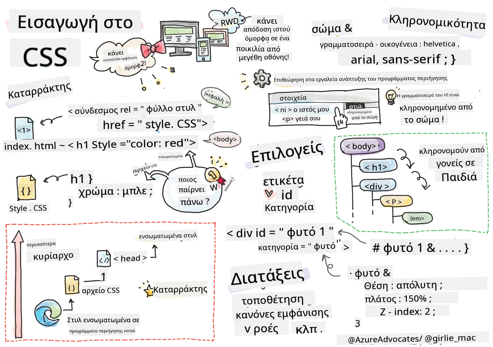
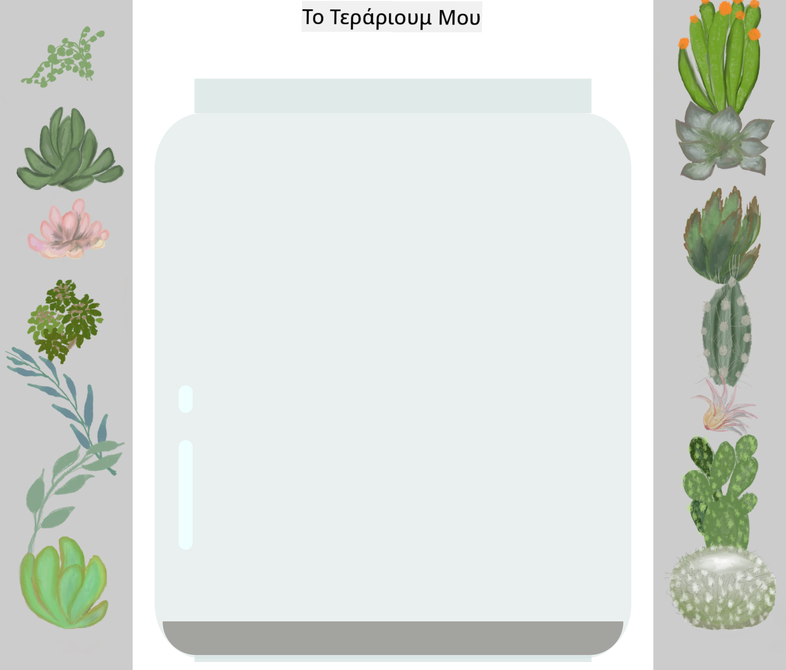

<!--
CO_OP_TRANSLATOR_METADATA:
{
  "original_hash": "acb5ae00cde004304296bb97da8ff4c3",
  "translation_date": "2025-08-29T07:16:00+00:00",
  "source_file": "3-terrarium/2-intro-to-css/README.md",
  "language_code": "el"
}
-->
# Έργο Terrarium Μέρος 2: Εισαγωγή στο CSS


> Σημειώσεις από [Tomomi Imura](https://twitter.com/girlie_mac)

## Ερωτηματολόγιο πριν το μάθημα

[Ερωτηματολόγιο πριν το μάθημα](https://ff-quizzes.netlify.app/web/quiz/17)

### Εισαγωγή

Το CSS, ή Cascading Style Sheets, λύνει ένα σημαντικό πρόβλημα της ανάπτυξης ιστοσελίδων: πώς να κάνετε την ιστοσελίδα σας να φαίνεται όμορφη. Το να δώσετε στυλ στις εφαρμογές σας τις κάνει πιο χρηστικές και πιο ελκυστικές. Μπορείτε επίσης να χρησιμοποιήσετε το CSS για να δημιουργήσετε Responsive Web Design (RWD) - επιτρέποντας στις εφαρμογές σας να φαίνονται καλά ανεξάρτητα από το μέγεθος της οθόνης στην οποία εμφανίζονται. Το CSS δεν αφορά μόνο την εμφάνιση της εφαρμογής σας. Η προδιαγραφή του περιλαμβάνει κινούμενα σχέδια και μετασχηματισμούς που μπορούν να επιτρέψουν εξελιγμένες αλληλεπιδράσεις για τις εφαρμογές σας. Η Ομάδα Εργασίας CSS βοηθά στη διατήρηση των τρεχουσών προδιαγραφών CSS. Μπορείτε να παρακολουθήσετε τη δουλειά τους στον [ιστότοπο του World Wide Web Consortium](https://www.w3.org/Style/CSS/members).

> Σημείωση: Το CSS είναι μια γλώσσα που εξελίσσεται, όπως όλα στο διαδίκτυο, και δεν υποστηρίζουν όλοι οι περιηγητές τα νεότερα μέρη της προδιαγραφής. Πάντα να ελέγχετε τις υλοποιήσεις σας συμβουλευόμενοι το [CanIUse.com](https://caniuse.com).

Σε αυτό το μάθημα, θα προσθέσουμε στυλ στο διαδικτυακό μας terrarium και θα μάθουμε περισσότερα για διάφορες έννοιες του CSS: την αλληλουχία, την κληρονομικότητα, τη χρήση επιλεγμένων στοιχείων, τη θέση και τη χρήση του CSS για τη δημιουργία διατάξεων. Στη διαδικασία, θα διαμορφώσουμε το terrarium και θα δημιουργήσουμε το ίδιο το terrarium.

### Προαπαιτούμενο

Θα πρέπει να έχετε δημιουργήσει το HTML για το terrarium σας και να είναι έτοιμο για στυλιζάρισμα.

> Δείτε το βίντεο

> 
> [](https://www.youtube.com/watch?v=6yIdOIV9p1I)

### Εργασία

Στον φάκελο του terrarium σας, δημιουργήστε ένα νέο αρχείο με όνομα `style.css`. Εισάγετε αυτό το αρχείο στην ενότητα `<head>`:

```html
<link rel="stylesheet" href="./style.css" />
```

---

## Η Αλληλουχία

Τα Cascading Style Sheets ενσωματώνουν την ιδέα ότι τα στυλ "αλληλουχούν", έτσι ώστε η εφαρμογή ενός στυλ να καθοδηγείται από την προτεραιότητά του. Τα στυλ που ορίζονται από τον δημιουργό της ιστοσελίδας έχουν προτεραιότητα έναντι αυτών που ορίζονται από τον περιηγητή. Τα στυλ που ορίζονται "inline" έχουν προτεραιότητα έναντι αυτών που ορίζονται σε εξωτερικό φύλλο στυλ.

### Εργασία

Προσθέστε το inline στυλ "color: red" στην ετικέτα `<h1>`:

```HTML
<h1 style="color: red">My Terrarium</h1>
```

Στη συνέχεια, προσθέστε τον ακόλουθο κώδικα στο αρχείο `style.css`:

```CSS
h1 {
 color: blue;
}
```

✅ Ποιο χρώμα εμφανίζεται στην εφαρμογή σας; Γιατί; Μπορείτε να βρείτε έναν τρόπο να παρακάμψετε τα στυλ; Πότε θα θέλατε να το κάνετε αυτό ή γιατί όχι;

---

## Κληρονομικότητα

Τα στυλ κληρονομούνται από ένα στυλ προγόνου σε έναν απόγονο, έτσι ώστε τα ενσωματωμένα στοιχεία να κληρονομούν τα στυλ των γονέων τους.

### Εργασία

Ορίστε τη γραμματοσειρά του σώματος σε μια συγκεκριμένη γραμματοσειρά και ελέγξτε τη γραμματοσειρά ενός ενσωματωμένου στοιχείου:

```CSS
body {
	font-family: helvetica, arial, sans-serif;
}
```

Ανοίξτε την κονσόλα του περιηγητή σας στην καρτέλα 'Elements' και παρατηρήστε τη γραμματοσειρά του H1. Κληρονομεί τη γραμματοσειρά του από το σώμα, όπως δηλώνεται μέσα στον περιηγητή:


✅ Μπορείτε να κάνετε ένα ενσωματωμένο στυλ να κληρονομήσει μια διαφορετική ιδιότητα;

---

## Επιλογείς CSS

### Ετικέτες

Μέχρι στιγμής, το αρχείο `style.css` σας έχει μόνο λίγες ετικέτες στυλιζαρισμένες, και η εφαρμογή φαίνεται αρκετά περίεργη:

```CSS
body {
	font-family: helvetica, arial, sans-serif;
}

h1 {
	color: #3a241d;
	text-align: center;
}
```

Αυτός ο τρόπος στυλιζαρίσματος μιας ετικέτας σας δίνει έλεγχο σε μοναδικά στοιχεία, αλλά χρειάζεστε να ελέγξετε τα στυλ πολλών φυτών στο terrarium σας. Για να το κάνετε αυτό, πρέπει να αξιοποιήσετε τους επιλογείς CSS.

### Ids

Προσθέστε λίγο στυλ για να διαμορφώσετε τα αριστερά και δεξιά δοχεία. Επειδή υπάρχει μόνο ένα αριστερό δοχείο και μόνο ένα δεξί δοχείο, τους δίνονται ids στο markup. Για να τα στυλιζάρετε, χρησιμοποιήστε `#`:

```CSS
#left-container {
	background-color: #eee;
	width: 15%;
	left: 0px;
	top: 0px;
	position: absolute;
	height: 100%;
	padding: 10px;
}

#right-container {
	background-color: #eee;
	width: 15%;
	right: 0px;
	top: 0px;
	position: absolute;
	height: 100%;
	padding: 10px;
}
```

Εδώ, έχετε τοποθετήσει αυτά τα δοχεία με απόλυτη θέση στα άκρα της οθόνης και χρησιμοποιήσατε ποσοστά για το πλάτος τους ώστε να μπορούν να προσαρμοστούν σε μικρές οθόνες κινητών.

✅ Αυτός ο κώδικας επαναλαμβάνεται αρκετά, άρα δεν είναι "DRY" (Don't Repeat Yourself). Μπορείτε να βρείτε έναν καλύτερο τρόπο να στυλιζάρετε αυτά τα ids, ίσως με ένα id και μια class; Θα χρειαστεί να αλλάξετε το markup και να αναδιαμορφώσετε το CSS:

```html
<div id="left-container" class="container"></div>
```

### Classes

Στο παραπάνω παράδειγμα, στυλιζάρατε δύο μοναδικά στοιχεία στην οθόνη. Αν θέλετε τα στυλ να εφαρμόζονται σε πολλά στοιχεία στην οθόνη, μπορείτε να χρησιμοποιήσετε CSS classes. Κάντε το αυτό για να διαμορφώσετε τα φυτά στα αριστερά και δεξιά δοχεία.

Παρατηρήστε ότι κάθε φυτό στο HTML markup έχει έναν συνδυασμό ids και classes. Τα ids εδώ χρησιμοποιούνται από το JavaScript που θα προσθέσετε αργότερα για να χειριστείτε την τοποθέτηση των φυτών στο terrarium. Οι classes, ωστόσο, δίνουν σε όλα τα φυτά ένα συγκεκριμένο στυλ.

```html
<div class="plant-holder">
	
</div>
```

Προσθέστε τον ακόλουθο κώδικα στο αρχείο `style.css`:

```CSS
.plant-holder {
	position: relative;
	height: 13%;
	left: -10px;
}

.plant {
	position: absolute;
	max-width: 150%;
	max-height: 150%;
	z-index: 2;
}
```

Αξιοσημείωτο σε αυτό το απόσπασμα είναι το μείγμα σχετικής και απόλυτης θέσης, το οποίο θα καλύψουμε στην επόμενη ενότητα. Ρίξτε μια ματιά στον τρόπο με τον οποίο χειρίζονται τα ύψη με ποσοστά:

Ορίσατε το ύψος του φυτοδοχείου στο 13%, έναν καλό αριθμό για να διασφαλίσετε ότι όλα τα φυτά εμφανίζονται σε κάθε κάθετο δοχείο χωρίς να χρειάζεται κύλιση.

Τοποθετήσατε το φυτοδοχείο να μετακινηθεί προς τα αριστερά ώστε τα φυτά να είναι πιο κεντραρισμένα μέσα στο δοχείο τους. Οι εικόνες έχουν μεγάλο ποσό διαφανούς φόντου ώστε να είναι πιο εύκολα μετακινούμενες, οπότε χρειάζεται να μετακινηθούν προς τα αριστερά για να ταιριάζουν καλύτερα στην οθόνη.

Στη συνέχεια, το ίδιο το φυτό έχει μέγιστο πλάτος 150%. Αυτό του επιτρέπει να μειώνεται καθώς μειώνεται το μέγεθος του περιηγητή. Δοκιμάστε να αλλάξετε το μέγεθος του περιηγητή σας. Τα φυτά παραμένουν στα δοχεία τους αλλά μειώνονται για να ταιριάζουν.

Επίσης αξιοσημείωτη είναι η χρήση του z-index, που ελέγχει το σχετικό ύψος ενός στοιχείου (ώστε τα φυτά να κάθονται πάνω από το δοχείο και να φαίνονται μέσα στο terrarium).

✅ Γιατί χρειάζεστε τόσο έναν επιλογέα CSS για το φυτοδοχείο όσο και για το φυτό;

## Θέση CSS

Η ανάμειξη ιδιοτήτων θέσης (υπάρχουν στατική, σχετική, σταθερή, απόλυτη και κολλώδης θέση) μπορεί να είναι λίγο δύσκολη, αλλά όταν γίνεται σωστά σας δίνει καλό έλεγχο στα στοιχεία στις σελίδες σας.

Τα στοιχεία με απόλυτη θέση τοποθετούνται σε σχέση με τους πλησιέστερους τοποθετημένους προγόνους τους, και αν δεν υπάρχουν, τοποθετούνται σύμφωνα με το σώμα του εγγράφου.

Τα στοιχεία με σχετική θέση τοποθετούνται βάσει των οδηγιών του CSS για να προσαρμόσουν τη θέση τους μακριά από την αρχική τους θέση.

Στο δείγμα μας, το `plant-holder` είναι ένα στοιχείο με σχετική θέση που τοποθετείται μέσα σε ένα δοχείο με απόλυτη θέση. Η προκύπτουσα συμπεριφορά είναι ότι τα δοχεία της πλαϊνής μπάρας είναι καρφωμένα αριστερά και δεξιά, και το `plant-holder` είναι ενσωματωμένο, προσαρμόζοντας τον εαυτό του μέσα στις πλαϊνές μπάρες, δίνοντας χώρο για τα φυτά να τοποθετηθούν σε κάθετη σειρά.

> Το ίδιο το `plant` έχει επίσης απόλυτη θέση, απαραίτητη για να είναι μετακινούμενο, όπως θα ανακαλύψετε στο επόμενο μάθημα.

✅ Πειραματιστείτε με την αλλαγή των τύπων θέσης των πλαϊνών δοχείων και του `plant-holder`. Τι συμβαίνει;

## Διατάξεις CSS

Τώρα θα χρησιμοποιήσετε όσα μάθατε για να δημιουργήσετε το ίδιο το terrarium, όλα χρησιμοποιώντας CSS!

Πρώτα, στυλιζάρετε τα παιδιά του div `.terrarium` ως στρογγυλεμένο ορθογώνιο χρησιμοποιώντας CSS:

```CSS
.jar-walls {
	height: 80%;
	width: 60%;
	background: #d1e1df;
	border-radius: 1rem;
	position: absolute;
	bottom: 0.5%;
	left: 20%;
	opacity: 0.5;
	z-index: 1;
}

.jar-top {
	width: 50%;
	height: 5%;
	background: #d1e1df;
	position: absolute;
	bottom: 80.5%;
	left: 25%;
	opacity: 0.7;
	z-index: 1;
}

.jar-bottom {
	width: 50%;
	height: 1%;
	background: #d1e1df;
	position: absolute;
	bottom: 0%;
	left: 25%;
	opacity: 0.7;
}

.dirt {
	width: 60%;
	height: 5%;
	background: #3a241d;
	position: absolute;
	border-radius: 0 0 1rem 1rem;
	bottom: 1%;
	left: 20%;
	opacity: 0.7;
	z-index: -1;
}
```

Παρατηρήστε τη χρήση ποσοστών εδώ. Αν μειώσετε το μέγεθος του περιηγητή σας, μπορείτε να δείτε πώς το βάζο προσαρμόζεται επίσης. Επίσης παρατηρήστε τα ποσοστά πλάτους και ύψους για τα στοιχεία του βάζου και πώς κάθε στοιχείο τοποθετείται απόλυτα στο κέντρο, καρφωμένο στο κάτω μέρος της προβολής.

Χρησιμοποιούμε επίσης `rem` για το border-radius, μια μέτρηση σχετική με τη γραμματοσειρά. Διαβάστε περισσότερα για αυτόν τον τύπο σχετικής μέτρησης στην [προδιαγραφή CSS](https://www.w3.org/TR/css-values-3/#font-relative-lengths).

✅ Δοκιμάστε να αλλάξετε τα χρώματα και την αδιαφάνεια του βάζου σε σχέση με αυτά του χώματος. Τι συμβαίνει; Γιατί;

---

## 🚀Πρόκληση

Προσθέστε μια 'φούσκα' λάμψη στην κάτω αριστερή περιοχή του βάζου για να φαίνεται πιο γυάλινο. Θα στυλιζάρετε τα `.jar-glossy-long` και `.jar-glossy-short` ώστε να μοιάζουν με αντανακλαστική λάμψη. Δείτε πώς θα φαίνεται:



Για να ολοκληρώσετε το ερωτηματολόγιο μετά το μάθημα, περάστε από αυτήν την ενότητα Learn: [Δώστε στυλ στην HTML εφαρμογή σας με CSS](https://docs.microsoft.com/learn/modules/build-simple-website/4-css-basics/?WT.mc_id=academic-77807-sagibbon)

## Ερωτηματολόγιο μετά το μάθημα

[Ερωτηματολόγιο μετά το μάθημα](https://ff-quizzes.netlify.app/web/quiz/18)

## Ανασκόπηση & Αυτομελέτη

Το CSS φαίνεται παραπλανητικά απλό, αλλά υπάρχουν πολλές προκλήσεις όταν προσπαθείτε να στυλιζάρετε μια εφαρμογή τέλεια για όλους τους περιηγητές και όλα τα μεγέθη οθόνης. Το CSS-Grid και το Flexbox είναι εργαλεία που έχουν αναπτυχθεί για να κάνουν τη δουλειά λίγο πιο δομημένη και πιο αξιόπιστη. Μάθετε για αυτά τα εργαλεία παίζοντας [Flexbox Froggy](https://flexboxfroggy.com/) και [Grid Garden](https://codepip.com/games/grid-garden/).

## Εργασία

[Αναδιάρθρωση CSS](assignment.md)

---

**Αποποίηση ευθύνης**:  
Αυτό το έγγραφο έχει μεταφραστεί χρησιμοποιώντας την υπηρεσία αυτόματης μετάφρασης [Co-op Translator](https://github.com/Azure/co-op-translator). Παρόλο που καταβάλλουμε κάθε δυνατή προσπάθεια για ακρίβεια, παρακαλούμε να έχετε υπόψη ότι οι αυτόματες μεταφράσεις ενδέχεται να περιέχουν λάθη ή ανακρίβειες. Το πρωτότυπο έγγραφο στη μητρική του γλώσσα θα πρέπει να θεωρείται η αυθεντική πηγή. Για κρίσιμες πληροφορίες, συνιστάται επαγγελματική ανθρώπινη μετάφραση. Δεν φέρουμε ευθύνη για τυχόν παρεξηγήσεις ή εσφαλμένες ερμηνείες που προκύπτουν από τη χρήση αυτής της μετάφρασης.