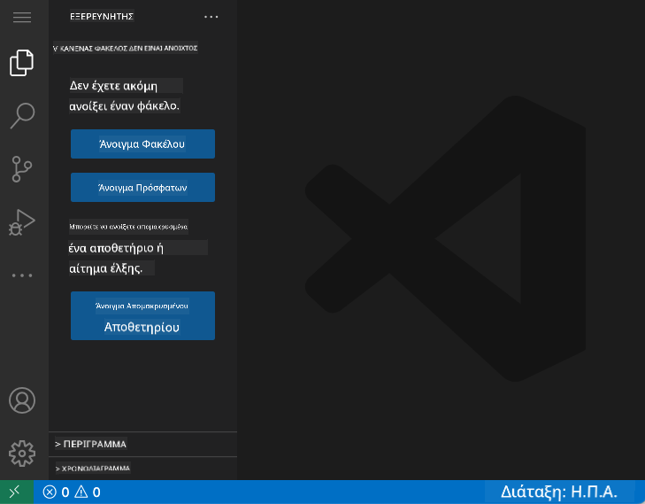
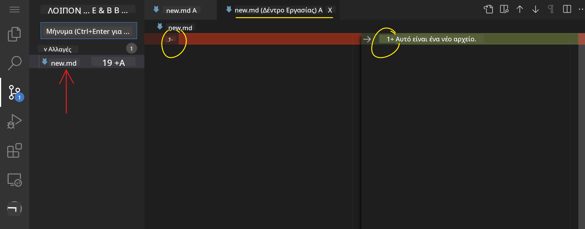
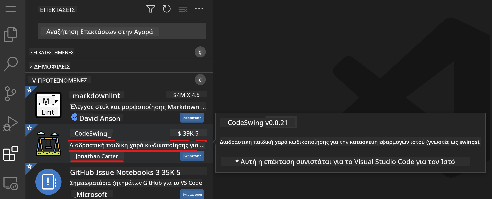
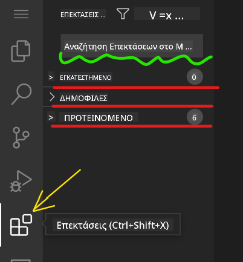
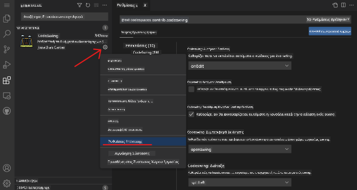

<!--
CO_OP_TRANSLATOR_METADATA:
{
  "original_hash": "1ba61d96a11309a2a6ea507496dcf7e5",
  "translation_date": "2025-08-29T07:17:30+00:00",
  "source_file": "8-code-editor/1-using-a-code-editor/README.md",
  "language_code": "el"
}
-->
# Χρήση ενός επεξεργαστή κώδικα

Αυτό το μάθημα καλύπτει τα βασικά της χρήσης του [VSCode.dev](https://vscode.dev), ενός επεξεργαστή κώδικα βασισμένου στον ιστό, ώστε να μπορείτε να κάνετε αλλαγές στον κώδικά σας και να συνεισφέρετε σε ένα έργο χωρίς να εγκαταστήσετε τίποτα στον υπολογιστή σας.

## Στόχοι μάθησης

Σε αυτό το μάθημα, θα μάθετε πώς να:

- Χρησιμοποιείτε έναν επεξεργαστή κώδικα σε ένα έργο κώδικα
- Παρακολουθείτε αλλαγές με έλεγχο εκδόσεων
- Προσαρμόζετε τον επεξεργαστή για ανάπτυξη

### Προαπαιτούμενα

Πριν ξεκινήσετε, θα χρειαστεί να δημιουργήσετε έναν λογαριασμό στο [GitHub](https://github.com). Μεταβείτε στο [GitHub](https://github.com/) και δημιουργήστε έναν λογαριασμό αν δεν έχετε ήδη.

### Εισαγωγή

Ένας επεξεργαστής κώδικα είναι ένα απαραίτητο εργαλείο για τη συγγραφή προγραμμάτων και τη συνεργασία σε υπάρχοντα έργα κώδικα. Μόλις κατανοήσετε τα βασικά ενός επεξεργαστή και πώς να αξιοποιήσετε τις δυνατότητές του, θα μπορείτε να τα εφαρμόσετε κατά τη συγγραφή κώδικα.

## Ξεκινώντας με το VSCode.dev

Το [VSCode.dev](https://vscode.dev) είναι ένας επεξεργαστής κώδικα στον ιστό. Δεν χρειάζεται να εγκαταστήσετε τίποτα για να το χρησιμοποιήσετε, όπως ακριβώς ανοίγετε οποιονδήποτε άλλο ιστότοπο. Για να ξεκινήσετε με τον επεξεργαστή, ανοίξτε τον παρακάτω σύνδεσμο: [https://vscode.dev](https://vscode.dev). Αν δεν έχετε συνδεθεί στο [GitHub](https://github.com/), ακολουθήστε τις οδηγίες για να συνδεθείτε ή να δημιουργήσετε έναν νέο λογαριασμό και στη συνέχεια συνδεθείτε.

Μόλις φορτώσει, θα πρέπει να μοιάζει με την παρακάτω εικόνα:



Υπάρχουν τρεις κύριες ενότητες, ξεκινώντας από τα αριστερά και προχωρώντας προς τα δεξιά:

1. Η _γραμμή δραστηριοτήτων_ που περιλαμβάνει μερικά εικονίδια, όπως ο μεγεθυντικός φακός 🔎, το γρανάζι ⚙️ και μερικά άλλα.
2. Η επεκταμένη γραμμή δραστηριοτήτων που από προεπιλογή εμφανίζει τον _Εξερευνητή_, που ονομάζεται _πλευρική γραμμή_.
3. Και τέλος, η περιοχή κώδικα στα δεξιά.

Κάντε κλικ σε κάθε ένα από τα εικονίδια για να εμφανίσετε διαφορετικά μενού. Όταν τελειώσετε, κάντε κλικ στον _Εξερευνητή_ για να επιστρέψετε εκεί που ξεκινήσατε.

Όταν αρχίσετε να δημιουργείτε ή να τροποποιείτε κώδικα, αυτό θα συμβεί στη μεγαλύτερη περιοχή στα δεξιά. Θα χρησιμοποιήσετε αυτήν την περιοχή για να δείτε και τον υπάρχοντα κώδικα, κάτι που θα κάνετε στη συνέχεια.

## Άνοιγμα ενός αποθετηρίου GitHub

Το πρώτο πράγμα που θα χρειαστείτε είναι να ανοίξετε ένα αποθετήριο GitHub. Υπάρχουν πολλοί τρόποι για να ανοίξετε ένα αποθετήριο. Σε αυτή την ενότητα θα δείτε δύο διαφορετικούς τρόπους για να ανοίξετε ένα αποθετήριο ώστε να ξεκινήσετε να εργάζεστε σε αλλαγές.

### 1. Με τον επεξεργαστή

Χρησιμοποιήστε τον ίδιο τον επεξεργαστή για να ανοίξετε ένα απομακρυσμένο αποθετήριο. Αν μεταβείτε στο [VSCode.dev](https://vscode.dev), θα δείτε ένα κουμπί _"Open Remote Repository"_:


Μπορείτε επίσης να χρησιμοποιήσετε την παλέτα εντολών. Η παλέτα εντολών είναι ένα πλαίσιο εισαγωγής όπου μπορείτε να πληκτρολογήσετε οποιαδήποτε λέξη που αποτελεί μέρος μιας εντολής ή μιας ενέργειας για να βρείτε τη σωστή εντολή προς εκτέλεση. Χρησιμοποιήστε το μενού επάνω αριστερά, επιλέξτε _View_ και στη συνέχεια επιλέξτε _Command Palette_, ή χρησιμοποιήστε τη συντόμευση πληκτρολογίου: Ctrl-Shift-P (σε MacOS είναι Command-Shift-P).


Μόλις ανοίξει το μενού, πληκτρολογήστε _open remote repository_ και στη συνέχεια επιλέξτε την πρώτη επιλογή. Πολλαπλά αποθετήρια στα οποία συμμετέχετε ή που έχετε ανοίξει πρόσφατα θα εμφανιστούν. Μπορείτε επίσης να χρησιμοποιήσετε ένα πλήρες URL GitHub για να επιλέξετε ένα. Χρησιμοποιήστε το παρακάτω URL και επικολλήστε το στο πλαίσιο:

```
https://github.com/microsoft/Web-Dev-For-Beginners
```

✅ Αν η διαδικασία είναι επιτυχής, θα δείτε όλα τα αρχεία αυτού του αποθετηρίου να φορτώνονται στον επεξεργαστή κειμένου.

### 2. Χρησιμοποιώντας το URL

Μπορείτε επίσης να χρησιμοποιήσετε ένα URL απευθείας για να φορτώσετε ένα αποθετήριο. Για παράδειγμα, το πλήρες URL για το τρέχον αποθετήριο είναι [https://github.com/microsoft/Web-Dev-For-Beginners](https://github.com/microsoft/Web-Dev-For-Beginners), αλλά μπορείτε να αντικαταστήσετε τον τομέα GitHub με `VSCode.dev/github` και να φορτώσετε το αποθετήριο απευθείας. Το προκύπτον URL θα είναι [https://vscode.dev/github/microsoft/Web-Dev-For-Beginners](https://vscode.dev/github/microsoft/Web-Dev-For-Beginners).

## Επεξεργασία αρχείων

Αφού ανοίξετε το αποθετήριο στον περιηγητή/ vscode.dev, το επόμενο βήμα είναι να κάνετε ενημερώσεις ή αλλαγές στο έργο.

### 1. Δημιουργία νέου αρχείου

Μπορείτε είτε να δημιουργήσετε ένα αρχείο μέσα σε έναν υπάρχοντα φάκελο είτε να το δημιουργήσετε στον ριζικό κατάλογο/φάκελο. Για να δημιουργήσετε ένα νέο αρχείο, ανοίξτε μια τοποθεσία/κατάλογο όπου θέλετε να αποθηκευτεί το αρχείο και επιλέξτε το εικονίδιο _'New file ...'_ στη γραμμή δραστηριοτήτων _(αριστερά)_, δώστε του ένα όνομα και πατήστε enter.


### 2. Επεξεργασία και αποθήκευση αρχείου στο αποθετήριο

Η χρήση του vscode.dev είναι χρήσιμη όποτε θέλετε να κάνετε γρήγορες ενημερώσεις στο έργο σας χωρίς να φορτώσετε οποιοδήποτε λογισμικό τοπικά.  
Για να ενημερώσετε τον κώδικά σας, κάντε κλικ στο εικονίδιο 'Explorer', που βρίσκεται επίσης στη γραμμή δραστηριοτήτων, για να δείτε αρχεία και φακέλους στο αποθετήριο.  
Επιλέξτε ένα αρχείο για να το ανοίξετε στην περιοχή κώδικα, κάντε τις αλλαγές σας και αποθηκεύστε.


Μόλις ολοκληρώσετε την ενημέρωση του έργου σας, επιλέξτε το εικονίδιο _`source control`_ που περιέχει όλες τις νέες αλλαγές που έχετε κάνει στο αποθετήριο.

Για να δείτε τις αλλαγές που κάνατε στο έργο σας, επιλέξτε το(α) αρχείο(α) στον φάκελο `Changes` στην επεκταμένη γραμμή δραστηριοτήτων. Αυτό θα ανοίξει ένα 'Working Tree' για να δείτε οπτικά τις αλλαγές που κάνατε στο αρχείο. Το κόκκινο δείχνει μια αφαίρεση από το έργο, ενώ το πράσινο υποδηλώνει μια προσθήκη.



Αν είστε ικανοποιημένοι με τις αλλαγές που κάνατε, τοποθετήστε τον δείκτη του ποντικιού πάνω από τον φάκελο `Changes` και κάντε κλικ στο κουμπί `+` για να προετοιμάσετε τις αλλαγές. Η προετοιμασία σημαίνει απλώς την προετοιμασία των αλλαγών σας για να τις δεσμεύσετε στο GitHub.

Αν, ωστόσο, δεν είστε άνετοι με κάποιες αλλαγές και θέλετε να τις απορρίψετε, τοποθετήστε τον δείκτη του ποντικιού πάνω από τον φάκελο `Changes` και επιλέξτε το εικονίδιο `undo`.

Στη συνέχεια, πληκτρολογήστε ένα `commit message` _(Μια περιγραφή της αλλαγής που κάνατε στο έργο)_, κάντε κλικ στο εικονίδιο `check` για να δεσμεύσετε και να προωθήσετε τις αλλαγές σας.

Μόλις τελειώσετε με το έργο σας, επιλέξτε το εικονίδιο `hamburger menu` επάνω αριστερά για να επιστρέψετε στο αποθετήριο στο github.com.


## Χρήση επεκτάσεων

Η εγκατάσταση επεκτάσεων στο VSCode σας επιτρέπει να προσθέσετε νέες δυνατότητες και επιλογές προσαρμογής του περιβάλλοντος ανάπτυξης στον επεξεργαστή σας, βελτιώνοντας τη ροή εργασίας ανάπτυξης. Αυτές οι επεκτάσεις βοηθούν επίσης στην προσθήκη υποστήριξης για πολλές γλώσσες προγραμματισμού και είναι συχνά είτε γενικές επεκτάσεις είτε επεκτάσεις βασισμένες σε γλώσσες.

Για να περιηγηθείτε στη λίστα όλων των διαθέσιμων επεκτάσεων, κάντε κλικ στο εικονίδιο _`Extensions`_ στη γραμμή δραστηριοτήτων και αρχίστε να πληκτρολογείτε το όνομα της επέκτασης στο πεδίο κειμένου με την ένδειξη _'Search Extensions in Marketplace'_.  
Θα δείτε μια λίστα επεκτάσεων, καθεμία από τις οποίες περιέχει **το όνομα της επέκτασης, το όνομα του εκδότη, μια περιγραφή μιας πρότασης, τον αριθμό λήψεων** και **μια βαθμολογία με αστέρια**.



Μπορείτε επίσης να δείτε όλες τις προηγουμένως εγκατεστημένες επεκτάσεις επεκτείνοντας τον φάκελο _`Installed`_, δημοφιλείς επεκτάσεις που χρησιμοποιούνται από τους περισσότερους προγραμματιστές στον φάκελο _`Popular`_ και προτεινόμενες επεκτάσεις για εσάς είτε από χρήστες στον ίδιο χώρο εργασίας είτε με βάση τα πρόσφατα ανοιγμένα αρχεία σας στον φάκελο _`Recommended`_.



### 1. Εγκατάσταση επεκτάσεων

Για να εγκαταστήσετε μια επέκταση, πληκτρολογήστε το όνομα της επέκτασης στο πεδίο αναζήτησης και κάντε κλικ πάνω της για να δείτε πρόσθετες πληροφορίες σχετικά με την επέκταση στην περιοχή κώδικα μόλις εμφανιστεί στην επεκταμένη γραμμή δραστηριοτήτων.

Μπορείτε είτε να κάνετε κλικ στο _μπλε κουμπί εγκατάστασης_ στην επεκταμένη γραμμή δραστηριοτήτων για να την εγκαταστήσετε είτε να χρησιμοποιήσετε το κουμπί εγκατάστασης που εμφανίζεται στην περιοχή κώδικα μόλις επιλέξετε την επέκταση για να φορτώσετε πρόσθετες πληροφορίες.


### 2. Προσαρμογή επεκτάσεων

Μετά την εγκατάσταση της επέκτασης, ίσως χρειαστεί να τροποποιήσετε τη συμπεριφορά της και να την προσαρμόσετε με βάση τις προτιμήσεις σας. Για να το κάνετε αυτό, επιλέξτε το εικονίδιο Extensions και αυτή τη φορά η επέκταση σας θα εμφανιστεί στον φάκελο _Installed_, κάντε κλικ στο _**Gear icon**_ και μεταβείτε στις _Extensions Setting_.



### 3. Διαχείριση επεκτάσεων

Μετά την εγκατάσταση και χρήση της επέκτασης, το vscode.dev προσφέρει επιλογές για τη διαχείριση της επέκτασης με βάση διαφορετικές ανάγκες. Για παράδειγμα, μπορείτε να επιλέξετε να:

- **Απενεργοποιήσετε:** _(Μπορείτε προσωρινά να απενεργοποιήσετε μια επέκταση όταν δεν τη χρειάζεστε πλέον αλλά δεν θέλετε να την απεγκαταστήσετε εντελώς)_

    Επιλέξτε την εγκατεστημένη επέκταση στην επεκταμένη γραμμή δραστηριοτήτων > κάντε κλικ στο Gear icon > επιλέξτε 'Disable' ή 'Disable (Workspace)' **Ή** Ανοίξτε την επέκταση στην περιοχή κώδικα και κάντε κλικ στο μπλε κουμπί Disable.

- **Απεγκαταστήσετε:** Επιλέξτε την εγκατεστημένη επέκταση στην επεκταμένη γραμμή δραστηριοτήτων > κάντε κλικ στο Gear icon > επιλέξτε 'Uninstall' **Ή** Ανοίξτε την επέκταση στην περιοχή κώδικα και κάντε κλικ στο μπλε κουμπί Uninstall.

---

## Εργασία

[Δημιουργήστε έναν ιστότοπο βιογραφικού χρησιμοποιώντας το vscode.dev](https://github.com/microsoft/Web-Dev-For-Beginners/blob/main/8-code-editor/1-using-a-code-editor/assignment.md)

## Ανασκόπηση & Αυτομελέτη

Διαβάστε περισσότερα για το [VSCode.dev](https://code.visualstudio.com/docs/editor/vscode-web?WT.mc_id=academic-0000-alfredodeza) και μερικές από τις άλλες δυνατότητές του.

---

**Αποποίηση Ευθύνης**:  
Αυτό το έγγραφο έχει μεταφραστεί χρησιμοποιώντας την υπηρεσία αυτόματης μετάφρασης [Co-op Translator](https://github.com/Azure/co-op-translator). Παρόλο που καταβάλλουμε προσπάθειες για ακρίβεια, παρακαλούμε να έχετε υπόψη ότι οι αυτόματες μεταφράσεις ενδέχεται να περιέχουν λάθη ή ανακρίβειες. Το πρωτότυπο έγγραφο στη μητρική του γλώσσα θα πρέπει να θεωρείται η αυθεντική πηγή. Για κρίσιμες πληροφορίες, συνιστάται επαγγελματική ανθρώπινη μετάφραση. Δεν φέρουμε ευθύνη για τυχόν παρεξηγήσεις ή εσφαλμένες ερμηνείες που προκύπτουν από τη χρήση αυτής της μετάφρασης.