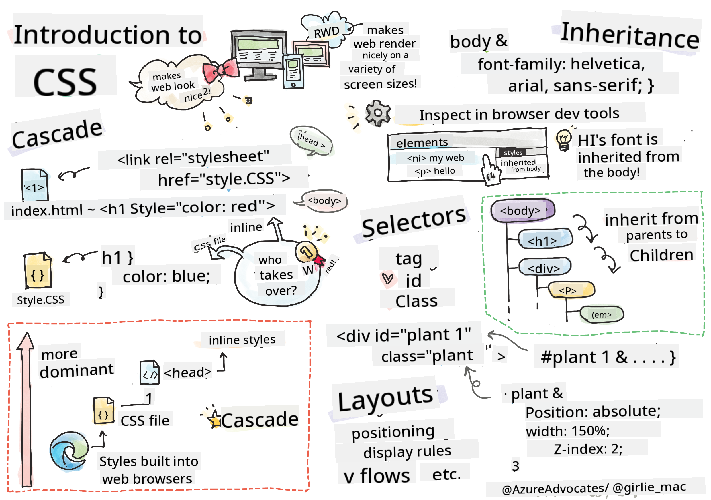
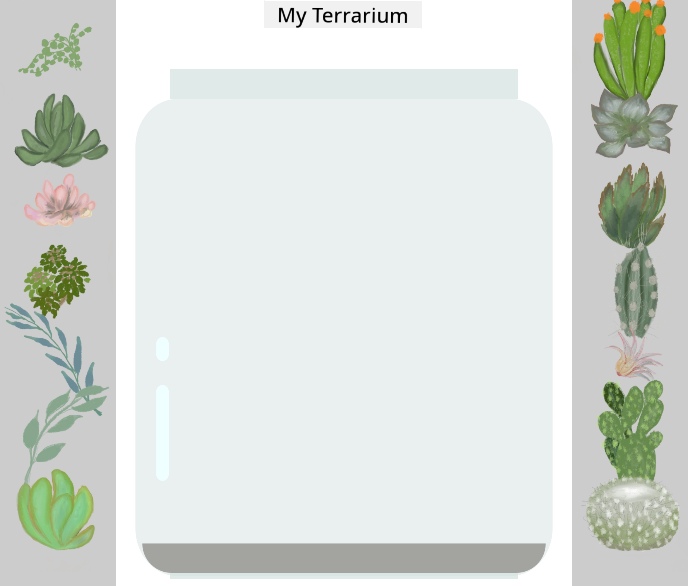

<!--
CO_OP_TRANSLATOR_METADATA:
{
  "original_hash": "acb5ae00cde004304296bb97da8ff4c3",
  "translation_date": "2025-08-29T13:24:30+00:00",
  "source_file": "3-terrarium/2-intro-to-css/README.md",
  "language_code": "en"
}
-->
# Terrarium Project Part 2: Introduction to CSS


> Sketchnote by [Tomomi Imura](https://twitter.com/girlie_mac)

## Pre-Lecture Quiz

[Pre-lecture quiz](https://ff-quizzes.netlify.app/web/quiz/17)

### Introduction

CSS, or Cascading Style Sheets, addresses a key challenge in web development: making your website visually appealing. Styling your apps not only enhances their usability and aesthetics but also enables Responsive Web Design (RWD), ensuring your apps look great on any screen size. CSS goes beyond just making things look good; its specifications include animations and transformations that allow for advanced interactions in your apps. The CSS Working Group maintains the current CSS specifications, and you can follow their work on the [World Wide Web Consortium's site](https://www.w3.org/Style/CSS/members).

> Note: CSS is an evolving language, like everything on the web, and not all browsers support the latest specifications. Always verify your implementations using [CanIUse.com](https://caniuse.com).

In this lesson, we’ll add styles to our online terrarium and explore key CSS concepts: the cascade, inheritance, selectors, positioning, and using CSS for layouts. By the end, we’ll have styled the terrarium and created the actual terrarium itself.

### Prerequisite

You should already have the HTML for your terrarium prepared and ready for styling.

> Watch the video

> 
> [](https://www.youtube.com/watch?v=6yIdOIV9p1I)

### Task

In your terrarium folder, create a new file called `style.css`. Link this file in the `<head>` section of your HTML:

```html
<link rel="stylesheet" href="./style.css" />
```

---

## The Cascade

Cascading Style Sheets are based on the concept of "cascading," meaning that the application of styles is determined by their priority. Styles defined by the website author take precedence over browser defaults. Inline styles have the highest priority, followed by styles in external stylesheets.

### Task

Add the inline style "color: red" to your `<h1>` tag:

```HTML
<h1 style="color: red">My Terrarium</h1>
```

Next, add the following code to your `style.css` file:

```CSS
h1 {
 color: blue;
}
```

✅ Which color appears in your web app? Why? Can you find a way to override styles? When might you want to do this, or why not?

---

## Inheritance

Styles are passed down from parent elements to their child elements, meaning nested elements inherit the styles of their parent.

### Task

Set the font for the body and check if a nested element inherits it:

```CSS
body {
	font-family: helvetica, arial, sans-serif;
}
```

Open your browser's console and inspect the 'Elements' tab. Observe the font of the `<h1>` tag. You’ll see that it inherits the font from the body, as indicated by the browser:


✅ Can you make a nested style inherit a different property?

---

## CSS Selectors

### Tags

So far, your `style.css` file has only a few tags styled, and the app looks a bit odd:

```CSS
body {
	font-family: helvetica, arial, sans-serif;
}

h1 {
	color: #3a241d;
	text-align: center;
}
```

This method of styling tags allows you to control individual elements, but to style multiple plants in your terrarium, you’ll need to use CSS selectors.

### Ids

Add styles to position the left and right containers. Since there’s only one left container and one right container, they are assigned ids in the HTML. Use `#` to style them:

```CSS
#left-container {
	background-color: #eee;
	width: 15%;
	left: 0px;
	top: 0px;
	position: absolute;
	height: 100%;
	padding: 10px;
}

#right-container {
	background-color: #eee;
	width: 15%;
	right: 0px;
	top: 0px;
	position: absolute;
	height: 100%;
	padding: 10px;
}
```

Here, the containers are positioned absolutely on the far left and right of the screen, with their widths set as percentages to ensure they scale on smaller mobile screens.

✅ This code is repetitive and not "DRY" (Don’t Repeat Yourself). Can you find a better way to style these ids, perhaps by combining an id and a class? You’ll need to update the HTML and refactor the CSS:

```html
<div id="left-container" class="container"></div>
```

### Classes

In the example above, you styled two unique elements. To apply styles to multiple elements, use CSS classes. Style the plants in the left and right containers as follows.

Notice that each plant in the HTML has both ids and classes. The ids are used by JavaScript (added later) to manipulate the placement of plants in the terrarium. The classes, however, define the styles for all plants.

```html
<div class="plant-holder">
	
</div>
```

Add the following to your `style.css` file:

```CSS
.plant-holder {
	position: relative;
	height: 13%;
	left: -10px;
}

.plant {
	position: absolute;
	max-width: 150%;
	max-height: 150%;
	z-index: 2;
}
```

Key points in this snippet include the combination of relative and absolute positioning, which we’ll discuss in the next section. Pay attention to how heights are managed using percentages:

- The plant holder’s height is set to 13%, ensuring all plants fit vertically within their containers without scrolling.
- The plant holder is shifted left to center the plants within their containers. The plant images have a lot of transparent space to make them draggable, so they need to be adjusted for better alignment.
- The plant’s max-width is set to 150%, allowing it to scale down as the browser window shrinks. Resize your browser to see how the plants stay within their containers while scaling down.

Also noteworthy is the use of `z-index`, which controls the stacking order of elements (ensuring the plants appear on top of the container and look like they’re inside the terrarium).

✅ Why do you need both a plant holder and a plant CSS selector?

## CSS Positioning

Mixing position properties (static, relative, fixed, absolute, and sticky) can be tricky, but when done correctly, it provides precise control over your page elements.

- Absolutely positioned elements are placed relative to their nearest positioned ancestor. If none exists, they are positioned relative to the document body.
- Relatively positioned elements are offset from their original position based on the CSS instructions.

In our example, the `plant-holder` is relatively positioned within an absolutely positioned container. This setup ensures the side containers are pinned to the left and right, while the `plant-holder` adjusts itself within the side containers, creating space for the plants to align vertically.

> The `plant` itself is absolutely positioned, which is necessary for making it draggable, as you’ll learn in the next lesson.

✅ Experiment with changing the positioning of the side containers and the `plant-holder`. What happens?

## CSS Layouts

Now, use what you’ve learned to build the terrarium itself using only CSS!

First, style the `.terrarium` div children as a rounded rectangle:

```CSS
.jar-walls {
	height: 80%;
	width: 60%;
	background: #d1e1df;
	border-radius: 1rem;
	position: absolute;
	bottom: 0.5%;
	left: 20%;
	opacity: 0.5;
	z-index: 1;
}

.jar-top {
	width: 50%;
	height: 5%;
	background: #d1e1df;
	position: absolute;
	bottom: 80.5%;
	left: 25%;
	opacity: 0.7;
	z-index: 1;
}

.jar-bottom {
	width: 50%;
	height: 1%;
	background: #d1e1df;
	position: absolute;
	bottom: 0%;
	left: 25%;
	opacity: 0.7;
}

.dirt {
	width: 60%;
	height: 5%;
	background: #3a241d;
	position: absolute;
	border-radius: 0 0 1rem 1rem;
	bottom: 1%;
	left: 20%;
	opacity: 0.7;
	z-index: -1;
}
```

Notice the use of percentages. If you resize your browser, the jar scales accordingly. Pay attention to the width and height percentages for the jar elements and how each is absolutely positioned in the center, pinned to the bottom of the viewport.

We’re also using `rem` for the border-radius, a font-relative unit. Learn more about this relative measurement in the [CSS spec](https://www.w3.org/TR/css-values-3/#font-relative-lengths).

✅ Try changing the jar’s colors and opacity compared to the dirt. What happens? Why?

---

## 🚀Challenge

Add a "bubble" shine to the bottom-left area of the jar to make it look more like glass. Style the `.jar-glossy-long` and `.jar-glossy-short` to create a reflective shine. Here’s the final result:



To complete the post-lecture quiz, explore this Learn module: [Style your HTML app with CSS](https://docs.microsoft.com/learn/modules/build-simple-website/4-css-basics/?WT.mc_id=academic-77807-sagibbon)

## Post-Lecture Quiz

[Post-lecture quiz](https://ff-quizzes.netlify.app/web/quiz/18)

## Review & Self Study

CSS may seem simple, but styling an app perfectly for all browsers and screen sizes can be challenging. Tools like CSS Grid and Flexbox make this process more structured and reliable. Learn about these tools by playing [Flexbox Froggy](https://flexboxfroggy.com/) and [Grid Garden](https://codepip.com/games/grid-garden/).

## Assignment

[CSS Refactoring](assignment.md)

---

**Disclaimer**:  
This document has been translated using the AI translation service [Co-op Translator](https://github.com/Azure/co-op-translator). While we strive for accuracy, please note that automated translations may contain errors or inaccuracies. The original document in its native language should be regarded as the authoritative source. For critical information, professional human translation is recommended. We are not responsible for any misunderstandings or misinterpretations resulting from the use of this translation.