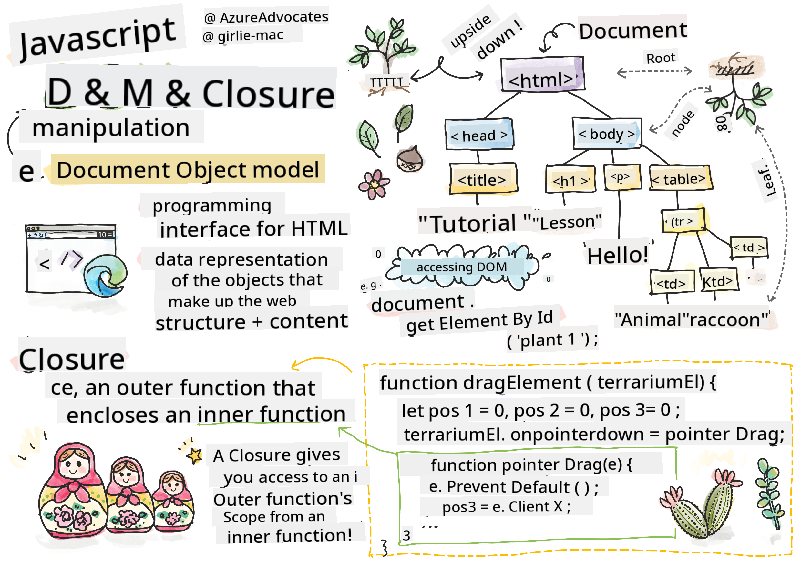
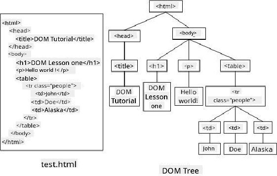

<!--
CO_OP_TRANSLATOR_METADATA:
{
  "original_hash": "61c14b27044861e5e69db35dd52c4403",
  "translation_date": "2025-08-29T13:25:27+00:00",
  "source_file": "3-terrarium/3-intro-to-DOM-and-closures/README.md",
  "language_code": "en"
}
-->
# Terrarium Project Part 3: DOM Manipulation and a Closure


> Sketchnote by [Tomomi Imura](https://twitter.com/girlie_mac)

## Pre-Lecture Quiz

[Pre-lecture quiz](https://ff-quizzes.netlify.app/web/quiz/19)

### Introduction

Manipulating the DOM, or the "Document Object Model," is a fundamental part of web development. According to [MDN](https://developer.mozilla.org/docs/Web/API/Document_Object_Model/Introduction), "The Document Object Model (DOM) is the data representation of the objects that comprise the structure and content of a document on the web." The challenges of DOM manipulation have often led developers to use JavaScript frameworks instead of plain JavaScript to manage the DOM, but we’ll tackle it ourselves!

Additionally, this lesson introduces the concept of a [JavaScript closure](https://developer.mozilla.org/docs/Web/JavaScript/Closures), which you can think of as a function wrapped inside another function, allowing the inner function to access the outer function's scope.

> JavaScript closures are a broad and complex topic. This lesson covers the basic idea that in the terrarium's code, you’ll encounter a closure: an inner function and an outer function structured in a way that lets the inner function access the outer function's scope. For more details, check out the [comprehensive documentation](https://developer.mozilla.org/docs/Web/JavaScript/Closures).

We’ll use a closure to manipulate the DOM.

Think of the DOM as a tree that represents all the ways a web page document can be manipulated. Various APIs (Application Program Interfaces) have been created to allow developers to access, edit, rearrange, and manage the DOM using their preferred programming language.



> A representation of the DOM and the HTML markup that references it. From [Olfa Nasraoui](https://www.researchgate.net/publication/221417012_Profile-Based_Focused_Crawler_for_Social_Media-Sharing_Websites)

In this lesson, we’ll complete our interactive terrarium project by writing JavaScript that lets users move plants around the page.

### Prerequisite

You should already have the HTML and CSS for your terrarium set up. By the end of this lesson, you’ll be able to drag plants into and out of the terrarium.

### Task

In your terrarium folder, create a new file called `script.js`. Import this file in the `<head>` section:

```html
	<script src="./script.js" defer></script>
```

> Note: Use `defer` when importing an external JavaScript file into the HTML file to ensure the JavaScript runs only after the HTML file has fully loaded. Alternatively, you could use the `async` attribute, which allows the script to execute while the HTML file is still being parsed. However, in our case, it’s important for the HTML elements to be fully loaded before the drag script runs.

---

## The DOM elements

The first step is to create references to the elements you want to manipulate in the DOM. In this case, these are the 14 plants currently located in the sidebars.

### Task

```html
dragElement(document.getElementById('plant1'));
dragElement(document.getElementById('plant2'));
dragElement(document.getElementById('plant3'));
dragElement(document.getElementById('plant4'));
dragElement(document.getElementById('plant5'));
dragElement(document.getElementById('plant6'));
dragElement(document.getElementById('plant7'));
dragElement(document.getElementById('plant8'));
dragElement(document.getElementById('plant9'));
dragElement(document.getElementById('plant10'));
dragElement(document.getElementById('plant11'));
dragElement(document.getElementById('plant12'));
dragElement(document.getElementById('plant13'));
dragElement(document.getElementById('plant14'));
```

What’s happening here? You’re referencing the document and searching its DOM for an element with a specific Id. Recall from the first HTML lesson that you assigned unique Ids to each plant image (`id="plant1"`). Now, you’ll use those Ids. After identifying each element, you pass it to a function called `dragElement`, which you’ll build shortly. This makes the HTML element draggable—or it will soon.

✅ Why do we reference elements by Id instead of their CSS class? Refer back to the CSS lesson for the answer.

---

## The Closure

Now it’s time to create the `dragElement` closure, which is an outer function that wraps around inner functions (in this case, three). 

Closures are useful when one or more functions need access to the outer function's scope. Here’s an example:

```javascript
function displayCandy(){
	let candy = ['jellybeans'];
	function addCandy(candyType) {
		candy.push(candyType)
	}
	addCandy('gumdrops');
}
displayCandy();
console.log(candy)
```

In this example, the `displayCandy` function wraps around a function that adds a new candy type to an array already defined in the outer function. If you run this code, the `candy` array will be undefined because it’s a local variable (local to the closure).

✅ How can you make the `candy` array accessible? Try moving it outside the closure. This way, the array becomes global instead of being limited to the closure’s local scope.

### Task

Under the element declarations in `script.js`, create a function:

```javascript
function dragElement(terrariumElement) {
	//set 4 positions for positioning on the screen
	let pos1 = 0,
		pos2 = 0,
		pos3 = 0,
		pos4 = 0;
	terrariumElement.onpointerdown = pointerDrag;
}
```

`dragElement` receives its `terrariumElement` object from the declarations at the top of the script. Then, you set some local positions to `0` for the object passed into the function. These local variables will be used to track each element’s position as you add drag-and-drop functionality within the closure. The terrarium will be populated with these draggable elements, so the app needs to keep track of their placement.

Additionally, the `terrariumElement` passed to this function is assigned a `pointerdown` event, which is part of the [web APIs](https://developer.mozilla.org/docs/Web/API) designed for DOM manipulation. `onpointerdown` triggers when a button is pressed or, in this case, when a draggable element is touched. This event handler works on both [web and mobile browsers](https://caniuse.com/?search=onpointerdown), with a few exceptions.

✅ The [event handler `onclick`](https://developer.mozilla.org/docs/Web/API/GlobalEventHandlers/onclick) has broader browser support. Why wouldn’t you use it here? Consider the specific type of interaction you’re trying to create.

---

## The Pointerdrag function

The `terrariumElement` is now ready to be dragged. When the `onpointerdown` event is triggered, the `pointerDrag` function is called. Add this function right below the line: `terrariumElement.onpointerdown = pointerDrag;`:

### Task 

```javascript
function pointerDrag(e) {
	e.preventDefault();
	console.log(e);
	pos3 = e.clientX;
	pos4 = e.clientY;
}
```

Several things happen here. First, you prevent the default events that typically occur on pointerdown by using `e.preventDefault();`. This gives you more control over the interface’s behavior.

> After completing the script file, revisit this line and try removing `e.preventDefault()`—what changes?

Next, open `index.html` in a browser and inspect the interface. When you click a plant, you’ll see how the 'e' event is captured. Explore the event to see the wealth of information gathered from a single pointerdown event!

Then, note how the local variables `pos3` and `pos4` are set to `e.clientX`. You can find the `e` values in the inspection pane. These values capture the x and y coordinates of the plant at the moment you click or touch it. You’ll need precise control over the plants’ behavior as you drag them, so you track their coordinates.

✅ Is it becoming clearer why this app is built with one large closure? Without it, how would you maintain scope for each of the 14 draggable plants?

Complete the initial function by adding two more pointer event manipulations under `pos4 = e.clientY`:

```html
document.onpointermove = elementDrag;
document.onpointerup = stopElementDrag;
```

Here, you specify that the plant should move with the pointer as you drag it and stop moving when you release it. `onpointermove` and `onpointerup` are part of the same API as `onpointerdown`. The interface will throw errors now because the `elementDrag` and `stopElementDrag` functions haven’t been defined yet, so let’s build those next.

---

## The elementDrag and stopElementDrag functions

Complete the closure by adding two more internal functions to handle what happens when you drag a plant and when you stop dragging it. The goal is to allow you to drag any plant at any time and place it anywhere on the screen. This interface is intentionally flexible (there’s no drop zone, for example) so you can design your terrarium however you like by adding, removing, and repositioning plants.

### Task

Add the `elementDrag` function right after the closing curly bracket of `pointerDrag`:

```javascript
function elementDrag(e) {
	pos1 = pos3 - e.clientX;
	pos2 = pos4 - e.clientY;
	pos3 = e.clientX;
	pos4 = e.clientY;
	console.log(pos1, pos2, pos3, pos4);
	terrariumElement.style.top = terrariumElement.offsetTop - pos2 + 'px';
	terrariumElement.style.left = terrariumElement.offsetLeft - pos1 + 'px';
}
```

In this function, you make several adjustments to the initial positions (`pos1`–`pos4`) set as local variables in the outer function. What’s happening here?

As you drag, you update `pos1` by setting it equal to `pos3` (previously set as `e.clientX`) minus the current `e.clientX` value. You do something similar for `pos2`. Then, you update `pos3` and `pos4` to the new x and y coordinates of the element. You can observe these changes in the console as you drag. Finally, you modify the plant’s CSS style to set its new position based on the updated values of `pos1` and `pos2`, calculating the plant’s top and left coordinates relative to its offset.

> `offsetTop` and `offsetLeft` are CSS properties that position an element relative to its parent, as long as the parent isn’t positioned as `static`.

This recalculation ensures precise control over the terrarium and its plants.

### Task 

Finally, add the `stopElementDrag` function after the closing curly bracket of `elementDrag`:

```javascript
function stopElementDrag() {
	document.onpointerup = null;
	document.onpointermove = null;
}
```

This small function resets the `onpointerup` and `onpointermove` events, allowing you to either restart dragging the same plant or begin dragging a new one.

✅ What happens if you don’t set these events to null?

Now your project is complete!

🥇Congratulations! You’ve finished your beautiful terrarium! 

---

## 🚀Challenge

Add a new event handler to your closure to add more functionality to the plants—for example, double-clicking a plant to bring it to the front. Get creative!

## Post-Lecture Quiz

[Post-lecture quiz](https://ff-quizzes.netlify.app/web/quiz/20)

## Review & Self Study

While dragging elements around the screen may seem simple, there are many ways to achieve this and many potential challenges, depending on the desired effect. In fact, there’s an entire [drag-and-drop API](https://developer.mozilla.org/docs/Web/API/HTML_Drag_and_Drop_API) you can explore. We didn’t use it in this module because we wanted a slightly different effect, but try it out in your own project to see what you can create.

Learn more about pointer events in the [W3C docs](https://www.w3.org/TR/pointerevents1/) and on [MDN web docs](https://developer.mozilla.org/docs/Web/API/Pointer_events).

Always check browser compatibility using [CanIUse.com](https://caniuse.com/).

## Assignment

[Work a bit more with the DOM](assignment.md)

---

**Disclaimer**:  
This document has been translated using the AI translation service [Co-op Translator](https://github.com/Azure/co-op-translator). While we strive for accuracy, please note that automated translations may contain errors or inaccuracies. The original document in its native language should be regarded as the authoritative source. For critical information, professional human translation is recommended. We are not responsible for any misunderstandings or misinterpretations resulting from the use of this translation.