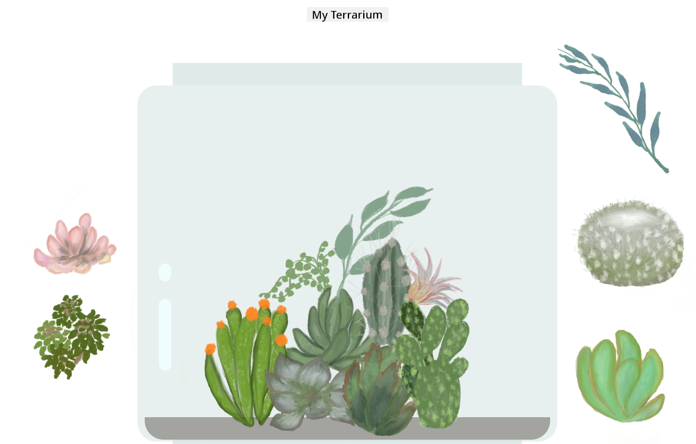

<!--
CO_OP_TRANSLATOR_METADATA:
{
  "original_hash": "6329fbe8bd936068debd78cca6f09c0a",
  "translation_date": "2025-08-28T11:50:16+00:00",
  "source_file": "3-terrarium/solution/README.md",
  "language_code": "en"
}
-->
# My Terrarium: A project to learn about HTML, CSS, and DOM manipulation using JavaScript 🌵🌱

A small drag-and-drop coding exercise. With a bit of HTML, JS, and CSS, you can create a web interface, style it, and add interactivity.

## Credits

Written with ♥️ by [Jen Looper](https://www.twitter.com/jenlooper)

The CSS-based terrarium design was inspired by Jakub Mandra's glass jar [codepen](https://codepen.io/Rotarepmi/pen/rjpNZY).

The artwork was hand-drawn by [Jen Looper](http://jenlooper.com) using Procreate.

## Deploy your Terrarium

You can deploy or publish your terrarium to the web using Azure Static Web Apps.

1. Fork this repository.

2. Click this button:

3. Follow the steps in the wizard to create your app. Make sure to set the app root to either `/solution` or the root of your codebase. This app doesn't include an API, so you don't need to add one. A `.github` folder will be created in your forked repository, which will help Azure Static Web Apps' build service compile and publish your app to a new URL.

---

**Disclaimer**:  
This document has been translated using the AI translation service [Co-op Translator](https://github.com/Azure/co-op-translator). While we strive for accuracy, please note that automated translations may contain errors or inaccuracies. The original document in its native language should be regarded as the authoritative source. For critical information, professional human translation is recommended. We are not responsible for any misunderstandings or misinterpretations resulting from the use of this translation.