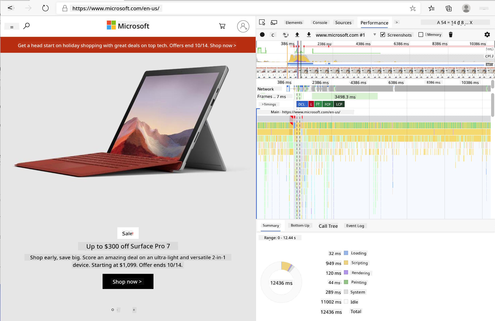
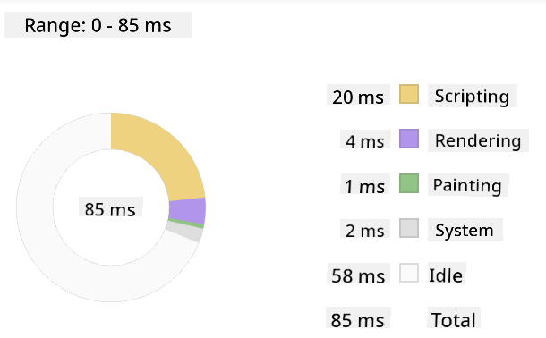

<!--
CO_OP_TRANSLATOR_METADATA:
{
  "original_hash": "49b58721a71cfda824e2f3e1f46908c6",
  "translation_date": "2025-08-29T13:19:00+00:00",
  "source_file": "5-browser-extension/3-background-tasks-and-performance/README.md",
  "language_code": "en"
}
-->
# Browser Extension Project Part 3: Learn about Background Tasks and Performance

## Pre-Lecture Quiz

[Pre-lecture quiz](https://ff-quizzes.netlify.app/web/quiz/27)

### Introduction

In the last two lessons of this module, you learned how to create a form and a display area for data fetched from an API. This is a very common way to establish a web presence. You even learned how to handle asynchronous data fetching. Your browser extension is almost complete.

What remains is managing some background tasks, such as refreshing the color of the extension's icon. This is a great opportunity to discuss how the browser handles these kinds of tasks. Let’s consider these browser tasks in the context of optimizing the performance of your web assets as you build them.

## Web Performance Basics

> "Website performance is about two things: how fast the page loads, and how fast the code on it runs." -- [Zack Grossbart](https://www.smashingmagazine.com/2012/06/javascript-profiling-chrome-developer-tools/)

The topic of making websites lightning-fast for all kinds of devices, users, and situations is understandably vast. Here are some key points to keep in mind when building either a standard web project or a browser extension.

The first step to ensuring your site runs efficiently is to gather data about its performance. The best place to start is the developer tools in your web browser. In Edge, click the "Settings and more" button (the three dots icon in the top-right corner), then navigate to More Tools > Developer Tools and open the Performance tab. You can also use the keyboard shortcuts `Ctrl` + `Shift` + `I` on Windows or `Option` + `Command` + `I` on Mac to open the developer tools.

The Performance tab includes a Profiling tool. Open a website (for example, [https://www.microsoft.com](https://www.microsoft.com/?WT.mc_id=academic-77807-sagibbon)) and click the 'Record' button, then refresh the site. Stop the recording at any time, and you’ll see the routines generated to 'script', 'render', and 'paint' the site:



✅ Visit the [Microsoft Documentation](https://docs.microsoft.com/microsoft-edge/devtools-guide/performance/?WT.mc_id=academic-77807-sagibbon) on the Performance panel in Edge.

> Tip: To get an accurate reading of your website's startup time, clear your browser's cache.

Select elements of the profile timeline to zoom in on events that occur while your page loads.

Get a snapshot of your page's performance by selecting a part of the profile timeline and reviewing the summary pane:



Check the Event Log pane to see if any event took longer than 15 ms:


✅ Get familiar with your profiler! Open the developer tools on this site and check for any bottlenecks. What’s the slowest-loading asset? The fastest?

## Profiling Checks

In general, there are some "problem areas" that every web developer should monitor when building a site to avoid unpleasant surprises during deployment.

**Asset sizes**: Over the years, the web has become 'heavier' and, as a result, slower. A significant portion of this weight comes from images.

✅ Explore the [Internet Archive](https://httparchive.org/reports/page-weight) for a historical view of page weight and more.

A good practice is to ensure your images are optimized and delivered at the appropriate size and resolution for your users.

**DOM traversals**: The browser builds its Document Object Model (DOM) based on the code you write. For better page performance, keep your tags minimal and only use and style what the page requires. For instance, excess CSS associated with a page can be optimized; styles needed for a single page don’t need to be included in the main stylesheet.

**JavaScript**: Every JavaScript developer should watch out for 'render-blocking' scripts that must load before the rest of the DOM can be traversed and painted in the browser. Consider using `defer` with your inline scripts (as demonstrated in the Terrarium module).

✅ Test some websites on a [Site Speed Test website](https://www.webpagetest.org/) to learn more about common checks for site performance.

Now that you have an understanding of how the browser renders the assets you send to it, let’s move on to the final steps for completing your extension:

### Create a Function to Calculate Color

In `/src/index.js`, add a function called `calculateColor()` after the series of `const` variables you set to access the DOM:

```JavaScript
function calculateColor(value) {
	let co2Scale = [0, 150, 600, 750, 800];
	let colors = ['#2AA364', '#F5EB4D', '#9E4229', '#381D02', '#381D02'];

	let closestNum = co2Scale.sort((a, b) => {
		return Math.abs(a - value) - Math.abs(b - value);
	})[0];
	console.log(value + ' is closest to ' + closestNum);
	let num = (element) => element > closestNum;
	let scaleIndex = co2Scale.findIndex(num);

	let closestColor = colors[scaleIndex];
	console.log(scaleIndex, closestColor);

	chrome.runtime.sendMessage({ action: 'updateIcon', value: { color: closestColor } });
}
```

What’s happening here? You pass in a value (the carbon intensity) from the API call you completed in the last lesson, then calculate how close its value is to the index in the colors array. Finally, you send the closest color value to the chrome runtime.

The chrome.runtime has [an API](https://developer.chrome.com/extensions/runtime) that handles various background tasks, which your extension is utilizing:

> "Use the chrome.runtime API to retrieve the background page, return details about the manifest, and listen for and respond to events in the app or extension lifecycle. You can also use this API to convert the relative path of URLs to fully-qualified URLs."

✅ If you’re developing this browser extension for Edge, you might be surprised to use a chrome API. The newer versions of Edge run on the Chromium browser engine, allowing you to leverage these tools.

> Note: If you want to profile a browser extension, launch the dev tools from within the extension itself, as it operates as a separate browser instance.

### Set a Default Icon Color

In the `init()` function, set the icon to a generic green color initially by calling chrome’s `updateIcon` action:

```JavaScript
chrome.runtime.sendMessage({
	action: 'updateIcon',
		value: {
			color: 'green',
		},
});
```

### Call the Function and Execute the Call

Next, call the function you just created by adding it to the promise returned by the CO2Signal API:

```JavaScript
//let CO2...
calculateColor(CO2);
```

Finally, in `/dist/background.js`, add the listener for these background action calls:

```JavaScript
chrome.runtime.onMessage.addListener(function (msg, sender, sendResponse) {
	if (msg.action === 'updateIcon') {
		chrome.browserAction.setIcon({ imageData: drawIcon(msg.value) });
	}
});
//borrowed from energy lollipop extension, nice feature!
function drawIcon(value) {
	let canvas = document.createElement('canvas');
	let context = canvas.getContext('2d');

	context.beginPath();
	context.fillStyle = value.color;
	context.arc(100, 100, 50, 0, 2 * Math.PI);
	context.fill();

	return context.getImageData(50, 50, 100, 100);
}
```

In this code, you’re adding a listener for any messages sent to the backend task manager. If the message is called 'updateIcon', the subsequent code runs to draw an icon of the appropriate color using the Canvas API.

✅ You’ll learn more about the Canvas API in the [Space Game lessons](../../6-space-game/2-drawing-to-canvas/README.md).

Now, rebuild your extension (`npm run build`), refresh and launch it, and watch the color change. Is it a good time to run an errand or wash the dishes? Now you know!

Congratulations! You’ve built a functional browser extension and gained insights into how the browser works and how to profile its performance.

---

## 🚀 Challenge

Explore some open-source websites that have been around for a long time. Based on their GitHub history, see if you can identify how they’ve been optimized for performance over the years, if at all. What’s the most common pain point?

## Post-Lecture Quiz

[Post-lecture quiz](https://ff-quizzes.netlify.app/web/quiz/28)

## Review & Self Study

Consider subscribing to a [performance newsletter](https://perf.email/).

Investigate how browsers measure web performance by exploring the performance tabs in their developer tools. Do you notice any significant differences?

## Assignment

[Analyze a site for performance](assignment.md)

---

**Disclaimer**:  
This document has been translated using the AI translation service [Co-op Translator](https://github.com/Azure/co-op-translator). While we strive for accuracy, please note that automated translations may contain errors or inaccuracies. The original document in its native language should be regarded as the authoritative source. For critical information, professional human translation is recommended. We are not responsible for any misunderstandings or misinterpretations resulting from the use of this translation.