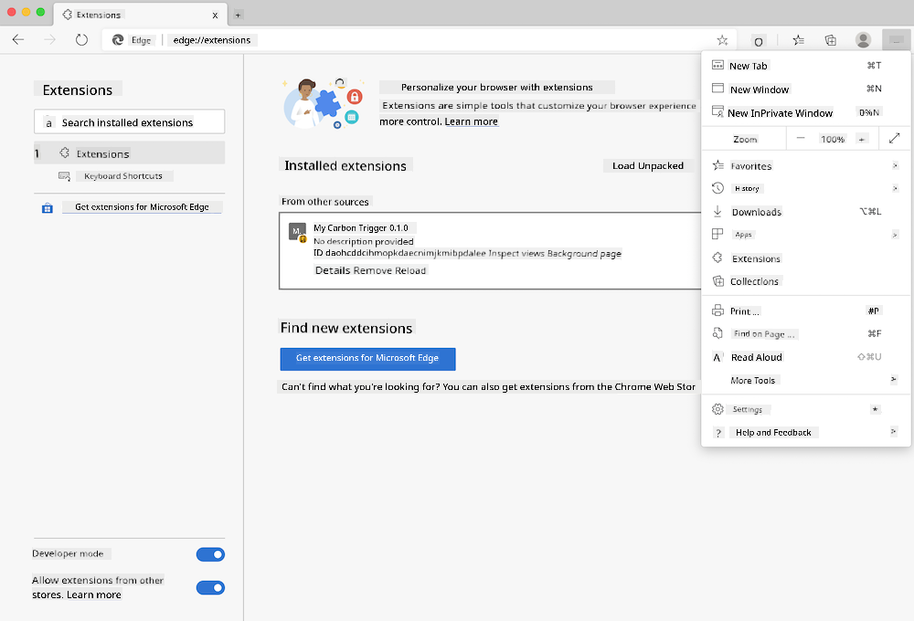

<!--
CO_OP_TRANSLATOR_METADATA:
{
  "original_hash": "3f5e6821e0febccfc5d05e7c944d9e3d",
  "translation_date": "2025-08-28T11:28:01+00:00",
  "source_file": "5-browser-extension/solution/translation/README.ja.md",
  "language_code": "en"
}
-->
# Carbon Trigger Browser Extension: Completed Code

Using tmrow's CO2 Signal API, this browser extension tracks electricity usage in your area and displays it as a reminder directly in your browser. By using this extension on an ad hoc basis, you can make decisions about your activities based on this information.


## Getting Started

You need to have [npm](https://npmjs.com) installed. Download a copy of this code into a folder on your computer.

Install all the required packages.

```
npm install
```

Build the extension using webpack.

```
npm run build
```

To install it on Edge, find the "Extensions" panel from the "three dots" menu in the top-right corner of the browser. From there, select "Load Unpacked" to load the new extension. When prompted, open the "dist" folder, and the extension will be loaded. To use it, you'll need an API key for the CO2 Signal API ([get one here via email](https://www.co2signal.com/) - enter your email in the box on this page) and the [code for your region](http://api.electricitymap.org/v3/zones) corresponding to the [Electricity Map](https://www.electricitymap.org/map) (for example, in Boston, you would use 'US-NEISO').



Once you input the API key and region into the extension interface, the colored dot displayed in your browser's extension bar will change to reflect your area's energy usage. This helps indicate whether it's a good time to engage in activities that require energy. The concept for this "dot" system was inspired by the [Energy Lollipop extension](https://energylollipop.com/) for California emissions.

---

**Disclaimer**:  
This document has been translated using the AI translation service [Co-op Translator](https://github.com/Azure/co-op-translator). While we aim for accuracy, please note that automated translations may include errors or inaccuracies. The original document in its native language should be regarded as the authoritative source. For critical information, professional human translation is advised. We are not responsible for any misunderstandings or misinterpretations resulting from the use of this translation.