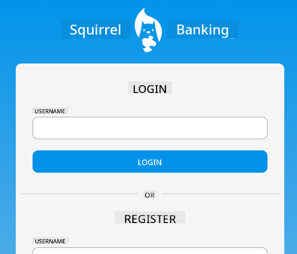

<!--
CO_OP_TRANSLATOR_METADATA:
{
  "original_hash": "830359535306594b448db6575ce5cdee",
  "translation_date": "2025-08-28T11:13:52+00:00",
  "source_file": "7-bank-project/README.md",
  "language_code": "en"
}
-->
# :dollar: Build a Bank

In this project, you'll learn how to create a fictional bank. These lessons include instructions on designing a web app layout, setting up routes, building forms, managing state, and retrieving data from an API to access the bank's information.

|  |  |
|--------------------------------|--------------------------------|

## Lessons

1. [HTML Templates and Routes in a Web App](1-template-route/README.md)
2. [Create a Login and Registration Form](2-forms/README.md)
3. [Techniques for Fetching and Using Data](3-data/README.md)
4. [State Management Concepts](4-state-management/README.md)

### Credits

These lessons were created with :hearts: by [Yohan Lasorsa](https://twitter.com/sinedied).

If you'd like to learn how to build the [server API](/7-bank-project/api/README.md) used in these lessons, you can check out [this video series](https://aka.ms/NodeBeginner) (specifically videos 17 through 21).

You can also explore [this interactive Learn tutorial](https://aka.ms/learn/express-api).

---

**Disclaimer**:  
This document has been translated using the AI translation service [Co-op Translator](https://github.com/Azure/co-op-translator). While we aim for accuracy, please note that automated translations may include errors or inaccuracies. The original document in its native language should be regarded as the authoritative source. For critical information, professional human translation is advised. We are not responsible for any misunderstandings or misinterpretations resulting from the use of this translation.