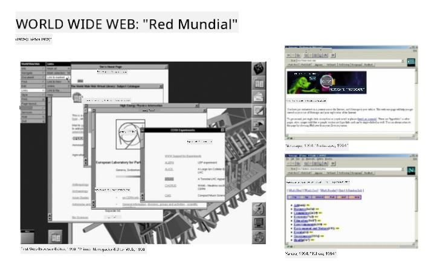
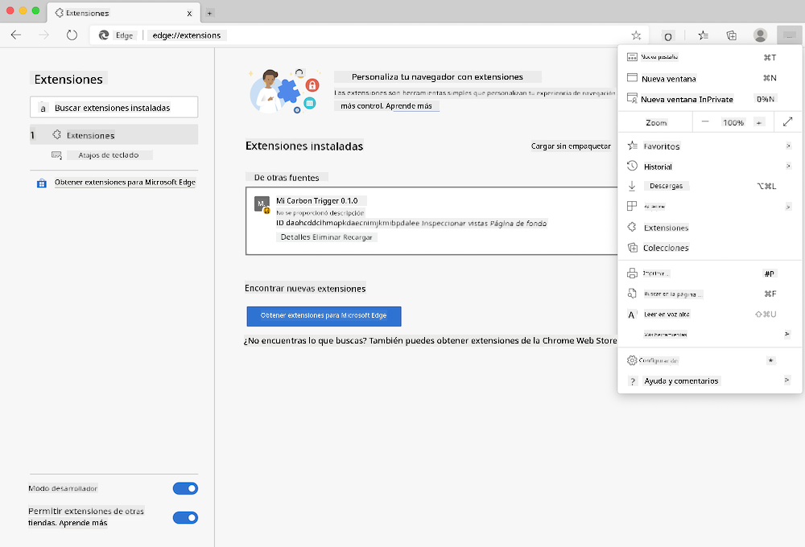
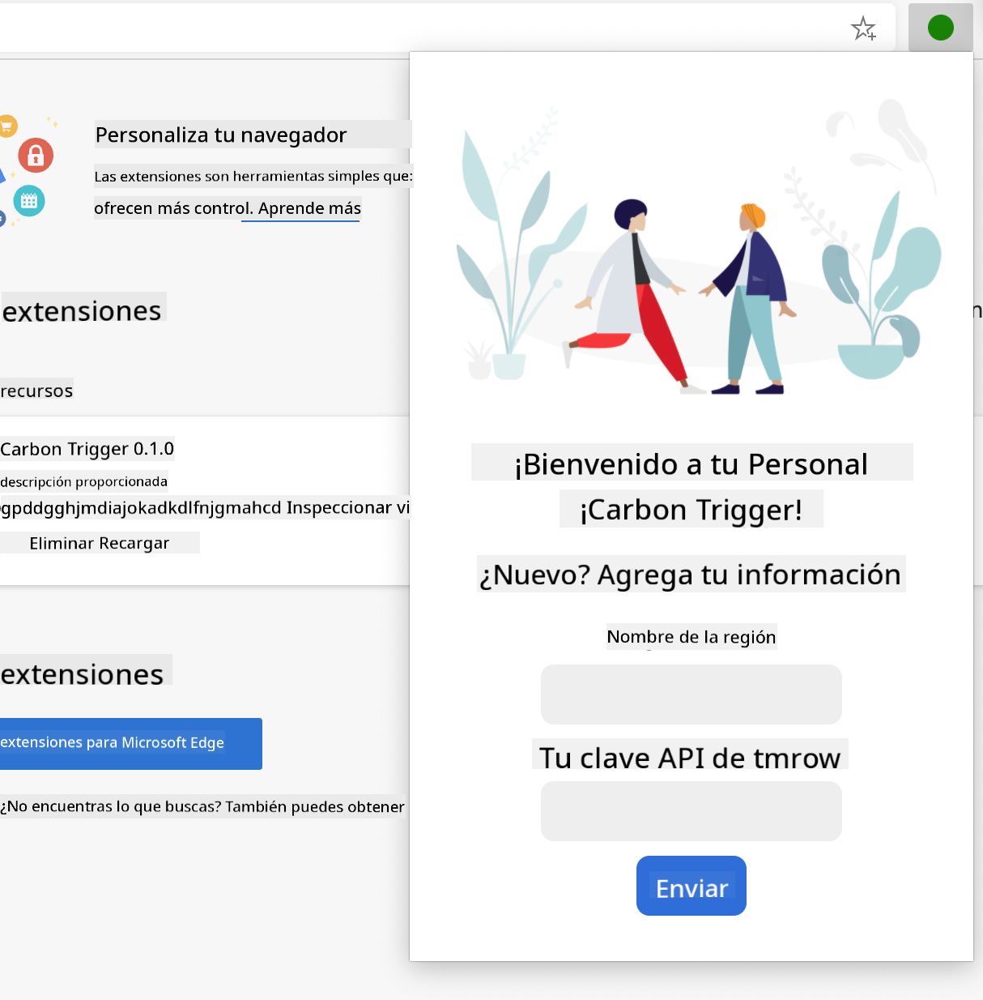
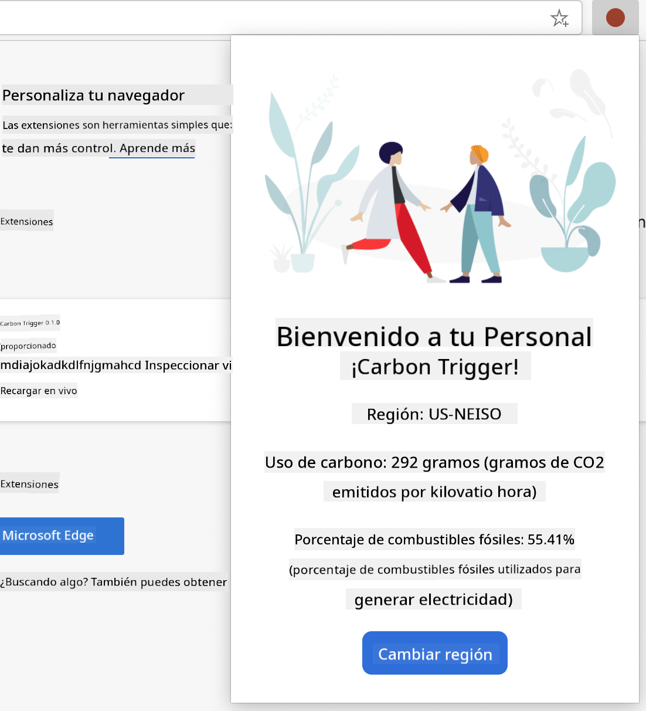

<!--
CO_OP_TRANSLATOR_METADATA:
{
  "original_hash": "2326d04e194a10aa760b51f5e5a1f61d",
  "translation_date": "2025-08-29T13:52:11+00:00",
  "source_file": "5-browser-extension/1-about-browsers/README.md",
  "language_code": "es"
}
-->
# Proyecto de Extensión de Navegador Parte 1: Todo sobre los Navegadores


> Dibujo por [Wassim Chegham](https://dev.to/wassimchegham/ever-wondered-what-happens-when-you-type-in-a-url-in-an-address-bar-in-a-browser-3dob)

## Cuestionario Previo a la Clase

[Cuestionario previo a la clase](https://ff-quizzes.netlify.app/web/quiz/23)

### Introducción

Las extensiones de navegador añaden funcionalidad adicional a un navegador. Pero antes de construir una, deberías aprender un poco sobre cómo los navegadores hacen su trabajo.

### Sobre el navegador

En esta serie de lecciones, aprenderás cómo construir una extensión de navegador que funcione en los navegadores Chrome, Firefox y Edge. En esta parte, descubrirás cómo funcionan los navegadores y estructurarás los elementos de la extensión de navegador.

Pero, ¿qué es exactamente un navegador? Es una aplicación de software que permite a un usuario final acceder a contenido desde un servidor y mostrarlo en páginas web.

✅ Un poco de historia: el primer navegador se llamó 'WorldWideWeb' y fue creado por Sir Timothy Berners-Lee en 1990.


> Algunos de los primeros navegadores, vía [Karen McGrane](https://www.slideshare.net/KMcGrane/week-4-ixd-history-personal-computing)

Cuando un usuario se conecta a internet utilizando una dirección URL (Localizador Uniforme de Recursos), generalmente a través del Protocolo de Transferencia de Hipertexto mediante una dirección `http` o `https`, el navegador se comunica con un servidor web y obtiene una página web.

En este punto, el motor de renderizado del navegador la muestra en el dispositivo del usuario, que podría ser un teléfono móvil, una computadora de escritorio o un portátil.

Los navegadores también tienen la capacidad de almacenar en caché contenido para que no tenga que ser recuperado del servidor cada vez. Pueden registrar el historial de navegación de un usuario, almacenar 'cookies', que son pequeños fragmentos de datos que contienen información utilizada para registrar la actividad del usuario, y más.

Algo muy importante que recordar sobre los navegadores es que no todos son iguales. Cada navegador tiene sus fortalezas y debilidades, y un desarrollador web profesional necesita entender cómo hacer que las páginas web funcionen bien en diferentes navegadores. Esto incluye manejar vistas pequeñas como las de un teléfono móvil, así como un usuario que esté desconectado.

Un sitio web realmente útil que probablemente deberías marcar como favorito en el navegador que prefieras usar es [caniuse.com](https://www.caniuse.com). Cuando estés construyendo páginas web, es muy útil usar las listas de tecnologías compatibles de caniuse para que puedas brindar el mejor soporte a tus usuarios.

✅ ¿Cómo puedes saber qué navegadores son los más populares entre los usuarios de tu sitio web? Revisa tus análisis: puedes instalar varios paquetes de análisis como parte de tu proceso de desarrollo web, y te dirán qué navegadores son los más utilizados por los usuarios.

## Extensiones de navegador

¿Por qué querrías construir una extensión de navegador? Es una herramienta útil para adjuntar a tu navegador cuando necesitas acceso rápido a tareas que tiendes a repetir. Por ejemplo, si necesitas verificar colores en las diversas páginas web con las que interactúas, podrías instalar una extensión de navegador para seleccionar colores. Si tienes problemas para recordar contraseñas, podrías usar una extensión de navegador para gestionar contraseñas.

Las extensiones de navegador también son divertidas de desarrollar. Tienden a gestionar un número limitado de tareas que realizan bien.

✅ ¿Cuáles son tus extensiones de navegador favoritas? ¿Qué tareas realizan?

### Instalando extensiones

Antes de comenzar a construir, echa un vistazo al proceso de creación y despliegue de una extensión de navegador. Aunque cada navegador varía un poco en cómo gestionan esta tarea, el proceso es similar en Chrome y Firefox a este ejemplo en Edge:



> Nota: Asegúrate de activar el modo desarrollador y permitir extensiones de otras tiendas.

En esencia, el proceso será:

- construir tu extensión usando `npm run build` 
- navegar en el navegador al panel de extensiones usando el botón "Configuración y más" (el icono `...`) en la parte superior derecha
- si es una instalación nueva, elegir `load unpacked` para cargar una extensión nueva desde su carpeta de construcción (en nuestro caso es `/dist`) 
- o, hacer clic en `reload` si estás recargando la extensión ya instalada

✅ Estas instrucciones se refieren a extensiones que construyes tú mismo; para instalar extensiones que han sido publicadas en la tienda de extensiones del navegador asociada a cada navegador, deberías navegar a esas [tiendas](https://microsoftedge.microsoft.com/addons/Microsoft-Edge-Extensions-Home) e instalar la extensión de tu elección.

### Comienza

Vas a construir una extensión de navegador que muestre la huella de carbono de tu región, mostrando el uso de energía de tu región y la fuente de esa energía. La extensión tendrá un formulario que recolectará una clave de API para que puedas acceder a la API de CO2 Signal.

**Necesitas:**

- [una clave de API](https://www.co2signal.com/); ingresa tu correo electrónico en el cuadro de esta página y se te enviará una
- el [código de tu región](http://api.electricitymap.org/v3/zones) correspondiente al [Electricity Map](https://www.electricitymap.org/map) (en Boston, por ejemplo, uso 'US-NEISO').
- el [código inicial](../../../../5-browser-extension/start). Descarga la carpeta `start`; completarás el código en esta carpeta.
- [NPM](https://www.npmjs.com) - NPM es una herramienta de gestión de paquetes; instálala localmente y los paquetes listados en tu archivo `package.json` serán instalados para su uso en tu proyecto web

✅ Aprende más sobre la gestión de paquetes en este [excelente módulo de aprendizaje](https://docs.microsoft.com/learn/modules/create-nodejs-project-dependencies/?WT.mc_id=academic-77807-sagibbon)

Tómate un minuto para revisar la base de código:

dist
    -|manifest.json (configuración predeterminada aquí)
    -|index.html (marcado HTML del front-end aquí)
    -|background.js (JS de fondo aquí)
    -|main.js (JS compilado)
src
    -|index.js (tu código JS va aquí)

✅ Una vez que tengas tu clave de API y el código de tu región a mano, guárdalos en una nota para uso futuro.

### Construye el HTML para la extensión

Esta extensión tiene dos vistas. Una para recopilar la clave de API y el código de región:



Y la segunda para mostrar el uso de carbono de la región:



Comencemos construyendo el HTML para el formulario y estilizándolo con CSS.

En la carpeta `/dist`, construirás un formulario y un área de resultados. En el archivo `index.html`, llena el área del formulario delineada:

```HTML
<form class="form-data" autocomplete="on">
	<div>
		<h2>New? Add your Information</h2>
	</div>
	<div>
		<label for="region">Region Name</label>
		<input type="text" id="region" required class="region-name" />
	</div>
	<div>
		<label for="api">Your API Key from tmrow</label>
		<input type="text" id="api" required class="api-key" />
	</div>
	<button class="search-btn">Submit</button>
</form>	
```
Este es el formulario donde tu información guardada será ingresada y almacenada en el almacenamiento local.

A continuación, crea el área de resultados; debajo de la etiqueta final del formulario, añade algunos divs:

```HTML
<div class="result">
	<div class="loading">loading...</div>
	<div class="errors"></div>
	<div class="data"></div>
	<div class="result-container">
		<p><strong>Region: </strong><span class="my-region"></span></p>
		<p><strong>Carbon Usage: </strong><span class="carbon-usage"></span></p>
		<p><strong>Fossil Fuel Percentage: </strong><span class="fossil-fuel"></span></p>
	</div>
	<button class="clear-btn">Change region</button>
</div>
```
En este punto, puedes intentar una construcción. Asegúrate de instalar las dependencias del paquete de esta extensión:

```
npm install
```

Este comando usará npm, el Administrador de Paquetes de Node, para instalar webpack para el proceso de construcción de tu extensión. Webpack es un empaquetador que maneja la compilación de código. Puedes ver el resultado de este proceso mirando en `/dist/main.js` - verás que el código ha sido empaquetado.

Por ahora, la extensión debería construirse y, si la despliegas en Edge como una extensión, verás un formulario mostrado de manera ordenada.

¡Felicidades! Has dado los primeros pasos hacia la construcción de una extensión de navegador. En lecciones posteriores, la harás más funcional y útil.

---

## 🚀 Desafío

Echa un vistazo a una tienda de extensiones de navegador e instala una en tu navegador. Puedes examinar sus archivos de maneras interesantes. ¿Qué descubres?

## Cuestionario Posterior a la Clase

[Cuestionario posterior a la clase](https://ff-quizzes.netlify.app/web/quiz/24)

## Repaso y Estudio Personal

En esta lección aprendiste un poco sobre la historia del navegador web; aprovecha esta oportunidad para aprender sobre cómo los inventores de la World Wide Web imaginaron su uso leyendo más sobre su historia. Algunos sitios útiles incluyen:

[La Historia de los Navegadores Web](https://www.mozilla.org/firefox/browsers/browser-history/)

[Historia de la Web](https://webfoundation.org/about/vision/history-of-the-web/)

[Una entrevista con Tim Berners-Lee](https://www.theguardian.com/technology/2019/mar/12/tim-berners-lee-on-30-years-of-the-web-if-we-dream-a-little-we-can-get-the-web-we-want)

## Tarea 

[Rediseña tu extensión](assignment.md)

---

**Descargo de responsabilidad**:  
Este documento ha sido traducido utilizando el servicio de traducción automática [Co-op Translator](https://github.com/Azure/co-op-translator). Si bien nos esforzamos por lograr precisión, tenga en cuenta que las traducciones automáticas pueden contener errores o imprecisiones. El documento original en su idioma nativo debe considerarse como la fuente autorizada. Para información crítica, se recomienda una traducción profesional realizada por humanos. No nos hacemos responsables de malentendidos o interpretaciones erróneas que puedan surgir del uso de esta traducción.