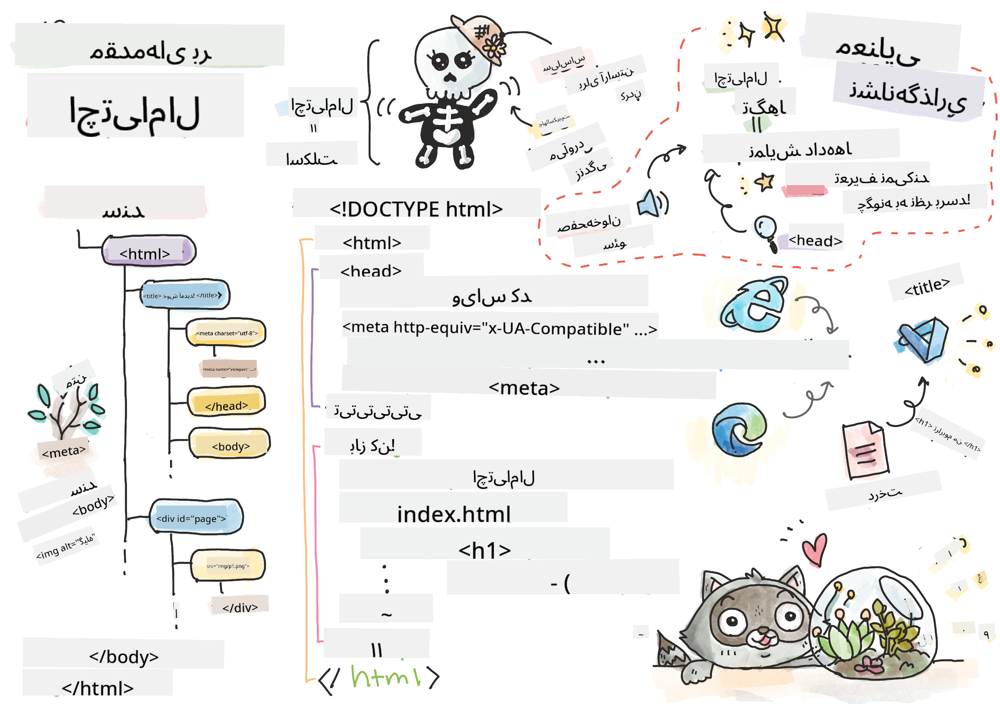
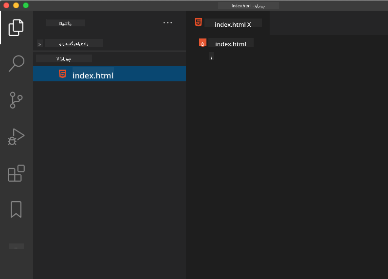

<!--
CO_OP_TRANSLATOR_METADATA:
{
  "original_hash": "89f7f9f800ce7c9f149e98baaae8491a",
  "translation_date": "2025-08-29T14:33:45+00:00",
  "source_file": "3-terrarium/1-intro-to-html/README.md",
  "language_code": "fa"
}
-->
# پروژه تراریوم بخش ۱: مقدمه‌ای بر HTML


> طراحی توسط [Tomomi Imura](https://twitter.com/girlie_mac)

## آزمون پیش از درس

[آزمون پیش از درس](https://ff-quizzes.netlify.app/web/quiz/15)

> مشاهده ویدیو

> 
> [](https://www.youtube.com/watch?v=1TvxJKBzhyQ)

### مقدمه

HTML یا زبان نشانه‌گذاری ابرمتن، «اسکلت» وب است. اگر CSS ظاهر HTML شما را زیبا کند و JavaScript به آن جان ببخشد، HTML بدنه برنامه وب شماست. حتی نحو HTML این ایده را منعکس می‌کند، زیرا شامل تگ‌های "head"، "body" و "footer" است.

در این درس، از HTML برای طراحی «اسکلت» رابط تراریوم مجازی خود استفاده خواهیم کرد. این رابط شامل یک عنوان و سه ستون خواهد بود: یک ستون سمت راست و یک ستون سمت چپ که گیاهان قابل کشیدن در آن قرار دارند، و یک ناحیه مرکزی که تراریوم شیشه‌ای به نظر می‌رسد. تا پایان این درس، گیاهان را در ستون‌ها خواهید دید، اما رابط کمی عجیب به نظر می‌رسد؛ نگران نباشید، در بخش بعدی با اضافه کردن سبک‌های CSS، ظاهر رابط را بهتر خواهید کرد.

### وظیفه

در کامپیوتر خود، یک پوشه به نام 'terrarium' ایجاد کنید و داخل آن یک فایل به نام 'index.html' بسازید. می‌توانید این کار را در Visual Studio Code انجام دهید. پس از ایجاد پوشه تراریوم، یک پنجره جدید در VS Code باز کنید، روی 'open folder' کلیک کنید و به پوشه جدید خود بروید. سپس در پنل Explorer روی دکمه کوچک 'file' کلیک کنید و فایل جدید را ایجاد کنید:



یا

از این دستورات در git bash استفاده کنید:
* `mkdir terrarium`
* `cd terrarium`
* `touch index.html`
* `code index.html` یا `nano index.html`

> فایل‌های index.html به مرورگر نشان می‌دهند که این فایل پیش‌فرض در یک پوشه است؛ URLهایی مانند `https://anysite.com/test` ممکن است با استفاده از ساختار پوشه‌ای شامل یک پوشه به نام `test` و فایل `index.html` در داخل آن ساخته شوند؛ نیازی نیست که `index.html` در URL نمایش داده شود.

---

## DocType و تگ‌های html

اولین خط یک فایل HTML، DocType آن است. کمی عجیب است که باید این خط را در بالای فایل قرار دهید، اما این خط به مرورگرهای قدیمی می‌گوید که صفحه باید در حالت استاندارد، مطابق با مشخصات فعلی HTML، رندر شود.

> نکته: در VS Code، می‌توانید روی یک تگ حرکت کنید و اطلاعاتی درباره استفاده از آن از راهنمای مرجع MDN دریافت کنید.

خط دوم باید تگ باز `<html>` باشد که در حال حاضر با تگ بسته آن `</html>` دنبال می‌شود. این تگ‌ها عناصر ریشه رابط شما هستند.

### وظیفه

این خطوط را در بالای فایل `index.html` خود اضافه کنید:

```HTML
<!DOCTYPE html>
<html></html>
```

✅ حالت‌های مختلفی وجود دارد که می‌توان با تنظیم DocType با یک رشته پرس‌وجو تعیین کرد: [حالت Quirks و حالت استاندارد](https://developer.mozilla.org/docs/Web/HTML/Quirks_Mode_and_Standards_Mode). این حالت‌ها برای پشتیبانی از مرورگرهای بسیار قدیمی که امروزه معمولاً استفاده نمی‌شوند (مانند Netscape Navigator 4 و Internet Explorer 5) طراحی شده‌اند. شما می‌توانید به اعلامیه استاندارد DocType پایبند باشید.

---

## 'head' سند

ناحیه 'head' سند HTML شامل اطلاعات مهمی درباره صفحه وب شماست که به عنوان [metadata](https://developer.mozilla.org/docs/Web/HTML/Element/meta) شناخته می‌شود. در مورد ما، این اطلاعات شامل چهار مورد زیر است:

-   عنوان صفحه
-   metadata صفحه شامل:
    -   'مجموعه کاراکترها' که نشان می‌دهد چه نوع کدگذاری کاراکتر در صفحه استفاده شده است
    -   اطلاعات مرورگر، از جمله `x-ua-compatible` که نشان می‌دهد مرورگر IE=edge پشتیبانی می‌شود
    -   اطلاعاتی درباره نحوه رفتار viewport هنگام بارگذاری. تنظیم viewport با مقیاس اولیه ۱، سطح زوم را هنگام بارگذاری اولیه صفحه کنترل می‌کند.

### وظیفه

یک بلوک 'head' به سند خود اضافه کنید، بین تگ‌های باز و بسته `<html>`.

```html
<head>
	<title>Welcome to my Virtual Terrarium</title>
	<meta charset="utf-8" />
	<meta http-equiv="X-UA-Compatible" content="IE=edge" />
	<meta name="viewport" content="width=device-width, initial-scale=1" />
</head>
```

✅ اگر یک تگ متا viewport مانند این تنظیم کنید: `<meta name="viewport" content="width=600">` چه اتفاقی می‌افتد؟ درباره [viewport](https://developer.mozilla.org/docs/Web/HTML/Viewport_meta_tag) بیشتر بخوانید.

---

## 'body' سند

### تگ‌های HTML

در HTML، شما تگ‌هایی به فایل .html خود اضافه می‌کنید تا عناصر یک صفحه وب را ایجاد کنید. هر تگ معمولاً دارای یک تگ باز و بسته است، مانند این: `<p>hello</p>` برای نشان دادن یک پاراگراف. بدنه رابط خود را با اضافه کردن مجموعه‌ای از تگ‌های `<body>` داخل جفت تگ‌های `<html>` ایجاد کنید؛ اکنون نشانه‌گذاری شما به این شکل است:

### وظیفه

```html
<!DOCTYPE html>
<html>
	<head>
		<title>Welcome to my Virtual Terrarium</title>
		<meta charset="utf-8" />
		<meta http-equiv="X-UA-Compatible" content="IE=edge" />
		<meta name="viewport" content="width=device-width, initial-scale=1" />
	</head>
	<body></body>
</html>
```

اکنون می‌توانید شروع به ساختن صفحه خود کنید. معمولاً از تگ‌های `<div>` برای ایجاد عناصر جداگانه در یک صفحه استفاده می‌شود. ما مجموعه‌ای از عناصر `<div>` ایجاد خواهیم کرد که تصاویر را در خود جای می‌دهند.

### تصاویر

یکی از تگ‌های HTML که نیازی به تگ بسته ندارد، تگ `` است، زیرا دارای یک عنصر `src` است که تمام اطلاعات مورد نیاز صفحه برای رندر کردن آیتم را در خود دارد.

یک پوشه در برنامه خود به نام `images` ایجاد کنید و تمام تصاویر موجود در [پوشه کد منبع](../../../../3-terrarium/solution/images) را در آن قرار دهید؛ (۱۴ تصویر از گیاهان وجود دارد).

### وظیفه

این تصاویر گیاهان را بین دو ستون داخل تگ‌های `<body></body>` اضافه کنید:

```html
<div id="page">
	<div id="left-container" class="container">
		<div class="plant-holder">
			
		</div>
		<div class="plant-holder">
			
		</div>
		<div class="plant-holder">
			
		</div>
		<div class="plant-holder">
			
		</div>
		<div class="plant-holder">
			
		</div>
		<div class="plant-holder">
			
		</div>
		<div class="plant-holder">
			
		</div>
	</div>
	<div id="right-container" class="container">
		<div class="plant-holder">
			
		</div>
		<div class="plant-holder">
			
		</div>
		<div class="plant-holder">
			
		</div>
		<div class="plant-holder">
			
		</div>
		<div class="plant-holder">
			
		</div>
		<div class="plant-holder">
			
		</div>
		<div class="plant-holder">
			
		</div>
	</div>
</div>
```

> توجه: Divها در مقابل Spanها. Divها به عنوان عناصر 'بلوک' در نظر گرفته می‌شوند و Spanها 'خطی' هستند. اگر این divها را به span تبدیل کنید، چه اتفاقی می‌افتد؟

با این نشانه‌گذاری، گیاهان اکنون روی صفحه نمایش داده می‌شوند. ظاهر آن خیلی خوب نیست، زیرا هنوز با استفاده از CSS سبک‌دهی نشده‌اند، و این کار را در درس بعدی انجام خواهیم داد.

هر تصویر دارای متن جایگزین (alt text) است که حتی اگر نتوانید تصویر را ببینید یا رندر کنید، ظاهر می‌شود. این یک ویژگی مهم برای دسترسی است. در درس‌های آینده درباره دسترسی بیشتر یاد خواهید گرفت؛ فعلاً به یاد داشته باشید که ویژگی alt اطلاعات جایگزین برای یک تصویر ارائه می‌دهد اگر کاربر به هر دلیلی نتواند آن را مشاهده کند (به دلیل اتصال کند، خطا در ویژگی src، یا اگر کاربر از صفحه‌خوان استفاده کند).

✅ آیا متوجه شدید که هر تصویر دارای همان متن جایگزین است؟ آیا این کار خوب است؟ چرا یا چرا نه؟ آیا می‌توانید این کد را بهبود دهید؟

---

## نشانه‌گذاری معنایی

به طور کلی، بهتر است هنگام نوشتن HTML از 'معنا'ی مناسب استفاده کنید. این به چه معناست؟ یعنی از تگ‌های HTML برای نشان دادن نوع داده یا تعاملی که برای آن طراحی شده‌اند استفاده کنید. به عنوان مثال، متن عنوان اصلی در یک صفحه باید از تگ `<h1>` استفاده کند.

این خط را درست زیر تگ باز `<body>` اضافه کنید:

```html
<h1>My Terrarium</h1>
```

استفاده از نشانه‌گذاری معنایی مانند داشتن هدرها به صورت `<h1>` و لیست‌های نامرتب به صورت `<ul>` به صفحه‌خوان‌ها کمک می‌کند تا در یک صفحه حرکت کنند. به طور کلی، دکمه‌ها باید به صورت `<button>` نوشته شوند و لیست‌ها باید `<li>` باشند. در حالی که _ممکن_ است از عناصر `<span>` با سبک خاص و هندلرهای کلیک برای شبیه‌سازی دکمه‌ها استفاده کنید، بهتر است برای کاربران دارای معلولیت از فناوری‌هایی استفاده شود که مکان دکمه در صفحه را تعیین کنند و با آن تعامل داشته باشند، اگر عنصر به صورت دکمه ظاهر شود. به همین دلیل، سعی کنید تا حد امکان از نشانه‌گذاری معنایی استفاده کنید.

✅ به یک صفحه‌خوان و [نحوه تعامل آن با یک صفحه وب](https://www.youtube.com/watch?v=OUDV1gqs9GA) نگاه کنید. آیا می‌توانید ببینید چرا داشتن نشانه‌گذاری غیر معنایی ممکن است کاربر را ناامید کند؟

## تراریوم

آخرین بخش این رابط شامل ایجاد نشانه‌گذاری است که برای ایجاد یک تراریوم سبک‌دهی خواهد شد.

### وظیفه:

این نشانه‌گذاری را بالای آخرین تگ `</div>` اضافه کنید:

```html
<div id="terrarium">
	<div class="jar-top"></div>
	<div class="jar-walls">
		<div class="jar-glossy-long"></div>
		<div class="jar-glossy-short"></div>
	</div>
	<div class="dirt"></div>
	<div class="jar-bottom"></div>
</div>
```

✅ حتی اگر این نشانه‌گذاری را به صفحه اضافه کرده‌اید، هیچ چیزی رندر نمی‌شود. چرا؟

---

## 🚀چالش

برخی از تگ‌های 'قدیمی' HTML وجود دارند که هنوز هم بازی با آن‌ها جالب است، اگرچه نباید از تگ‌های منسوخ شده مانند [این تگ‌ها](https://developer.mozilla.org/docs/Web/HTML/Element#Obsolete_and_deprecated_elements) در نشانه‌گذاری خود استفاده کنید. با این حال، آیا می‌توانید از تگ قدیمی `<marquee>` برای حرکت افقی عنوان h1 استفاده کنید؟ (اگر این کار را انجام دادید، فراموش نکنید که بعداً آن را حذف کنید)

## آزمون پس از درس

[آزمون پس از درس](https://ff-quizzes.netlify.app/web/quiz/16)

## مرور و مطالعه شخصی

HTML سیستم ساخت بلوک‌های 'آزموده شده و واقعی' است که به ساخت وب به شکل امروزی کمک کرده است. کمی درباره تاریخچه آن با مطالعه برخی تگ‌های قدیمی و جدید یاد بگیرید. آیا می‌توانید بفهمید چرا برخی تگ‌ها منسوخ شده‌اند و برخی اضافه شده‌اند؟ چه تگ‌هایی ممکن است در آینده معرفی شوند؟

درباره ساخت سایت‌ها برای وب و دستگاه‌های موبایل بیشتر در [Microsoft Learn](https://docs.microsoft.com/learn/modules/build-simple-website/?WT.mc_id=academic-77807-sagibbon) یاد بگیرید.

## تکلیف

[تمرین HTML: ساخت یک طرح اولیه وبلاگ](assignment.md)

---

**سلب مسئولیت**:  
این سند با استفاده از سرویس ترجمه هوش مصنوعی [Co-op Translator](https://github.com/Azure/co-op-translator) ترجمه شده است. در حالی که ما برای دقت تلاش می‌کنیم، لطفاً توجه داشته باشید که ترجمه‌های خودکار ممکن است شامل خطاها یا نادقتی‌هایی باشند. سند اصلی به زبان اصلی آن باید به عنوان منبع معتبر در نظر گرفته شود. برای اطلاعات حساس، ترجمه حرفه‌ای انسانی توصیه می‌شود. ما هیچ مسئولیتی در قبال سوءتفاهم‌ها یا تفسیرهای نادرست ناشی از استفاده از این ترجمه نداریم.