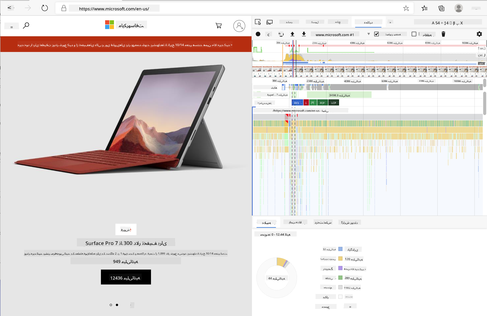
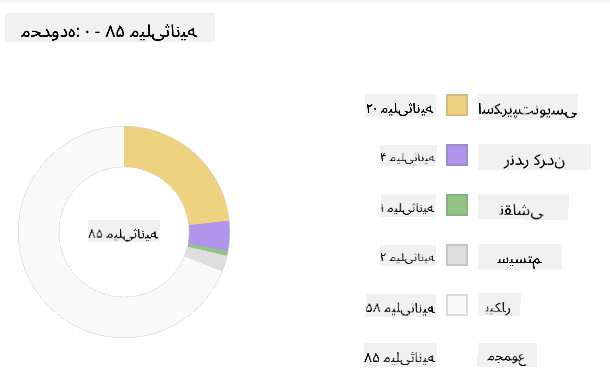

<!--
CO_OP_TRANSLATOR_METADATA:
{
  "original_hash": "49b58721a71cfda824e2f3e1f46908c6",
  "translation_date": "2025-08-29T14:27:42+00:00",
  "source_file": "5-browser-extension/3-background-tasks-and-performance/README.md",
  "language_code": "fa"
}
-->
# پروژه افزونه مرورگر بخش ۳: آشنایی با وظایف پس‌زمینه و عملکرد

## آزمون پیش از درس

[آزمون پیش از درس](https://ff-quizzes.netlify.app/web/quiz/27)

### مقدمه

در دو درس قبلی این ماژول، یاد گرفتید که چگونه یک فرم و بخش نمایش برای داده‌های دریافت‌شده از یک API بسازید. این یک روش استاندارد برای ایجاد حضور در وب است. حتی یاد گرفتید که چگونه داده‌ها را به صورت غیرهمزمان دریافت کنید. افزونه مرورگر شما تقریباً کامل شده است.

تنها کاری که باقی مانده، مدیریت برخی وظایف پس‌زمینه است، از جمله به‌روزرسانی رنگ آیکون افزونه. بنابراین، این زمان مناسبی است تا درباره نحوه مدیریت این نوع وظایف توسط مرورگر صحبت کنیم. بیایید به این وظایف مرورگر در زمینه عملکرد دارایی‌های وب شما هنگام ساخت آن‌ها فکر کنیم.

## اصول عملکرد وب

> "عملکرد وب‌سایت درباره دو چیز است: سرعت بارگذاری صفحه و سرعت اجرای کد روی آن." -- [زک گروس‌بارت](https://www.smashingmagazine.com/2012/06/javascript-profiling-chrome-developer-tools/)

موضوع اینکه چگونه وب‌سایت‌های خود را برای انواع دستگاه‌ها، کاربران و شرایط به طرز شگفت‌انگیزی سریع کنید، به طرز قابل‌انتظاری گسترده است. در اینجا چند نکته وجود دارد که هنگام ساخت یک پروژه وب استاندارد یا یک افزونه مرورگر باید به آن‌ها توجه کنید.

اولین کاری که باید انجام دهید تا مطمئن شوید سایت شما به طور کارآمد اجرا می‌شود، جمع‌آوری داده‌هایی درباره عملکرد آن است. اولین جایی که می‌توانید این کار را انجام دهید، ابزارهای توسعه‌دهنده مرورگر وب شماست. در مرورگر Edge، می‌توانید دکمه "تنظیمات و بیشتر" (آیکون سه نقطه در بالا سمت راست مرورگر) را انتخاب کرده و سپس به مسیر More Tools > Developer Tools بروید و تب Performance را باز کنید. همچنین می‌توانید با استفاده از میانبرهای صفحه‌کلید `Ctrl` + `Shift` + `I` در ویندوز یا `Option` + `Command` + `I` در مک، ابزارهای توسعه‌دهنده را باز کنید.

تب Performance شامل یک ابزار پروفایل‌گیری است. یک وب‌سایت باز کنید (برای مثال، [https://www.microsoft.com](https://www.microsoft.com/?WT.mc_id=academic-77807-sagibbon)) و روی دکمه 'Record' کلیک کنید، سپس سایت را رفرش کنید. ضبط را در هر زمانی متوقف کنید و می‌توانید روتین‌هایی که برای 'script'، 'render' و 'paint' سایت تولید شده‌اند را مشاهده کنید:



✅ به [مستندات مایکروسافت](https://docs.microsoft.com/microsoft-edge/devtools-guide/performance/?WT.mc_id=academic-77807-sagibbon) درباره پنل Performance در Edge مراجعه کنید.

> نکته: برای دریافت یک اندازه‌گیری دقیق از زمان شروع سایت خود، کش مرورگر خود را پاک کنید.

عناصر تایم‌لاین پروفایل را انتخاب کنید تا روی رویدادهایی که هنگام بارگذاری صفحه شما اتفاق می‌افتند، زوم کنید.

یک نمای کلی از عملکرد صفحه خود با انتخاب بخشی از تایم‌لاین پروفایل و مشاهده پنل خلاصه دریافت کنید:



پنل Event Log را بررسی کنید تا ببینید آیا رویدادی بیش از ۱۵ میلی‌ثانیه طول کشیده است:


✅ پروفایل‌گیر خود را بشناسید! ابزارهای توسعه‌دهنده را در این سایت باز کنید و ببینید آیا گلوگاهی وجود دارد. کدام دارایی کندترین بارگذاری را دارد؟ سریع‌ترین کدام است؟

## بررسی‌های پروفایل‌گیری

به طور کلی، برخی "نقاط مشکل‌زا" وجود دارند که هر توسعه‌دهنده وب باید هنگام ساخت یک سایت به آن‌ها توجه کند تا از سورپرایزهای ناخوشایند هنگام استقرار در محیط تولید جلوگیری کند.

**اندازه دارایی‌ها**: وب در سال‌های اخیر "سنگین‌تر" و در نتیجه کندتر شده است. بخشی از این وزن به استفاده از تصاویر مربوط می‌شود.

✅ به [آرشیو اینترنت](https://httparchive.org/reports/page-weight) نگاهی بیندازید تا نمایی تاریخی از وزن صفحات و موارد دیگر داشته باشید.

یک روش خوب این است که مطمئن شوید تصاویر شما بهینه شده‌اند و با اندازه و وضوح مناسب برای کاربران شما ارائه می‌شوند.

**پیمایش DOM**: مرورگر باید مدل شیء سند (DOM) خود را بر اساس کدی که می‌نویسید بسازد، بنابراین به نفع عملکرد خوب صفحه است که تگ‌های خود را به حداقل برسانید و فقط از آنچه صفحه نیاز دارد استفاده و استایل‌دهی کنید. به این نکته توجه کنید که CSS اضافی مرتبط با یک صفحه می‌تواند بهینه شود؛ استایل‌هایی که فقط در یک صفحه استفاده می‌شوند نیازی به گنجاندن در فایل اصلی استایل ندارند.

**جاوااسکریپت**: هر توسعه‌دهنده جاوااسکریپت باید مراقب اسکریپت‌های "مسدودکننده رندر" باشد که باید قبل از پیمایش و نقاشی بقیه DOM به مرورگر بارگذاری شوند. استفاده از `defer` با اسکریپت‌های درون‌خطی خود را در نظر بگیرید (همان‌طور که در ماژول Terrarium انجام شده است).

✅ برخی سایت‌ها را در یک [وب‌سایت تست سرعت سایت](https://www.webpagetest.org/) امتحان کنید تا بیشتر با بررسی‌های رایجی که برای تعیین عملکرد سایت انجام می‌شوند، آشنا شوید.

حالا که ایده‌ای از نحوه رندر دارایی‌های شما توسط مرورگر دارید، بیایید به آخرین کارهایی که باید برای تکمیل افزونه خود انجام دهید، نگاهی بیندازیم:

### ایجاد یک تابع برای محاسبه رنگ

در فایل `/src/index.js`، یک تابع به نام `calculateColor()` بعد از سری متغیرهای `const` که برای دسترسی به DOM تنظیم کرده‌اید، اضافه کنید:

```JavaScript
function calculateColor(value) {
	let co2Scale = [0, 150, 600, 750, 800];
	let colors = ['#2AA364', '#F5EB4D', '#9E4229', '#381D02', '#381D02'];

	let closestNum = co2Scale.sort((a, b) => {
		return Math.abs(a - value) - Math.abs(b - value);
	})[0];
	console.log(value + ' is closest to ' + closestNum);
	let num = (element) => element > closestNum;
	let scaleIndex = co2Scale.findIndex(num);

	let closestColor = colors[scaleIndex];
	console.log(scaleIndex, closestColor);

	chrome.runtime.sendMessage({ action: 'updateIcon', value: { color: closestColor } });
}
```

اینجا چه اتفاقی می‌افتد؟ شما یک مقدار (شدت کربن) را از فراخوانی API که در درس قبلی تکمیل کردید، ارسال می‌کنید و سپس محاسبه می‌کنید که مقدار آن چقدر به شاخص ارائه‌شده در آرایه رنگ‌ها نزدیک است. سپس نزدیک‌ترین مقدار رنگ را به کروم ران‌تایم ارسال می‌کنید.

کروم ران‌تایم دارای [یک API](https://developer.chrome.com/extensions/runtime) است که انواع وظایف پس‌زمینه را مدیریت می‌کند و افزونه شما از آن استفاده می‌کند:

> "از API کروم ران‌تایم برای بازیابی صفحه پس‌زمینه، بازگرداندن جزئیات مربوط به مانیفست و گوش دادن و پاسخ دادن به رویدادها در چرخه عمر برنامه یا افزونه استفاده کنید. همچنین می‌توانید از این API برای تبدیل مسیرهای نسبی URLها به URLهای کاملاً واجد شرایط استفاده کنید."

✅ اگر این افزونه مرورگر را برای Edge توسعه می‌دهید، ممکن است تعجب کنید که از یک API کروم استفاده می‌کنید. نسخه‌های جدیدتر مرورگر Edge بر روی موتور مرورگر Chromium اجرا می‌شوند، بنابراین می‌توانید از این ابزارها استفاده کنید.

> توجه: اگر می‌خواهید یک افزونه مرورگر را پروفایل‌گیری کنید، ابزارهای توسعه‌دهنده را از داخل خود افزونه باز کنید، زیرا این یک نمونه مرورگر جداگانه است.

### تنظیم رنگ پیش‌فرض آیکون

حالا، در تابع `init()`، آیکون را به صورت پیش‌فرض سبز عمومی تنظیم کنید و دوباره از اکشن `updateIcon` کروم استفاده کنید:

```JavaScript
chrome.runtime.sendMessage({
	action: 'updateIcon',
		value: {
			color: 'green',
		},
});
```

### فراخوانی تابع و اجرای فراخوانی

سپس، تابعی که تازه ایجاد کردید را با افزودن آن به پرامیس بازگشتی از API سیگنال CO2 فراخوانی کنید:

```JavaScript
//let CO2...
calculateColor(CO2);
```

و در نهایت، در فایل `/dist/background.js`، یک شنونده برای این فراخوانی‌های اکشن پس‌زمینه اضافه کنید:

```JavaScript
chrome.runtime.onMessage.addListener(function (msg, sender, sendResponse) {
	if (msg.action === 'updateIcon') {
		chrome.browserAction.setIcon({ imageData: drawIcon(msg.value) });
	}
});
//borrowed from energy lollipop extension, nice feature!
function drawIcon(value) {
	let canvas = document.createElement('canvas');
	let context = canvas.getContext('2d');

	context.beginPath();
	context.fillStyle = value.color;
	context.arc(100, 100, 50, 0, 2 * Math.PI);
	context.fill();

	return context.getImageData(50, 50, 100, 100);
}
```

در این کد، شما یک شنونده برای هر پیامی که به مدیر وظایف پس‌زمینه می‌آید اضافه می‌کنید. اگر نام آن 'updateIcon' باشد، کد بعدی اجرا می‌شود تا یک آیکون با رنگ مناسب با استفاده از API Canvas ترسیم شود.

✅ در درس‌های [بازی فضایی](../../6-space-game/2-drawing-to-canvas/README.md) بیشتر درباره API Canvas یاد خواهید گرفت.

حالا، افزونه خود را دوباره بسازید (`npm run build`)، آن را رفرش و اجرا کنید و تغییر رنگ را مشاهده کنید. آیا زمان مناسبی برای انجام کارهای دیگر یا شستن ظروف است؟ حالا می‌دانید!

تبریک می‌گویم، شما یک افزونه مرورگر مفید ساخته‌اید و درباره نحوه کار مرورگر و نحوه پروفایل‌گیری عملکرد آن بیشتر یاد گرفته‌اید.

---

## 🚀 چالش

برخی وب‌سایت‌های متن‌باز که مدت زیادی است وجود دارند را بررسی کنید و بر اساس تاریخچه گیت‌هاب آن‌ها ببینید آیا می‌توانید تعیین کنید که چگونه در طول سال‌ها برای عملکرد بهینه شده‌اند، اگر اصلاً بهینه شده باشند. رایج‌ترین نقطه دردسر چیست؟

## آزمون پس از درس

[آزمون پس از درس](https://ff-quizzes.netlify.app/web/quiz/28)

## مرور و مطالعه شخصی

در نظر داشته باشید که برای یک [خبرنامه عملکرد](https://perf.email/) ثبت‌نام کنید.

برخی از روش‌هایی که مرورگرها عملکرد وب را ارزیابی می‌کنند را با بررسی تب‌های عملکرد در ابزارهای وب آن‌ها بررسی کنید. آیا تفاوت‌های عمده‌ای پیدا می‌کنید؟

## تکلیف

[تحلیل یک سایت از نظر عملکرد](assignment.md)

---

**سلب مسئولیت**:  
این سند با استفاده از سرویس ترجمه هوش مصنوعی [Co-op Translator](https://github.com/Azure/co-op-translator) ترجمه شده است. در حالی که ما برای دقت تلاش می‌کنیم، لطفاً توجه داشته باشید که ترجمه‌های خودکار ممکن است شامل خطاها یا نادرستی‌هایی باشند. سند اصلی به زبان اصلی آن باید به عنوان منبع معتبر در نظر گرفته شود. برای اطلاعات حساس، ترجمه حرفه‌ای انسانی توصیه می‌شود. ما هیچ مسئولیتی در قبال سوءتفاهم‌ها یا تفسیرهای نادرست ناشی از استفاده از این ترجمه نداریم.