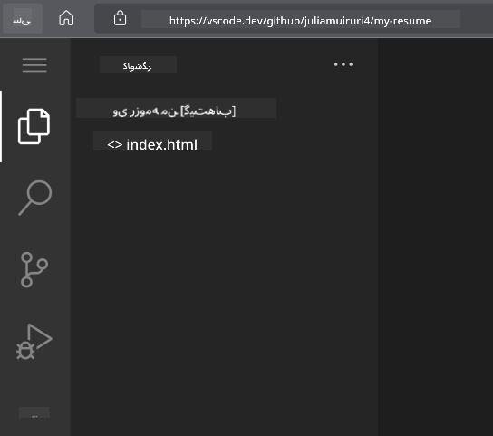

<!--
CO_OP_TRANSLATOR_METADATA:
{
  "original_hash": "bd3aa6d2b879c30ea496c43aec1c49ed",
  "translation_date": "2025-08-29T14:36:01+00:00",
  "source_file": "8-code-editor/1-using-a-code-editor/assignment.md",
  "language_code": "fa"
}
-->
# ایجاد یک وب‌سایت رزومه با استفاده از vscode.dev

_چقدر جالب است که یک استخدام‌کننده از شما رزومه بخواهد و شما به جای ارسال فایل، یک لینک برای او بفرستید؟_ 😎

## اهداف

پس از انجام این تمرین، شما یاد خواهید گرفت که:

- یک وب‌سایت برای نمایش رزومه خود ایجاد کنید

### پیش‌نیازها

1. یک حساب کاربری در GitHub. به [GitHub](https://github.com/) بروید و اگر هنوز حسابی ندارید، یک حساب ایجاد کنید.

## مراحل

**مرحله 1:** یک مخزن جدید در GitHub ایجاد کنید و نام آن را `my-resume` بگذارید.

**مرحله 2:** یک فایل `index.html` در مخزن خود ایجاد کنید. ما حداقل یک فایل در github.com اضافه می‌کنیم زیرا نمی‌توانید یک مخزن خالی را در vscode.dev باز کنید.

روی لینک `creating a new file` کلیک کنید، نام `index.html` را وارد کنید و دکمه `Commit new file` را انتخاب کنید.


**مرحله 3:** [VSCode.dev](https://vscode.dev) را باز کنید و دکمه `Open Remote Repository` را انتخاب کنید.

لینک مخزنی که برای سایت رزومه خود ایجاد کرده‌اید را کپی کرده و در کادر ورودی جای‌گذاری کنید:

_نام کاربری خود را با `your-username` جایگزین کنید._

```
https://github.com/your-username/my-resume
```

✅ اگر موفقیت‌آمیز باشد، پروژه شما و فایل `index.html` در ویرایشگر متن مرورگر باز خواهند شد.



**مرحله 4:** فایل `index.html` را باز کنید، کد زیر را در ناحیه کد جای‌گذاری کنید و ذخیره کنید.

<details>
    <summary><b>کد HTML مسئول محتوای وب‌سایت رزومه شما.</b></summary>
    
        <html>

            <head>
                <link href="style.css" rel="stylesheet">
                <link rel="stylesheet" href="https://cdnjs.cloudflare.com/ajax/libs/font-awesome/5.15.4/css/all.min.css">
                <title>Your Name Goes Here!</title>
            </head>
            <body>
                <header id="header">
                    <!-- هدر رزومه با نام و عنوان شما -->
                    <h1>Your Name Goes Here!</h1>
                    <hr>
                    Your Role!
                    <hr>
                </header>
                <main>
                    <article id="mainLeft">
                        <section>
                            <h2>تماس</h2>
                            <!-- اطلاعات تماس شامل شبکه‌های اجتماعی -->
                            <p>
                                <i class="fa fa-envelope" aria-hidden="true"></i>
                                <a href="mailto:username@domain.top-level domain">ایمیل خود را اینجا بنویسید</a>
                            </p>
                            <p>
                                <i class="fab fa-github" aria-hidden="true"></i>
                                <a href="github.com/yourGitHubUsername">نام کاربری خود را اینجا بنویسید!</a>
                            </p>
                            <p>
                                <i class="fab fa-linkedin" aria-hidden="true"></i>
                                <a href="linkedin.com/yourLinkedInUsername">نام کاربری خود را اینجا بنویسید!</a>
                            </p>
                        </section>
                        <section>
                            <h2>مهارت‌ها</h2>
                            <!-- مهارت‌های شما -->
                            <ul>
                                <li>مهارت 1!</li>
                                <li>مهارت 2!</li>
                                <li>مهارت 3!</li>
                                <li>مهارت 4!</li>
                            </ul>
                        </section>
                        <section>
                            <h2>تحصیلات</h2>
                            <!-- تحصیلات شما -->
                            <h3>دوره خود را اینجا بنویسید!</h3>
                            <p>
                                موسسه خود را اینجا بنویسید!
                            </p>
                            <p>
                                تاریخ شروع - پایان
                            </p>
                        </section>            
                    </article>
                    <article id="mainRight">
                        <section>
                            <h2>درباره</h2>
                            <!-- درباره شما -->
                            <p>یک توضیح کوتاه درباره خودتان بنویسید!</p>
                        </section>
                        <section>
                            <h2>تجربه کاری</h2>
                            <!-- تجربه کاری شما -->
                            <h3>عنوان شغلی</h3>
                            <p>
                                نام سازمان | ماه شروع – ماه پایان
                            </p>
                            <ul>
                                    <li>وظیفه 1 - کاری که انجام دادید را بنویسید!</li>
                                    <li>وظیفه 2 - کاری که انجام دادید را بنویسید!</li>
                                    <li>نتایج/تأثیر مشارکت خود را بنویسید</li>
                                    
                            </ul>
                            <h3>عنوان شغلی 2</h3>
                            <p>
                                نام سازمان | ماه شروع – ماه پایان
                            </p>
                            <ul>
                                    <li>وظیفه 1 - کاری که انجام دادید را بنویسید!</li>
                                    <li>وظیفه 2 - کاری که انجام دادید را بنویسید!</li>
                                    <li>نتایج/تأثیر مشارکت خود را بنویسید</li>
                                    
                            </ul>
                        </section>
                    </article>
                </main>
            </body>
        </html>
</details>

جزئیات رزومه خود را جایگزین متن‌های _نمونه_ در کد HTML کنید.

**مرحله 5:** روی پوشه My-Resume کلیک کنید، روی آیکون `New File ...` کلیک کنید و دو فایل جدید در پروژه خود ایجاد کنید: `style.css` و `codeswing.json`.

**مرحله 6:** فایل `style.css` را باز کنید، کد زیر را جای‌گذاری کنید و ذخیره کنید.

<details>
        <summary><b>کد CSS برای قالب‌بندی طرح‌بندی سایت.</b></summary>
            
            body {
                font-family: 'Segoe UI', Tahoma, Geneva, Verdana, sans-serif;
                font-size: 16px;
                max-width: 960px;
                margin: auto;
            }
            h1 {
                font-size: 3em;
                letter-spacing: .6em;
                padding-top: 1em;
                padding-bottom: 1em;
            }

            h2 {
                font-size: 1.5em;
                padding-bottom: 1em;
            }

            h3 {
                font-size: 1em;
                padding-bottom: 1em;
            }
            main { 
                display: grid;
                grid-template-columns: 40% 60%;
                margin-top: 3em;
            }
            header {
                text-align: center;
                margin: auto 2em;
            }

            section {
                margin: auto 1em 4em 2em;
            }

            i {
                margin-right: .5em;
            }

            p {
                margin: .2em auto
            }

            hr {
                border: none;
                background-color: lightgray;
                height: 1px;
            }

            h1, h2, h3 {
                font-weight: 100;
                margin-bottom: 0;
            }
            #mainLeft {
                border-right: 1px solid lightgray;
            }
            
</details>

**مرحله 6:** فایل `codeswing.json` را باز کنید، کد زیر را جای‌گذاری کنید و ذخیره کنید.

    {
    "scripts": [],
    "styles": []
    }

**مرحله 7:** افزونه `Codeswing extension` را نصب کنید تا وب‌سایت رزومه را در ناحیه کد مشاهده کنید.

روی آیکون _`Extensions`_ در نوار فعالیت کلیک کنید و عبارت Codeswing را تایپ کنید. یا روی دکمه _نصب آبی_ در نوار فعالیت گسترش‌یافته کلیک کنید یا از دکمه نصب که پس از انتخاب افزونه ظاهر می‌شود استفاده کنید تا اطلاعات بیشتری بارگذاری شود. بلافاصله پس از نصب افزونه، تغییرات پروژه خود را در ناحیه کد مشاهده کنید 😃


این چیزی است که پس از نصب افزونه روی صفحه خود خواهید دید.


اگر از تغییراتی که ایجاد کرده‌اید راضی هستید، روی پوشه `Changes` کلیک کنید و دکمه `+` را برای مرحله‌بندی تغییرات فشار دهید.

یک پیام commit تایپ کنید _(توضیحی از تغییراتی که در پروژه ایجاد کرده‌اید)_ و تغییرات خود را با کلیک روی `check` ثبت کنید. پس از اتمام کار روی پروژه، آیکون منوی همبرگری در بالا سمت چپ را انتخاب کنید تا به مخزن در GitHub بازگردید.

تبریک می‌گوییم 🎉 شما به تازگی وب‌سایت رزومه خود را با استفاده از vscode.dev در چند مرحله ایجاد کردید.

## 🚀 چالش

یک مخزن از راه دور که مجوز تغییرات دارید باز کنید و برخی فایل‌ها را به‌روزرسانی کنید. سپس، سعی کنید یک شاخه جدید با تغییرات خود ایجاد کنید و یک Pull Request ارسال کنید.

## مرور و مطالعه شخصی

بیشتر درباره [VSCode.dev](https://code.visualstudio.com/docs/editor/vscode-web?WT.mc_id=academic-0000-alfredodeza) و برخی از ویژگی‌های دیگر آن مطالعه کنید.

---

**سلب مسئولیت**:  
این سند با استفاده از سرویس ترجمه هوش مصنوعی [Co-op Translator](https://github.com/Azure/co-op-translator) ترجمه شده است. در حالی که ما برای دقت تلاش می‌کنیم، لطفاً توجه داشته باشید که ترجمه‌های خودکار ممکن است شامل خطاها یا نادرستی‌هایی باشند. سند اصلی به زبان اصلی آن باید به عنوان منبع معتبر در نظر گرفته شود. برای اطلاعات حساس، ترجمه حرفه‌ای انسانی توصیه می‌شود. ما هیچ مسئولیتی در قبال سوءتفاهم‌ها یا تفسیرهای نادرست ناشی از استفاده از این ترجمه نداریم.