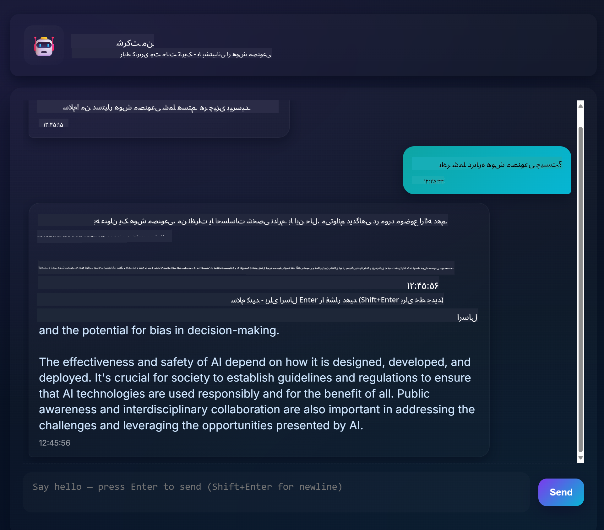
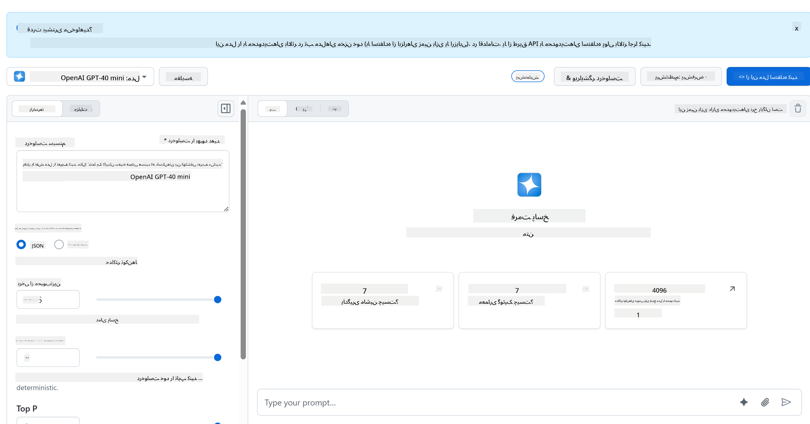
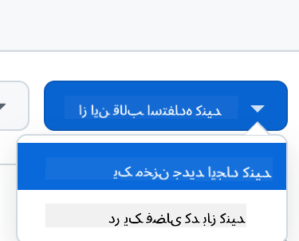

<!--
CO_OP_TRANSLATOR_METADATA:
{
  "original_hash": "11cf36165c243947b6cd85b88cf6faa6",
  "translation_date": "2025-09-01T16:48:34+00:00",
  "source_file": "9-chat-project/README.md",
  "language_code": "fa"
}
-->
# پروژه چت

این پروژه چت نشان می‌دهد که چگونه می‌توان یک دستیار چت با استفاده از مدل‌های GitHub ساخت.

این چیزی است که پروژه نهایی به نظر می‌رسد:



کمی زمینه: ساخت دستیارهای چت با استفاده از هوش مصنوعی مولد یک روش عالی برای شروع یادگیری درباره هوش مصنوعی است. در این درس یاد خواهید گرفت که چگونه هوش مصنوعی مولد را در یک برنامه وب ادغام کنید. بیایید شروع کنیم.

## اتصال به هوش مصنوعی مولد

برای بخش بک‌اند، ما از مدل‌های GitHub استفاده می‌کنیم. این یک سرویس عالی است که به شما امکان می‌دهد به صورت رایگان از هوش مصنوعی استفاده کنید. به محیط آزمایشی آن بروید و کدی که با زبان بک‌اند انتخابی شما مطابقت دارد را دریافت کنید. این چیزی است که در [GitHub Models Playground](https://github.com/marketplace/models/azure-openai/gpt-4o-mini/playground) به نظر می‌رسد.



همانطور که گفتیم، برگه "Code" و زمان اجرای انتخابی خود را انتخاب کنید.


### استفاده از Python

در این مورد، ما Python را انتخاب می‌کنیم، که به این معناست که این کد را انتخاب می‌کنیم:

```python
"""Run this model in Python

> pip install openai
"""
import os
from openai import OpenAI

# To authenticate with the model you will need to generate a personal access token (PAT) in your GitHub settings. 
# Create your PAT token by following instructions here: https://docs.github.com/en/authentication/keeping-your-account-and-data-secure/managing-your-personal-access-tokens
client = OpenAI(
    base_url="https://models.github.ai/inference",
    api_key=os.environ["GITHUB_TOKEN"],
)

response = client.chat.completions.create(
    messages=[
        {
            "role": "system",
            "content": "",
        },
        {
            "role": "user",
            "content": "What is the capital of France?",
        }
    ],
    model="openai/gpt-4o-mini",
    temperature=1,
    max_tokens=4096,
    top_p=1
)

print(response.choices[0].message.content)
```

بیایید این کد را کمی تمیز کنیم تا قابل استفاده مجدد باشد:

```python
def call_llm(prompt: str, system_message: str):
    response = client.chat.completions.create(
        messages=[
            {
                "role": "system",
                "content": system_message,
            },
            {
                "role": "user",
                "content": prompt,
            }
        ],
        model="openai/gpt-4o-mini",
        temperature=1,
        max_tokens=4096,
        top_p=1
    )

    return response.choices[0].message.content
```

با این تابع `call_llm` اکنون می‌توانیم یک پیام و یک پیام سیستمی را بگیریم و تابع نتیجه را برمی‌گرداند.

### شخصی‌سازی دستیار هوش مصنوعی

اگر می‌خواهید دستیار هوش مصنوعی را شخصی‌سازی کنید، می‌توانید مشخص کنید که چگونه می‌خواهید رفتار کند، با پر کردن پیام سیستمی به این صورت:

```python
call_llm("Tell me about you", "You're Albert Einstein, you only know of things in the time you were alive")
```

## ارائه از طریق یک API وب

عالی، بخش هوش مصنوعی را انجام دادیم، حالا ببینیم چگونه می‌توانیم آن را در یک API وب ادغام کنیم. برای API وب، ما Flask را انتخاب می‌کنیم، اما هر فریمورک وب دیگری نیز مناسب است. بیایید کد آن را ببینیم:

### استفاده از Python

```python
# api.py
from flask import Flask, request, jsonify
from llm import call_llm
from flask_cors import CORS

app = Flask(__name__)
CORS(app)   # *   example.com

@app.route("/", methods=["GET"])
def index():
    return "Welcome to this API. Call POST /hello with 'message': 'my message' as JSON payload"


@app.route("/hello", methods=["POST"])
def hello():
    # get message from request body  { "message": "do this taks for me" }
    data = request.get_json()
    message = data.get("message", "")

    response = call_llm(message, "You are a helpful assistant.")
    return jsonify({
        "response": response
    })

if __name__ == "__main__":
    app.run(host="0.0.0.0", port=5000)
```

اینجا، ما یک API Flask ایجاد می‌کنیم و یک مسیر پیش‌فرض "/" و "/chat" تعریف می‌کنیم. مسیر دوم برای استفاده توسط فرانت‌اند ما برای ارسال سوالات به آن طراحی شده است.

برای ادغام *llm.py* این کاری است که باید انجام دهیم:

- تابع `call_llm` را وارد کنید:

   ```python
   from llm import call_llm
   from flask import Flask, request
   ```

- آن را از مسیر "/chat" فراخوانی کنید:

   ```python
   @app.route("/hello", methods=["POST"])
   def hello():
      # get message from request body  { "message": "do this taks for me" }
      data = request.get_json()
      message = data.get("message", "")

      response = call_llm(message, "You are a helpful assistant.")
      return jsonify({
         "response": response
      })
   ```

   در اینجا درخواست ورودی را تجزیه می‌کنیم تا ویژگی `message` را از بدنه JSON دریافت کنیم. سپس با این فراخوانی LLM را فراخوانی می‌کنیم:

   ```python
   response = call_llm(message, "You are a helpful assistant")

   # return the response as JSON
   return jsonify({
      "response": response 
   })
   ```

عالی، حالا کاری که لازم بود انجام دادیم.

## تنظیم Cors

باید اشاره کنیم که چیزی مانند CORS، اشتراک منابع بین مبدا، تنظیم کردیم. این به این معناست که چون بک‌اند و فرانت‌اند ما روی پورت‌های مختلف اجرا می‌شوند، باید اجازه دهیم فرانت‌اند به بک‌اند دسترسی پیدا کند.

### استفاده از Python

یک قطعه کد در *api.py* وجود دارد که این را تنظیم می‌کند:

```python
from flask_cors import CORS

app = Flask(__name__)
CORS(app)   # *   example.com
```

در حال حاضر تنظیم شده است تا "*" را که همه مبدا‌ها هستند، اجازه دهد و این کمی ناامن است. باید آن را زمانی که به تولید می‌رویم محدود کنیم.

## اجرای پروژه

برای اجرای پروژه، ابتدا باید بک‌اند و سپس فرانت‌اند خود را راه‌اندازی کنید.

### استفاده از Python

خب، ما *llm.py* و *api.py* داریم، چگونه می‌توانیم این را با یک بک‌اند کار کنیم؟ خب، دو کار باید انجام دهیم:

- نصب وابستگی‌ها:

   ```sh
   cd backend
   python -m venv venv
   source ./venv/bin/activate

   pip install openai flask flask-cors openai
   ```

- راه‌اندازی API

   ```sh
   python api.py
   ```

   اگر در Codespaces هستید، باید به بخش Ports در پایین ویرایشگر بروید، روی آن کلیک راست کنید و گزینه "Port Visibility" را انتخاب کنید و "Public" را انتخاب کنید.

### کار روی فرانت‌اند

حالا که یک API در حال اجرا داریم، بیایید یک فرانت‌اند برای آن ایجاد کنیم. یک فرانت‌اند حداقلی که به تدریج آن را بهبود خواهیم داد. در یک پوشه *frontend* موارد زیر را ایجاد کنید:

```text
backend/
frontend/
index.html
app.js
styles.css
```

بیایید با **index.html** شروع کنیم:

```html
<html>
    <head>
        <link rel="stylesheet" href="styles.css">
    </head>
    <body>
      <form>
        <textarea id="messages"></textarea>
        <input id="input" type="text" />
        <button type="submit" id="sendBtn">Send</button>  
      </form>  
      <script src="app.js" />
    </body>
</html>    
```

این حداقل چیزی است که برای پشتیبانی از یک پنجره چت نیاز دارید، زیرا شامل یک textarea برای نمایش پیام‌ها، یک ورودی برای تایپ پیام و یک دکمه برای ارسال پیام به بک‌اند است. بیایید به JavaScript در *app.js* نگاه کنیم.

**app.js**

```js
// app.js

(function(){
  // 1. set up elements  
  const messages = document.getElementById("messages");
  const form = document.getElementById("form");
  const input = document.getElementById("input");

  const BASE_URL = "change this";
  const API_ENDPOINT = `${BASE_URL}/hello`;

  // 2. create a function that talks to our backend
  async function callApi(text) {
    const response = await fetch(API_ENDPOINT, {
      method: "POST",
      headers: { "Content-Type": "application/json" },
      body: JSON.stringify({ message: text })
    });
    let json = await response.json();
    return json.response;
  }

  // 3. add response to our textarea
  function appendMessage(text, role) {
    const el = document.createElement("div");
    el.className = `message ${role}`;
    el.innerHTML = text;
    messages.appendChild(el);
  }

  // 4. listen to submit events
  form.addEventListener("submit", async(e) => {
    e.preventDefault();
   // someone clicked the button in the form
   
   // get input
   const text = input.value.trim();

   appendMessage(text, "user")

   // reset it
   input.value = '';

   const reply = await callApi(text);

   // add to messages
   appendMessage(reply, "assistant");

  })
})();
```

بیایید کد را بخش به بخش بررسی کنیم:

- 1) در اینجا ما به همه عناصر خود که بعداً در کد به آنها ارجاع خواهیم داد، دسترسی پیدا می‌کنیم.
- 2) در این بخش، یک تابع ایجاد می‌کنیم که از متد داخلی `fetch` برای فراخوانی بک‌اند استفاده می‌کند.
- 3) `appendMessage` کمک می‌کند تا پاسخ‌ها و همچنین پیام‌هایی که شما به عنوان کاربر تایپ می‌کنید، اضافه شوند.
- 4) در اینجا به رویداد submit گوش می‌دهیم و در نهایت فیلد ورودی را می‌خوانیم، پیام کاربر را در textarea قرار می‌دهیم، API را فراخوانی می‌کنیم و پاسخ را در textarea نمایش می‌دهیم.

بیایید به استایل‌دهی نگاه کنیم، اینجا جایی است که می‌توانید واقعاً خلاق باشید و آن را به دلخواه خود طراحی کنید، اما اینجا چند پیشنهاد داریم:

**styles.css**

```
.message {
    background: #222;
    box-shadow: 0 0 0 10px orange;
    padding: 10px:
    margin: 5px;
}

.message.user {
    background: blue;
}

.message.assistant {
    background: grey;
} 
```

با این سه کلاس، پیام‌ها را بسته به اینکه از دستیار یا شما به عنوان کاربر آمده‌اند، متفاوت طراحی خواهید کرد. اگر می‌خواهید الهام بگیرید، به پوشه `solution/frontend/styles.css` نگاهی بیندازید.

### تغییر Base Url

یک مورد اینجا تنظیم نشده بود و آن `BASE_URL` بود، این تا زمانی که بک‌اند شما راه‌اندازی شود مشخص نیست. برای تنظیم آن:

- اگر API را به صورت محلی اجرا می‌کنید، باید چیزی شبیه به `http://localhost:5000` تنظیم شود.
- اگر در Codespaces اجرا می‌شود، باید چیزی شبیه به "[name]app.github.dev" باشد.

## تکلیف

پوشه‌ای به نام *project* ایجاد کنید با محتوایی مشابه زیر:

```text
project/
  frontend/
    index.html
    app.js
    styles.css
  backend/
    ...
```

محتوای دستورالعمل‌های بالا را کپی کنید اما آزادانه آن را به دلخواه خود شخصی‌سازی کنید.

## راه‌حل

[راه‌حل](./solution/README.md)

## امتیاز اضافی

سعی کنید شخصیت دستیار هوش مصنوعی را تغییر دهید.

### برای Python

وقتی `call_llm` را در *api.py* فراخوانی می‌کنید، می‌توانید آرگومان دوم را به چیزی که می‌خواهید تغییر دهید، برای مثال:

```python
call_llm(message, "You are Captain Picard")
```

### فرانت‌اند

همچنین CSS و متن را به دلخواه خود تغییر دهید، بنابراین تغییرات را در *index.html* و *styles.css* انجام دهید.

## خلاصه

عالی، شما از ابتدا یاد گرفتید که چگونه یک دستیار شخصی با استفاده از هوش مصنوعی ایجاد کنید. این کار را با استفاده از مدل‌های GitHub، یک بک‌اند در Python و یک فرانت‌اند در HTML، CSS و JavaScript انجام دادیم.

## تنظیم با Codespaces

- به اینجا بروید: [مخزن Web Dev For Beginners](https://github.com/microsoft/Web-Dev-For-Beginners)
- از یک قالب ایجاد کنید (مطمئن شوید که وارد GitHub شده‌اید) در گوشه بالا سمت راست:

    

- وقتی در مخزن خود هستید، یک Codespace ایجاد کنید:

    

    این باید محیطی را شروع کند که اکنون می‌توانید با آن کار کنید.

---

**سلب مسئولیت**:  
این سند با استفاده از سرویس ترجمه هوش مصنوعی [Co-op Translator](https://github.com/Azure/co-op-translator) ترجمه شده است. در حالی که ما تلاش می‌کنیم دقت را حفظ کنیم، لطفاً توجه داشته باشید که ترجمه‌های خودکار ممکن است شامل خطاها یا نادرستی‌ها باشند. سند اصلی به زبان اصلی آن باید به عنوان منبع معتبر در نظر گرفته شود. برای اطلاعات حساس، توصیه می‌شود از ترجمه حرفه‌ای انسانی استفاده کنید. ما مسئولیتی در قبال سوء تفاهم‌ها یا تفسیرهای نادرست ناشی از استفاده از این ترجمه نداریم.