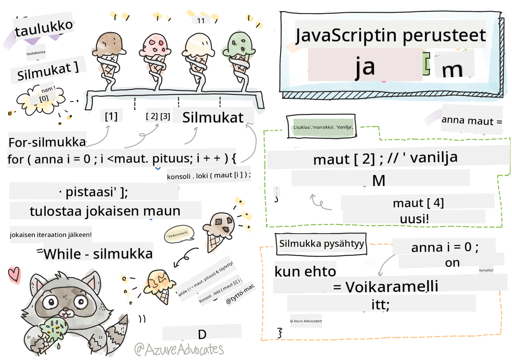

<!--
CO_OP_TRANSLATOR_METADATA:
{
  "original_hash": "9029f96b0e034839c1799f4595e4bb66",
  "translation_date": "2025-08-29T00:44:09+00:00",
  "source_file": "2-js-basics/4-arrays-loops/README.md",
  "language_code": "fi"
}
-->
# JavaScriptin perusteet: Taulukot ja silmukat


> Sketchnote by [Tomomi Imura](https://twitter.com/girlie_mac)

## Ennakkokysely
[Ennakkokysely](https://ff-quizzes.netlify.app/web/quiz/13)

Tämä oppitunti käsittelee JavaScriptin perusteita, kieltä, joka tuo interaktiivisuutta verkkoon. Tässä oppitunnissa opit taulukoista ja silmukoista, joita käytetään datan käsittelyyn.

[](https://youtube.com/watch?v=1U4qTyq02Xw "Arrays")

[](https://www.youtube.com/watch?v=Eeh7pxtTZ3k "Loops")

> 🎥 Klikkaa yllä olevia kuvia nähdäksesi videoita taulukoista ja silmukoista.

> Voit käydä tämän oppitunnin [Microsoft Learnissa](https://docs.microsoft.com/learn/modules/web-development-101-arrays/?WT.mc_id=academic-77807-sagibbon)!

## Taulukot

Datan käsittely on yleinen tehtävä kaikissa ohjelmointikielissä, ja se on paljon helpompaa, kun data on järjestetty rakenteelliseen muotoon, kuten taulukkoon. Taulukoiden avulla data tallennetaan rakenteeseen, joka muistuttaa listaa. Yksi taulukoiden suurista eduista on, että voit tallentaa eri tyyppistä dataa yhteen taulukkoon.

✅ Taulukot ovat kaikkialla ympärillämme! Voitko keksiä tosielämän esimerkin taulukosta, kuten aurinkopaneelijärjestelmästä?

Taulukon syntaksi koostuu hakasuluista.

```javascript
let myArray = [];
```

Tämä on tyhjä taulukko, mutta taulukot voidaan määritellä jo valmiiksi datalla täytettyinä. Useat arvot taulukossa erotetaan toisistaan pilkulla.

```javascript
let iceCreamFlavors = ["Chocolate", "Strawberry", "Vanilla", "Pistachio", "Rocky Road"];
```

Taulukon arvoille annetaan yksilöllinen arvo, jota kutsutaan **indeksiksi**, kokonaisluvuksi, joka määritetään sen etäisyyden perusteella taulukon alusta. Yllä olevassa esimerkissä merkkijonoarvolla "Chocolate" on indeksi 0, ja "Rocky Road" -arvon indeksi on 4. Käytä indeksiä hakasulkeiden kanssa hakeaksesi, muuttaaksesi tai lisätäksesi taulukon arvoja.

✅ Yllättääkö sinua, että taulukot alkavat nollasta? Joissakin ohjelmointikielissä indeksit alkavat 1:stä. Tällä on mielenkiintoinen historia, josta voit [lukea Wikipediassa](https://en.wikipedia.org/wiki/Zero-based_numbering).

```javascript
let iceCreamFlavors = ["Chocolate", "Strawberry", "Vanilla", "Pistachio", "Rocky Road"];
iceCreamFlavors[2]; //"Vanilla"
```

Voit käyttää indeksiä muuttaaksesi arvoa, kuten tässä:

```javascript
iceCreamFlavors[4] = "Butter Pecan"; //Changed "Rocky Road" to "Butter Pecan"
```

Ja voit lisätä uuden arvon tiettyyn indeksiin näin:

```javascript
iceCreamFlavors[5] = "Cookie Dough"; //Added "Cookie Dough"
```

✅ Yleisempi tapa lisätä arvoja taulukkoon on käyttää taulukko-operaattoreita, kuten array.push()

Voit selvittää, kuinka monta arvoa taulukossa on, käyttämällä `length`-ominaisuutta.

```javascript
let iceCreamFlavors = ["Chocolate", "Strawberry", "Vanilla", "Pistachio", "Rocky Road"];
iceCreamFlavors.length; //5
```

✅ Kokeile itse! Käytä selaimesi konsolia luodaksesi ja muokataksesi omaa taulukkoasi.

## Silmukat

Silmukat mahdollistavat toistuvien tai **iteratiivisten** tehtävien suorittamisen ja voivat säästää paljon aikaa ja koodia. Jokainen iteraatio voi vaihdella muuttujien, arvojen ja ehtojen osalta. JavaScriptissä on erilaisia silmukoita, joilla on pieniä eroja, mutta ne tekevät pohjimmiltaan saman asian: käyvät dataa läpi.

### For-silmukka

`for`-silmukka vaatii kolme osaa iteraatioon:
- `counter` Muuttuja, joka yleensä alustetaan numerolla ja laskee iteraatioiden määrän
- `condition` Lauseke, joka käyttää vertailuoperaattoreita ja pysäyttää silmukan, kun se on `false`
- `iteration-expression` Suoritetaan jokaisen iteraation lopussa, yleensä käytetään muuttamaan laskurin arvoa
  
```javascript
// Counting up to 10
for (let i = 0; i < 10; i++) {
  console.log(i);
}
```

✅ Suorita tämä koodi selaimesi konsolissa. Mitä tapahtuu, kun teet pieniä muutoksia laskuriin, ehtoon tai iteraatiolausekkeeseen? Voitko saada sen toimimaan taaksepäin, luoden lähtölaskennan?

### While-silmukka

Toisin kuin `for`-silmukan syntaksi, `while`-silmukka vaatii vain ehdon, joka pysäyttää silmukan, kun ehto muuttuu `false`:ksi. Silmukoiden ehdot yleensä riippuvat muista arvoista, kuten laskureista, ja niitä täytyy hallita silmukan aikana. Laskureiden alkuarvot täytyy luoda silmukan ulkopuolella, ja kaikki lausekkeet, jotka täyttävät ehdon, mukaan lukien laskurin muuttaminen, täytyy ylläpitää silmukan sisällä.

```javascript
//Counting up to 10
let i = 0;
while (i < 10) {
 console.log(i);
 i++;
}
```

✅ Miksi valitsisit for-silmukan vs. while-silmukan? 17 000 katsojaa pohti samaa kysymystä StackOverflow'ssa, ja jotkut mielipiteet [voivat olla mielenkiintoisia sinulle](https://stackoverflow.com/questions/39969145/while-loops-vs-for-loops-in-javascript).

## Silmukat ja taulukot

Taulukoita käytetään usein silmukoiden kanssa, koska useimmat ehdot vaativat taulukon pituuden silmukan pysäyttämiseksi, ja indeksi voi myös toimia laskurin arvona.

```javascript
let iceCreamFlavors = ["Chocolate", "Strawberry", "Vanilla", "Pistachio", "Rocky Road"];

for (let i = 0; i < iceCreamFlavors.length; i++) {
  console.log(iceCreamFlavors[i]);
} //Ends when all flavors are printed
```

✅ Kokeile silmukoida omaa taulukkoasi selaimesi konsolissa. 

---

## 🚀 Haaste

On olemassa muita tapoja silmukoida taulukoita kuin for- ja while-silmukat. Näitä ovat [forEach](https://developer.mozilla.org/docs/Web/JavaScript/Reference/Global_Objects/Array/forEach), [for-of](https://developer.mozilla.org/docs/Web/JavaScript/Reference/Statements/for...of) ja [map](https://developer.mozilla.org/docs/Web/JavaScript/Reference/Global_Objects/Array/map). Kirjoita taulukkosilmukkasi uudelleen käyttäen yhtä näistä tekniikoista.

## Oppitunnin jälkeinen kysely
[Oppitunnin jälkeinen kysely](https://ff-quizzes.netlify.app/web/quiz/14)

## Kertaus ja itseopiskelu

JavaScriptin taulukoilla on monia menetelmiä, jotka ovat erittäin hyödyllisiä datan käsittelyssä. [Lue näistä menetelmistä](https://developer.mozilla.org/docs/Web/JavaScript/Reference/Global_Objects/Array) ja kokeile joitakin niistä (kuten push, pop, slice ja splice) omalla taulukollasi.

## Tehtävä

[Silmukoi taulukko](assignment.md)

---

**Vastuuvapauslauseke**:  
Tämä asiakirja on käännetty käyttämällä tekoälypohjaista käännöspalvelua [Co-op Translator](https://github.com/Azure/co-op-translator). Pyrimme tarkkuuteen, mutta huomioithan, että automaattiset käännökset voivat sisältää virheitä tai epätarkkuuksia. Alkuperäistä asiakirjaa sen alkuperäisellä kielellä tulee pitää ensisijaisena lähteenä. Kriittisen tiedon osalta suositellaan ammattimaista ihmiskääntämistä. Emme ole vastuussa tämän käännöksen käytöstä aiheutuvista väärinkäsityksistä tai virhetulkinnoista.