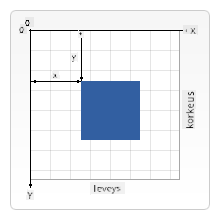

<!--
CO_OP_TRANSLATOR_METADATA:
{
  "original_hash": "056641280211e52fd0adb81b6058ec55",
  "translation_date": "2025-08-29T00:41:32+00:00",
  "source_file": "6-space-game/2-drawing-to-canvas/README.md",
  "language_code": "fi"
}
-->
# Rakenna avaruuspeli, osa 2: Piirrä sankari ja hirviöt kankaalle

## Ennen luentoa -kysely

[Ennen luentoa -kysely](https://ff-quizzes.netlify.app/web/quiz/31)

## Canvas

Canvas on HTML-elementti, joka oletuksena ei sisällä mitään sisältöä; se on tyhjä pohja. Sinun täytyy lisätä siihen sisältöä piirtämällä.

✅ Lue [lisää Canvas API:sta](https://developer.mozilla.org/docs/Web/API/Canvas_API) MDN:ssä.

Näin se yleensä määritellään osana sivun runkoa:

```html
<canvas id="myCanvas" width="200" height="100"></canvas>
```

Yllä asetamme `id`, `width` ja `height`.

- `id`: aseta tämä, jotta voit viitata siihen, kun tarvitset vuorovaikutusta sen kanssa.
- `width`: tämä on elementin leveys.
- `height`: tämä on elementin korkeus.

## Yksinkertaisen geometrian piirtäminen

Canvas käyttää kartesiolaista koordinaatistojärjestelmää asioiden piirtämiseen. Se käyttää x- ja y-akselia ilmaisemaan, missä jokin sijaitsee. Sijainti `0,0` on vasen yläkulma, ja oikea alakulma on se, mitä määritit CANVASIN leveys- ja korkeusasetuksiksi.


> Kuva [MDN:stä](https://developer.mozilla.org/docs/Web/API/Canvas_API/Tutorial/Drawing_shapes)

Piirtääksesi canvas-elementtiin sinun täytyy käydä läpi seuraavat vaiheet:

1. **Hanki viittaus** Canvas-elementtiin.
1. **Hanki viittaus** Context-elementtiin, joka sijaitsee Canvas-elementissä.
1. **Suorita piirtotoiminto** käyttämällä Context-elementtiä.

Yllä olevien vaiheiden koodi näyttää yleensä tältä:

```javascript
// draws a red rectangle
//1. get the canvas reference
canvas = document.getElementById("myCanvas");

//2. set the context to 2D to draw basic shapes
ctx = canvas.getContext("2d");

//3. fill it with the color red
ctx.fillStyle = 'red';

//4. and draw a rectangle with these parameters, setting location and size
ctx.fillRect(0,0, 200, 200) // x,y,width, height
```

✅ Canvas API keskittyy pääasiassa 2D-muotoihin, mutta voit myös piirtää 3D-elementtejä verkkosivulle; tähän voit käyttää [WebGL API:ta](https://developer.mozilla.org/docs/Web/API/WebGL_API).

Canvas API:lla voit piirtää kaikenlaisia asioita, kuten:

- **Geometrisia muotoja**, olemme jo näyttäneet, kuinka piirtää suorakulmio, mutta voit piirtää paljon muutakin.
- **Tekstiä**, voit piirtää tekstiä millä tahansa fontilla ja värillä.
- **Kuvia**, voit piirtää kuvan esimerkiksi .jpg- tai .png-tiedostosta.

✅ Kokeile! Tiedät, kuinka piirtää suorakulmio, mutta osaatko piirtää ympyrän sivulle? Katso joitakin mielenkiintoisia Canvas-piirroksia CodePenissä. Tässä on [erityisen vaikuttava esimerkki](https://codepen.io/dissimulate/pen/KrAwx).

## Lataa ja piirrä kuvatiedosto

Voit ladata kuvatiedoston luomalla `Image`-objektin ja asettamalla sen `src`-ominaisuuden. Sitten kuuntelet `load`-tapahtumaa tietääksesi, milloin se on valmis käytettäväksi. Koodi näyttää tältä:

### Lataa tiedosto

```javascript
const img = new Image();
img.src = 'path/to/my/image.png';
img.onload = () => {
  // image loaded and ready to be used
}
```

### Latausmalli

On suositeltavaa kääriä yllä oleva rakenne seuraavanlaiseen muotoon, jotta sitä on helpompi käyttää ja yrität manipuloida sitä vain, kun se on täysin ladattu:

```javascript
function loadAsset(path) {
  return new Promise((resolve) => {
    const img = new Image();
    img.src = path;
    img.onload = () => {
      // image loaded and ready to be used
      resolve(img);
    }
  })
}

// use like so

async function run() {
  const heroImg = await loadAsset('hero.png')
  const monsterImg = await loadAsset('monster.png')
}

```

Piirtääksesi pelin elementtejä näytölle, koodisi näyttäisi tältä:

```javascript
async function run() {
  const heroImg = await loadAsset('hero.png')
  const monsterImg = await loadAsset('monster.png')

  canvas = document.getElementById("myCanvas");
  ctx = canvas.getContext("2d");
  ctx.drawImage(heroImg, canvas.width/2,canvas.height/2);
  ctx.drawImage(monsterImg, 0,0);
}
```

## Nyt on aika aloittaa pelin rakentaminen

### Mitä rakentaa

Rakennat verkkosivun, jossa on Canvas-elementti. Sen tulisi näyttää musta ruutu `1024*768`. Olemme toimittaneet sinulle kaksi kuvaa:

- Sankarialus

   

- 5*5 hirviö

   

### Suositellut kehitysvaiheet

Etsi tiedostot, jotka on luotu sinulle `your-work`-alikansiossa. Sen pitäisi sisältää seuraavat:

```bash
-| assets
  -| enemyShip.png
  -| player.png
-| index.html
-| app.js
-| package.json
```

Avaa tämän kansion kopio Visual Studio Codessa. Sinulla tulisi olla paikallinen kehitysympäristö asennettuna, mieluiten Visual Studio Code, jossa on NPM ja Node asennettuna. Jos sinulla ei ole `npm`-asetuksia tietokoneellasi, [tässä ohjeet sen asentamiseen](https://www.npmjs.com/get-npm).

Aloita projektisi siirtymällä `your_work`-kansioon:

```bash
cd your-work
npm start
```

Yllä oleva käynnistää HTTP-palvelimen osoitteessa `http://localhost:5000`. Avaa selain ja syötä tämä osoite. Tällä hetkellä sivu on tyhjä, mutta se muuttuu.

> Huom: nähdäksesi muutokset näytöllä, päivitä selaimesi.

### Lisää koodi

Lisää tarvittava koodi `your-work/app.js`-tiedostoon ratkaistaksesi alla olevat tehtävät.

1. **Piirrä** canvas mustalla taustalla
   > vinkki: lisää kaksi riviä sopivan TODO-kohdan alle `/app.js`-tiedostossa, asettaen `ctx`-elementin mustaksi ja ylä-/vasen koordinaatit 0,0 sekä korkeus ja leveys vastaamaan canvasin kokoa.
2. **Lataa** tekstuurit
   > vinkki: lisää pelaajan ja vihollisen kuvat käyttämällä `await loadTexture` ja välittämällä kuvan polku. Et näe niitä vielä näytöllä!
3. **Piirrä** sankari näytön keskelle alaosaan
   > vinkki: käytä `drawImage`-API:a piirtääksesi heroImg näytölle, asettaen `canvas.width / 2 - 45` ja `canvas.height - canvas.height / 4)`.
4. **Piirrä** 5*5 hirviöt
   > vinkki: Nyt voit poistaa kommentit koodista, joka piirtää viholliset näytölle. Seuraavaksi siirry `createEnemies`-funktioon ja rakenna se.

   Ensin, määritä joitakin vakioita:

    ```javascript
    const MONSTER_TOTAL = 5;
    const MONSTER_WIDTH = MONSTER_TOTAL * 98;
    const START_X = (canvas.width - MONSTER_WIDTH) / 2;
    const STOP_X = START_X + MONSTER_WIDTH;
    ```

    sitten, luo silmukka, joka piirtää hirviöiden taulukon näytölle:

    ```javascript
    for (let x = START_X; x < STOP_X; x += 98) {
        for (let y = 0; y < 50 * 5; y += 50) {
          ctx.drawImage(enemyImg, x, y);
        }
      }
    ```

## Lopputulos

Valmis tulos näyttää tältä:


## Ratkaisu

Yritä ratkaista itse ensin, mutta jos jäät jumiin, katso [ratkaisu](../../../../6-space-game/2-drawing-to-canvas/solution/app.js)

---

## 🚀 Haaste

Olet oppinut piirtämään 2D-keskeisellä Canvas API:lla; tutustu [WebGL API:iin](https://developer.mozilla.org/docs/Web/API/WebGL_API) ja yritä piirtää 3D-objekti.

## Luentojälkeinen kysely

[Luentojälkeinen kysely](https://ff-quizzes.netlify.app/web/quiz/32)

## Kertaus ja itseopiskelu

Opi lisää Canvas API:sta [lukemalla siitä](https://developer.mozilla.org/docs/Web/API/Canvas_API).

## Tehtävä

[Leiki Canvas API:n kanssa](assignment.md)

---

**Vastuuvapauslauseke**:  
Tämä asiakirja on käännetty käyttämällä tekoälypohjaista käännöspalvelua [Co-op Translator](https://github.com/Azure/co-op-translator). Vaikka pyrimme tarkkuuteen, huomioithan, että automaattiset käännökset voivat sisältää virheitä tai epätarkkuuksia. Alkuperäistä asiakirjaa sen alkuperäisellä kielellä tulee pitää ensisijaisena lähteenä. Kriittisen tiedon osalta suositellaan ammattimaista ihmisen tekemää käännöstä. Emme ole vastuussa tämän käännöksen käytöstä johtuvista väärinkäsityksistä tai virhetulkinnoista.