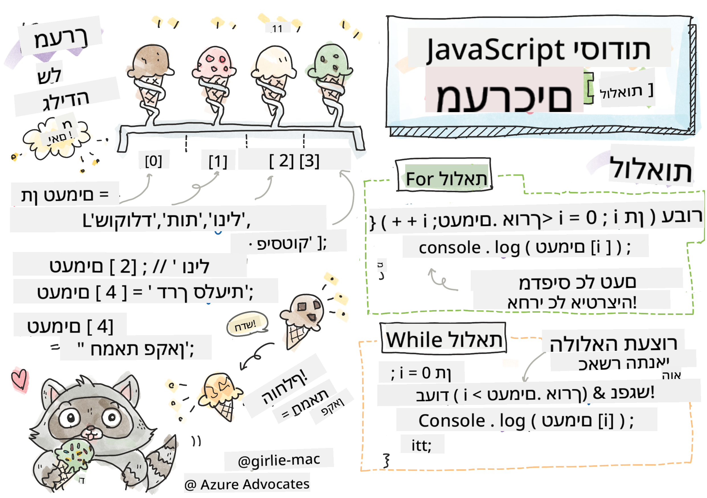

<!--
CO_OP_TRANSLATOR_METADATA:
{
  "original_hash": "9029f96b0e034839c1799f4595e4bb66",
  "translation_date": "2025-08-29T01:17:13+00:00",
  "source_file": "2-js-basics/4-arrays-loops/README.md",
  "language_code": "he"
}
-->
# יסודות JavaScript: מערכים ולולאות

  
> איור מאת [Tomomi Imura](https://twitter.com/girlie_mac)

## חידון לפני השיעור  
[חידון לפני השיעור](https://ff-quizzes.netlify.app/web/quiz/13)

השיעור הזה עוסק ביסודות של JavaScript, השפה שמוסיפה אינטראקטיביות לאתרי אינטרנט. בשיעור זה תלמדו על מערכים ולולאות, המשמשים לעיבוד נתונים.

[](https://youtube.com/watch?v=1U4qTyq02Xw "Arrays")

[](https://www.youtube.com/watch?v=Eeh7pxtTZ3k "Loops")

> 🎥 לחצו על התמונות למעלה לצפייה בסרטונים על מערכים ולולאות.

> ניתן ללמוד את השיעור הזה גם ב-[Microsoft Learn](https://docs.microsoft.com/learn/modules/web-development-101-arrays/?WT.mc_id=academic-77807-sagibbon)!

## מערכים

עבודה עם נתונים היא משימה נפוצה בכל שפה, והיא הופכת לקלה יותר כאשר הנתונים מאורגנים בפורמט מבני, כמו מערכים. במערכים, הנתונים נשמרים במבנה דמוי רשימה. אחד היתרונות המרכזיים של מערכים הוא שניתן לשמור בהם סוגי נתונים שונים.

✅ מערכים נמצאים סביבנו כל הזמן! האם תוכלו לחשוב על דוגמה מהחיים האמיתיים למערך, כמו מערך של לוחות סולאריים?

התחביר של מערך הוא זוג סוגריים מרובעים.

```javascript
let myArray = [];
```

זהו מערך ריק, אך ניתן להכריז על מערכים שכבר מכילים נתונים. ערכים מרובים במערך מופרדים באמצעות פסיק.

```javascript
let iceCreamFlavors = ["Chocolate", "Strawberry", "Vanilla", "Pistachio", "Rocky Road"];
```

לערכי המערך מוקצה ערך ייחודי שנקרא **אינדקס**, שהוא מספר שלם שמוקצה בהתאם למרחקו מתחילת המערך. בדוגמה למעלה, לערך המחרוזת "Chocolate" יש אינדקס 0, ולאינדקס של "Rocky Road" יש ערך 4. ניתן להשתמש באינדקס עם סוגריים מרובעים כדי לאחזר, לשנות או להוסיף ערכים למערך.

✅ האם מפתיע אתכם שמערכים מתחילים באינדקס אפס? בשפות תכנות מסוימות, אינדקסים מתחילים ב-1. יש לכך היסטוריה מעניינת, עליה תוכלו [לקרוא בוויקיפדיה](https://en.wikipedia.org/wiki/Zero-based_numbering).

```javascript
let iceCreamFlavors = ["Chocolate", "Strawberry", "Vanilla", "Pistachio", "Rocky Road"];
iceCreamFlavors[2]; //"Vanilla"
```

ניתן להשתמש באינדקס כדי לשנות ערך, כך:

```javascript
iceCreamFlavors[4] = "Butter Pecan"; //Changed "Rocky Road" to "Butter Pecan"
```

ואפשר להוסיף ערך חדש באינדקס מסוים כך:

```javascript
iceCreamFlavors[5] = "Cookie Dough"; //Added "Cookie Dough"
```

✅ דרך נפוצה יותר להוסיף ערכים למערך היא באמצעות אופרטורים כמו array.push().

כדי לגלות כמה פריטים יש במערך, השתמשו במאפיין `length`.

```javascript
let iceCreamFlavors = ["Chocolate", "Strawberry", "Vanilla", "Pistachio", "Rocky Road"];
iceCreamFlavors.length; //5
```

✅ נסו בעצמכם! השתמשו בקונסול של הדפדפן כדי ליצור ולשנות מערך משלכם.

## לולאות

לולאות מאפשרות לנו לבצע משימות חוזרות או **איטרטיביות**, ויכולות לחסוך זמן רב וקוד. כל איטרציה יכולה להשתנות במשתנים, ערכים ותנאים. ישנם סוגים שונים של לולאות ב-JavaScript, ולכולן הבדלים קטנים, אך ביסודו של דבר הן עושות את אותו הדבר: חוזרות על נתונים.

### לולאת For

לולאת `for` דורשת 3 חלקים כדי לבצע איטרציה:
- `counter` משתנה שמתחיל בדרך כלל במספר שסופר את מספר האיטרציות
- `condition` ביטוי שמשתמש באופרטורים להשוואה כדי לגרום ללולאה להפסיק כאשר הוא `false`
- `iteration-expression` רץ בסוף כל איטרציה, ומשמש בדרך כלל לשינוי ערך ה-counter

```javascript
// Counting up to 10
for (let i = 0; i < 10; i++) {
  console.log(i);
}
```

✅ הריצו את הקוד הזה בקונסול של הדפדפן. מה קורה כשאתם מבצעים שינויים קטנים ב-counter, בתנאי או בביטוי האיטרציה? האם תוכלו לגרום ללולאה לרוץ אחורה, וליצור ספירה לאחור?

### לולאת While

בניגוד לתחביר של לולאת `for`, לולאות `while` דורשות רק תנאי שיגרום ללולאה להפסיק כאשר התנאי יהפוך ל-`false`. תנאים בלולאות בדרך כלל מסתמכים על ערכים אחרים כמו counters, ויש לנהל אותם במהלך הלולאה. ערכי התחלה ל-counters חייבים להיווצר מחוץ ללולאה, וכל ביטוי שעונה על תנאי, כולל שינוי ה-counter, חייב להתבצע בתוך הלולאה.

```javascript
//Counting up to 10
let i = 0;
while (i < 10) {
 console.log(i);
 i++;
}
```

✅ מדוע תבחרו בלולאת for לעומת לולאת while? 17 אלף צופים שאלו את אותה שאלה ב-StackOverflow, וחלק מהדעות [עשויות לעניין אתכם](https://stackoverflow.com/questions/39969145/while-loops-vs-for-loops-in-javascript).

## לולאות ומערכים

מערכים משמשים לעיתים קרובות עם לולאות מכיוון שרוב התנאים דורשים את אורך המערך כדי להפסיק את הלולאה, והאינדקס יכול לשמש גם כערך ה-counter.

```javascript
let iceCreamFlavors = ["Chocolate", "Strawberry", "Vanilla", "Pistachio", "Rocky Road"];

for (let i = 0; i < iceCreamFlavors.length; i++) {
  console.log(iceCreamFlavors[i]);
} //Ends when all flavors are printed
```

✅ נסו להתנסות בלולאה על מערך משלכם בקונסול של הדפדפן.

---

## 🚀 אתגר

ישנן דרכים נוספות ללולאה על מערכים מלבד לולאות for ו-while. ישנן [forEach](https://developer.mozilla.org/docs/Web/JavaScript/Reference/Global_Objects/Array/forEach), [for-of](https://developer.mozilla.org/docs/Web/JavaScript/Reference/Statements/for...of), ו-[map](https://developer.mozilla.org/docs/Web/JavaScript/Reference/Global_Objects/Array/map). שכתבו את הלולאה שלכם על מערך באמצעות אחת מהטכניקות הללו.

## חידון אחרי השיעור  
[חידון אחרי השיעור](https://ff-quizzes.netlify.app/web/quiz/14)

## סקירה ולימוד עצמי

למערכים ב-JavaScript יש שיטות רבות שמצורפות אליהם, והן שימושיות מאוד לעיבוד נתונים. [קראו על השיטות הללו](https://developer.mozilla.org/docs/Web/JavaScript/Reference/Global_Objects/Array) ונסו כמה מהן (כמו push, pop, slice ו-splice) על מערך משלכם.

## משימה

[לולאה על מערך](assignment.md)

---

**כתב ויתור**:  
מסמך זה תורגם באמצעות שירות תרגום מבוסס בינה מלאכותית [Co-op Translator](https://github.com/Azure/co-op-translator). בעוד שאנו שואפים לדיוק, יש להיות מודעים לכך שתרגומים אוטומטיים עשויים להכיל שגיאות או אי-דיוקים. המסמך המקורי בשפתו המקורית צריך להיחשב כמקור הסמכותי. למידע קריטי, מומלץ להשתמש בתרגום מקצועי על ידי מתרגם אנושי. איננו נושאים באחריות לכל אי-הבנה או פרשנות שגויה הנובעת משימוש בתרגום זה.