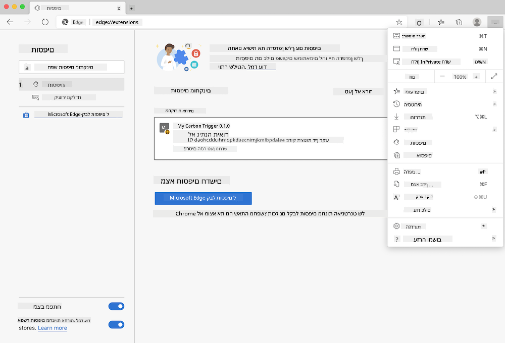

<!--
CO_OP_TRANSLATOR_METADATA:
{
  "original_hash": "3f5e6821e0febccfc5d05e7c944d9e3d",
  "translation_date": "2025-08-27T20:54:33+00:00",
  "source_file": "5-browser-extension/solution/translation/README.ja.md",
  "language_code": "he"
}
-->
# תוסף דפדפן למעקב אחר פליטת פחמן: קוד מוכן

בנו תוסף לדפדפן שמציג תזכורת על צריכת החשמל באזורכם, באמצעות ה-API של CO2 Signal מבית tmrow. התוסף מאפשר לכם לעקוב אחר צריכת החשמל באזורכם ולהשתמש במידע הזה כדי לקבל החלטות מושכלות לגבי הפעילות שלכם.


## הקדמה

יש לוודא ש-[npm](https://npmjs.com) מותקן. הורידו עותק של הקוד לתיקייה במחשב שלכם.

התקינו את כל החבילות הנדרשות.

```
npm install
```

בנו את התוסף באמצעות webpack.

```
npm run build
```

כדי להתקין ב-Edge, מצאו את לוח ה"הרחבות" דרך תפריט "שלוש הנקודות" בפינה הימנית העליונה של הדפדפן. משם, בחרו "Load Unpacked" כדי לטעון את התוסף החדש. כאשר תתבקשו, פתחו את תיקיית "dist", והתוסף ייטען. לשימוש בתוסף, תצטרכו מפתח API של CO2 Signal ([קבלו אחד כאן דרך אימייל](https://www.co2signal.com/) - הזינו את האימייל שלכם בתיבה שבדף) וקוד לאזור שלכם התואם ל-[Electricity Map](https://www.electricitymap.org/map) ([ראו כאן את הקוד לאזור שלכם](http://api.electricitymap.org/v3/zones)). לדוגמה, בבוסטון משתמשים ב-'US-NEISO'.



לאחר שתזינו את מפתח ה-API והאזור בממשק התוסף, נקודה צבעונית שתופיע בסרגל ההרחבות של הדפדפן תשתנה בהתאם לצריכת האנרגיה באזורכם. הנקודה תספק אינדיקציה אילו פעילויות שדורשות אנרגיה מתאימות לביצוע באותו זמן. הרעיון של מערכת ה"נקודה" נלקח מהתוסף [Energy Lollipop](https://energylollipop.com/) שנועד למעקב אחר פליטות בקליפורניה.

---

**כתב ויתור**:  
מסמך זה תורגם באמצעות שירות תרגום מבוסס בינה מלאכותית [Co-op Translator](https://github.com/Azure/co-op-translator). למרות שאנו שואפים לדיוק, יש לקחת בחשבון שתרגומים אוטומטיים עשויים להכיל שגיאות או אי דיוקים. המסמך המקורי בשפתו המקורית צריך להיחשב כמקור סמכותי. עבור מידע קריטי, מומלץ להשתמש בתרגום מקצועי על ידי אדם. איננו נושאים באחריות לאי הבנות או לפרשנויות שגויות הנובעות משימוש בתרגום זה.