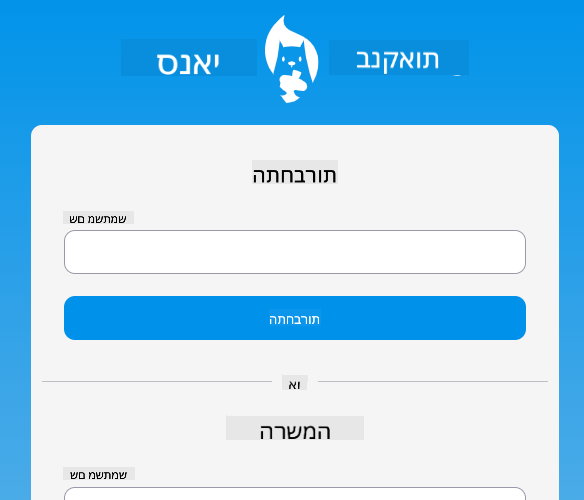
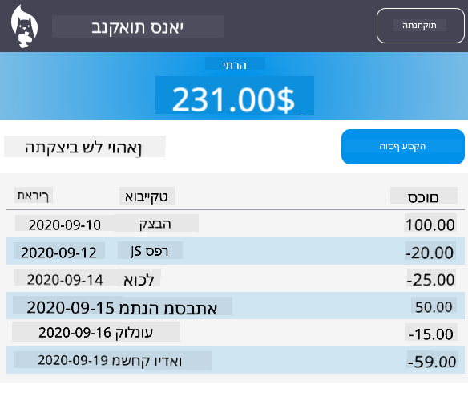

<!--
CO_OP_TRANSLATOR_METADATA:
{
  "original_hash": "830359535306594b448db6575ce5cdee",
  "translation_date": "2025-08-27T20:54:58+00:00",
  "source_file": "7-bank-project/README.md",
  "language_code": "he"
}
-->
# :dollar: בנה בנק

בפרויקט הזה תלמדו איך לבנות בנק פיקטיבי. השיעורים כוללים הוראות על איך לעצב אפליקציית ווב ולספק נתיבים, לבנות טפסים, לנהל מצב, ולמשוך נתונים מ-API שממנו תוכלו לקבל את נתוני הבנק.

|  |  |
|--------------------------------|--------------------------------|

## שיעורים

1. [תבניות HTML ונתיבים באפליקציית ווב](1-template-route/README.md)
2. [בניית טופס התחברות והרשמה](2-forms/README.md)
3. [שיטות למשיכת נתונים ושימוש בהם](3-data/README.md)
4. [מושגים בניהול מצב](4-state-management/README.md)

### קרדיטים

השיעורים נכתבו באהבה על ידי [יוהאן לסורסה](https://twitter.com/sinedied).

אם אתם מעוניינים ללמוד איך לבנות את [שרת ה-API](/7-bank-project/api/README.md) שמשמש בשיעורים האלה, תוכלו לעקוב אחרי [סדרת הסרטונים הזו](https://aka.ms/NodeBeginner) (במיוחד סרטונים 17 עד 21).

תוכלו גם להציץ ב-[מדריך הלמידה האינטראקטיבי הזה](https://aka.ms/learn/express-api).

---

**כתב ויתור**:  
מסמך זה תורגם באמצעות שירות תרגום מבוסס בינה מלאכותית [Co-op Translator](https://github.com/Azure/co-op-translator). למרות שאנו שואפים לדיוק, יש לקחת בחשבון שתרגומים אוטומטיים עשויים להכיל שגיאות או אי דיוקים. המסמך המקורי בשפתו המקורית צריך להיחשב כמקור סמכותי. עבור מידע קריטי, מומלץ להשתמש בתרגום מקצועי על ידי אדם. איננו נושאים באחריות לאי הבנות או לפרשנויות שגויות הנובעות משימוש בתרגום זה.