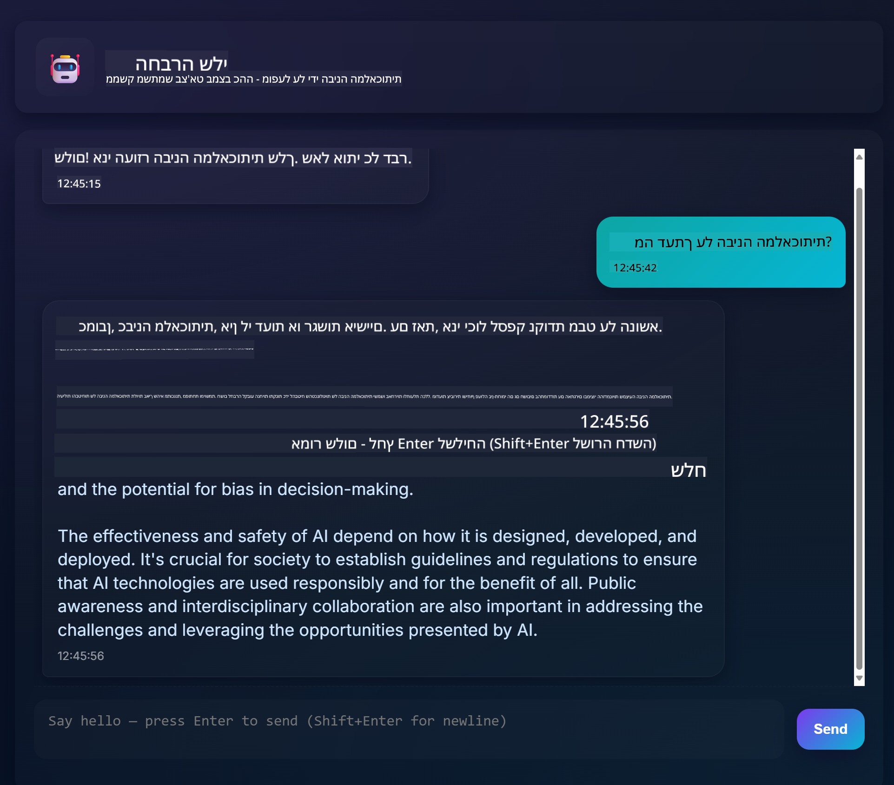
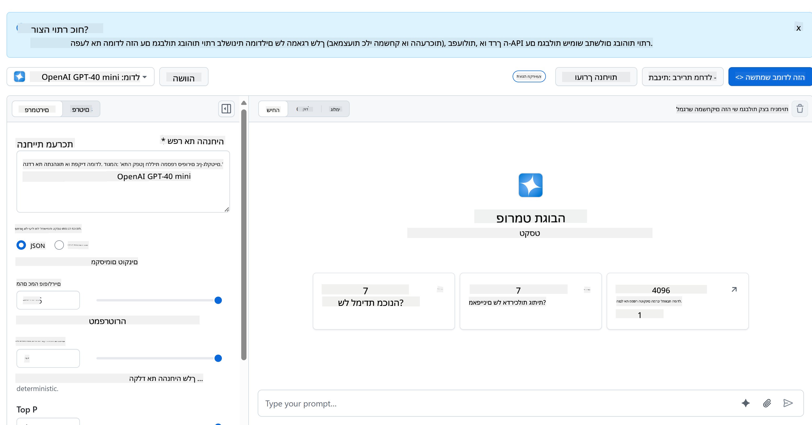
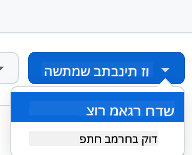
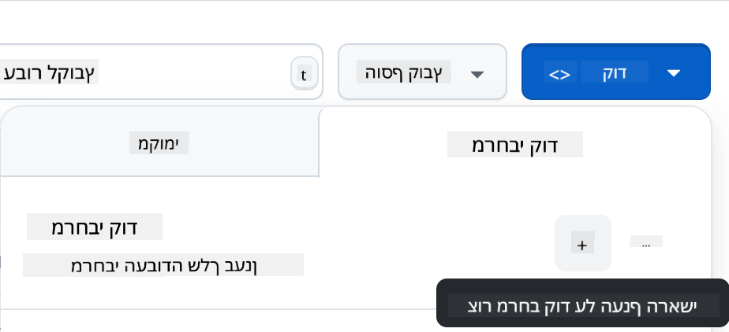

<!--
CO_OP_TRANSLATOR_METADATA:
{
  "original_hash": "11cf36165c243947b6cd85b88cf6faa6",
  "translation_date": "2025-09-01T16:57:59+00:00",
  "source_file": "9-chat-project/README.md",
  "language_code": "he"
}
-->
# פרויקט צ'אט

פרויקט הצ'אט הזה מדגים כיצד לבנות עוזר צ'אט באמצעות GitHub Models.

כך נראה הפרויקט המוגמר:



קצת רקע, בניית עוזרי צ'אט באמצעות AI גנרטיבי היא דרך מצוינת להתחיל ללמוד על בינה מלאכותית. במהלך השיעור הזה תלמדו לשלב AI גנרטיבי באפליקציית ווב. בואו נתחיל.

## חיבור ל-AI גנרטיבי

בצד השרת, אנחנו משתמשים ב-GitHub Models. זהו שירות נהדר שמאפשר להשתמש בבינה מלאכותית בחינם. גשו ל-playground שלו וקחו את הקוד שמתאים לשפת התכנות שבחרתם. כך זה נראה ב-[GitHub Models Playground](https://github.com/marketplace/models/azure-openai/gpt-4o-mini/playground)



כפי שאמרנו, בחרו בלשונית "Code" ואת סביבת הריצה שלכם.


### שימוש ב-Python

במקרה הזה נבחר ב-Python, מה שאומר שנשתמש בקוד הבא:

```python
"""Run this model in Python

> pip install openai
"""
import os
from openai import OpenAI

# To authenticate with the model you will need to generate a personal access token (PAT) in your GitHub settings. 
# Create your PAT token by following instructions here: https://docs.github.com/en/authentication/keeping-your-account-and-data-secure/managing-your-personal-access-tokens
client = OpenAI(
    base_url="https://models.github.ai/inference",
    api_key=os.environ["GITHUB_TOKEN"],
)

response = client.chat.completions.create(
    messages=[
        {
            "role": "system",
            "content": "",
        },
        {
            "role": "user",
            "content": "What is the capital of France?",
        }
    ],
    model="openai/gpt-4o-mini",
    temperature=1,
    max_tokens=4096,
    top_p=1
)

print(response.choices[0].message.content)
```

בואו ננקה את הקוד הזה קצת כדי שיהיה ניתן לשימוש חוזר:

```python
def call_llm(prompt: str, system_message: str):
    response = client.chat.completions.create(
        messages=[
            {
                "role": "system",
                "content": system_message,
            },
            {
                "role": "user",
                "content": prompt,
            }
        ],
        model="openai/gpt-4o-mini",
        temperature=1,
        max_tokens=4096,
        top_p=1
    )

    return response.choices[0].message.content
```

עם הפונקציה `call_llm` נוכל עכשיו לקחת prompt ו-system prompt, והפונקציה תחזיר את התוצאה.

### התאמת עוזר ה-AI

אם תרצו להתאים את עוזר ה-AI, תוכלו להגדיר כיצד הוא יתנהג על ידי מילוי ה-system prompt כך:

```python
call_llm("Tell me about you", "You're Albert Einstein, you only know of things in the time you were alive")
```

## חשיפת ה-AI דרך Web API

מעולה, סיימנו את חלק ה-AI, עכשיו נראה איך לשלב אותו ב-Web API. עבור ה-Web API, נבחר להשתמש ב-Flask, אבל כל פריימוורק ווב אחר יתאים. הנה הקוד:

### שימוש ב-Python

```python
# api.py
from flask import Flask, request, jsonify
from llm import call_llm
from flask_cors import CORS

app = Flask(__name__)
CORS(app)   # *   example.com

@app.route("/", methods=["GET"])
def index():
    return "Welcome to this API. Call POST /hello with 'message': 'my message' as JSON payload"


@app.route("/hello", methods=["POST"])
def hello():
    # get message from request body  { "message": "do this taks for me" }
    data = request.get_json()
    message = data.get("message", "")

    response = call_llm(message, "You are a helpful assistant.")
    return jsonify({
        "response": response
    })

if __name__ == "__main__":
    app.run(host="0.0.0.0", port=5000)
```

כאן אנחנו יוצרים API עם Flask ומגדירים נתיב ברירת מחדל "/" ונתיב "/chat". הנתיב השני מיועד לשימוש על ידי ה-frontend שלנו כדי להעביר שאלות.

כדי לשלב את *llm.py*, הנה מה שצריך לעשות:

- לייבא את הפונקציה `call_llm`:

   ```python
   from llm import call_llm
   from flask import Flask, request
   ```

- לקרוא לה מתוך הנתיב "/chat":

   ```python
   @app.route("/hello", methods=["POST"])
   def hello():
      # get message from request body  { "message": "do this taks for me" }
      data = request.get_json()
      message = data.get("message", "")

      response = call_llm(message, "You are a helpful assistant.")
      return jsonify({
         "response": response
      })
   ```

   כאן אנחנו מנתחים את הבקשה הנכנסת כדי לשלוף את המאפיין `message` מגוף ה-JSON. לאחר מכן, אנחנו קוראים ל-LLM עם הקריאה הזו:

   ```python
   response = call_llm(message, "You are a helpful assistant")

   # return the response as JSON
   return jsonify({
      "response": response 
   })
   ```

מעולה, עכשיו סיימנו את מה שצריך.

## הגדרת Cors

חשוב לציין שהגדרנו משהו כמו CORS, שיתוף משאבים בין מקורות שונים. המשמעות היא שכיוון שה-backend וה-frontend שלנו ירוצו על פורטים שונים, נצטרך לאפשר ל-frontend לקרוא ל-backend.

### שימוש ב-Python

יש קטע קוד ב-*api.py* שמגדיר זאת:

```python
from flask_cors import CORS

app = Flask(__name__)
CORS(app)   # *   example.com
```

כרגע זה מוגדר לאפשר "*" שזה כל המקורות, וזה קצת לא בטוח. כדאי להגביל זאת כשנעבור לפרודקשן.

## הרצת הפרויקט

כדי להריץ את הפרויקט, צריך להפעיל קודם את ה-backend ואז את ה-frontend.

### שימוש ב-Python

אוקיי, אז יש לנו את *llm.py* ואת *api.py*, איך נגרום לזה לעבוד עם backend? יש שני דברים שצריך לעשות:

- להתקין תלותים:

   ```sh
   cd backend
   python -m venv venv
   source ./venv/bin/activate

   pip install openai flask flask-cors openai
   ```

- להפעיל את ה-API

   ```sh
   python api.py
   ```

   אם אתם ב-Codespaces, גשו ל-Ports בחלק התחתון של העורך, לחצו לחיצה ימנית עליו ובחרו "Port Visibility" ואז "Public".

### עבודה על ה-frontend

עכשיו שיש לנו API פועל, בואו ניצור frontend עבורו. נתחיל עם frontend בסיסי שנשפר בהדרגה. בתיקיית *frontend*, צרו את הקבצים הבאים:

```text
backend/
frontend/
index.html
app.js
styles.css
```

נתחיל עם **index.html**:

```html
<html>
    <head>
        <link rel="stylesheet" href="styles.css">
    </head>
    <body>
      <form>
        <textarea id="messages"></textarea>
        <input id="input" type="text" />
        <button type="submit" id="sendBtn">Send</button>  
      </form>  
      <script src="app.js" />
    </body>
</html>    
```

הקוד למעלה הוא המינימום הנדרש לתמיכה בחלון צ'אט, הכולל textarea שבו יוצגו ההודעות, input להקלדת ההודעה וכפתור לשליחת ההודעה ל-backend. עכשיו נעבור ל-JavaScript ב-*app.js*.

**app.js**

```js
// app.js

(function(){
  // 1. set up elements  
  const messages = document.getElementById("messages");
  const form = document.getElementById("form");
  const input = document.getElementById("input");

  const BASE_URL = "change this";
  const API_ENDPOINT = `${BASE_URL}/hello`;

  // 2. create a function that talks to our backend
  async function callApi(text) {
    const response = await fetch(API_ENDPOINT, {
      method: "POST",
      headers: { "Content-Type": "application/json" },
      body: JSON.stringify({ message: text })
    });
    let json = await response.json();
    return json.response;
  }

  // 3. add response to our textarea
  function appendMessage(text, role) {
    const el = document.createElement("div");
    el.className = `message ${role}`;
    el.innerHTML = text;
    messages.appendChild(el);
  }

  // 4. listen to submit events
  form.addEventListener("submit", async(e) => {
    e.preventDefault();
   // someone clicked the button in the form
   
   // get input
   const text = input.value.trim();

   appendMessage(text, "user")

   // reset it
   input.value = '';

   const reply = await callApi(text);

   // add to messages
   appendMessage(reply, "assistant");

  })
})();
```

בואו נעבור על הקוד לפי חלקים:

- 1) כאן אנחנו מקבלים הפניות לכל האלמנטים שנשתמש בהם בהמשך הקוד.
- 2) בחלק הזה, אנחנו יוצרים פונקציה שמשתמשת ב-`fetch` המובנה כדי לקרוא ל-backend שלנו.
- 3) `appendMessage` עוזרת להוסיף תגובות וגם את מה שאתם כמשתמשים מקלידים.
- 4) כאן אנחנו מאזינים לאירוע submit, קוראים את שדה הקלט, מציגים את הודעת המשתמש ב-textarea, קוראים ל-API ומציגים את התגובה ב-textarea.

נעבור לעיצוב, כאן אפשר להשתגע ולעצב איך שרוצים, אבל הנה כמה הצעות:

**styles.css**

```
.message {
    background: #222;
    box-shadow: 0 0 0 10px orange;
    padding: 10px:
    margin: 5px;
}

.message.user {
    background: blue;
}

.message.assistant {
    background: grey;
} 
```

עם שלוש המחלקות האלו, תוכלו לעצב הודעות בצורה שונה בהתאם למקור שלהן - עוזר או משתמש. אם אתם מחפשים השראה, בדקו את התיקייה `solution/frontend/styles.css`.

### שינוי Base Url

יש דבר אחד שלא הגדרנו וזה `BASE_URL`, שלא ידוע עד שה-backend מופעל. כדי להגדיר זאת:

- אם אתם מריצים את ה-API מקומית, זה צריך להיות משהו כמו `http://localhost:5000`.
- אם אתם מריצים ב-Codespaces, זה ייראה כמו "[name]app.github.dev".

## משימה

צרו תיקייה משלכם בשם *project* עם תוכן כזה:

```text
project/
  frontend/
    index.html
    app.js
    styles.css
  backend/
    ...
```

העתיקו את התוכן מההוראות למעלה, אבל הרגישו חופשיים להתאים אותו לטעמכם.

## פתרון

[פתרון](./solution/README.md)

## בונוס

נסו לשנות את האישיות של עוזר ה-AI.

### עבור Python

כשאתם קוראים ל-`call_llm` ב-*api.py*, תוכלו לשנות את הפרמטר השני למה שתרצו, לדוגמה:

```python
call_llm(message, "You are Captain Picard")
```

### Frontend

שנו גם את ה-CSS והטקסט לטעמכם, כך שתבצעו שינויים ב-*index.html* וב-*styles.css*.

## סיכום

מעולה, למדתם מאפס איך ליצור עוזר אישי באמצעות AI. עשינו זאת באמצעות GitHub Models, backend ב-Python ו-frontend ב-HTML, CSS ו-JavaScript.

## הגדרה עם Codespaces

- נווטו ל: [Web Dev For Beginners repo](https://github.com/microsoft/Web-Dev-For-Beginners)
- צרו מתוך תבנית (ודאו שאתם מחוברים ל-GitHub) בפינה הימנית העליונה:

    

- ברגע שאתם בריפו שלכם, צרו Codespace:

    

    זה יתחיל סביבה שתוכלו לעבוד בה עכשיו.

---

**כתב ויתור**:  
מסמך זה תורגם באמצעות שירות תרגום מבוסס בינה מלאכותית [Co-op Translator](https://github.com/Azure/co-op-translator). למרות שאנו שואפים לדיוק, יש לקחת בחשבון שתרגומים אוטומטיים עשויים להכיל שגיאות או אי דיוקים. המסמך המקורי בשפתו המקורית צריך להיחשב כמקור סמכותי. עבור מידע קריטי, מומלץ להשתמש בתרגום מקצועי על ידי אדם. איננו אחראים לאי הבנות או לפרשנויות שגויות הנובעות משימוש בתרגום זה.