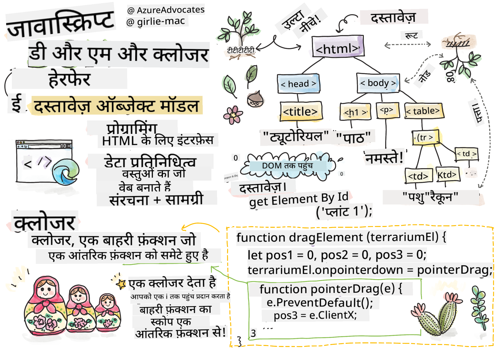
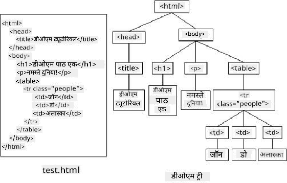
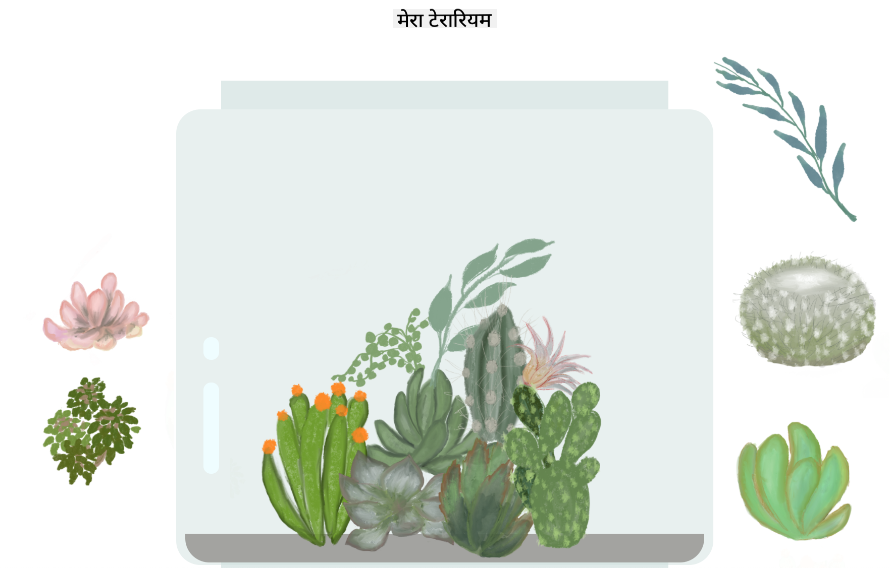

<!--
CO_OP_TRANSLATOR_METADATA:
{
  "original_hash": "61c14b27044861e5e69db35dd52c4403",
  "translation_date": "2025-08-29T16:01:03+00:00",
  "source_file": "3-terrarium/3-intro-to-DOM-and-closures/README.md",
  "language_code": "hi"
}
-->
# टेरारियम प्रोजेक्ट भाग 3: DOM मैनिपुलेशन और एक क्लोजर


> स्केच नोट [Tomomi Imura](https://twitter.com/girlie_mac) द्वारा

## प्री-लेक्चर क्विज़

[प्री-लेक्चर क्विज़](https://ff-quizzes.netlify.app/web/quiz/19)

### परिचय

DOM, या "डॉक्यूमेंट ऑब्जेक्ट मॉडल" को मैनिपुलेट करना वेब विकास का एक महत्वपूर्ण पहलू है। [MDN](https://developer.mozilla.org/docs/Web/API/Document_Object_Model/Introduction) के अनुसार, "डॉक्यूमेंट ऑब्जेक्ट मॉडल (DOM) वेब पर एक डॉक्यूमेंट की संरचना और सामग्री को बनाने वाले ऑब्जेक्ट्स का डेटा प्रतिनिधित्व है।" वेब पर DOM मैनिपुलेशन से जुड़ी चुनौतियाँ अक्सर डेवलपर्स को जावास्क्रिप्ट फ्रेमवर्क का उपयोग करने के लिए प्रेरित करती हैं, लेकिन हम इसे वैनिला जावास्क्रिप्ट के साथ प्रबंधित करेंगे!

इसके अलावा, इस पाठ में [जावास्क्रिप्ट क्लोजर](https://developer.mozilla.org/docs/Web/JavaScript/Closures) का विचार पेश किया जाएगा, जिसे आप इस तरह समझ सकते हैं: एक ऐसा फ़ंक्शन जो दूसरे फ़ंक्शन के भीतर होता है, जिससे आंतरिक फ़ंक्शन बाहरी फ़ंक्शन के स्कोप तक पहुंच सकता है।

> जावास्क्रिप्ट क्लोजर एक व्यापक और जटिल विषय है। इस पाठ में हम केवल बुनियादी विचार को छूएंगे कि इस टेरारियम के कोड में आपको एक क्लोजर मिलेगा: एक आंतरिक फ़ंक्शन और एक बाहरी फ़ंक्शन, जो इस तरह से बनाए गए हैं कि आंतरिक फ़ंक्शन बाहरी फ़ंक्शन के स्कोप तक पहुंच सके। इस पर अधिक जानकारी के लिए [विस्तृत डाक्यूमेंटेशन](https://developer.mozilla.org/docs/Web/JavaScript/Closures) देखें।

हम DOM को मैनिपुलेट करने के लिए एक क्लोजर का उपयोग करेंगे।

DOM को एक पेड़ के रूप में सोचें, जो यह दर्शाता है कि एक वेब पेज डॉक्यूमेंट को कितने तरीकों से मैनिपुलेट किया जा सकता है। विभिन्न API (एप्लिकेशन प्रोग्राम इंटरफेस) लिखे गए हैं ताकि प्रोग्रामर अपनी पसंद की प्रोग्रामिंग भाषा का उपयोग करके DOM तक पहुंच सकें और इसे संपादित, बदल, पुनर्व्यवस्थित और अन्य तरीकों से प्रबंधित कर सकें।



> DOM और उससे जुड़े HTML मार्कअप का एक प्रतिनिधित्व। [Olfa Nasraoui](https://www.researchgate.net/publication/221417012_Profile-Based_Focused_Crawler_for_Social_Media-Sharing_Websites) से

इस पाठ में, हम अपने इंटरैक्टिव टेरारियम प्रोजेक्ट को पूरा करेंगे, जिसमें जावास्क्रिप्ट का उपयोग करके उपयोगकर्ता को पेज पर पौधों को मैनिपुलेट करने की अनुमति दी जाएगी।

### पूर्वापेक्षा

आपके पास टेरारियम के लिए HTML और CSS तैयार होना चाहिए। इस पाठ के अंत तक, आप पौधों को टेरारियम में खींचने और बाहर निकालने में सक्षम होंगे।

### कार्य

अपने टेरारियम फ़ोल्डर में एक नई फ़ाइल बनाएं जिसका नाम `script.js` हो। इस फ़ाइल को `<head>` सेक्शन में इंपोर्ट करें:

```html
	<script src="./script.js" defer></script>
```

> नोट: HTML फ़ाइल को पूरी तरह से लोड होने के बाद ही जावास्क्रिप्ट को निष्पादित करने की अनुमति देने के लिए `defer` का उपयोग करें। आप `async` एट्रिब्यूट का भी उपयोग कर सकते हैं, जो स्क्रिप्ट को HTML फ़ाइल के पार्सिंग के दौरान निष्पादित करने की अनुमति देता है, लेकिन हमारे मामले में, यह महत्वपूर्ण है कि ड्रैग स्क्रिप्ट को निष्पादित करने से पहले HTML तत्व पूरी तरह से उपलब्ध हों।
---

## DOM तत्व

सबसे पहले, आपको DOM में उन तत्वों के संदर्भ बनाने की आवश्यकता है जिन्हें आप मैनिपुलेट करना चाहते हैं। हमारे मामले में, ये 14 पौधे हैं जो वर्तमान में साइड बार में प्रतीक्षा कर रहे हैं।

### कार्य

```html
dragElement(document.getElementById('plant1'));
dragElement(document.getElementById('plant2'));
dragElement(document.getElementById('plant3'));
dragElement(document.getElementById('plant4'));
dragElement(document.getElementById('plant5'));
dragElement(document.getElementById('plant6'));
dragElement(document.getElementById('plant7'));
dragElement(document.getElementById('plant8'));
dragElement(document.getElementById('plant9'));
dragElement(document.getElementById('plant10'));
dragElement(document.getElementById('plant11'));
dragElement(document.getElementById('plant12'));
dragElement(document.getElementById('plant13'));
dragElement(document.getElementById('plant14'));
```

यहाँ क्या हो रहा है? आप डॉक्यूमेंट का संदर्भ ले रहे हैं और उसके DOM में एक विशेष Id वाले तत्व को खोज रहे हैं। याद रखें कि HTML के पहले पाठ में आपने प्रत्येक पौधे की छवि को एक व्यक्तिगत Id (`id="plant1"`) दिया था? अब आप उस प्रयास का उपयोग करेंगे। प्रत्येक तत्व की पहचान करने के बाद, आप उस आइटम को `dragElement` नामक एक फ़ंक्शन में पास करते हैं, जिसे आप थोड़ी देर में बनाएंगे। इस प्रकार, HTML में तत्व अब ड्रैग-इनेबल्ड हो गया है, या जल्द ही हो जाएगा।

✅ हम तत्वों को Id द्वारा क्यों संदर्भित करते हैं? CSS क्लास द्वारा क्यों नहीं? इस प्रश्न का उत्तर देने के लिए आप CSS पर पिछले पाठ का संदर्भ ले सकते हैं।

---

## क्लोजर

अब आप `dragElement` क्लोजर बनाने के लिए तैयार हैं, जो एक बाहरी फ़ंक्शन है जो एक या अधिक आंतरिक फ़ंक्शन को घेरता है (हमारे मामले में, तीन होंगे)।

क्लोजर तब उपयोगी होते हैं जब एक या अधिक फ़ंक्शन को बाहरी फ़ंक्शन के स्कोप तक पहुंचने की आवश्यकता होती है। यहाँ एक उदाहरण है:

```javascript
function displayCandy(){
	let candy = ['jellybeans'];
	function addCandy(candyType) {
		candy.push(candyType)
	}
	addCandy('gumdrops');
}
displayCandy();
console.log(candy)
```

इस उदाहरण में, `displayCandy` फ़ंक्शन एक ऐसे फ़ंक्शन को घेरता है जो एक मौजूदा ऐरे में एक नई कैंडी प्रकार को पुश करता है। यदि आप इस कोड को चलाते हैं, तो `candy` ऐरे अनिर्धारित होगा, क्योंकि यह एक स्थानीय वेरिएबल है (क्लोजर के लिए स्थानीय)।

✅ आप `candy` ऐरे को कैसे सुलभ बना सकते हैं? इसे क्लोजर के बाहर ले जाकर देखें। इस तरह, ऐरे ग्लोबल हो जाएगा, बजाय इसके कि यह केवल क्लोजर के स्थानीय स्कोप तक सीमित रहे।

### कार्य

`script.js` में तत्व घोषणाओं के नीचे एक फ़ंक्शन बनाएं:

```javascript
function dragElement(terrariumElement) {
	//set 4 positions for positioning on the screen
	let pos1 = 0,
		pos2 = 0,
		pos3 = 0,
		pos4 = 0;
	terrariumElement.onpointerdown = pointerDrag;
}
```

`dragElement` अपने `terrariumElement` ऑब्जेक्ट को स्क्रिप्ट के शीर्ष पर घोषणाओं से प्राप्त करता है। फिर, आप उस फ़ंक्शन में पास किए गए ऑब्जेक्ट के लिए कुछ स्थानीय पोजीशन को `0` पर सेट करते हैं। ये स्थानीय वेरिएबल हैं जिन्हें आप प्रत्येक तत्व के लिए मैनिपुलेट करेंगे क्योंकि आप क्लोजर के भीतर ड्रैग और ड्रॉप कार्यक्षमता जोड़ते हैं। टेरारियम इन खींचे गए तत्वों से भरा जाएगा, इसलिए एप्लिकेशन को यह ट्रैक रखना होगा कि उन्हें कहाँ रखा गया है।

इसके अलावा, `terrariumElement` जिसे इस फ़ंक्शन में पास किया गया है, को एक `pointerdown` इवेंट सौंपा गया है, जो [वेब API](https://developer.mozilla.org/docs/Web/API) का हिस्सा है, जिसे DOM प्रबंधन में मदद के लिए डिज़ाइन किया गया है। `onpointerdown` तब फायर होता है जब कोई बटन दबाया जाता है, या हमारे मामले में, जब एक ड्रैग करने योग्य तत्व को छुआ जाता है। यह इवेंट हैंडलर [वेब और मोबाइल ब्राउज़रों](https://caniuse.com/?search=onpointerdown) दोनों पर काम करता है, कुछ अपवादों के साथ।

✅ [इवेंट हैंडलर `onclick`](https://developer.mozilla.org/docs/Web/API/GlobalEventHandlers/onclick) में क्रॉस-ब्राउज़र समर्थन अधिक है; आप इसे यहाँ क्यों नहीं उपयोग करेंगे? उस सटीक स्क्रीन इंटरैक्शन के बारे में सोचें जिसे आप यहाँ बनाना चाहते हैं।

---

## Pointerdrag फ़ंक्शन

`terrariumElement` को इधर-उधर खींचने के लिए तैयार है; जब `onpointerdown` इवेंट फायर होता है, तो `pointerDrag` फ़ंक्शन को बुलाया जाता है। इस लाइन के ठीक नीचे वह फ़ंक्शन जोड़ें: `terrariumElement.onpointerdown = pointerDrag;`:

### कार्य 

```javascript
function pointerDrag(e) {
	e.preventDefault();
	console.log(e);
	pos3 = e.clientX;
	pos4 = e.clientY;
}
```

कई चीजें होती हैं। सबसे पहले, आप `e.preventDefault();` का उपयोग करके `pointerdown` पर सामान्य रूप से होने वाली डिफ़ॉल्ट घटनाओं को रोकते हैं। इस तरह आपके पास इंटरफ़ेस के व्यवहार पर अधिक नियंत्रण होता है।

> जब आप स्क्रिप्ट फ़ाइल को पूरी तरह से बना लें, तो इस लाइन पर वापस आएं और इसे बिना `e.preventDefault()` के आज़माएं - क्या होता है?

दूसरा, ब्राउज़र विंडो में `index.html` खोलें और इंटरफ़ेस का निरीक्षण करें। जब आप किसी पौधे पर क्लिक करते हैं, तो आप देख सकते हैं कि 'e' इवेंट कैसे कैप्चर किया गया है। इवेंट में कितनी जानकारी एकत्र की जाती है, यह देखने के लिए इवेंट को गहराई से देखें!  

इसके बाद, ध्यान दें कि स्थानीय वेरिएबल `pos3` और `pos4` को `e.clientX` पर कैसे सेट किया गया है। आप निरीक्षण पैन में `e` मान पा सकते हैं। ये मान उस क्षण पौधे के x और y निर्देशांक को कैप्चर करते हैं जब आप उस पर क्लिक या टच करते हैं। जब आप पौधों को क्लिक और ड्रैग करते हैं, तो उनके व्यवहार पर बारीकी से नियंत्रण रखने के लिए आपको उनके निर्देशांक का ट्रैक रखना होगा।

✅ क्या यह स्पष्ट हो रहा है कि यह पूरा ऐप एक बड़े क्लोजर के साथ क्यों बनाया गया है? यदि ऐसा नहीं होता, तो आप 14 ड्रैग करने योग्य पौधों में से प्रत्येक के लिए स्कोप को कैसे बनाए रखते?

प्रारंभिक फ़ंक्शन को पूरा करने के लिए `pos4 = e.clientY` के नीचे दो और पॉइंटर इवेंट मैनिपुलेशन जोड़ें:

```html
document.onpointermove = elementDrag;
document.onpointerup = stopElementDrag;
```
अब आप यह संकेत दे रहे हैं कि आप पौधे को पॉइंटर के साथ खींचना चाहते हैं और जब आप पौधे को डीसिलेक्ट करते हैं तो ड्रैगिंग इशारा बंद हो जाता है। `onpointermove` और `onpointerup` उसी API का हिस्सा हैं जैसे `onpointerdown`। इंटरफ़ेस अब त्रुटियाँ फेंकेगा क्योंकि आपने अभी तक `elementDrag` और `stopElementDrag` फ़ंक्शन को परिभाषित नहीं किया है, इसलिए उन्हें अगला बनाएं।

## elementDrag और stopElementDrag फ़ंक्शन

आप अपने क्लोजर को दो और आंतरिक फ़ंक्शन जोड़कर पूरा करेंगे जो यह संभालेंगे कि जब आप पौधे को खींचते हैं और खींचना बंद करते हैं तो क्या होता है। आप जो व्यवहार चाहते हैं वह यह है कि आप किसी भी समय किसी भी पौधे को खींच सकें और उसे स्क्रीन पर कहीं भी रख सकें। यह इंटरफ़ेस काफी अनुकूल है (उदाहरण के लिए कोई ड्रॉप ज़ोन नहीं है) ताकि आप पौधों को जोड़कर, हटाकर और पुनः स्थिति देकर अपने टेरारियम को अपनी पसंद के अनुसार डिज़ाइन कर सकें।

### कार्य

`pointerDrag` के समापन कर्ली ब्रैकेट के ठीक बाद `elementDrag` फ़ंक्शन जोड़ें:

```javascript
function elementDrag(e) {
	pos1 = pos3 - e.clientX;
	pos2 = pos4 - e.clientY;
	pos3 = e.clientX;
	pos4 = e.clientY;
	console.log(pos1, pos2, pos3, pos4);
	terrariumElement.style.top = terrariumElement.offsetTop - pos2 + 'px';
	terrariumElement.style.left = terrariumElement.offsetLeft - pos1 + 'px';
}
```
इस फ़ंक्शन में, आप उन प्रारंभिक पोजीशन 1-4 को बहुत संपादित करते हैं जिन्हें आपने बाहरी फ़ंक्शन में स्थानीय वेरिएबल के रूप में सेट किया था। यहाँ क्या हो रहा है?

जब आप खींचते हैं, तो आप `pos1` को फिर से असाइन करते हैं, इसे `pos3` (जिसे आपने पहले `e.clientX` के रूप में सेट किया था) के बराबर बनाकर, वर्तमान `e.clientX` मान से घटाते हैं। आप `pos2` पर भी ऐसा ही ऑपरेशन करते हैं। फिर, आप `pos3` और `pos4` को तत्व के नए X और Y निर्देशांक पर रीसेट करते हैं। आप इन परिवर्तनों को कंसोल में खींचते समय देख सकते हैं। फिर, आप पौधे की css शैली को उसके नए पोजीशन के आधार पर सेट करते हैं, `pos1` और `pos2` की नई पोजीशन की तुलना करके पौधे के शीर्ष और बाएँ X और Y निर्देशांक की गणना करते हैं।

> `offsetTop` और `offsetLeft` CSS गुण हैं जो किसी तत्व की स्थिति को उसके पैरेंट के आधार पर सेट करते हैं; उसका पैरेंट कोई भी तत्व हो सकता है जो `static` के रूप में पोजिशन नहीं किया गया हो। 

पोजिशनिंग की इस पुनर्गणना से आपको टेरारियम और उसके पौधों के व्यवहार को बारीकी से ट्यून करने की अनुमति मिलती है।

### कार्य 

इंटरफ़ेस को पूरा करने का अंतिम कार्य `stopElementDrag` फ़ंक्शन को `elementDrag` के समापन कर्ली ब्रैकेट के बाद जोड़ना है:

```javascript
function stopElementDrag() {
	document.onpointerup = null;
	document.onpointermove = null;
}
```

यह छोटा फ़ंक्शन `onpointerup` और `onpointermove` इवेंट को रीसेट करता है ताकि आप या तो अपने पौधे की प्रगति को फिर से शुरू कर सकें या एक नया पौधा खींचना शुरू कर सकें।

✅ क्या होता है यदि आप इन इवेंट्स को null पर सेट नहीं करते?

अब आपने अपना प्रोजेक्ट पूरा कर लिया है!

🥇बधाई हो! आपने अपना सुंदर टेरारियम पूरा कर लिया है। 

---

## 🚀चुनौती

अपने क्लोजर में एक नया इवेंट हैंडलर जोड़ें ताकि पौधों के साथ कुछ और किया जा सके; उदाहरण के लिए, किसी पौधे को सामने लाने के लिए उस पर डबल-क्लिक करें। रचनात्मक बनें!

## पोस्ट-लेक्चर क्विज़

[पोस्ट-लेक्चर क्विज़](https://ff-quizzes.netlify.app/web/quiz/20)

## समीक्षा और स्व-अध्ययन

स्क्रीन पर तत्वों को खींचना तुच्छ लग सकता है, लेकिन इसे करने के कई तरीके हैं और कई समस्याएँ हो सकती हैं, यह इस बात पर निर्भर करता है कि आप किस प्रकार का प्रभाव चाहते हैं। वास्तव में, एक पूरा [ड्रैग और ड्रॉप API](https://developer.mozilla.org/docs/Web/API/HTML_Drag_and_Drop_API) है जिसे आप आज़मा सकते हैं। हमने इस मॉड्यूल में इसका उपयोग नहीं किया क्योंकि हम जो प्रभाव चाहते थे वह थोड़ा अलग था, लेकिन इसे अपने प्रोजेक्ट पर आज़माएँ और देखें कि आप क्या हासिल कर सकते हैं।

पॉइंटर इवेंट्स पर अधिक जानकारी [W3C डॉक्स](https://www.w3.org/TR/pointerevents1/) और [MDN वेब डॉक्स](https://developer.mozilla.org/docs/Web/API/Pointer_events) पर पाएं।

हमेशा ब्राउज़र क्षमताओं की जाँच [CanIUse.com](https://caniuse.com/) का उपयोग करके करें।

## असाइनमेंट

[DOM के साथ थोड़ा और काम करें](assignment.md)

---

**अस्वीकरण**:  
यह दस्तावेज़ AI अनुवाद सेवा [Co-op Translator](https://github.com/Azure/co-op-translator) का उपयोग करके अनुवादित किया गया है। जबकि हम सटीकता सुनिश्चित करने का प्रयास करते हैं, कृपया ध्यान दें कि स्वचालित अनुवाद में त्रुटियां या अशुद्धियां हो सकती हैं। मूल भाषा में उपलब्ध मूल दस्तावेज़ को प्रामाणिक स्रोत माना जाना चाहिए। महत्वपूर्ण जानकारी के लिए, पेशेवर मानव अनुवाद की सिफारिश की जाती है। इस अनुवाद के उपयोग से उत्पन्न किसी भी गलतफहमी या गलत व्याख्या के लिए हम जिम्मेदार नहीं हैं।