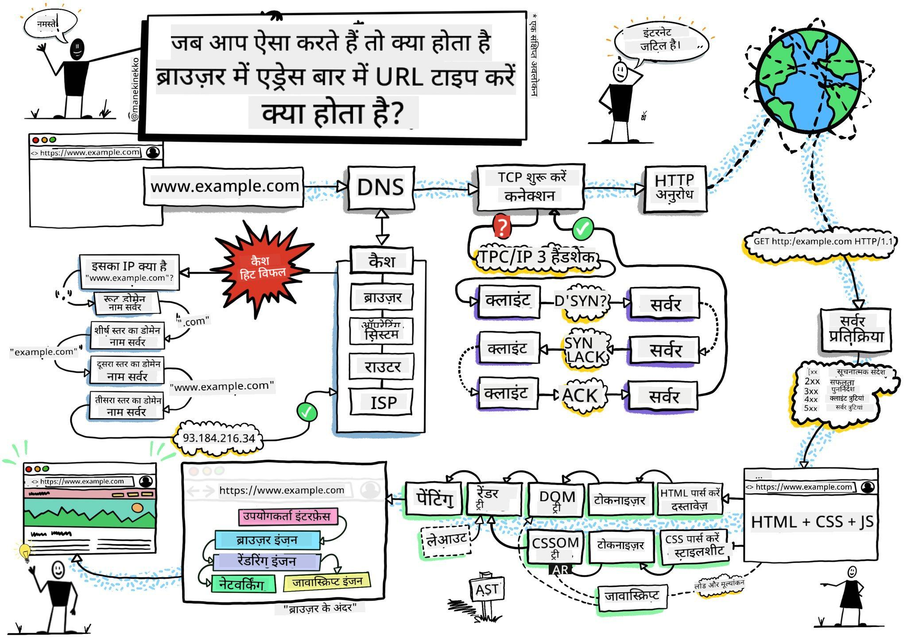
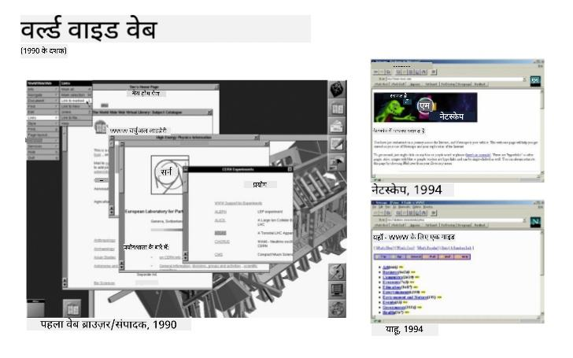
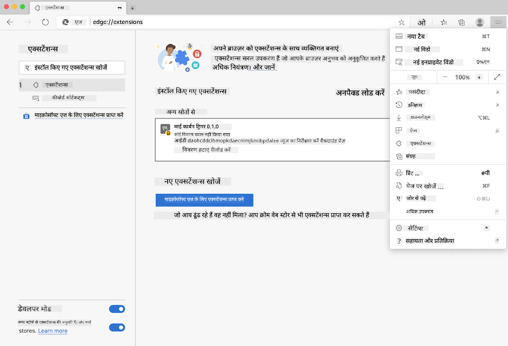
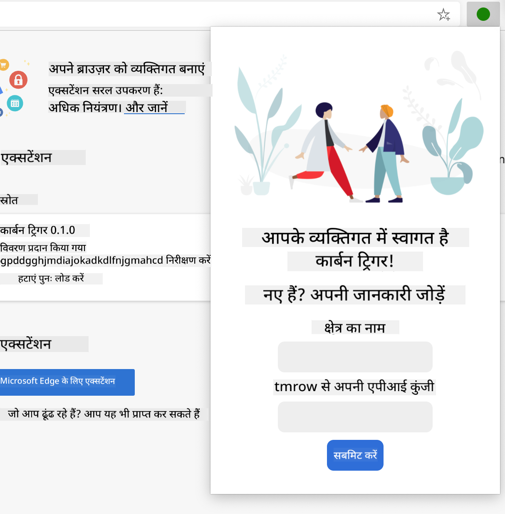
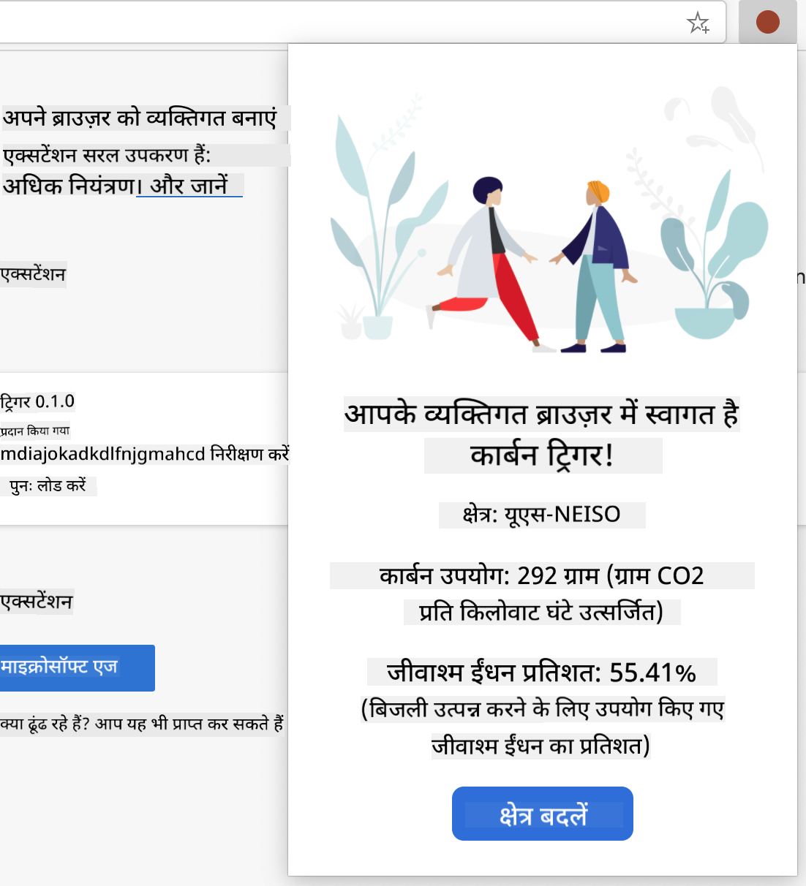

<!--
CO_OP_TRANSLATOR_METADATA:
{
  "original_hash": "2326d04e194a10aa760b51f5e5a1f61d",
  "translation_date": "2025-08-29T15:52:15+00:00",
  "source_file": "5-browser-extension/1-about-browsers/README.md",
  "language_code": "hi"
}
-->
# ब्राउज़र एक्सटेंशन प्रोजेक्ट भाग 1: ब्राउज़र्स के बारे में सबकुछ


> स्केच नोट [Wassim Chegham](https://dev.to/wassimchegham/ever-wondered-what-happens-when-you-type-in-a-url-in-an-address-bar-in-a-browser-3dob) द्वारा

## प्री-लेक्चर क्विज़

[प्री-लेक्चर क्विज़](https://ff-quizzes.netlify.app/web/quiz/23)

### परिचय

ब्राउज़र एक्सटेंशन ब्राउज़र में अतिरिक्त कार्यक्षमता जोड़ते हैं। लेकिन इसे बनाने से पहले, आपको यह समझना चाहिए कि ब्राउज़र कैसे काम करते हैं।

### ब्राउज़र के बारे में

इस पाठ श्रृंखला में, आप एक ब्राउज़र एक्सटेंशन बनाना सीखेंगे जो Chrome, Firefox और Edge ब्राउज़र्स पर काम करेगा। इस भाग में, आप जानेंगे कि ब्राउज़र कैसे काम करते हैं और ब्राउज़र एक्सटेंशन के तत्वों को तैयार करेंगे।

लेकिन ब्राउज़र वास्तव में क्या है? यह एक सॉफ़्टवेयर एप्लिकेशन है जो उपयोगकर्ता को सर्वर से सामग्री एक्सेस करने और उसे वेब पेजों पर प्रदर्शित करने की अनुमति देता है।

✅ थोड़ा इतिहास: पहला ब्राउज़र 'WorldWideWeb' था और इसे 1990 में सर टिमोथी बर्नर्स-ली द्वारा बनाया गया था।


> कुछ प्रारंभिक ब्राउज़र, [Karen McGrane](https://www.slideshare.net/KMcGrane/week-4-ixd-history-personal-computing) के माध्यम से

जब कोई उपयोगकर्ता URL (Uniform Resource Locator) पता का उपयोग करके इंटरनेट से जुड़ता है, आमतौर पर Hypertext Transfer Protocol के माध्यम से `http` या `https` पते का उपयोग करते हुए, ब्राउज़र वेब सर्वर से संपर्क करता है और वेब पेज प्राप्त करता है।

इस समय, ब्राउज़र का रेंडरिंग इंजन इसे उपयोगकर्ता के डिवाइस पर प्रदर्शित करता है, जो मोबाइल फोन, डेस्कटॉप या लैपटॉप हो सकता है।

ब्राउज़र में सामग्री को कैश करने की क्षमता भी होती है ताकि इसे हर बार सर्वर से पुनः प्राप्त न करना पड़े। वे उपयोगकर्ता की ब्राउज़िंग गतिविधि का इतिहास रिकॉर्ड कर सकते हैं, 'कुकीज़' स्टोर कर सकते हैं, जो छोटे डेटा बिट्स होते हैं जो उपयोगकर्ता की गतिविधि को स्टोर करने के लिए उपयोग किए जाते हैं, और भी बहुत कुछ।

एक बहुत महत्वपूर्ण बात जो ब्राउज़र्स के बारे में याद रखनी चाहिए वह यह है कि वे सभी एक जैसे नहीं होते! प्रत्येक ब्राउज़र की अपनी ताकत और कमजोरियां होती हैं, और एक पेशेवर वेब डेवलपर को यह समझना चाहिए कि वेब पेजों को क्रॉस-ब्राउज़र पर अच्छा प्रदर्शन कैसे कराया जाए। इसमें छोटे व्यूपोर्ट्स जैसे मोबाइल फोन के, और ऑफलाइन उपयोगकर्ता को संभालना शामिल है।

एक बहुत उपयोगी वेबसाइट जिसे आप शायद अपने पसंदीदा ब्राउज़र में बुकमार्क करना चाहेंगे वह है [caniuse.com](https://www.caniuse.com)। जब आप वेब पेज बना रहे होते हैं, तो उपयोगकर्ताओं को बेहतर समर्थन देने के लिए caniuse की समर्थित तकनीकों की सूची का उपयोग करना बहुत मददगार होता है।

✅ आप कैसे पता लगा सकते हैं कि आपके वेब साइट के उपयोगकर्ता आधार में कौन से ब्राउज़र सबसे लोकप्रिय हैं? अपने एनालिटिक्स की जांच करें - आप अपने वेब विकास प्रक्रिया के हिस्से के रूप में विभिन्न एनालिटिक्स पैकेज इंस्टॉल कर सकते हैं, और वे आपको बताएंगे कि विभिन्न लोकप्रिय ब्राउज़र्स में कौन से ब्राउज़र सबसे अधिक उपयोग किए जाते हैं।

## ब्राउज़र एक्सटेंशन

आप ब्राउज़र एक्सटेंशन क्यों बनाना चाहेंगे? यह एक उपयोगी चीज़ है जिसे आप अपने ब्राउज़र से जोड़ सकते हैं जब आपको बार-बार किए जाने वाले कार्यों तक त्वरित पहुंच की आवश्यकता होती है। उदाहरण के लिए, यदि आप खुद को विभिन्न वेब पेजों पर रंगों की जांच करते हुए पाते हैं, तो आप एक कलर-पिकर ब्राउज़र एक्सटेंशन इंस्टॉल कर सकते हैं। यदि आपको पासवर्ड याद रखने में परेशानी होती है, तो आप पासवर्ड-मैनेजमेंट ब्राउज़र एक्सटेंशन का उपयोग कर सकते हैं।

ब्राउज़र एक्सटेंशन बनाना मजेदार भी होता है। वे सीमित संख्या में कार्यों को प्रबंधित करते हैं जिन्हें वे अच्छी तरह से करते हैं।

✅ आपके पसंदीदा ब्राउज़र एक्सटेंशन कौन से हैं? वे कौन से कार्य करते हैं?

### एक्सटेंशन इंस्टॉल करना

बनाने से पहले, ब्राउज़र एक्सटेंशन को बनाने और डिप्लॉय करने की प्रक्रिया पर एक नज़र डालें। जबकि प्रत्येक ब्राउज़र इस कार्य को प्रबंधित करने में थोड़ा भिन्न होता है, Chrome और Firefox पर प्रक्रिया Edge के इस उदाहरण के समान है:



> नोट: सुनिश्चित करें कि डेवलपर मोड चालू करें और अन्य स्टोर्स से एक्सटेंशन की अनुमति दें।

मूल रूप से, प्रक्रिया इस प्रकार होगी:

- `npm run build` का उपयोग करके अपना एक्सटेंशन बनाएं  
- ब्राउज़र में "Settings and more" बटन (ऊपरी दाएं कोने में `...` आइकन) का उपयोग करके एक्सटेंशन पैन पर जाएं  
- यदि यह नया इंस्टॉलेशन है, तो `/dist` बिल्ड फ़ोल्डर से नया एक्सटेंशन अपलोड करने के लिए `load unpacked` चुनें  
- या, पहले से इंस्टॉल किए गए एक्सटेंशन को फिर से लोड करने के लिए `reload` पर क्लिक करें  

✅ ये निर्देश उन एक्सटेंशनों के लिए हैं जिन्हें आप स्वयं बनाते हैं; उन एक्सटेंशनों को इंस्टॉल करने के लिए जो प्रत्येक ब्राउज़र से जुड़े ब्राउज़र एक्सटेंशन स्टोर में जारी किए गए हैं, आपको उन [स्टोर्स](https://microsoftedge.microsoft.com/addons/Microsoft-Edge-Extensions-Home) पर जाना चाहिए और अपनी पसंद का एक्सटेंशन इंस्टॉल करना चाहिए।

### शुरुआत करें

आप एक ब्राउज़र एक्सटेंशन बनाने जा रहे हैं जो आपके क्षेत्र का कार्बन फुटप्रिंट दिखाएगा, आपके क्षेत्र की ऊर्जा खपत और ऊर्जा के स्रोत को प्रदर्शित करेगा। एक्सटेंशन में एक फॉर्म होगा जो API कुंजी एकत्र करेगा ताकि आप CO2 Signal की API तक पहुंच सकें।

**आपको चाहिए:**

- [एक API कुंजी](https://www.co2signal.com/); इस पेज पर अपना ईमेल दर्ज करें और आपको एक कुंजी भेजी जाएगी  
- [आपके क्षेत्र का कोड](http://api.electricitymap.org/v3/zones) जो [Electricity Map](https://www.electricitymap.org/map) से संबंधित है (उदाहरण के लिए, Boston में मैं 'US-NEISO' का उपयोग करता हूं)।  
- [स्टार्टर कोड](../../../../5-browser-extension/start)। `start` फ़ोल्डर डाउनलोड करें; आप इस फ़ोल्डर में कोड पूरा करेंगे।  
- [NPM](https://www.npmjs.com) - NPM एक पैकेज प्रबंधन टूल है; इसे स्थानीय रूप से इंस्टॉल करें और आपके `package.json` फ़ाइल में सूचीबद्ध पैकेज आपके वेब एसेट द्वारा उपयोग के लिए इंस्टॉल किए जाएंगे  

✅ पैकेज प्रबंधन के बारे में अधिक जानें इस [उत्कृष्ट Learn module](https://docs.microsoft.com/learn/modules/create-nodejs-project-dependencies/?WT.mc_id=academic-77807-sagibbon) में

कोडबेस को देखने के लिए एक मिनट लें:

dist  
    -|manifest.json (डिफॉल्ट्स यहां सेट करें)  
    -|index.html (फ्रंट-एंड HTML मार्कअप यहां)  
    -|background.js (बैकग्राउंड JS यहां)  
    -|main.js (बिल्ट JS)  
src  
    -|index.js (आपका JS कोड यहां जाएगा)  

✅ एक बार जब आपके पास API कुंजी और क्षेत्र कोड तैयार हो जाए, तो उन्हें भविष्य में उपयोग के लिए किसी नोट में स्टोर करें।

### एक्सटेंशन के लिए HTML बनाएं

इस एक्सटेंशन में दो दृश्य हैं। एक API कुंजी और क्षेत्र कोड एकत्र करने के लिए:



और दूसरा क्षेत्र की कार्बन खपत प्रदर्शित करने के लिए:



आइए फॉर्म के लिए HTML बनाकर और इसे CSS के साथ स्टाइल करके शुरू करें।

`/dist` फ़ोल्डर में, आप एक फॉर्म और एक परिणाम क्षेत्र बनाएंगे। `index.html` फ़ाइल में, निर्दिष्ट फॉर्म क्षेत्र को भरें:

```HTML
<form class="form-data" autocomplete="on">
	<div>
		<h2>New? Add your Information</h2>
	</div>
	<div>
		<label for="region">Region Name</label>
		<input type="text" id="region" required class="region-name" />
	</div>
	<div>
		<label for="api">Your API Key from tmrow</label>
		<input type="text" id="api" required class="api-key" />
	</div>
	<button class="search-btn">Submit</button>
</form>	
```  
यह वह फॉर्म है जहां आपकी सहेजी गई जानकारी इनपुट की जाएगी और स्थानीय स्टोरेज में सहेजी जाएगी।

इसके बाद, परिणाम क्षेत्र बनाएं; अंतिम फॉर्म टैग के नीचे कुछ divs जोड़ें:

```HTML
<div class="result">
	<div class="loading">loading...</div>
	<div class="errors"></div>
	<div class="data"></div>
	<div class="result-container">
		<p><strong>Region: </strong><span class="my-region"></span></p>
		<p><strong>Carbon Usage: </strong><span class="carbon-usage"></span></p>
		<p><strong>Fossil Fuel Percentage: </strong><span class="fossil-fuel"></span></p>
	</div>
	<button class="clear-btn">Change region</button>
</div>
```  
इस समय, आप एक बिल्ड आज़मा सकते हैं। सुनिश्चित करें कि इस एक्सटेंशन के पैकेज डिपेंडेंसीज़ इंस्टॉल करें:

```
npm install
```  

यह कमांड npm, Node Package Manager का उपयोग करेगा, जो आपके एक्सटेंशन के बिल्ड प्रक्रिया के लिए webpack इंस्टॉल करेगा। आप इस प्रक्रिया का आउटपुट `/dist/main.js` में देख सकते हैं - आप देखेंगे कि कोड बंडल किया गया है।

फिलहाल, एक्सटेंशन को बिल्ड करना चाहिए और यदि आप इसे Edge में एक्सटेंशन के रूप में डिप्लॉय करते हैं, तो आपको एक फॉर्म साफ़-सुथरा प्रदर्शित होता दिखाई देगा।

बधाई हो, आपने ब्राउज़र एक्सटेंशन बनाने की दिशा में पहला कदम उठाया है। अगले पाठों में, आप इसे अधिक कार्यात्मक और उपयोगी बनाएंगे।

---

## 🚀 चुनौती

ब्राउज़र एक्सटेंशन स्टोर पर एक नज़र डालें और अपने ब्राउज़र में एक इंस्टॉल करें। आप इसकी फाइलों को दिलचस्प तरीकों से जांच सकते हैं। आप क्या खोजते हैं?

## पोस्ट-लेक्चर क्विज़

[पोस्ट-लेक्चर क्विज़](https://ff-quizzes.netlify.app/web/quiz/24)

## समीक्षा और स्व-अध्ययन

इस पाठ में आपने वेब ब्राउज़र के इतिहास के बारे में थोड़ा सीखा; इस अवसर का उपयोग करके जानें कि वर्ल्ड वाइड वेब के आविष्कारकों ने इसके उपयोग की कल्पना कैसे की थी। इसके इतिहास के बारे में अधिक पढ़ने के लिए कुछ उपयोगी साइट्स हैं:

[वेब ब्राउज़र्स का इतिहास](https://www.mozilla.org/firefox/browsers/browser-history/)

[वेब का इतिहास](https://webfoundation.org/about/vision/history-of-the-web/)

[टिम बर्नर्स-ली के साथ एक साक्षात्कार](https://www.theguardian.com/technology/2019/mar/12/tim-berners-lee-on-30-years-of-the-web-if-we-dream-a-little-we-can-get-the-web-we-want)

## असाइनमेंट 

[अपने एक्सटेंशन को फिर से स्टाइल करें](assignment.md)

---

**अस्वीकरण**:  
यह दस्तावेज़ AI अनुवाद सेवा [Co-op Translator](https://github.com/Azure/co-op-translator) का उपयोग करके अनुवादित किया गया है। जबकि हम सटीकता सुनिश्चित करने का प्रयास करते हैं, कृपया ध्यान दें कि स्वचालित अनुवाद में त्रुटियां या अशुद्धियां हो सकती हैं। मूल भाषा में उपलब्ध मूल दस्तावेज़ को प्रामाणिक स्रोत माना जाना चाहिए। महत्वपूर्ण जानकारी के लिए, पेशेवर मानव अनुवाद की सिफारिश की जाती है। इस अनुवाद के उपयोग से उत्पन्न किसी भी गलतफहमी या गलत व्याख्या के लिए हम जिम्मेदार नहीं हैं।