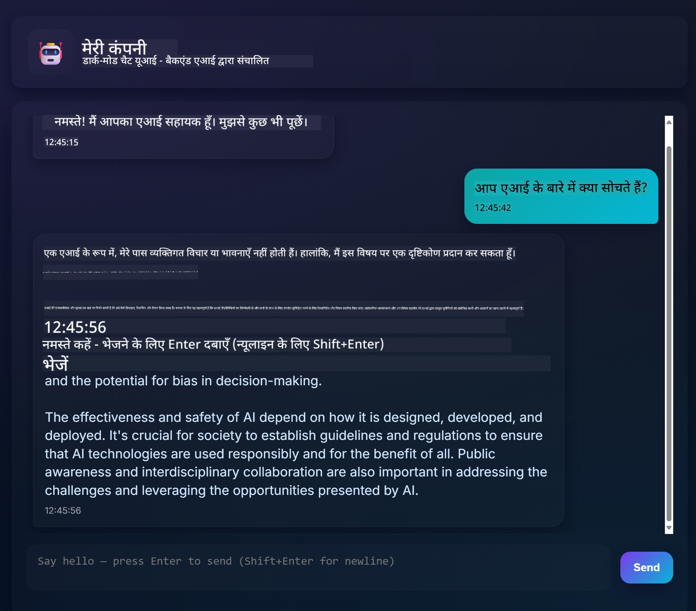
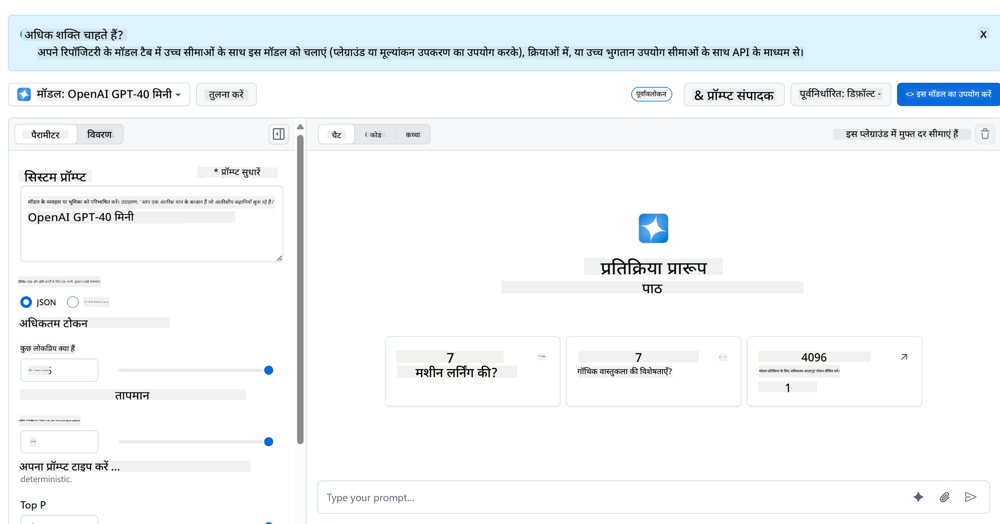
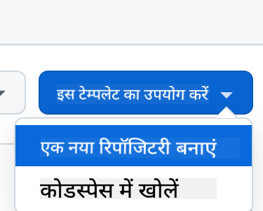
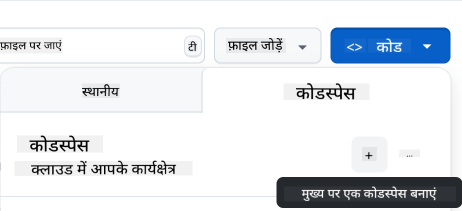

<!--
CO_OP_TRANSLATOR_METADATA:
{
  "original_hash": "11cf36165c243947b6cd85b88cf6faa6",
  "translation_date": "2025-09-01T16:51:26+00:00",
  "source_file": "9-chat-project/README.md",
  "language_code": "hi"
}
-->
# चैट प्रोजेक्ट

यह चैट प्रोजेक्ट दिखाता है कि GitHub Models का उपयोग करके एक चैट असिस्टेंट कैसे बनाया जाए।

यहाँ पर तैयार प्रोजेक्ट ऐसा दिखता है:



कुछ संदर्भ, जनरेटिव AI का उपयोग करके चैट असिस्टेंट बनाना AI के बारे में सीखने का एक शानदार तरीका है। इस पाठ में आप सीखेंगे कि जनरेटिव AI को एक वेब ऐप में कैसे इंटीग्रेट किया जाए। चलिए शुरू करते हैं।

## जनरेटिव AI से कनेक्ट करना

बैकएंड के लिए, हम GitHub Models का उपयोग कर रहे हैं। यह एक शानदार सेवा है जो आपको मुफ्त में AI का उपयोग करने की अनुमति देती है। इसके प्लेग्राउंड पर जाएं और उस कोड को प्राप्त करें जो आपके चुने हुए बैकएंड भाषा के अनुरूप हो। यह [GitHub Models Playground](https://github.com/marketplace/models/azure-openai/gpt-4o-mini/playground) पर ऐसा दिखता है:



जैसा कि हमने कहा, "Code" टैब और अपनी चुनी हुई रनटाइम का चयन करें।


### Python का उपयोग करना

इस मामले में हम Python का चयन करते हैं, जिसका मतलब है कि हम इस कोड को चुनेंगे:

```python
"""Run this model in Python

> pip install openai
"""
import os
from openai import OpenAI

# To authenticate with the model you will need to generate a personal access token (PAT) in your GitHub settings. 
# Create your PAT token by following instructions here: https://docs.github.com/en/authentication/keeping-your-account-and-data-secure/managing-your-personal-access-tokens
client = OpenAI(
    base_url="https://models.github.ai/inference",
    api_key=os.environ["GITHUB_TOKEN"],
)

response = client.chat.completions.create(
    messages=[
        {
            "role": "system",
            "content": "",
        },
        {
            "role": "user",
            "content": "What is the capital of France?",
        }
    ],
    model="openai/gpt-4o-mini",
    temperature=1,
    max_tokens=4096,
    top_p=1
)

print(response.choices[0].message.content)
```

आइए इस कोड को थोड़ा साफ करें ताकि यह पुन: उपयोग योग्य हो जाए:

```python
def call_llm(prompt: str, system_message: str):
    response = client.chat.completions.create(
        messages=[
            {
                "role": "system",
                "content": system_message,
            },
            {
                "role": "user",
                "content": prompt,
            }
        ],
        model="openai/gpt-4o-mini",
        temperature=1,
        max_tokens=4096,
        top_p=1
    )

    return response.choices[0].message.content
```

इस `call_llm` फंक्शन के साथ, अब हम एक प्रॉम्प्ट और एक सिस्टम प्रॉम्प्ट ले सकते हैं और फंक्शन अंततः परिणाम लौटाता है।

### AI असिस्टेंट को कस्टमाइज़ करें

यदि आप AI असिस्टेंट को कस्टमाइज़ करना चाहते हैं, तो आप सिस्टम प्रॉम्प्ट को इस तरह से भरकर उसकी व्यवहार शैली को निर्दिष्ट कर सकते हैं:

```python
call_llm("Tell me about you", "You're Albert Einstein, you only know of things in the time you were alive")
```

## इसे वेब API के माध्यम से एक्सपोज़ करें

बहुत बढ़िया, हमने AI भाग पूरा कर लिया है, अब देखते हैं कि इसे वेब API में कैसे इंटीग्रेट किया जा सकता है। वेब API के लिए, हम Flask का उपयोग कर रहे हैं, लेकिन कोई भी वेब फ्रेमवर्क अच्छा होगा। इसका कोड देखें:

### Python का उपयोग करना

```python
# api.py
from flask import Flask, request, jsonify
from llm import call_llm
from flask_cors import CORS

app = Flask(__name__)
CORS(app)   # *   example.com

@app.route("/", methods=["GET"])
def index():
    return "Welcome to this API. Call POST /hello with 'message': 'my message' as JSON payload"


@app.route("/hello", methods=["POST"])
def hello():
    # get message from request body  { "message": "do this taks for me" }
    data = request.get_json()
    message = data.get("message", "")

    response = call_llm(message, "You are a helpful assistant.")
    return jsonify({
        "response": response
    })

if __name__ == "__main__":
    app.run(host="0.0.0.0", port=5000)
```

यहाँ, हम एक Flask API बनाते हैं और "/" और "/chat" नामक डिफ़ॉल्ट रूट को परिभाषित करते हैं। दूसरा रूट हमारे फ्रंटएंड द्वारा प्रश्नों को पास करने के लिए उपयोग किया जाता है।

*llm.py* को इंटीग्रेट करने के लिए हमें यह करना होगा:

- `call_llm` फंक्शन को इंपोर्ट करें:

   ```python
   from llm import call_llm
   from flask import Flask, request
   ```

- इसे "/chat" रूट से कॉल करें:

   ```python
   @app.route("/hello", methods=["POST"])
   def hello():
      # get message from request body  { "message": "do this taks for me" }
      data = request.get_json()
      message = data.get("message", "")

      response = call_llm(message, "You are a helpful assistant.")
      return jsonify({
         "response": response
      })
   ```

   यहाँ हम इनकमिंग रिक्वेस्ट को पार्स करते हैं ताकि JSON बॉडी से `message` प्रॉपर्टी को प्राप्त किया जा सके। इसके बाद हम LLM को इस कॉल के साथ कॉल करते हैं:

   ```python
   response = call_llm(message, "You are a helpful assistant")

   # return the response as JSON
   return jsonify({
      "response": response 
   })
   ```

बहुत बढ़िया, अब हमने जो चाहिए था वह पूरा कर लिया।

## Cors को कॉन्फ़िगर करें

हमें यह बताना चाहिए कि हमने कुछ ऐसा सेटअप किया है जिसे CORS, क्रॉस-ओरिजिन रिसोर्स शेयरिंग कहते हैं। इसका मतलब है कि क्योंकि हमारा बैकएंड और फ्रंटएंड अलग-अलग पोर्ट पर चलेंगे, हमें फ्रंटएंड को बैकएंड को कॉल करने की अनुमति देनी होगी।

### Python का उपयोग करना

*api.py* में एक कोड का टुकड़ा है जो इसे सेट करता है:

```python
from flask_cors import CORS

app = Flask(__name__)
CORS(app)   # *   example.com
```

अभी यह "*" पर सेट किया गया है, जो सभी ओरिजिन को अनुमति देता है और यह थोड़ा असुरक्षित है। हमें इसे प्रोडक्शन में जाने पर प्रतिबंधित करना चाहिए।

## अपना प्रोजेक्ट चलाएं

अपने प्रोजेक्ट को चलाने के लिए, आपको पहले अपना बैकएंड और फिर अपना फ्रंटएंड शुरू करना होगा।

### Python का उपयोग करना

ठीक है, हमारे पास *llm.py* और *api.py* है, इसे बैकएंड के साथ कैसे काम में लाया जाए? खैर, हमें दो चीजें करनी होंगी:

- डिपेंडेंसीज़ इंस्टॉल करें:

   ```sh
   cd backend
   python -m venv venv
   source ./venv/bin/activate

   pip install openai flask flask-cors openai
   ```

- API शुरू करें:

   ```sh
   python api.py
   ```

   यदि आप Codespaces में हैं, तो आपको एडिटर के निचले हिस्से में Ports पर जाना होगा, उस पर राइट-क्लिक करें और "Port Visibility" पर क्लिक करें और "Public" चुनें।

### फ्रंटएंड पर काम करें

अब जब हमारे पास API चल रहा है, तो चलिए इसके लिए एक फ्रंटएंड बनाते हैं। एक न्यूनतम फ्रंटएंड जिसे हम चरणबद्ध तरीके से सुधारेंगे। *frontend* फोल्डर में निम्नलिखित बनाएं:

```text
backend/
frontend/
index.html
app.js
styles.css
```

चलो **index.html** से शुरू करते हैं:

```html
<html>
    <head>
        <link rel="stylesheet" href="styles.css">
    </head>
    <body>
      <form>
        <textarea id="messages"></textarea>
        <input id="input" type="text" />
        <button type="submit" id="sendBtn">Send</button>  
      </form>  
      <script src="app.js" />
    </body>
</html>    
```

ऊपर दिया गया कोड चैट विंडो को सपोर्ट करने के लिए न्यूनतम आवश्यक है, क्योंकि इसमें एक टेक्स्टएरिया है जहां संदेश रेंडर किए जाएंगे, एक इनपुट जहां संदेश टाइप किया जाएगा और एक बटन जो आपके संदेश को बैकएंड में भेजेगा। चलिए *app.js* में JavaScript को देखते हैं।

**app.js**

```js
// app.js

(function(){
  // 1. set up elements  
  const messages = document.getElementById("messages");
  const form = document.getElementById("form");
  const input = document.getElementById("input");

  const BASE_URL = "change this";
  const API_ENDPOINT = `${BASE_URL}/hello`;

  // 2. create a function that talks to our backend
  async function callApi(text) {
    const response = await fetch(API_ENDPOINT, {
      method: "POST",
      headers: { "Content-Type": "application/json" },
      body: JSON.stringify({ message: text })
    });
    let json = await response.json();
    return json.response;
  }

  // 3. add response to our textarea
  function appendMessage(text, role) {
    const el = document.createElement("div");
    el.className = `message ${role}`;
    el.innerHTML = text;
    messages.appendChild(el);
  }

  // 4. listen to submit events
  form.addEventListener("submit", async(e) => {
    e.preventDefault();
   // someone clicked the button in the form
   
   // get input
   const text = input.value.trim();

   appendMessage(text, "user")

   // reset it
   input.value = '';

   const reply = await callApi(text);

   // add to messages
   appendMessage(reply, "assistant");

  })
})();
```

आइए कोड को सेक्शन के अनुसार समझते हैं:

- 1) यहाँ हम उन सभी एलिमेंट्स का रेफरेंस प्राप्त करते हैं जिन्हें हम बाद में कोड में उपयोग करेंगे।
- 2) इस सेक्शन में, हम एक फंक्शन बनाते हैं जो बिल्ट-इन `fetch` मेथड का उपयोग करता है जो हमारे बैकएंड को कॉल करता है।
- 3) `appendMessage` उपयोगकर्ता द्वारा टाइप किए गए संदेशों और असिस्टेंट के उत्तरों को जोड़ने में मदद करता है।
- 4) यहाँ हम सबमिट इवेंट को सुनते हैं और इनपुट फील्ड को पढ़ते हैं, उपयोगकर्ता का संदेश टेक्स्टएरिया में रखते हैं, API को कॉल करते हैं और टेक्स्टएरिया में उत्तर रेंडर करते हैं।

अब स्टाइलिंग को देखते हैं, यहाँ आप इसे अपनी पसंद के अनुसार डिज़ाइन कर सकते हैं, लेकिन कुछ सुझाव हैं:

**styles.css**

```
.message {
    background: #222;
    box-shadow: 0 0 0 10px orange;
    padding: 10px:
    margin: 5px;
}

.message.user {
    background: blue;
}

.message.assistant {
    background: grey;
} 
```

इन तीन क्लासेस के साथ, आप संदेशों को अलग-अलग स्टाइल कर सकते हैं, यह इस पर निर्भर करता है कि वे असिस्टेंट से आए हैं या उपयोगकर्ता से। यदि आप प्रेरणा लेना चाहते हैं, तो `solution/frontend/styles.css` फोल्डर देखें।

### बेस URL बदलें

यहाँ एक चीज़ थी जिसे हमने सेट नहीं किया और वह थी `BASE_URL`, यह तब तक ज्ञात नहीं होता जब तक आपका बैकएंड शुरू नहीं होता। इसे सेट करने के लिए:

- यदि आप API को लोकली चलाते हैं, तो इसे कुछ इस तरह सेट किया जाना चाहिए: `http://localhost:5000`।
- यदि Codespaces में चलाते हैं, तो यह कुछ इस तरह दिखेगा: "[name]app.github.dev"।

## असाइनमेंट

अपना खुद का *project* फोल्डर बनाएं जिसमें इस तरह की सामग्री हो:

```text
project/
  frontend/
    index.html
    app.js
    styles.css
  backend/
    ...
```

ऊपर दिए गए निर्देशों से सामग्री कॉपी करें लेकिन इसे अपनी पसंद के अनुसार कस्टमाइज़ करें।

## समाधान

[Solution](./solution/README.md)

## बोनस

AI असिस्टेंट की पर्सनैलिटी बदलने की कोशिश करें।

### Python के लिए

जब आप *api.py* में `call_llm` को कॉल करते हैं, तो आप दूसरे आर्ग्युमेंट को अपनी पसंद के अनुसार बदल सकते हैं, उदाहरण के लिए:

```python
call_llm(message, "You are Captain Picard")
```

### फ्रंटएंड

CSS और टेक्स्ट को अपनी पसंद के अनुसार बदलें, इसलिए *index.html* और *styles.css* में बदलाव करें।

## सारांश

बहुत बढ़िया, आपने शुरुआत से सीख लिया कि AI का उपयोग करके एक पर्सनल असिस्टेंट कैसे बनाया जाए। हमने इसे GitHub Models, Python में बैकएंड और HTML, CSS और JavaScript में फ्रंटएंड का उपयोग करके किया।

## Codespaces के साथ सेटअप करें

- यहाँ जाएं: [Web Dev For Beginners repo](https://github.com/microsoft/Web-Dev-For-Beginners)
- टॉप-राइट कॉर्नर में टेम्पलेट से क्रिएट करें (सुनिश्चित करें कि आप GitHub में लॉग इन हैं):

    

- एक बार अपने रिपो में, Codespace बनाएं:

    

    यह एक ऐसा वातावरण शुरू करेगा जिसमें आप अब काम कर सकते हैं।

---

**अस्वीकरण**:  
यह दस्तावेज़ AI अनुवाद सेवा [Co-op Translator](https://github.com/Azure/co-op-translator) का उपयोग करके अनुवादित किया गया है। जबकि हम सटीकता सुनिश्चित करने का प्रयास करते हैं, कृपया ध्यान दें कि स्वचालित अनुवाद में त्रुटियां या अशुद्धियां हो सकती हैं। मूल भाषा में उपलब्ध मूल दस्तावेज़ को प्रामाणिक स्रोत माना जाना चाहिए। महत्वपूर्ण जानकारी के लिए, पेशेवर मानव अनुवाद की सिफारिश की जाती है। इस अनुवाद के उपयोग से उत्पन्न किसी भी गलतफहमी या गलत व्याख्या के लिए हम जिम्मेदार नहीं हैं।