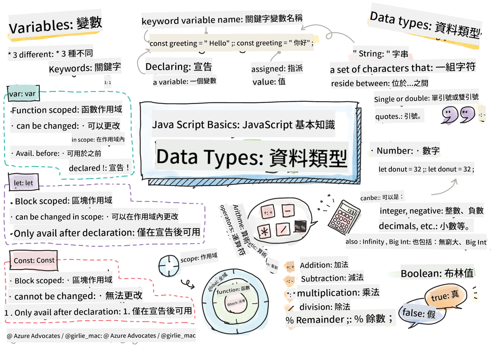

<!--
CO_OP_TRANSLATOR_METADATA:
{
  "original_hash": "b95fdd8310ef467305015ece1b0f9411",
  "translation_date": "2025-08-29T15:05:33+00:00",
  "source_file": "2-js-basics/1-data-types/README.md",
  "language_code": "hk"
}
-->
# JavaScript 基礎：數據類型


> [Tomomi Imura](https://twitter.com/girlie_mac) 的手繪筆記

## 課前測驗
[課前測驗](https://ff-quizzes.netlify.app/web/)

這節課涵蓋了 JavaScript 的基礎知識，這是一種為網頁提供互動性的語言。

> 你可以在 [Microsoft Learn](https://docs.microsoft.com/learn/modules/web-development-101-variables/?WT.mc_id=academic-77807-sagibbon) 上學習這節課！

[](https://youtube.com/watch?v=JNIXfGiDWM8 "JavaScript 中的變數")

[](https://youtube.com/watch?v=AWfA95eLdq8 "JavaScript 中的數據類型")

> 🎥 點擊上方圖片觀看有關變數和數據類型的影片

讓我們從變數和填充它們的數據類型開始吧！

## 變數

變數用來存儲值，這些值可以在你的代碼中使用並更改。

創建和**聲明**一個變數的語法是 **[關鍵字] [名稱]**，它由以下兩部分組成：

- **關鍵字**。關鍵字可以是 `let` 或 `var`。

✅ `let` 關鍵字是在 ES6 中引入的，為變數提供了所謂的 _區塊作用域_。建議使用 `let` 而不是 `var`。我們會在後續部分更深入地討論區塊作用域。
- **變數名稱**，這是你自己選擇的一個名稱。

### 任務 - 使用變數

1. **聲明一個變數**。讓我們使用 `let` 關鍵字聲明一個變數：

    ```javascript
    let myVariable;
    ```

   現在 `myVariable` 已經使用 `let` 關鍵字聲明了，但目前還沒有賦值。

1. **賦值**。使用 `=` 運算符，後接期望的值，將值存儲到變數中。

    ```javascript
    myVariable = 123;
    ```

   > 注意：在本課中，`=` 的使用表示我們使用的是 "賦值運算符"，用於將值設置給變數。它並不表示等於。

   現在 `myVariable` 已經被*初始化*為值 123。

1. **重構**。用以下語句替換你的代碼。

    ```javascript
    let myVariable = 123;
    ```

    上述操作稱為 _顯式初始化_，即在聲明變數的同時賦值。

1. **更改變數值**。以下方式更改變數值：

   ```javascript
   myVariable = 321;
   ```

   一旦變數被聲明，你可以在代碼中的任何地方使用 `=` 運算符和新值來更改它的值。

   ✅ 試試看！你可以直接在瀏覽器中編寫 JavaScript。打開瀏覽器窗口並導航到開發者工具。在控制台中，你會看到一個提示符；輸入 `let myVariable = 123`，按回車，然後輸入 `myVariable`。會發生什麼？注意，你會在後續課程中學到更多這些概念。

## 常量

常量的聲明和初始化與變數的概念相同，但使用的是 `const` 關鍵字。常量通常用全大寫字母聲明。

```javascript
const MY_VARIABLE = 123;
```

常量與變數類似，但有兩個例外：

- **必須有值**。常量必須初始化，否則運行代碼時會出錯。
- **引用不可更改**。一旦初始化，常量的引用不能更改，否則運行代碼時會出錯。我們來看兩個例子：
   - **簡單值**。以下是不允許的：
   
      ```javascript
      const PI = 3;
      PI = 4; // not allowed
      ```
 
   - **對象引用受保護**。以下是不允許的：
   
      ```javascript
      const obj = { a: 3 };
      obj = { b: 5 } // not allowed
      ```

    - **對象值未受保護**。以下是允許的：
    
      ```javascript
      const obj = { a: 3 };
      obj.a = 5;  // allowed
      ```

      上述代碼更改了對象的值，但沒有更改引用本身，因此是允許的。

   > 注意，`const` 表示引用受到重新賦值的保護。然而，值並不是 _不可變_ 的，尤其是當它是像對象這樣的複雜結構時，值仍然可以更改。

## 數據類型

變數可以存儲多種不同類型的值，例如數字和文本。這些不同類型的值被稱為**數據類型**。數據類型是軟件開發中的重要部分，因為它幫助開發者決定代碼應該如何編寫以及軟件應該如何運行。此外，一些數據類型具有獨特的功能，可以幫助轉換或提取值中的附加信息。

✅ 數據類型也被稱為 JavaScript 的數據原始類型，因為它們是語言提供的最低級別的數據類型。JavaScript 有 7 種原始數據類型：string、number、bigint、boolean、undefined、null 和 symbol。花點時間想像一下這些原始類型可能代表什麼。什麼是 `zebra`？`0` 呢？`true` 呢？

### 數字

在上一節中，`myVariable` 的值是一個數字數據類型。

`let myVariable = 123;`

變數可以存儲所有類型的數字，包括小數或負數。數字還可以與算術運算符一起使用，這部分內容會在[下一節](../../../../2-js-basics/1-data-types)中介紹。

### 算術運算符

在執行算術操作時，可以使用多種類型的運算符，以下列出了一些：

| 符號 | 描述                                                                  | 範例                              |
| ---- | --------------------------------------------------------------------- | --------------------------------- |
| `+`  | **加法**：計算兩個數字的和                                           | `1 + 2 // 預期答案是 3`           |
| `-`  | **減法**：計算兩個數字的差                                           | `1 - 2 // 預期答案是 -1`          |
| `*`  | **乘法**：計算兩個數字的積                                           | `1 * 2 // 預期答案是 2`           |
| `/`  | **除法**：計算兩個數字的商                                           | `1 / 2 // 預期答案是 0.5`         |
| `%`  | **取餘**：計算兩個數字相除後的餘數                                   | `1 % 2 // 預期答案是 1`           |

✅ 試試看！在瀏覽器的控制台中嘗試一個算術操作。結果是否讓你感到驚訝？

### 字串

字串是位於單引號或雙引號之間的一組字符。

- `'這是一個字串'`
- `"這也是一個字串"`
- `let myString = '這是一個存儲在變數中的字串值';`

記得在寫字串時使用引號，否則 JavaScript 會認為它是一個變數名稱。

### 格式化字串

字串是文本，有時需要進行格式化。

要**連接**兩個或多個字串（即將它們拼接在一起），可以使用 `+` 運算符。

```javascript
let myString1 = "Hello";
let myString2 = "World";

myString1 + myString2 + "!"; //HelloWorld!
myString1 + " " + myString2 + "!"; //Hello World!
myString1 + ", " + myString2 + "!"; //Hello, World!

```

✅ 為什麼在 JavaScript 中 `1 + 1 = 2`，但 `'1' + '1' = 11`？想一想。那 `'1' + 1` 呢？

**模板字串**是格式化字串的另一種方式，不同於引號，它使用的是反引號。任何非純文本的內容必須放在 `${ }` 的佔位符中，包括可能是字串的變數。

```javascript
let myString1 = "Hello";
let myString2 = "World";

`${myString1} ${myString2}!` //Hello World!
`${myString1}, ${myString2}!` //Hello, World!
```

你可以使用任一方法來實現格式化目標，但模板字串會保留所有空格和換行。

✅ 什麼時候會使用模板字串而不是普通字串？

### 布林值

布林值只有兩個值：`true` 或 `false`。布林值可以幫助決定在滿足某些條件時應該運行哪些代碼行。在許多情況下，[運算符](../../../../2-js-basics/1-data-types)會幫助設置布林值，並且你會經常看到和編寫變數在初始化或更新其值時使用運算符。

- `let myTrueBool = true`
- `let myFalseBool = false`

✅ 如果一個變數被認為是 "truthy"，則它會評估為布林值 `true`。有趣的是，在 JavaScript 中，[所有值默認為 truthy，除非被定義為 falsy](https://developer.mozilla.org/docs/Glossary/Truthy)。

---

## 🚀 挑戰

JavaScript 因其在處理數據類型時偶爾會出現令人驚訝的行為而聞名。研究一下這些 "陷阱"。例如：大小寫敏感可能會讓你吃虧！在控制台中試試看：`let age = 1; let Age = 2; age == Age`（結果是 `false`——為什麼？）。你還能找到哪些陷阱？

## 課後測驗
[課後測驗](https://ff-quizzes.netlify.app)

## 複習與自學

看看[這份 JavaScript 練習題列表](https://css-tricks.com/snippets/javascript/)，試著完成一題。你學到了什麼？

## 作業

[數據類型練習](assignment.md)

---

**免責聲明**：  
此文件已使用人工智能翻譯服務 [Co-op Translator](https://github.com/Azure/co-op-translator) 翻譯。我們致力於提供準確的翻譯，但請注意，自動翻譯可能包含錯誤或不準確之處。應以原始語言的文件作為權威來源。對於關鍵資訊，建議尋求專業人工翻譯。我們對因使用此翻譯而引起的任何誤解或錯誤解讀概不負責。  