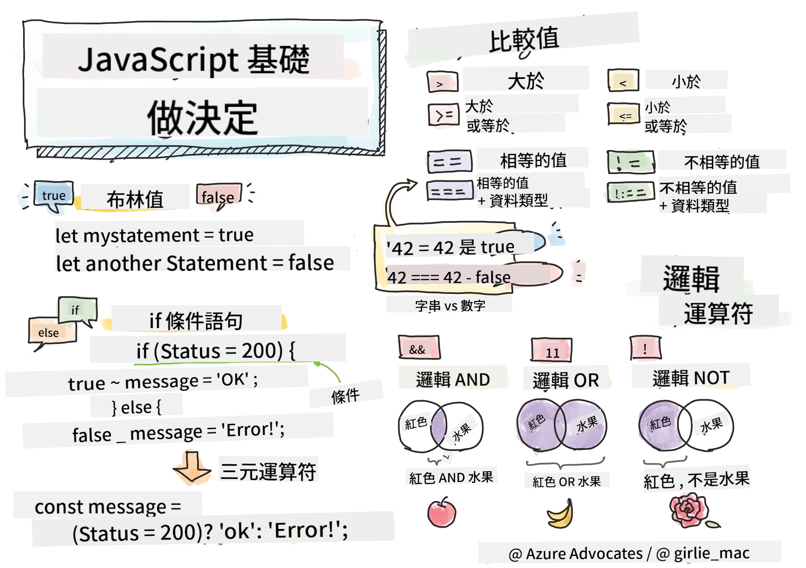

<!--
CO_OP_TRANSLATOR_METADATA:
{
  "original_hash": "f7009631b73556168ca435120a231c98",
  "translation_date": "2025-08-29T15:05:09+00:00",
  "source_file": "2-js-basics/3-making-decisions/README.md",
  "language_code": "hk"
}
-->
# JavaScript 基礎：作出決策



> 由 [Tomomi Imura](https://twitter.com/girlie_mac) 繪製的筆記圖

## 課前測驗

[課前測驗](https://ff-quizzes.netlify.app/web/quiz/11)

作出決策並控制程式碼執行的順序，能讓你的程式碼更具重用性和穩健性。本節將介紹在 JavaScript 中控制資料流的語法，以及當與布林值結合使用時的重要性。

[](https://youtube.com/watch?v=SxTp8j-fMMY "作出決策")

> 🎥 點擊上方圖片觀看有關作出決策的影片。

> 你可以在 [Microsoft Learn](https://docs.microsoft.com/learn/modules/web-development-101-if-else/?WT.mc_id=academic-77807-sagibbon) 上學習這節課！

## 布林值簡介

布林值只有兩個可能的值：`true` 或 `false`。布林值用於決定在特定條件下應執行哪些程式碼。

你可以這樣設定布林值為 true 或 false：

`let myTrueBool = true`  
`let myFalseBool = false`

✅ 布林值是以英國數學家、哲學家和邏輯學家 George Boole (1815–1864) 的名字命名的。

## 比較運算符與布林值

運算符用於通過比較來評估條件，並生成布林值。以下是一些常用的運算符列表。

| 符號  | 描述                                                                                                                                       | 範例                |
| ----- | ------------------------------------------------------------------------------------------------------------------------------------------ | ------------------- |
| `<`   | **小於**：比較兩個值，若左邊的值小於右邊，則返回布林值 `true`                                                                              | `5 < 6 // true`     |
| `<=`  | **小於或等於**：比較兩個值，若左邊的值小於或等於右邊，則返回布林值 `true`                                                                  | `5 <= 6 // true`    |
| `>`   | **大於**：比較兩個值，若左邊的值大於右邊，則返回布林值 `true`                                                                              | `5 > 6 // false`    |
| `>=`  | **大於或等於**：比較兩個值，若左邊的值大於或等於右邊，則返回布林值 `true`                                                                  | `5 >= 6 // false`   |
| `===` | **嚴格相等**：比較兩個值，若左右兩邊的值相等且類型相同，則返回布林值 `true`                                                                | `5 === 6 // false`  |
| `!==` | **不相等**：比較兩個值，返回與嚴格相等運算符相反的布林值                                                                                   | `5 !== 6 // true`   |

✅ 在瀏覽器的控制台中寫一些比較來檢查你的知識。是否有任何返回的數據讓你感到驚訝？

## If 語句

`if` 語句會在條件為 true 時執行其區塊內的程式碼。

```javascript
if (condition) {
  //Condition is true. Code in this block will run.
}
```

邏輯運算符通常用於構成條件。

```javascript
let currentMoney;
let laptopPrice;

if (currentMoney >= laptopPrice) {
  //Condition is true. Code in this block will run.
  console.log("Getting a new laptop!");
}
```

## If..Else 語句

`else` 語句會在條件為 false 時執行其區塊內的程式碼。它是 `if` 語句的可選部分。

```javascript
let currentMoney;
let laptopPrice;

if (currentMoney >= laptopPrice) {
  //Condition is true. Code in this block will run.
  console.log("Getting a new laptop!");
} else {
  //Condition is false. Code in this block will run.
  console.log("Can't afford a new laptop, yet!");
}
```

✅ 在瀏覽器控制台中運行這段程式碼以及以下程式碼來測試你的理解。更改 `currentMoney` 和 `laptopPrice` 變數的值，觀察 `console.log()` 的返回結果。

## Switch 語句

`switch` 語句用於根據不同的條件執行不同的操作。使用 `switch` 語句可以選擇執行多個程式碼區塊中的一個。

```javascript
switch (expression) {
  case x:
    // code block
    break;
  case y:
    // code block
    break;
  default:
  // code block
}
```

```javascript
// program using switch statement
let a = 2;

switch (a) {
  case 1:
    a = "one";
    break;
  case 2:
    a = "two";
    break;
  default:
    a = "not found";
    break;
}
console.log(`The value is ${a}`);
```

✅ 在瀏覽器控制台中運行這段程式碼以及以下程式碼來測試你的理解。更改變數 `a` 的值，觀察 `console.log()` 的返回結果。

## 邏輯運算符與布林值

決策可能需要多個比較，並可以通過邏輯運算符串聯起來生成布林值。

| 符號  | 描述                                                                                     | 範例                                                                      |
| ----- | ---------------------------------------------------------------------------------------- | ------------------------------------------------------------------------- |
| `&&`  | **邏輯 AND**：比較兩個布林表達式。僅當兩邊都為 true 時返回 true                          | `(5 > 6) && (5 < 6 ) //一邊為 false，另一邊為 true。返回 false`           |
| `\|\|` | **邏輯 OR**：比較兩個布林表達式。只要有一邊為 true 就返回 true                          | `(5 > 6) \|\| (5 < 6) //一邊為 false，另一邊為 true。返回 true`           |
| `!`   | **邏輯 NOT**：返回布林表達式的相反值                                                     | `!(5 > 6) // 5 不大於 6，但 "!" 會返回 true`                              |

## 使用邏輯運算符的條件與決策

邏輯運算符可以用於在 `if..else` 語句中構成條件。

```javascript
let currentMoney;
let laptopPrice;
let laptopDiscountPrice = laptopPrice - laptopPrice * 0.2; //Laptop price at 20 percent off

if (currentMoney >= laptopPrice || currentMoney >= laptopDiscountPrice) {
  //Condition is true. Code in this block will run.
  console.log("Getting a new laptop!");
} else {
  //Condition is true. Code in this block will run.
  console.log("Can't afford a new laptop, yet!");
}
```

### 否定運算符

到目前為止，你已經看到如何使用 `if...else` 語句來創建條件邏輯。任何進入 `if` 的內容都需要評估為 true 或 false。通過使用 `!` 運算符，你可以**否定**表達式。它看起來像這樣：

```javascript
if (!condition) {
  // runs if condition is false
} else {
  // runs if condition is true
}
```

### 三元運算符

`if...else` 不是表達決策邏輯的唯一方式。你還可以使用一種稱為三元運算符的東西。其語法如下：

```javascript
let variable = condition ? <return this if true> : <return this if false>
```

以下是一個更具體的例子：

```javascript
let firstNumber = 20;
let secondNumber = 10;
let biggestNumber = firstNumber > secondNumber ? firstNumber : secondNumber;
```

✅ 花點時間多讀幾遍這段程式碼。你理解這些運算符是如何工作的嗎？

上述程式碼的意思是：

- 如果 `firstNumber` 大於 `secondNumber`
- 那麼將 `firstNumber` 賦值給 `biggestNumber`
- 否則將 `secondNumber` 賦值給 `biggestNumber`。

三元運算符只是以下程式碼的簡潔寫法：

```javascript
let biggestNumber;
if (firstNumber > secondNumber) {
  biggestNumber = firstNumber;
} else {
  biggestNumber = secondNumber;
}
```

---

## 🚀 挑戰

創建一個程式，首先使用邏輯運算符編寫，然後使用三元運算符重寫。你更喜歡哪種語法？

---

## 課後測驗

[課後測驗](https://ff-quizzes.netlify.app/web/quiz/12)

## 複習與自學

閱讀更多有關用戶可用的運算符 [在 MDN 上](https://developer.mozilla.org/docs/Web/JavaScript/Reference/Operators)。

瀏覽 Josh Comeau 的精彩 [運算符查詢工具](https://joshwcomeau.com/operator-lookup/)！

## 作業

[運算符](assignment.md)

---

**免責聲明**：  
此文件已使用 AI 翻譯服務 [Co-op Translator](https://github.com/Azure/co-op-translator) 翻譯。我們致力於提供準確的翻譯，但請注意，自動翻譯可能包含錯誤或不準確之處。應以原文文件作為權威來源。對於關鍵資訊，建議尋求專業人工翻譯。我們對因使用此翻譯而引起的任何誤解或誤釋不承擔責任。