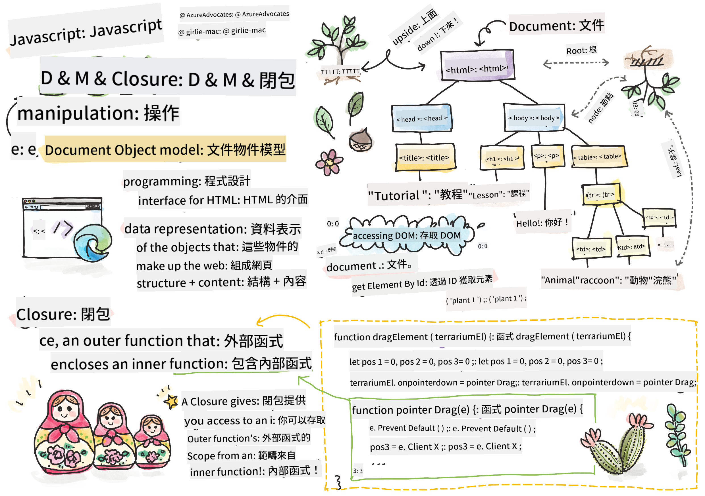
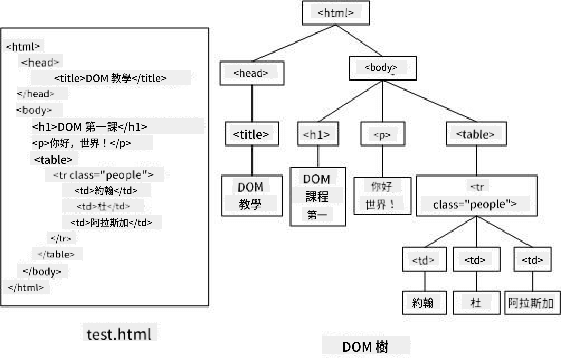

<!--
CO_OP_TRANSLATOR_METADATA:
{
  "original_hash": "61c14b27044861e5e69db35dd52c4403",
  "translation_date": "2025-08-29T15:08:31+00:00",
  "source_file": "3-terrarium/3-intro-to-DOM-and-closures/README.md",
  "language_code": "hk"
}
-->
# 玻璃花園項目第三部分：DOM 操作與閉包


> [Tomomi Imura](https://twitter.com/girlie_mac) 的手繪筆記

## 課前測驗

[課前測驗](https://ff-quizzes.netlify.app/web/quiz/19)

### 簡介

操作 DOM（文件物件模型）是網頁開發中的一個關鍵部分。根據 [MDN](https://developer.mozilla.org/docs/Web/API/Document_Object_Model/Introduction) 的定義：「文件物件模型 (DOM) 是一種數據表示形式，用於描述構成網頁結構和內容的物件。」由於操作 DOM 的挑戰，許多開發者選擇使用 JavaScript 框架來取代原生 JavaScript 進行 DOM 管理，但我們這次將嘗試自己動手完成！

此外，本課程還會介紹 [JavaScript 閉包](https://developer.mozilla.org/docs/Web/JavaScript/Closures) 的概念。閉包可以理解為一個函數包裹著另一個函數，使內部函數能夠訪問外部函數的作用域。

> JavaScript 閉包是一個廣泛且複雜的主題。本課程僅涉及最基本的概念。在這個玻璃花園的代碼中，你會發現一個閉包：一個內部函數和一個外部函數的結構設計，使內部函數能夠訪問外部函數的作用域。若想深入了解其運作方式，請參考 [詳細文檔](https://developer.mozilla.org/docs/Web/JavaScript/Closures)。

我們將使用閉包來操作 DOM。

可以將 DOM 想像成一棵樹，代表了網頁文件可以被操作的所有方式。各種 API（應用程式介面）被設計出來，讓開發者可以使用自己選擇的程式語言來訪問 DOM，並進行編輯、修改、重組或其他管理操作。



> DOM 與其對應的 HTML 標記的表示圖。來源：[Olfa Nasraoui](https://www.researchgate.net/publication/221417012_Profile-Based_Focused_Crawler_for_Social_Media-Sharing_Websites)

在本課程中，我們將完成互動式玻璃花園項目，通過編寫 JavaScript 代碼，讓用戶能夠操作頁面上的植物。

### 前置條件

你應該已經完成了玻璃花園的 HTML 和 CSS 部分。在本課程結束時，你將能夠通過拖拽將植物移入或移出玻璃花園。

### 任務

在你的玻璃花園資料夾中，創建一個名為 `script.js` 的新文件，並在 `<head>` 區域中引入該文件：

```html
	<script src="./script.js" defer></script>
```

> 注意：在將外部 JavaScript 文件引入 HTML 文件時，使用 `defer` 屬性，這樣可以確保 JavaScript 在 HTML 文件完全加載後才執行。你也可以使用 `async` 屬性，允許腳本在 HTML 文件解析時執行，但在我們的情況下，確保 HTML 元素完全可用以進行拖拽操作更為重要。
---

## DOM 元素

首先，你需要在 DOM 中創建對要操作的元素的引用。在我們的例子中，這些元素是目前位於側邊欄的 14 個植物。

### 任務

```html
dragElement(document.getElementById('plant1'));
dragElement(document.getElementById('plant2'));
dragElement(document.getElementById('plant3'));
dragElement(document.getElementById('plant4'));
dragElement(document.getElementById('plant5'));
dragElement(document.getElementById('plant6'));
dragElement(document.getElementById('plant7'));
dragElement(document.getElementById('plant8'));
dragElement(document.getElementById('plant9'));
dragElement(document.getElementById('plant10'));
dragElement(document.getElementById('plant11'));
dragElement(document.getElementById('plant12'));
dragElement(document.getElementById('plant13'));
dragElement(document.getElementById('plant14'));
```

這裡發生了什麼？你正在引用文件，並在其 DOM 中查找具有特定 Id 的元素。還記得我們在 HTML 課程中為每個植物圖片分配了唯一的 Id（例如 `id="plant1"`）嗎？現在你可以利用這些 Id。識別每個元素後，你將該元素傳遞給一個名為 `dragElement` 的函數（稍後會構建該函數）。因此，HTML 中的元素現在已啟用拖拽功能，或者即將啟用。

✅ 為什麼我們通過 Id 引用元素？為什麼不通過它們的 CSS 類名？你可以回顧之前的 CSS 課程來回答這個問題。

---

## 閉包

現在你可以創建 `dragElement` 閉包了，這是一個外部函數，包裹著一個或多個內部函數（在我們的例子中是三個）。

當一個或多個函數需要訪問外部函數的作用域時，閉包非常有用。以下是一個例子：

```javascript
function displayCandy(){
	let candy = ['jellybeans'];
	function addCandy(candyType) {
		candy.push(candyType)
	}
	addCandy('gumdrops');
}
displayCandy();
console.log(candy)
```

在這個例子中，`displayCandy` 函數包裹了一個函數，該函數將新的糖果類型推入已存在於函數中的數組。如果你運行這段代碼，`candy` 數組將是未定義的，因為它是一個局部變數（僅限於閉包的作用域）。

✅ 如何讓 `candy` 數組可訪問？嘗試將其移到閉包之外。這樣，數組將變為全域變數，而不是僅限於閉包的局部作用域。

### 任務

在 `script.js` 中的元素聲明下，創建一個函數：

```javascript
function dragElement(terrariumElement) {
	//set 4 positions for positioning on the screen
	let pos1 = 0,
		pos2 = 0,
		pos3 = 0,
		pos4 = 0;
	terrariumElement.onpointerdown = pointerDrag;
}
```

`dragElement` 從腳本頂部的聲明中獲取其 `terrariumElement` 對象。然後，你為傳遞到函數的對象設置了一些初始位置，這些位置的值為 `0`。這些是局部變數，將在閉包內為每個元素添加拖拽功能時進行操作。玻璃花園將通過這些被拖拽的元素填充，因此應用程序需要跟蹤它們的放置位置。

此外，傳遞給該函數的 `terrariumElement` 被分配了一個 `pointerdown` 事件，這是 [web API](https://developer.mozilla.org/docs/Web/API) 的一部分，旨在幫助管理 DOM。`onpointerdown` 事件在按下按鈕時觸發，或者在我們的例子中，當觸摸一個可拖拽的元素時觸發。該事件處理程序適用於 [網頁和移動瀏覽器](https://caniuse.com/?search=onpointerdown)，但有少數例外。

✅ [事件處理程序 `onclick`](https://developer.mozilla.org/docs/Web/API/GlobalEventHandlers/onclick) 在跨瀏覽器支持方面更廣泛；為什麼這裡不使用它？想一想你希望創建的屏幕交互的具體類型。

---

## Pointerdrag 函數

`terrariumElement` 現在已準備好被拖拽；當觸發 `onpointerdown` 事件時，函數 `pointerDrag` 被調用。在這行代碼下方添加該函數：`terrariumElement.onpointerdown = pointerDrag;`：

### 任務 

```javascript
function pointerDrag(e) {
	e.preventDefault();
	console.log(e);
	pos3 = e.clientX;
	pos4 = e.clientY;
}
```

這裡發生了幾件事。首先，你使用 `e.preventDefault();` 阻止了 `pointerdown` 事件的默認行為。這樣你可以更好地控制界面的行為。

> 當你完全構建腳本文件後，回到這行代碼並嘗試刪除 `e.preventDefault()` - 會發生什麼？

其次，在瀏覽器窗口中打開 `index.html`，並檢查界面。當你點擊一個植物時，你可以看到如何捕獲 'e' 事件。深入查看該事件，看看一次 `pointerdown` 事件收集了多少信息！

接下來，注意如何將局部變數 `pos3` 和 `pos4` 設置為 `e.clientX`。你可以在檢查面板中找到 `e` 的值。這些值捕獲了你點擊或觸摸植物時的 x 和 y 坐標。由於你需要對植物的拖拽行為進行精細控制，因此需要跟蹤它們的坐標。

✅ 現在是否更清楚為什麼整個應用程序是用一個大的閉包構建的？如果不是閉包，你將如何為 14 個可拖拽的植物維持作用域？

完成初始函數，通過在 `pos4 = e.clientY` 下添加另外兩個指針事件操作：

```html
document.onpointermove = elementDrag;
document.onpointerup = stopElementDrag;
```
現在你正在指示植物隨著指針移動而被拖拽，並在取消選擇植物時停止拖拽。`onpointermove` 和 `onpointerup` 都是與 `onpointerdown` 相同 API 的一部分。由於你尚未定義 `elementDrag` 和 `stopElementDrag` 函數，界面現在會拋出錯誤，因此接下來構建這些函數。

## elementDrag 和 stopElementDrag 函數

你將通過添加另外兩個內部函數來完成閉包，這些函數將處理拖拽植物和停止拖拽時的行為。你希望的行為是，隨時可以拖拽任何植物，並將其放置在屏幕上的任何位置。這個界面非常靈活（例如，沒有特定的放置區域），讓你可以自由設計自己的玻璃花園，添加、移除和重新定位植物。

### 任務

在 `pointerDrag` 的閉合大括號後添加 `elementDrag` 函數：

```javascript
function elementDrag(e) {
	pos1 = pos3 - e.clientX;
	pos2 = pos4 - e.clientY;
	pos3 = e.clientX;
	pos4 = e.clientY;
	console.log(pos1, pos2, pos3, pos4);
	terrariumElement.style.top = terrariumElement.offsetTop - pos2 + 'px';
	terrariumElement.style.left = terrariumElement.offsetLeft - pos1 + 'px';
}
```
在這個函數中，你對之前在外部函數中設置的初始位置 1-4 進行了大量操作。這裡發生了什麼？

當你拖拽時，你通過將 `pos3`（之前設置為 `e.clientX`）減去當前的 `e.clientX` 值來重新分配 `pos1`。對 `pos2` 進行了類似的操作。然後，你將 `pos3` 和 `pos4` 重置為元素的新 X 和 Y 坐標。你可以在拖拽時在控制台中觀察這些變化。接著，你操作植物的 CSS 樣式，根據這些新位置計算植物的頂部和左側 X 和 Y 坐標，並設置其新位置。

> `offsetTop` 和 `offsetLeft` 是 CSS 屬性，用於根據父元素設置元素的位置；其父元素可以是任何非 `static` 定位的元素。

所有這些位置的重新計算使你能夠微調玻璃花園及其植物的行為。

### 任務 

完成界面的最後一步是在 `elementDrag` 的閉合大括號後添加 `stopElementDrag` 函數：

```javascript
function stopElementDrag() {
	document.onpointerup = null;
	document.onpointermove = null;
}
```

這個小函數重置了 `onpointerup` 和 `onpointermove` 事件，這樣你可以重新開始拖拽植物，或者開始拖拽新的植物。

✅ 如果你不將這些事件設置為 null，會發生什麼？

現在你已經完成了你的項目！

🥇恭喜！你已經完成了你的美麗玻璃花園！

---

## 🚀挑戰

為你的閉包添加新的事件處理程序，讓植物能夠執行更多操作；例如，雙擊植物將其置於最前方。發揮創意吧！

## 課後測驗

[課後測驗](https://ff-quizzes.netlify.app/web/quiz/20)

## 複習與自學

雖然在屏幕上拖拽元素看起來很簡單，但有許多實現方式和潛在的陷阱，具體取決於你想要的效果。事實上，有一個完整的 [拖拽 API](https://developer.mozilla.org/docs/Web/API/HTML_Drag_and_Drop_API) 可以嘗試。我們在本模組中沒有使用該 API，因為我們想要的效果有些不同，但你可以在自己的項目中嘗試這個 API，看看能實現什麼。

在 [W3C 文檔](https://www.w3.org/TR/pointerevents1/) 和 [MDN 網頁文檔](https://developer.mozilla.org/docs/Web/API/Pointer_events) 上找到更多關於指針事件的信息。

隨時使用 [CanIUse.com](https://caniuse.com/) 檢查瀏覽器的兼容性。

## 作業

[進一步練習 DOM](assignment.md)

---

**免責聲明**：  
本文件已使用人工智能翻譯服務 [Co-op Translator](https://github.com/Azure/co-op-translator) 進行翻譯。儘管我們致力於提供準確的翻譯，請注意自動翻譯可能包含錯誤或不準確之處。原始語言的文件應被視為權威來源。對於重要信息，建議使用專業人工翻譯。我們對因使用此翻譯而引起的任何誤解或錯誤解釋概不負責。