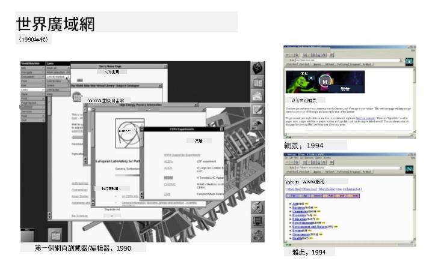
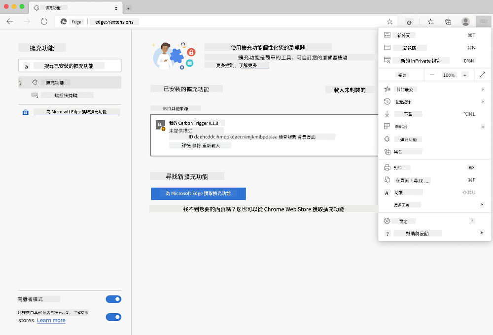
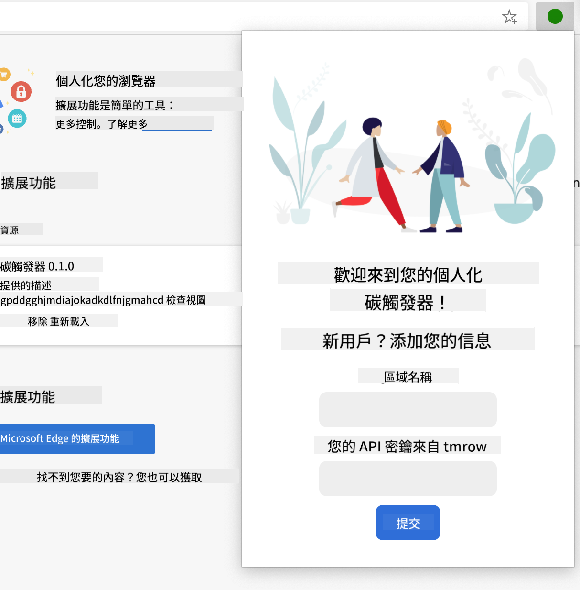
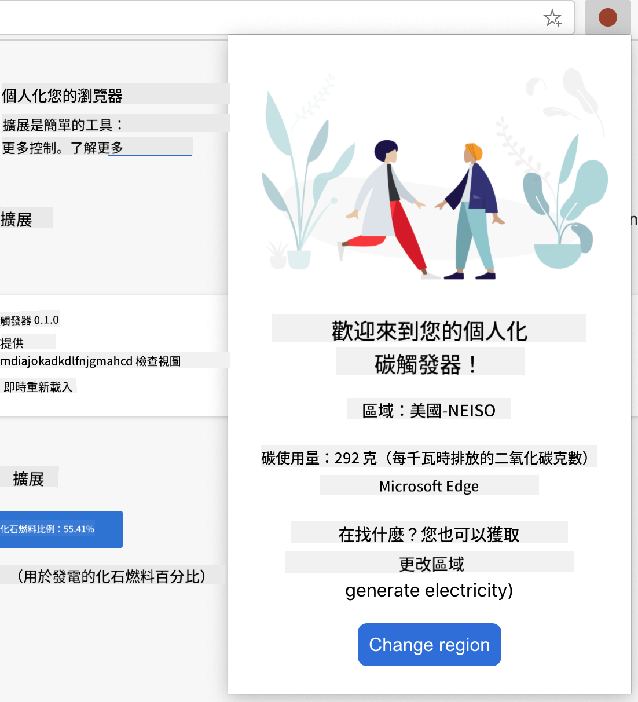

<!--
CO_OP_TRANSLATOR_METADATA:
{
  "original_hash": "2326d04e194a10aa760b51f5e5a1f61d",
  "translation_date": "2025-08-29T14:59:43+00:00",
  "source_file": "5-browser-extension/1-about-browsers/README.md",
  "language_code": "hk"
}
-->
# 瀏覽器擴展項目第一部分：關於瀏覽器的一切


> 手繪筆記由 [Wassim Chegham](https://dev.to/wassimchegham/ever-wondered-what-happens-when-you-type-in-a-url-in-an-address-bar-in-a-browser-3dob) 提供

## 課前測驗

[課前測驗](https://ff-quizzes.netlify.app/web/quiz/23)

### 簡介

瀏覽器擴展為瀏覽器添加了額外的功能。但在你開始構建之前，應該先了解一些關於瀏覽器如何運作的知識。

### 關於瀏覽器

在這系列課程中，你將學習如何構建一個可以在 Chrome、Firefox 和 Edge 瀏覽器上運行的瀏覽器擴展。在這部分，你將了解瀏覽器的工作原理，並搭建瀏覽器擴展的基本結構。

那麼，什麼是瀏覽器？它是一種軟件應用程序，允許終端用戶從伺服器訪問內容並在網頁上顯示。

✅ 一點歷史：第一個瀏覽器名為「WorldWideWeb」，由蒂姆·伯納斯-李爵士於 1990 年創建。


> 一些早期的瀏覽器，圖片來源 [Karen McGrane](https://www.slideshare.net/KMcGrane/week-4-ixd-history-personal-computing)

當用戶使用 URL（統一資源定位符）地址連接到互聯網時，通常通過 `http` 或 `https` 地址使用超文本傳輸協議，瀏覽器會與網頁伺服器通信並獲取網頁。

此時，瀏覽器的渲染引擎會將網頁顯示在用戶的設備上，可能是手機、桌面電腦或筆記本電腦。

瀏覽器還具有緩存內容的功能，這樣就不需要每次都從伺服器檢索內容。它們可以記錄用戶的瀏覽歷史，存儲「cookies」（小型數據片段，用於保存用戶活動的信息）等。

需要記住的一個重要事實是，瀏覽器並不完全相同！每個瀏覽器都有其優勢和劣勢，專業的網頁開發人員需要了解如何讓網頁在不同瀏覽器中表現良好。這包括處理小型視窗（如手機屏幕）以及離線用戶的情況。

一個非常有用的網站是 [caniuse.com](https://www.caniuse.com)，你應該將其加入你喜歡使用的瀏覽器的書籤中。在構建網頁時，使用 caniuse 提供的支持技術列表可以幫助你更好地支持用戶。

✅ 如何知道哪些瀏覽器在你的網站用戶中最受歡迎？檢查你的分析數據——你可以在網頁開發過程中安裝各種分析工具包，它們會告訴你不同流行瀏覽器的使用情況。

## 瀏覽器擴展

為什麼要構建瀏覽器擴展？當你需要快速訪問經常重複的任務時，這是一個非常方便的工具。例如，如果你經常需要檢查網頁上的顏色，你可以安裝一個顏色選取器瀏覽器擴展。如果你記不住密碼，你可以使用密碼管理瀏覽器擴展。

開發瀏覽器擴展也很有趣。它們通常只需處理有限的任務，並能很好地完成這些任務。

✅ 你最喜歡的瀏覽器擴展是什麼？它們執行哪些任務？

### 安裝擴展

在開始構建之前，先了解一下構建和部署瀏覽器擴展的過程。雖然每個瀏覽器在管理這個過程時略有不同，但在 Chrome 和 Firefox 上的過程與 Edge 上的示例類似：



> 注意：確保切換到開發者模式並允許來自其他商店的擴展。

基本過程如下：

- 使用 `npm run build` 構建你的擴展  
- 在瀏覽器中通過右上角的「設置及更多」按鈕（`...` 圖標）導航到擴展面板  
- 如果是新安裝，選擇「加載未打包的擴展」來從構建文件夾（在我們的例子中是 `/dist`）上傳新的擴展  
- 或者，如果是重新加載已安裝的擴展，點擊「重新加載」  

✅ 這些指令適用於你自己構建的擴展；如果要安裝已發布到各瀏覽器擴展商店的擴展，應導航到這些 [商店](https://microsoftedge.microsoft.com/addons/Microsoft-Edge-Extensions-Home) 並安裝你選擇的擴展。

### 開始構建

你將構建一個顯示你所在地區碳足跡的瀏覽器擴展，展示你所在地區的能源使用情況及能源來源。該擴展將包含一個表單，用於收集 API 密鑰，以訪問 CO2 Signal 的 API。

**你需要：**

- [一個 API 密鑰](https://www.co2signal.com/)；在此頁面輸入你的電子郵件，密鑰將發送給你  
- 與 [Electricity Map](https://www.electricitymap.org/map) 對應的 [地區代碼](http://api.electricitymap.org/v3/zones)（例如，在波士頓，我使用「US-NEISO」）  
- [起始代碼](../../../../5-browser-extension/start)。下載 `start` 文件夾；你將在此文件夾中完成代碼  
- [NPM](https://www.npmjs.com) - NPM 是一個包管理工具；本地安裝它，並安裝 `package.json` 文件中列出的包以供網頁資產使用  

✅ 在這個 [優秀的學習模組](https://docs.microsoft.com/learn/modules/create-nodejs-project-dependencies/?WT.mc_id=academic-77807-sagibbon) 中了解更多關於包管理的知識。

花點時間瀏覽代碼庫：

dist  
    -|manifest.json（默認設置在這裡）  
    -|index.html（前端 HTML 標記在這裡）  
    -|background.js（背景 JS 在這裡）  
    -|main.js（構建後的 JS）  
src  
    -|index.js（你的 JS 代碼在這裡）  

✅ 一旦你準備好 API 密鑰和地區代碼，將它們存儲在一個筆記中以備後用。

### 為擴展構建 HTML

這個擴展有兩個視圖。一個用於收集 API 密鑰和地區代碼：



另一個用於顯示地區的碳使用情況：



我們先從構建表單的 HTML 開始，並用 CSS 進行樣式設計。

在 `/dist` 文件夾中，你將構建一個表單和一個結果區域。在 `index.html` 文件中，填充表單區域：

```HTML
<form class="form-data" autocomplete="on">
	<div>
		<h2>New? Add your Information</h2>
	</div>
	<div>
		<label for="region">Region Name</label>
		<input type="text" id="region" required class="region-name" />
	</div>
	<div>
		<label for="api">Your API Key from tmrow</label>
		<input type="text" id="api" required class="api-key" />
	</div>
	<button class="search-btn">Submit</button>
</form>	
```  
這是保存信息並將其輸入本地存儲的表單。

接下來，創建結果區域；在最後的表單標籤下添加一些 div：

```HTML
<div class="result">
	<div class="loading">loading...</div>
	<div class="errors"></div>
	<div class="data"></div>
	<div class="result-container">
		<p><strong>Region: </strong><span class="my-region"></span></p>
		<p><strong>Carbon Usage: </strong><span class="carbon-usage"></span></p>
		<p><strong>Fossil Fuel Percentage: </strong><span class="fossil-fuel"></span></p>
	</div>
	<button class="clear-btn">Change region</button>
</div>
```  
此時，你可以嘗試構建。確保安裝此擴展的包依賴項：

```
npm install
```  

此命令將使用 npm（Node 包管理器）為你的擴展構建過程安裝 webpack。Webpack 是一個處理代碼編譯的打包工具。你可以通過查看 `/dist/main.js` 來查看此過程的輸出——你會看到代碼已被打包。

目前，該擴展應該可以構建，並且如果你將其部署到 Edge 作為擴展，你會看到一個整齊顯示的表單。

恭喜你，已經邁出了構建瀏覽器擴展的第一步。在後續課程中，你將使其更具功能性和實用性。

---

## 🚀 挑戰

瀏覽一個瀏覽器擴展商店並安裝一個擴展到你的瀏覽器。你可以用有趣的方式檢查它的文件。你發現了什麼？

## 課後測驗

[課後測驗](https://ff-quizzes.netlify.app/web/quiz/24)

## 回顧與自學

在本課中，你學到了一些關於網頁瀏覽器歷史的知識；利用這個機會，通過閱讀更多歷史資料來了解萬維網的發明者如何設想它的用途。一些有用的網站包括：

[網頁瀏覽器的歷史](https://www.mozilla.org/firefox/browsers/browser-history/)

[網絡的歷史](https://webfoundation.org/about/vision/history-of-the-web/)

[蒂姆·伯納斯-李的訪談](https://www.theguardian.com/technology/2019/mar/12/tim-berners-lee-on-30-years-of-the-web-if-we-dream-a-little-we-can-get-the-web-we-want)

## 作業

[重新設計你的擴展](assignment.md)

---

**免責聲明**：  
此文件已使用人工智能翻譯服務 [Co-op Translator](https://github.com/Azure/co-op-translator) 翻譯。我們致力於提供準確的翻譯，但請注意，自動翻譯可能包含錯誤或不準確之處。應以原始語言的文件作為權威來源。對於關鍵資訊，建議使用專業的人類翻譯。我們對因使用此翻譯而引起的任何誤解或誤釋不承擔責任。