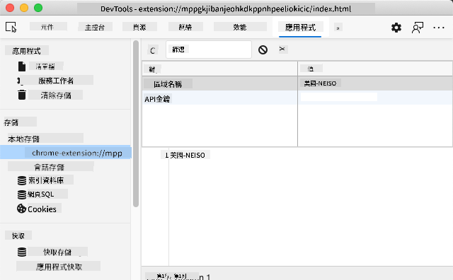

<!--
CO_OP_TRANSLATOR_METADATA:
{
  "original_hash": "a7587943d38d095de8613e1b508609f5",
  "translation_date": "2025-08-29T15:01:41+00:00",
  "source_file": "5-browser-extension/2-forms-browsers-local-storage/README.md",
  "language_code": "hk"
}
-->
# 瀏覽器擴展項目第二部分：調用 API，使用本地存儲

## 課前測驗

[課前測驗](https://ff-quizzes.netlify.app/web/quiz/25)

### 簡介

在這節課中，你將通過提交瀏覽器擴展的表單來調用 API，並在瀏覽器擴展中顯示結果。此外，你還將學習如何將數據存儲在瀏覽器的本地存儲中，以供未來參考和使用。

✅ 按照適當文件中的編號段落，了解應該在哪裡放置你的代碼。

### 設置擴展中需要操作的元素：

到目前為止，你已經為瀏覽器擴展構建了表單和結果 `<div>` 的 HTML。接下來，你需要在 `/src/index.js` 文件中逐步構建你的擴展。參考[上一課](../1-about-browsers/README.md)了解如何設置項目和構建過程。

在你的 `index.js` 文件中，首先創建一些 `const` 變量來保存與各個字段相關的值：

```JavaScript
// form fields
const form = document.querySelector('.form-data');
const region = document.querySelector('.region-name');
const apiKey = document.querySelector('.api-key');

// results
const errors = document.querySelector('.errors');
const loading = document.querySelector('.loading');
const results = document.querySelector('.result-container');
const usage = document.querySelector('.carbon-usage');
const fossilfuel = document.querySelector('.fossil-fuel');
const myregion = document.querySelector('.my-region');
const clearBtn = document.querySelector('.clear-btn');
```

所有這些字段都是通過它們的 CSS class 引用的，這些 class 是你在上一課的 HTML 中設置的。

### 添加事件監聽器

接下來，為表單和重置按鈕添加事件監聽器，當用戶提交表單或點擊重置按鈕時，會觸發某些操作，並在文件底部添加初始化應用的調用：

```JavaScript
form.addEventListener('submit', (e) => handleSubmit(e));
clearBtn.addEventListener('click', (e) => reset(e));
init();
```

✅ 注意這裡使用的簡寫方式來監聽提交或點擊事件，以及事件如何被傳遞到 handleSubmit 或 reset 函數。你能否用更長的格式寫出這個簡寫的等效代碼？你更喜歡哪種方式？

### 構建 init() 函數和 reset() 函數：

現在你需要構建初始化擴展的函數，這個函數叫做 init()：

```JavaScript
function init() {
	//if anything is in localStorage, pick it up
	const storedApiKey = localStorage.getItem('apiKey');
	const storedRegion = localStorage.getItem('regionName');

	//set icon to be generic green
	//todo

	if (storedApiKey === null || storedRegion === null) {
		//if we don't have the keys, show the form
		form.style.display = 'block';
		results.style.display = 'none';
		loading.style.display = 'none';
		clearBtn.style.display = 'none';
		errors.textContent = '';
	} else {
        //if we have saved keys/regions in localStorage, show results when they load
        displayCarbonUsage(storedApiKey, storedRegion);
		results.style.display = 'none';
		form.style.display = 'none';
		clearBtn.style.display = 'block';
	}
};

function reset(e) {
	e.preventDefault();
	//clear local storage for region only
	localStorage.removeItem('regionName');
	init();
}

```

在這個函數中，有一些有趣的邏輯。閱讀代碼後，你能看出發生了什麼嗎？

- 設置兩個 `const` 來檢查用戶是否在本地存儲中保存了 APIKey 和地區代碼。
- 如果其中任何一個為 null，通過將表單的樣式設置為 'block' 來顯示表單。
- 隱藏結果、加載和 clearBtn，並將任何錯誤文本設置為空字符串。
- 如果存在 key 和地區，啟動一個例程來：
  - 調用 API 獲取碳使用數據。
  - 隱藏結果區域。
  - 隱藏表單。
  - 顯示重置按鈕。

在繼續之前，了解瀏覽器中一個非常重要的概念：[LocalStorage](https://developer.mozilla.org/docs/Web/API/Window/localStorage)。LocalStorage 是一種在瀏覽器中以 `key-value` 對形式存儲字符串的有用方式。這種網頁存儲可以通過 JavaScript 操作來管理瀏覽器中的數據。LocalStorage 不會過期，而另一種網頁存儲 SessionStorage 則會在瀏覽器關閉時清除。這些存儲類型在使用上各有利弊。

> 注意 - 你的瀏覽器擴展有自己的本地存儲；主瀏覽器窗口是不同的實例，行為獨立。

你可以將 APIKey 設置為一個字符串值，例如，你可以通過 "檢查" 網頁（你可以右鍵點擊瀏覽器進行檢查）並進入 Applications 標籤查看存儲來看到它在 Edge 上的設置。



✅ 思考哪些情況下你不應該將某些數據存儲在 LocalStorage 中。一般來說，將 API Keys 放在 LocalStorage 中是個壞主意！你能看出原因嗎？在我們的案例中，由於我們的應用僅用於學習且不會部署到應用商店，我們將使用這種方法。

注意，你使用 Web API 操作 LocalStorage，可以通過 `getItem()`、`setItem()` 或 `removeItem()`。它在各瀏覽器中廣泛支持。

在構建 `displayCarbonUsage()` 函數（在 `init()` 中調用）之前，讓我們先構建處理初始表單提交的功能。

### 處理表單提交

創建一個名為 `handleSubmit` 的函數，接受一個事件參數 `(e)`。阻止事件傳播（在這種情況下，我們希望阻止瀏覽器刷新），並調用一個新函數 `setUpUser`，傳入參數 `apiKey.value` 和 `region.value`。通過這種方式，你使用了通過初始表單填充的適當字段中獲取的兩個值。

```JavaScript
function handleSubmit(e) {
	e.preventDefault();
	setUpUser(apiKey.value, region.value);
}
```

✅ 回憶一下 - 你在上一課設置的 HTML 有兩個輸入字段，其 `values` 是通過你在文件頂部設置的 `const` 捕獲的，並且它們都是 `required`，因此瀏覽器會阻止用戶輸入空值。

### 設置用戶

接下來是 `setUpUser` 函數，這裡你設置了本地存儲的 apiKey 和 regionName 值。添加一個新函數：

```JavaScript
function setUpUser(apiKey, regionName) {
	localStorage.setItem('apiKey', apiKey);
	localStorage.setItem('regionName', regionName);
	loading.style.display = 'block';
	errors.textContent = '';
	clearBtn.style.display = 'block';
	//make initial call
	displayCarbonUsage(apiKey, regionName);
}
```

此函數設置了一條加載消息，以在調用 API 時顯示。到目前為止，你已經到達了創建這個瀏覽器擴展最重要的函數！

### 顯示碳使用數據

最後，是時候查詢 API 了！

在進一步之前，我們應該討論 API。API，即[應用程序編程接口](https://www.webopedia.com/TERM/A/API.html)，是網頁開發者工具箱中的關鍵元素。它們為程序之間的交互和接口提供了標準方式。例如，如果你正在構建一個需要查詢數據庫的網站，可能有人已經為你創建了一個 API 可以使用。雖然 API 有很多類型，其中一種最流行的是 [REST API](https://www.smashingmagazine.com/2018/01/understanding-using-rest-api/)。

✅ "REST" 代表 "表現性狀態轉移"，其特點是使用不同配置的 URL 來獲取數據。研究一下開發者可用的各種 API 類型。哪種格式最吸引你？

關於這個函數有一些重要的注意事項。首先，注意 [`async` 關鍵字](https://developer.mozilla.org/docs/Web/JavaScript/Reference/Statements/async_function)。將函數設計為異步運行意味著它會等待某個操作（例如數據返回）完成後再繼續。

這裡有一段關於 `async` 的快速視頻：

[](https://youtube.com/watch?v=YwmlRkrxvkk "管理 Promise 的 Async 和 Await")

> 🎥 點擊上方圖片觀看關於 async/await 的視頻。

創建一個新函數來查詢 C02Signal API：

```JavaScript
import axios from '../node_modules/axios';

async function displayCarbonUsage(apiKey, region) {
	try {
		await axios
			.get('https://api.co2signal.com/v1/latest', {
				params: {
					countryCode: region,
				},
				headers: {
					'auth-token': apiKey,
				},
			})
			.then((response) => {
				let CO2 = Math.floor(response.data.data.carbonIntensity);

				//calculateColor(CO2);

				loading.style.display = 'none';
				form.style.display = 'none';
				myregion.textContent = region;
				usage.textContent =
					Math.round(response.data.data.carbonIntensity) + ' grams (grams C02 emitted per kilowatt hour)';
				fossilfuel.textContent =
					response.data.data.fossilFuelPercentage.toFixed(2) +
					'% (percentage of fossil fuels used to generate electricity)';
				results.style.display = 'block';
			});
	} catch (error) {
		console.log(error);
		loading.style.display = 'none';
		results.style.display = 'none';
		errors.textContent = 'Sorry, we have no data for the region you have requested.';
	}
}
```

這是一個大的函數。這裡發生了什麼？

- 遵循最佳實踐，你使用 `async` 關鍵字使這個函數異步運行。該函數包含一個 `try/catch` 塊，因為當 API 返回數據時，它會返回一個 Promise。由於你無法控制 API 的響應速度（它可能根本不響應！），你需要通過異步調用來處理這種不確定性。
- 你正在查詢 co2signal API 以獲取地區數據，使用你的 API Key。要使用該 Key，你需要在 header 參數中使用一種身份驗證方式。
- 一旦 API 響應，你將其響應數據的各個元素分配給你設置的屏幕部分以顯示這些數據。
- 如果出現錯誤或沒有結果，你會顯示一條錯誤消息。

✅ 使用異步編程模式是工具箱中的另一個非常有用的工具。閱讀[各種配置此類代碼的方法](https://developer.mozilla.org/docs/Web/JavaScript/Reference/Statements/async_function)。

恭喜！如果你構建了擴展（`npm run build`）並在擴展面板中刷新它，你就擁有了一個可運行的擴展！唯一未完成的是圖標，你將在下一課中修復它。

---

## 🚀 挑戰

我們在這些課程中討論了幾種 API 類型。選擇一個網頁 API，深入研究它提供的功能。例如，查看瀏覽器中可用的 API，例如 [HTML 拖放 API](https://developer.mozilla.org/docs/Web/API/HTML_Drag_and_Drop_API)。在你看來，什麼樣的 API 是優秀的？

## 課後測驗

[課後測驗](https://ff-quizzes.netlify.app/web/quiz/26)

## 回顧與自學

在這節課中，你學到了 LocalStorage 和 API，這兩個對專業網頁開發者非常有用。你能想到這兩者如何協同工作嗎？思考一下如何設計一個網站，將項目存儲起來以供 API 使用。

## 作業

[採用一個 API](assignment.md)

---

**免責聲明**：  
此文件已使用人工智能翻譯服務 [Co-op Translator](https://github.com/Azure/co-op-translator) 翻譯。我們致力於提供準確的翻譯，但請注意，自動翻譯可能包含錯誤或不準確之處。應以原始語言的文件作為權威來源。對於關鍵資訊，建議尋求專業人工翻譯。我們對因使用此翻譯而引起的任何誤解或錯誤解讀概不負責。