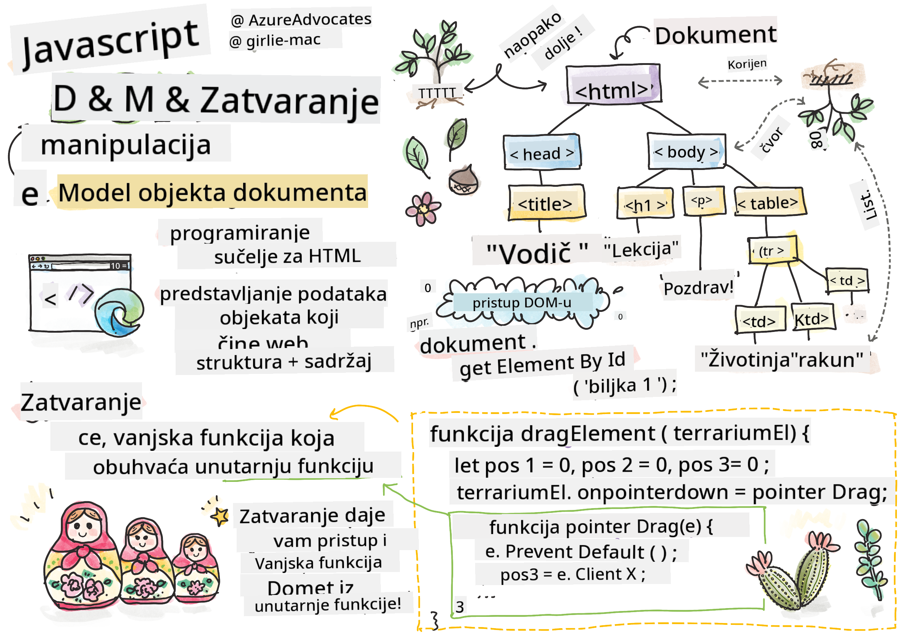
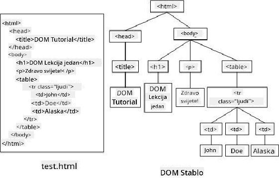

<!--
CO_OP_TRANSLATOR_METADATA:
{
  "original_hash": "61c14b27044861e5e69db35dd52c4403",
  "translation_date": "2025-08-29T12:38:05+00:00",
  "source_file": "3-terrarium/3-intro-to-DOM-and-closures/README.md",
  "language_code": "hr"
}
-->
# Projekt Terarij, 3. dio: Manipulacija DOM-om i zatvaranje (closure)


> Sketchnote autorice [Tomomi Imura](https://twitter.com/girlie_mac)

## Kviz prije predavanja

[Kviz prije predavanja](https://ff-quizzes.netlify.app/web/quiz/19)

### Uvod

Manipulacija DOM-om, ili "Modelom objekata dokumenta", ključni je aspekt razvoja weba. Prema [MDN-u](https://developer.mozilla.org/docs/Web/API/Document_Object_Model/Introduction), "Model objekata dokumenta (DOM) je podatkovna reprezentacija objekata koji čine strukturu i sadržaj dokumenta na webu." Izazovi vezani uz manipulaciju DOM-om često su bili razlog korištenja JavaScript okvira umjesto čistog JavaScripta za upravljanje DOM-om, ali mi ćemo se snaći sami!

Osim toga, ovaj će vas sat upoznati s idejom [JavaScript zatvaranja (closure)](https://developer.mozilla.org/docs/Web/JavaScript/Closures), koje možete zamisliti kao funkciju unutar druge funkcije, tako da unutarnja funkcija ima pristup opsegu vanjske funkcije.

> JavaScript zatvaranja su široka i složena tema. Ovaj sat dotiče se osnovne ideje da ćete u kodu ovog terarija pronaći zatvaranje: unutarnju funkciju i vanjsku funkciju konstruirane na način koji omogućuje unutarnjoj funkciji pristup opsegu vanjske funkcije. Za mnogo više informacija o tome kako ovo funkcionira, posjetite [opsežnu dokumentaciju](https://developer.mozilla.org/docs/Web/JavaScript/Closures).

Koristit ćemo zatvaranje za manipulaciju DOM-om.

Zamislite DOM kao stablo koje predstavlja sve načine na koje se dokument web stranice može manipulirati. Razni API-ji (sučelja za programske aplikacije) napisani su kako bi programeri, koristeći svoj programski jezik po izboru, mogli pristupiti DOM-u i uređivati, mijenjati, preuređivati i na druge načine njime upravljati.



> Reprezentacija DOM-a i HTML oznaka koje ga referenciraju. Izvor: [Olfa Nasraoui](https://www.researchgate.net/publication/221417012_Profile-Based_Focused_Crawler_for_Social_Media-Sharing_Websites)

U ovom satu dovršit ćemo naš interaktivni projekt terarija stvaranjem JavaScripta koji će omogućiti korisniku manipulaciju biljkama na stranici.

### Preduvjet

Trebali biste imati izrađen HTML i CSS za svoj terarij. Do kraja ovog sata moći ćete premještati biljke u i izvan terarija povlačenjem.

### Zadatak

U svojoj mapi terarija stvorite novu datoteku pod nazivom `script.js`. Uvezite tu datoteku u odjeljak `<head>`:

```html
	<script src="./script.js" defer></script>
```

> Napomena: koristite `defer` prilikom uvoza vanjske JavaScript datoteke u HTML datoteku kako bi se JavaScript izvršio tek nakon što se HTML datoteka potpuno učita. Također možete koristiti atribut `async`, koji omogućuje izvršavanje skripte dok se HTML datoteka još uvijek parsira, ali u našem slučaju važno je da HTML elementi budu potpuno dostupni za povlačenje prije nego što omogućimo izvršavanje skripte za povlačenje.
---

## DOM elementi

Prvo što trebate učiniti jest stvoriti reference na elemente koje želite manipulirati u DOM-u. U našem slučaju, to su 14 biljaka koje trenutno čekaju u bočnim trakama.

### Zadatak

```html
dragElement(document.getElementById('plant1'));
dragElement(document.getElementById('plant2'));
dragElement(document.getElementById('plant3'));
dragElement(document.getElementById('plant4'));
dragElement(document.getElementById('plant5'));
dragElement(document.getElementById('plant6'));
dragElement(document.getElementById('plant7'));
dragElement(document.getElementById('plant8'));
dragElement(document.getElementById('plant9'));
dragElement(document.getElementById('plant10'));
dragElement(document.getElementById('plant11'));
dragElement(document.getElementById('plant12'));
dragElement(document.getElementById('plant13'));
dragElement(document.getElementById('plant14'));
```

Što se ovdje događa? Referencirate dokument i pretražujete njegov DOM kako biste pronašli element s određenim Id-om. Sjetite se da ste u prvom satu o HTML-u dali pojedinačne Id-ove svakoj slici biljke (`id="plant1"`)? Sada ćete iskoristiti taj trud. Nakon što identificirate svaki element, prosljeđujete taj element funkciji pod nazivom `dragElement` koju ćete uskoro izraditi. Tako je element u HTML-u sada omogućen za povlačenje ili će to uskoro biti.

✅ Zašto referenciramo elemente prema Id-u? Zašto ne prema njihovoj CSS klasi? Možete se prisjetiti prethodnog sata o CSS-u kako biste odgovorili na ovo pitanje.

---

## Zatvaranje (Closure)

Sada ste spremni stvoriti zatvaranje `dragElement`, koje je vanjska funkcija koja obuhvaća unutarnju funkciju ili funkcije (u našem slučaju, imat ćemo tri).

Zatvaranja su korisna kada jedna ili više funkcija trebaju pristupiti opsegu vanjske funkcije. Evo primjera:

```javascript
function displayCandy(){
	let candy = ['jellybeans'];
	function addCandy(candyType) {
		candy.push(candyType)
	}
	addCandy('gumdrops');
}
displayCandy();
console.log(candy)
```

U ovom primjeru, funkcija `displayCandy` obuhvaća funkciju koja dodaje novu vrstu slatkiša u niz koji već postoji u funkciji. Ako biste pokrenuli ovaj kod, niz `candy` bio bi nedefiniran jer je to lokalna varijabla (lokalna za zatvaranje).

✅ Kako možete učiniti niz `candy` dostupnim? Pokušajte ga premjestiti izvan zatvaranja. Na taj način niz postaje globalan, umjesto da ostane dostupan samo lokalnom opsegu zatvaranja.

### Zadatak

Ispod deklaracija elemenata u `script.js`, stvorite funkciju:

```javascript
function dragElement(terrariumElement) {
	//set 4 positions for positioning on the screen
	let pos1 = 0,
		pos2 = 0,
		pos3 = 0,
		pos4 = 0;
	terrariumElement.onpointerdown = pointerDrag;
}
```

`dragElement` dobiva svoj objekt `terrariumElement` iz deklaracija na vrhu skripte. Zatim postavljate neke lokalne pozicije na `0` za objekt proslijeđen funkciji. Ovo su lokalne varijable koje će se manipulirati za svaki element dok dodajete funkcionalnost povlačenja i ispuštanja unutar zatvaranja za svaki element. Terarij će biti popunjen ovim povučenim elementima, pa aplikacija mora pratiti gdje su postavljeni.

Osim toga, `terrariumElement` koji se prosljeđuje ovoj funkciji dodjeljuje se događaj `pointerdown`, koji je dio [web API-ja](https://developer.mozilla.org/docs/Web/API) dizajniranih za pomoć pri upravljanju DOM-om. `onpointerdown` se aktivira kada se pritisne gumb ili, u našem slučaju, kada se dodirne element koji se može povući. Ovaj rukovatelj događajima radi i na [web i mobilnim preglednicima](https://caniuse.com/?search=onpointerdown), uz nekoliko iznimaka.

✅ [Rukovatelj događajima `onclick`](https://developer.mozilla.org/docs/Web/API/GlobalEventHandlers/onclick) ima mnogo veću podršku među preglednicima; zašto ga ovdje ne biste koristili? Razmislite o točnoj vrsti interakcije sa zaslonom koju pokušavate stvoriti.

---

## Funkcija Pointerdrag

`terrariumElement` je spreman za povlačenje; kada se aktivira događaj `onpointerdown`, poziva se funkcija `pointerDrag`. Dodajte tu funkciju odmah ispod ove linije: `terrariumElement.onpointerdown = pointerDrag;`:

### Zadatak 

```javascript
function pointerDrag(e) {
	e.preventDefault();
	console.log(e);
	pos3 = e.clientX;
	pos4 = e.clientY;
}
```

Događa se nekoliko stvari. Prvo, sprječavate da se zadani događaji koji se obično događaju na `pointerdown` dogode pomoću `e.preventDefault();`. Na taj način imate veću kontrolu nad ponašanjem sučelja.

> Vratite se na ovu liniju kada potpuno izgradite datoteku skripte i pokušajte bez `e.preventDefault()` - što se događa?

Drugo, otvorite `index.html` u prozoru preglednika i pregledajte sučelje. Kada kliknete na biljku, možete vidjeti kako se bilježi događaj 'e'. Istražite događaj kako biste vidjeli koliko se informacija prikuplja jednim događajem pointerdown!  

Zatim, primijetite kako su lokalne varijable `pos3` i `pos4` postavljene na e.clientX. Vrijednosti `e` možete pronaći u inspekcijskom prozoru. Ove vrijednosti bilježe x i y koordinate biljke u trenutku kada je kliknete ili dodirnete. Trebat će vam precizna kontrola nad ponašanjem biljaka dok ih klikate i povlačite, pa pratite njihove koordinate.

✅ Postaje li jasnije zašto je cijela aplikacija izgrađena s jednim velikim zatvaranjem? Da nije, kako biste održavali opseg za svaku od 14 biljaka koje se mogu povlačiti?

Dovršite početnu funkciju dodavanjem još dvije manipulacije događajima pokazivača ispod `pos4 = e.clientY`:

```html
document.onpointermove = elementDrag;
document.onpointerup = stopElementDrag;
```
Sada naznačujete da želite da se biljka povlači zajedno s pokazivačem dok ga pomičete i da se gesta povlačenja zaustavi kada poništite odabir biljke. `onpointermove` i `onpointerup` dio su istog API-ja kao i `onpointerdown`. Sučelje će sada bacati pogreške jer još niste definirali funkcije `elementDrag` i `stopElementDrag`, pa ih sljedeće izradite.

## Funkcije elementDrag i stopElementDrag

Dovršit ćete svoje zatvaranje dodavanjem još dvije unutarnje funkcije koje će upravljati onim što se događa kada povučete biljku i prestanete je povlačiti. Ponašanje koje želite jest da možete povući bilo koju biljku u bilo kojem trenutku i postaviti je bilo gdje na zaslonu. Ovo sučelje je prilično neograničeno (nema zone ispuštanja, na primjer) kako biste mogli dizajnirati svoj terarij točno onako kako želite dodavanjem, uklanjanjem i premještanjem biljaka.

### Zadatak

Dodajte funkciju `elementDrag` odmah nakon zatvarajuće vitičaste zagrade funkcije `pointerDrag`:

```javascript
function elementDrag(e) {
	pos1 = pos3 - e.clientX;
	pos2 = pos4 - e.clientY;
	pos3 = e.clientX;
	pos4 = e.clientY;
	console.log(pos1, pos2, pos3, pos4);
	terrariumElement.style.top = terrariumElement.offsetTop - pos2 + 'px';
	terrariumElement.style.left = terrariumElement.offsetLeft - pos1 + 'px';
}
```
U ovoj funkciji puno uređujete početne pozicije 1-4 koje ste postavili kao lokalne varijable u vanjskoj funkciji. Što se ovdje događa?

Dok povlačite, ponovno dodjeljujete `pos1` tako da bude jednak `pos3` (koji ste ranije postavili kao `e.clientX`) minus trenutna vrijednost `e.clientX`. Sličnu operaciju radite za `pos2`. Zatim ponovno postavljate `pos3` i `pos4` na nove X i Y koordinate elementa. Možete pratiti ove promjene u konzoli dok povlačite. Zatim manipulirate CSS stilom biljke kako biste postavili njezin novi položaj na temelju novih pozicija `pos1` i `pos2`, računajući X i Y koordinate biljke na temelju usporedbe njezina pomaka s tim novim pozicijama.

> `offsetTop` i `offsetLeft` su CSS svojstva koja postavljaju položaj elementa na temelju položaja njegovog roditelja; roditelj može biti bilo koji element koji nije postavljen kao `static`. 

Sve ovo ponovno izračunavanje položaja omogućuje vam fino podešavanje ponašanja terarija i njegovih biljaka.

### Zadatak 

Završni zadatak za dovršetak sučelja je dodavanje funkcije `stopElementDrag` nakon zatvarajuće vitičaste zagrade funkcije `elementDrag`:

```javascript
function stopElementDrag() {
	document.onpointerup = null;
	document.onpointermove = null;
}
```

Ova mala funkcija resetira događaje `onpointerup` i `onpointermove` tako da možete ili ponovno započeti povlačenje biljke ili započeti povlačenje nove biljke.

✅ Što se događa ako ne postavite ove događaje na null?

Sada ste dovršili svoj projekt!

🥇Čestitamo! Završili ste svoj prekrasan terarij. 

---

## 🚀Izazov

Dodajte novi rukovatelj događajima svom zatvaranju kako biste učinili nešto više s biljkama; na primjer, dvostrukim klikom na biljku dovedite je u prvi plan. Budite kreativni!

## Kviz nakon predavanja

[Kviz nakon predavanja](https://ff-quizzes.netlify.app/web/quiz/20)

## Pregled i samostalno učenje

Iako povlačenje elemenata po zaslonu izgleda trivijalno, postoji mnogo načina za to i mnogo zamki, ovisno o efektu koji želite postići. Zapravo, postoji cijeli [API za povlačenje i ispuštanje](https://developer.mozilla.org/docs/Web/API/HTML_Drag_and_Drop_API) koji možete isprobati. Nismo ga koristili u ovom modulu jer je efekt koji smo željeli bio nešto drugačiji, ali isprobajte ovaj API na vlastitom projektu i pogledajte što možete postići.

Pronađite više informacija o događajima pokazivača na [W3C dokumentaciji](https://www.w3.org/TR/pointerevents1/) i na [MDN web dokumentaciji](https://developer.mozilla.org/docs/Web/API/Pointer_events).

Uvijek provjerite mogućnosti preglednika koristeći [CanIUse.com](https://caniuse.com/).

## Zadatak

[Radite još malo s DOM-om](assignment.md)

---

**Odricanje od odgovornosti**:  
Ovaj dokument je preveden pomoću AI usluge za prevođenje [Co-op Translator](https://github.com/Azure/co-op-translator). Iako nastojimo osigurati točnost, imajte na umu da automatski prijevodi mogu sadržavati pogreške ili netočnosti. Izvorni dokument na izvornom jeziku treba smatrati autoritativnim izvorom. Za ključne informacije preporučuje se profesionalni prijevod od strane čovjeka. Ne preuzimamo odgovornost za nesporazume ili pogrešna tumačenja koja mogu proizaći iz korištenja ovog prijevoda.