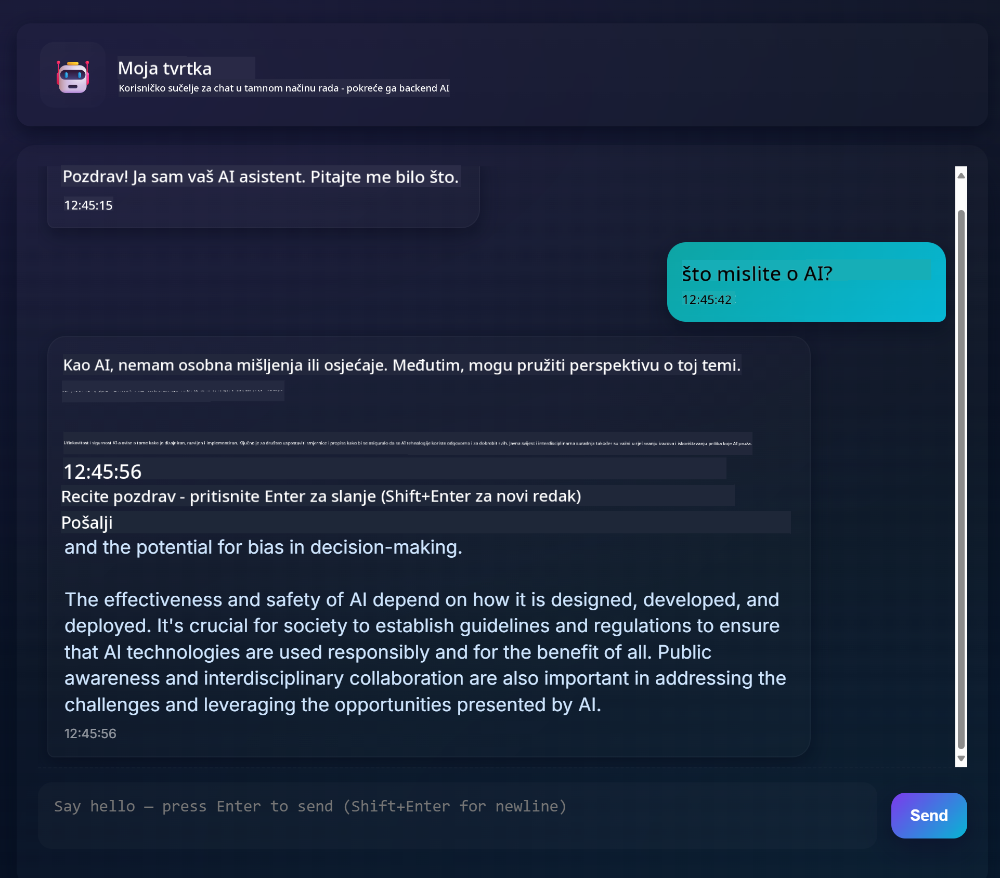
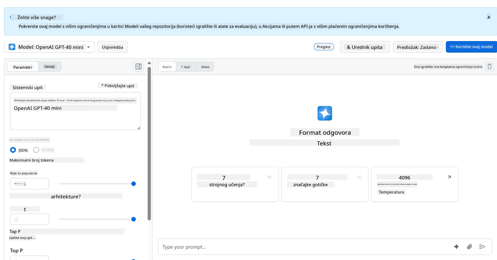
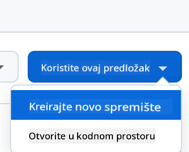

<!--
CO_OP_TRANSLATOR_METADATA:
{
  "original_hash": "11cf36165c243947b6cd85b88cf6faa6",
  "translation_date": "2025-09-01T17:03:03+00:00",
  "source_file": "9-chat-project/README.md",
  "language_code": "hr"
}
-->
# Chat projekt

Ovaj chat projekt pokazuje kako izraditi Chat Asistenta koristeći GitHub modele.

Evo kako izgleda gotov projekt:



Malo konteksta, izrada chat asistenata pomoću generativne umjetne inteligencije odličan je način za početak učenja o AI-ju. Tijekom ove lekcije naučit ćete kako integrirati generativnu AI u web aplikaciju, pa krenimo.

## Povezivanje s generativnom AI

Za backend koristimo GitHub modele. To je odlična usluga koja vam omogućuje korištenje AI-ja besplatno. Posjetite njihov playground i preuzmite kod koji odgovara vašem odabranom jeziku za backend. Evo kako to izgleda na [GitHub Models Playground](https://github.com/marketplace/models/azure-openai/gpt-4o-mini/playground)



Kao što smo rekli, odaberite karticu "Code" i svoj odabrani runtime.


### Korištenje Pythona

U ovom slučaju odabiremo Python, što znači da biramo ovaj kod:

```python
"""Run this model in Python

> pip install openai
"""
import os
from openai import OpenAI

# To authenticate with the model you will need to generate a personal access token (PAT) in your GitHub settings. 
# Create your PAT token by following instructions here: https://docs.github.com/en/authentication/keeping-your-account-and-data-secure/managing-your-personal-access-tokens
client = OpenAI(
    base_url="https://models.github.ai/inference",
    api_key=os.environ["GITHUB_TOKEN"],
)

response = client.chat.completions.create(
    messages=[
        {
            "role": "system",
            "content": "",
        },
        {
            "role": "user",
            "content": "What is the capital of France?",
        }
    ],
    model="openai/gpt-4o-mini",
    temperature=1,
    max_tokens=4096,
    top_p=1
)

print(response.choices[0].message.content)
```

Očistimo ovaj kod malo kako bi bio ponovno upotrebljiv:

```python
def call_llm(prompt: str, system_message: str):
    response = client.chat.completions.create(
        messages=[
            {
                "role": "system",
                "content": system_message,
            },
            {
                "role": "user",
                "content": prompt,
            }
        ],
        model="openai/gpt-4o-mini",
        temperature=1,
        max_tokens=4096,
        top_p=1
    )

    return response.choices[0].message.content
```

S ovom funkcijom `call_llm` sada možemo uzeti prompt i sistemski prompt, a funkcija će vratiti rezultat.

### Prilagodba AI asistenta

Ako želite prilagoditi AI asistenta, možete specificirati kako želite da se ponaša popunjavanjem sistemskog prompta ovako:

```python
call_llm("Tell me about you", "You're Albert Einstein, you only know of things in the time you were alive")
```

## Izlaganje putem Web API-ja

Odlično, završili smo AI dio, sada pogledajmo kako to možemo integrirati u Web API. Za Web API koristimo Flask, ali bilo koji web okvir bi trebao biti dobar. Pogledajmo kod za to:

### Korištenje Pythona

```python
# api.py
from flask import Flask, request, jsonify
from llm import call_llm
from flask_cors import CORS

app = Flask(__name__)
CORS(app)   # *   example.com

@app.route("/", methods=["GET"])
def index():
    return "Welcome to this API. Call POST /hello with 'message': 'my message' as JSON payload"


@app.route("/hello", methods=["POST"])
def hello():
    # get message from request body  { "message": "do this taks for me" }
    data = request.get_json()
    message = data.get("message", "")

    response = call_llm(message, "You are a helpful assistant.")
    return jsonify({
        "response": response
    })

if __name__ == "__main__":
    app.run(host="0.0.0.0", port=5000)
```

Ovdje kreiramo Flask API i definiramo zadanu rutu "/" i "/chat". Potonja je namijenjena za korištenje od strane našeg frontenda za slanje pitanja.

Za integraciju *llm.py* trebamo učiniti sljedeće:

- Importirati funkciju `call_llm`:

   ```python
   from llm import call_llm
   from flask import Flask, request
   ```

- Pozvati je iz rute "/chat":

   ```python
   @app.route("/hello", methods=["POST"])
   def hello():
      # get message from request body  { "message": "do this taks for me" }
      data = request.get_json()
      message = data.get("message", "")

      response = call_llm(message, "You are a helpful assistant.")
      return jsonify({
         "response": response
      })
   ```

   Ovdje analiziramo dolazni zahtjev kako bismo dohvatili svojstvo `message` iz JSON tijela. Nakon toga pozivamo LLM s ovim pozivom:

   ```python
   response = call_llm(message, "You are a helpful assistant")

   # return the response as JSON
   return jsonify({
      "response": response 
   })
   ```

Odlično, sada smo napravili što je potrebno.

## Konfiguriranje CORS-a

Trebamo napomenuti da smo postavili nešto poput CORS-a, dijeljenja resursa između različitih izvora. To znači da, budući da će naš backend i frontend raditi na različitim portovima, moramo omogućiti frontendu da poziva backend.

### Korištenje Pythona

Postoji dio koda u *api.py* koji to postavlja:

```python
from flask_cors import CORS

app = Flask(__name__)
CORS(app)   # *   example.com
```

Trenutno je postavljeno da dopušta "*" što znači sve izvore, a to nije baš sigurno. Trebali bismo to ograničiti kada idemo u produkciju.

## Pokretanje projekta

Za pokretanje projekta prvo trebate pokrenuti backend, a zatim frontend.

### Korištenje Pythona

Ok, imamo *llm.py* i *api.py*, kako to možemo pokrenuti s backendom? Postoje dvije stvari koje trebamo učiniti:

- Instalirati ovisnosti:

   ```sh
   cd backend
   python -m venv venv
   source ./venv/bin/activate

   pip install openai flask flask-cors openai
   ```

- Pokrenuti API

   ```sh
   python api.py
   ```

   Ako koristite Codespaces, trebate otići na Ports u donjem dijelu uređivača, desnim klikom odabrati "Port Visibility" i odabrati "Public".

### Rad na frontendu

Sada kada imamo API koji radi, kreirajmo frontend za to. Minimalni frontend koji ćemo postupno poboljšavati. U mapi *frontend* kreirajte sljedeće:

```text
backend/
frontend/
index.html
app.js
styles.css
```

Počnimo s **index.html**:

```html
<html>
    <head>
        <link rel="stylesheet" href="styles.css">
    </head>
    <body>
      <form>
        <textarea id="messages"></textarea>
        <input id="input" type="text" />
        <button type="submit" id="sendBtn">Send</button>  
      </form>  
      <script src="app.js" />
    </body>
</html>    
```

Ovo gore je apsolutni minimum potreban za podršku chat prozora, jer se sastoji od tekstualnog područja gdje će se prikazivati poruke, polja za unos gdje ćete upisivati poruku i gumba za slanje poruke na backend. Pogledajmo JavaScript u *app.js*

**app.js**

```js
// app.js

(function(){
  // 1. set up elements  
  const messages = document.getElementById("messages");
  const form = document.getElementById("form");
  const input = document.getElementById("input");

  const BASE_URL = "change this";
  const API_ENDPOINT = `${BASE_URL}/hello`;

  // 2. create a function that talks to our backend
  async function callApi(text) {
    const response = await fetch(API_ENDPOINT, {
      method: "POST",
      headers: { "Content-Type": "application/json" },
      body: JSON.stringify({ message: text })
    });
    let json = await response.json();
    return json.response;
  }

  // 3. add response to our textarea
  function appendMessage(text, role) {
    const el = document.createElement("div");
    el.className = `message ${role}`;
    el.innerHTML = text;
    messages.appendChild(el);
  }

  // 4. listen to submit events
  form.addEventListener("submit", async(e) => {
    e.preventDefault();
   // someone clicked the button in the form
   
   // get input
   const text = input.value.trim();

   appendMessage(text, "user")

   // reset it
   input.value = '';

   const reply = await callApi(text);

   // add to messages
   appendMessage(reply, "assistant");

  })
})();
```

Prođimo kroz kod po sekcijama:

- 1) Ovdje dobivamo referencu na sve elemente koje ćemo kasnije koristiti u kodu.
- 2) U ovom dijelu kreiramo funkciju koja koristi ugrađenu metodu `fetch` za pozivanje našeg backenda.
- 3) `appendMessage` pomaže dodati odgovore kao i ono što vi kao korisnik upišete.
- 4) Ovdje slušamo događaj submit i na kraju čitamo polje za unos, stavljamo korisnikovu poruku u tekstualno područje, pozivamo API i prikazujemo odgovor u tekstualnom području.

Pogledajmo sada stiliziranje, ovdje možete biti kreativni i napraviti izgled kakav želite, ali evo nekih prijedloga:

**styles.css**

```
.message {
    background: #222;
    box-shadow: 0 0 0 10px orange;
    padding: 10px:
    margin: 5px;
}

.message.user {
    background: blue;
}

.message.assistant {
    background: grey;
} 
```

S ove tri klase stilizirat ćete poruke različito ovisno o tome dolaze li od asistenta ili od vas kao korisnika. Ako trebate inspiraciju, pogledajte mapu `solution/frontend/styles.css`.

### Promjena osnovnog URL-a

Postoji jedna stvar koju ovdje nismo postavili, a to je `BASE_URL`. Ovo nije poznato dok vaš backend ne bude pokrenut. Da biste ga postavili:

- Ako pokrećete API lokalno, treba biti postavljen na nešto poput `http://localhost:5000`.
- Ako pokrećete u Codespaces, treba izgledati nešto poput "[name]app.github.dev".

## Zadatak

Kreirajte vlastitu mapu *project* sa sadržajem poput ovog:

```text
project/
  frontend/
    index.html
    app.js
    styles.css
  backend/
    ...
```

Kopirajte sadržaj prema gore navedenim uputama, ali slobodno prilagodite prema vlastitim željama.

## Rješenje

[Rješenje](./solution/README.md)

## Bonus

Pokušajte promijeniti osobnost AI asistenta.

### Za Python

Kada pozivate `call_llm` u *api.py*, možete promijeniti drugi argument u ono što želite, na primjer:

```python
call_llm(message, "You are Captain Picard")
```

### Frontend

Promijenite također CSS i tekst prema vlastitim željama, napravite promjene u *index.html* i *styles.css*.

## Sažetak

Odlično, naučili ste od nule kako stvoriti osobnog asistenta koristeći AI. To smo učinili koristeći GitHub modele, backend u Pythonu i frontend u HTML-u, CSS-u i JavaScriptu.

## Postavljanje s Codespaces

- Navigirajte na: [Web Dev For Beginners repo](https://github.com/microsoft/Web-Dev-For-Beginners)
- Kreirajte iz predloška (provjerite jeste li prijavljeni na GitHub) u gornjem desnom kutu:

    

- Kada ste u svom repozitoriju, kreirajte Codespace:

    

    Ovo bi trebalo pokrenuti okruženje s kojim sada možete raditi.

---

**Odricanje od odgovornosti**:  
Ovaj dokument je preveden pomoću AI usluge za prevođenje [Co-op Translator](https://github.com/Azure/co-op-translator). Iako nastojimo osigurati točnost, imajte na umu da automatski prijevodi mogu sadržavati pogreške ili netočnosti. Izvorni dokument na izvornom jeziku treba smatrati autoritativnim izvorom. Za ključne informacije preporučuje se profesionalni prijevod od strane ljudskog prevoditelja. Ne preuzimamo odgovornost za nesporazume ili pogrešna tumačenja koja mogu proizaći iz korištenja ovog prijevoda.