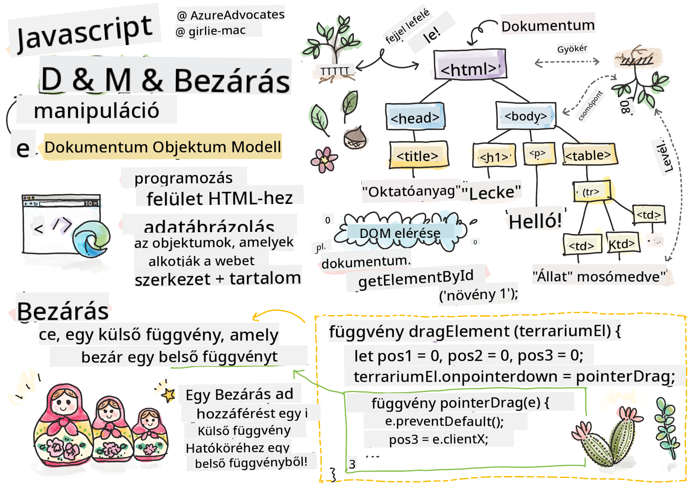
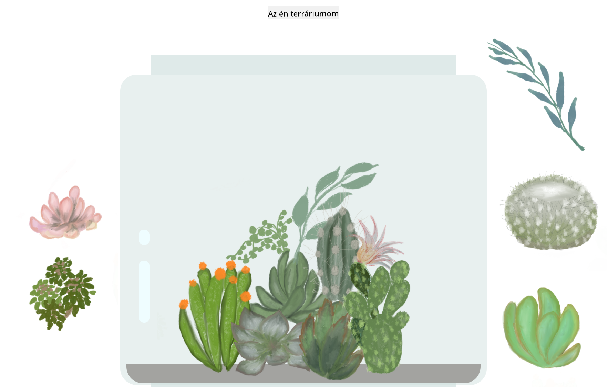

<!--
CO_OP_TRANSLATOR_METADATA:
{
  "original_hash": "61c14b27044861e5e69db35dd52c4403",
  "translation_date": "2025-08-29T10:34:54+00:00",
  "source_file": "3-terrarium/3-intro-to-DOM-and-closures/README.md",
  "language_code": "hu"
}
-->
# Terrárium Projekt 3. rész: DOM manipuláció és egy zárvány


> Sketchnote készítette: [Tomomi Imura](https://twitter.com/girlie_mac)

## Előadás előtti kvíz

[Előadás előtti kvíz](https://ff-quizzes.netlify.app/web/quiz/19)

### Bevezetés

A DOM, vagyis a "Document Object Model" manipulálása kulcsfontosságú része a webfejlesztésnek. Az [MDN](https://developer.mozilla.org/docs/Web/API/Document_Object_Model/Introduction) szerint: "A Document Object Model (DOM) a weben található dokumentumok szerkezetét és tartalmát alkotó objektumok adatábrázolása." A DOM manipulációval kapcsolatos kihívások gyakran vezettek ahhoz, hogy JavaScript keretrendszereket használjunk a DOM kezelésére ahelyett, hogy tiszta JavaScriptet alkalmaznánk, de mi most saját magunk fogjuk megoldani!

Ezen kívül ebben a leckében bemutatjuk a [JavaScript zárvány](https://developer.mozilla.org/docs/Web/JavaScript/Closures) fogalmát, amelyet úgy képzelhetsz el, mint egy funkciót, amelyet egy másik funkció zár körül, így a belső funkció hozzáférhet a külső funkció hatóköréhez.

> A JavaScript zárványok összetett és mély téma. Ez a lecke csak az alapötletet érinti, hogy a terrárium kódjában található egy zárvány: egy belső és egy külső funkció, amelyeket úgy konstruáltak, hogy a belső funkció hozzáférjen a külső funkció hatóköréhez. Ha többet szeretnél megtudni arról, hogyan működik ez, látogass el az [alapos dokumentációhoz](https://developer.mozilla.org/docs/Web/JavaScript/Closures).

Egy zárványt fogunk használni a DOM manipulálására.

Gondolj a DOM-ra úgy, mint egy fára, amely a weboldal dokumentumának minden manipulálható módját ábrázolja. Különböző API-k (Application Program Interfaces) készültek, hogy a programozók a választott programozási nyelvükkel hozzáférjenek a DOM-hoz, és szerkeszthessék, módosíthassák, átrendezhetik, vagy más módon kezelhessék azt.


> A DOM és az azt hivatkozó HTML markup ábrázolása. Készítette: [Olfa Nasraoui](https://www.researchgate.net/publication/221417012_Profile-Based_Focused_Crawler_for_Social_Media-Sharing_Websites)

Ebben a leckében befejezzük az interaktív terrárium projektünket azzal, hogy létrehozzuk a JavaScriptet, amely lehetővé teszi a felhasználó számára, hogy manipulálja a növényeket az oldalon.

### Előfeltétel

A terráriumod HTML-jének és CSS-ének már készen kell lennie. A lecke végére képes leszel a növényeket a terráriumba mozgatni és onnan kivenni, azokat húzással.

### Feladat

A terrárium mappádban hozz létre egy új fájlt `script.js` néven. Importáld ezt a fájlt a `<head>` szekcióban:

```html
	<script src="./script.js" defer></script>
```

> Megjegyzés: használd a `defer` attribútumot, amikor egy külső JavaScript fájlt importálsz a HTML fájlba, hogy a JavaScript csak akkor hajtódjon végre, amikor a HTML fájl teljesen betöltődött. Használhatnád az `async` attribútumot is, amely lehetővé teszi a script végrehajtását a HTML fájl elemzése közben, de a mi esetünkben fontos, hogy a HTML elemek teljesen elérhetők legyenek a húzás előtt.

---

## A DOM elemek

Az első dolog, amit meg kell tenned, hogy létrehozod a hivatkozásokat azokra az elemekre, amelyeket manipulálni szeretnél a DOM-ban. A mi esetünkben ezek a 14 növény, amelyek jelenleg az oldalsávokban várakoznak.

### Feladat

```html
dragElement(document.getElementById('plant1'));
dragElement(document.getElementById('plant2'));
dragElement(document.getElementById('plant3'));
dragElement(document.getElementById('plant4'));
dragElement(document.getElementById('plant5'));
dragElement(document.getElementById('plant6'));
dragElement(document.getElementById('plant7'));
dragElement(document.getElementById('plant8'));
dragElement(document.getElementById('plant9'));
dragElement(document.getElementById('plant10'));
dragElement(document.getElementById('plant11'));
dragElement(document.getElementById('plant12'));
dragElement(document.getElementById('plant13'));
dragElement(document.getElementById('plant14'));
```

Mi történik itt? A dokumentumot hivatkozod, és annak DOM-jában keresel egy elemet egy adott Id alapján. Emlékezz az első HTML leckére, amikor egyedi Id-ket adtál minden növény képének (`id="plant1"`)? Most hasznát veszed ennek az erőfeszítésnek. Miután azonosítottad az egyes elemeket, átadod azokat egy `dragElement` nevű funkciónak, amelyet hamarosan létrehozol. Így az elem a HTML-ben mostantól húzhatóvá válik, vagy hamarosan azzá válik.

✅ Miért hivatkozunk elemekre Id alapján? Miért nem a CSS osztályuk alapján? Ezt a kérdést az előző CSS leckében találhatod meg.

---

## A zárvány

Most készen állsz arra, hogy létrehozd a `dragElement` zárványt, amely egy külső funkció, amely körülvesz egy vagy több belső funkciót (a mi esetünkben három lesz).

A zárványok hasznosak, amikor egy vagy több funkciónak hozzá kell férnie egy külső funkció hatóköréhez. Íme egy példa:

```javascript
function displayCandy(){
	let candy = ['jellybeans'];
	function addCandy(candyType) {
		candy.push(candyType)
	}
	addCandy('gumdrops');
}
displayCandy();
console.log(candy)
```

Ebben a példában a `displayCandy` funkció körülvesz egy funkciót, amely egy új cukorka típust ad hozzá egy már létező tömbhöz a funkcióban. Ha futtatnád ezt a kódot, a `candy` tömb nem lenne elérhető, mivel ez egy lokális változó (lokális a zárványhoz).

✅ Hogyan teheted elérhetővé a `candy` tömböt? Próbáld meg áthelyezni a zárványon kívülre. Így a tömb globálissá válik, ahelyett, hogy csak a zárvány lokális hatókörében maradna.

### Feladat

A `script.js` fájlban az elemek deklarációi alatt hozz létre egy funkciót:

```javascript
function dragElement(terrariumElement) {
	//set 4 positions for positioning on the screen
	let pos1 = 0,
		pos2 = 0,
		pos3 = 0,
		pos4 = 0;
	terrariumElement.onpointerdown = pointerDrag;
}
```

A `dragElement` a `terrariumElement` objektumot kapja a script tetején lévő deklarációkból. Ezután néhány lokális pozíciót állít be `0` értékre az objektumhoz, amelyet a funkcióba adtak. Ezek azok a lokális változók, amelyeket minden egyes elemhez manipulálni fogsz, amikor húzás és ejtés funkciót adsz hozzá a zárványon belül. A terráriumot ezek a húzott elemek fogják benépesíteni, így az alkalmazásnak nyomon kell követnie, hogy hol helyezkednek el.

Ezen kívül a funkcióba adott `terrariumElement`-hez egy `pointerdown` eseményt rendelünk, amely a [web API-k](https://developer.mozilla.org/docs/Web/API) része, és segít a DOM kezelésében. Az `onpointerdown` akkor aktiválódik, amikor egy gombot megnyomnak, vagy a mi esetünkben egy húzható elemet megérintenek. Ez az eseménykezelő mind [webes, mind mobil böngészőkön](https://caniuse.com/?search=onpointerdown) működik, néhány kivétellel.

✅ Az [`onclick` eseménykezelő](https://developer.mozilla.org/docs/Web/API/GlobalEventHandlers/onclick) sokkal szélesebb körű támogatást élvez a böngészők között; miért nem használod itt? Gondolj arra, hogy pontosan milyen típusú képernyő-interakciót próbálsz létrehozni.

---

## A Pointerdrag funkció

A `terrariumElement` készen áll arra, hogy körbehúzzák; amikor az `onpointerdown` esemény aktiválódik, a `pointerDrag` funkció kerül meghívásra. Add hozzá ezt a funkciót közvetlenül az alábbi sor alá: `terrariumElement.onpointerdown = pointerDrag;`:

### Feladat 

```javascript
function pointerDrag(e) {
	e.preventDefault();
	console.log(e);
	pos3 = e.clientX;
	pos4 = e.clientY;
}
```

Több dolog történik. Először is, megakadályozod az alapértelmezett eseményeket, amelyek általában pointerdown esetén történnek, az `e.preventDefault();` használatával. Így nagyobb kontrollt kapsz az interfész viselkedése felett.

> Térj vissza ehhez a sorhoz, amikor teljesen felépítetted a script fájlt, és próbáld ki `e.preventDefault()` nélkül - mi történik?

Másodszor, nyisd meg az `index.html` fájlt egy böngészőablakban, és vizsgáld meg az interfészt. Amikor rákattintasz egy növényre, láthatod, hogyan kerül rögzítésre az 'e' esemény. Nézd meg az eseményt, hogy mennyi információt gyűjt egy pointer down esemény!

Ezután jegyezd meg, hogyan állítják be a lokális változókat `pos3` és `pos4` az e.clientX értékére. Az `e` értékeket megtalálhatod az ellenőrző panelen. Ezek az értékek rögzítik a növény x és y koordinátáit abban a pillanatban, amikor rákattintasz vagy megérinted. Finomhangolni kell a növények viselkedését, amikor kattintasz és húzod őket, ezért nyomon követed a koordinátáikat.

✅ Kezd világosabbá válni, miért épül az egész alkalmazás egy nagy zárványra? Ha nem így lenne, hogyan tartanád fenn a hatókört mind a 14 húzható növényhez?

Fejezd be az inicializáló funkciót azzal, hogy két további pointer esemény manipulációt adsz hozzá a `pos4 = e.clientY` alá:

```html
document.onpointermove = elementDrag;
document.onpointerup = stopElementDrag;
```
Most azt jelzed, hogy a növényt a pointerrel együtt akarod húzni, amikor mozgatod, és hogy a húzási gesztusnak meg kell állnia, amikor elengeded a növényt. Az `onpointermove` és az `onpointerup` ugyanannak az API-nak a részei, mint az `onpointerdown`. Az interfész most hibákat fog dobni, mivel még nem definiáltad az `elementDrag` és a `stopElementDrag` funkciókat, így ezeket építsd ki következőként.

## Az elementDrag és stopElementDrag funkciók

A zárványt két további belső funkcióval fogod befejezni, amelyek kezelik, mi történik, amikor egy növényt húzol, és amikor abbahagyod a húzását. A kívánt viselkedés az, hogy bármikor húzhatsz egy növényt, és bárhol elhelyezheted a képernyőn. Ez az interfész meglehetősen szabad (például nincs ejtési zóna), hogy lehetővé tegye számodra, hogy pontosan úgy tervezd meg a terráriumodat, ahogy szeretnéd, növények hozzáadásával, eltávolításával és áthelyezésével.

### Feladat

Add hozzá az `elementDrag` funkciót közvetlenül a `pointerDrag` záró kapcsos zárójele után:

```javascript
function elementDrag(e) {
	pos1 = pos3 - e.clientX;
	pos2 = pos4 - e.clientY;
	pos3 = e.clientX;
	pos4 = e.clientY;
	console.log(pos1, pos2, pos3, pos4);
	terrariumElement.style.top = terrariumElement.offsetTop - pos2 + 'px';
	terrariumElement.style.left = terrariumElement.offsetLeft - pos1 + 'px';
}
```
Ebben a funkcióban sokat szerkesztesz az 1-4 pozíciók kezdeti értékein, amelyeket lokális változóként állítottál be a külső funkcióban. Mi történik itt?

Amikor húzol, újra hozzárendeled a `pos1` értékét úgy, hogy egyenlővé teszed a `pos3`-mal (amelyet korábban `e.clientX`-ként állítottál be), mínusz az aktuális `e.clientX` értékkel. Hasonló műveletet végzel a `pos2`-vel. Ezután újra beállítod a `pos3` és `pos4` értékét az elem új X és Y koordinátáira. Ezeket a változásokat a konzolban figyelheted meg, miközben húzol. Ezután manipulálod a növény CSS stílusát, hogy beállítsd az új pozícióját az 1-es és 2-es pozíciók új értékei alapján, kiszámítva a növény felső és bal X és Y koordinátáit az eltolás összehasonlításával ezekkel az új pozíciókkal.

> Az `offsetTop` és az `offsetLeft` CSS tulajdonságok, amelyek egy elem pozícióját állítják be a szülőjéhez képest; a szülő bármely olyan elem lehet, amely nem `static` pozíciójú.

Ez az összes pozíció újraszámítása lehetővé teszi, hogy finomhangold a terrárium és a növények viselkedését.

### Feladat 

Az interfész befejezéséhez add hozzá a `stopElementDrag` funkciót az `elementDrag` záró kapcsos zárójele után:

```javascript
function stopElementDrag() {
	document.onpointerup = null;
	document.onpointermove = null;
}
```

Ez a kis funkció visszaállítja az `onpointerup` és `onpointermove` eseményeket, hogy újraindíthasd a növény mozgását azzal, hogy újra elkezded húzni, vagy elkezdhetsz húzni egy új növényt.

✅ Mi történik, ha nem állítod nullára ezeket az eseményeket?

Most befejezted a projektedet!

🥇Gratulálunk! Elkészítetted a gyönyörű terráriumodat! 

---

## 🚀Kihívás

Adj új eseménykezelőt a zárványodhoz, hogy valami mást is csináljon a növényekkel; például dupla kattintással hozd előre egy növényt. Légy kreatív!

## Előadás utáni kvíz

[Előadás utáni kvíz](https://ff-quizzes.netlify.app/web/quiz/20)

## Áttekintés és önálló tanulás

Bár az elemek képernyőn való húzása triviálisnak tűnhet, számos módja van ennek, és sok buktató, attól függően, hogy milyen hatást szeretnél elérni. Valójában létezik egy teljes [drag and drop API](https://developer.mozilla.org/docs/Web/API/HTML_Drag_and_Drop_API), amelyet kipróbálhatsz. Nem használtuk ezt a modulban, mert az általunk kívánt hatás kissé eltérő volt, de próbáld ki ezt az API-t a saját projekteden, és nézd meg, mit érhetsz el.

További információt találhatsz a pointer eseményekről a [W3C dokumentációban](https://www.w3.org/TR/pointerevents1/) és az [MDN webes dokumentációban](https://developer.mozilla.org/docs/Web/API/Pointer_events).

Mindig ellenőrizd a böngésző képességeit a [CanIUse.com](https://caniuse.com/) segítségével.

## Feladat

[Dolgozz még egy kicsit a DOM-mal](assignment.md)

---

**Felelősségkizárás**:  
Ezt a dokumentumot az [Co-op Translator](https://github.com/Azure/co-op-translator) AI fordítószolgáltatás segítségével fordítottuk le. Bár törekszünk a pontosságra, kérjük, vegye figyelembe, hogy az automatikus fordítások hibákat vagy pontatlanságokat tartalmazhatnak. Az eredeti dokumentum az eredeti nyelvén tekintendő hiteles forrásnak. Kritikus információk esetén javasolt a professzionális, emberi fordítás igénybevétele. Nem vállalunk felelősséget a fordítás használatából eredő félreértésekért vagy téves értelmezésekért.