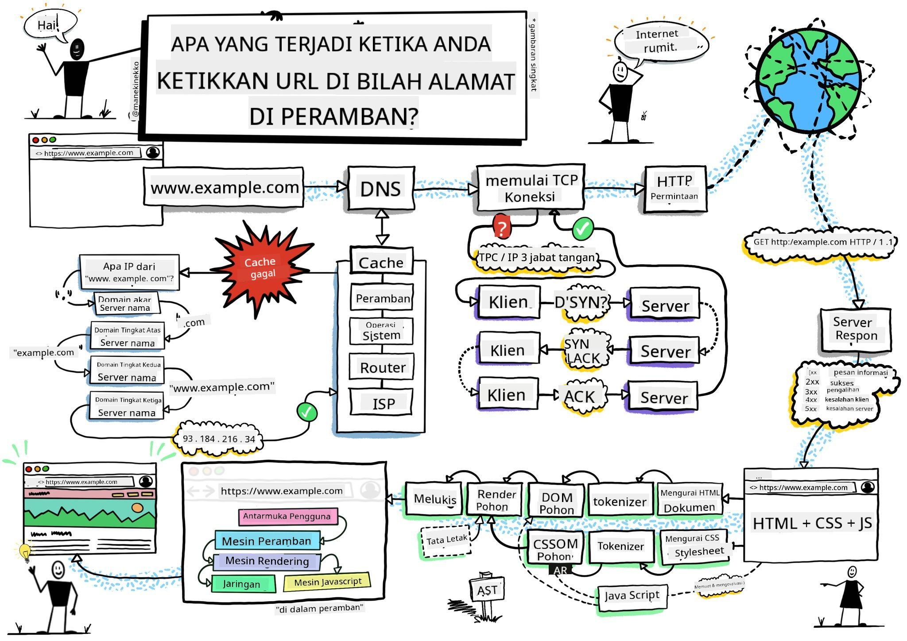
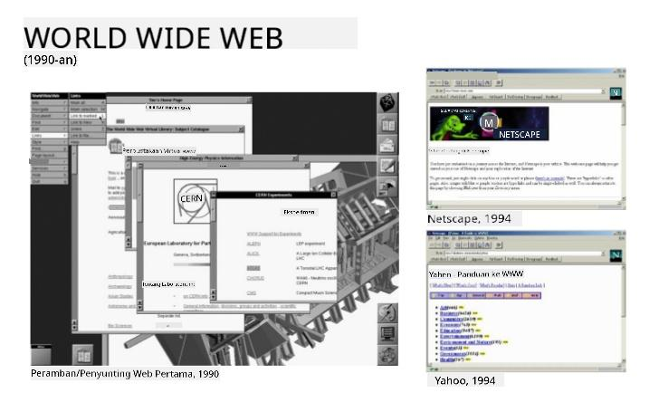
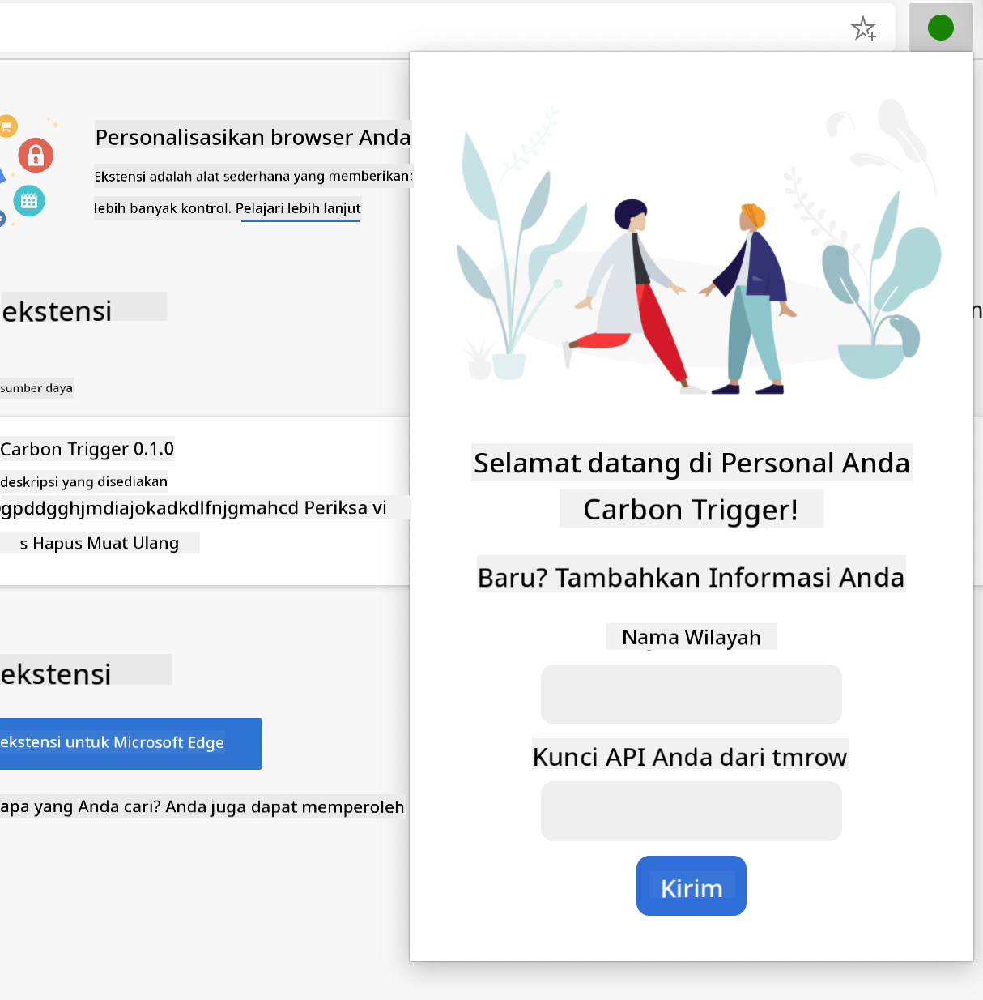
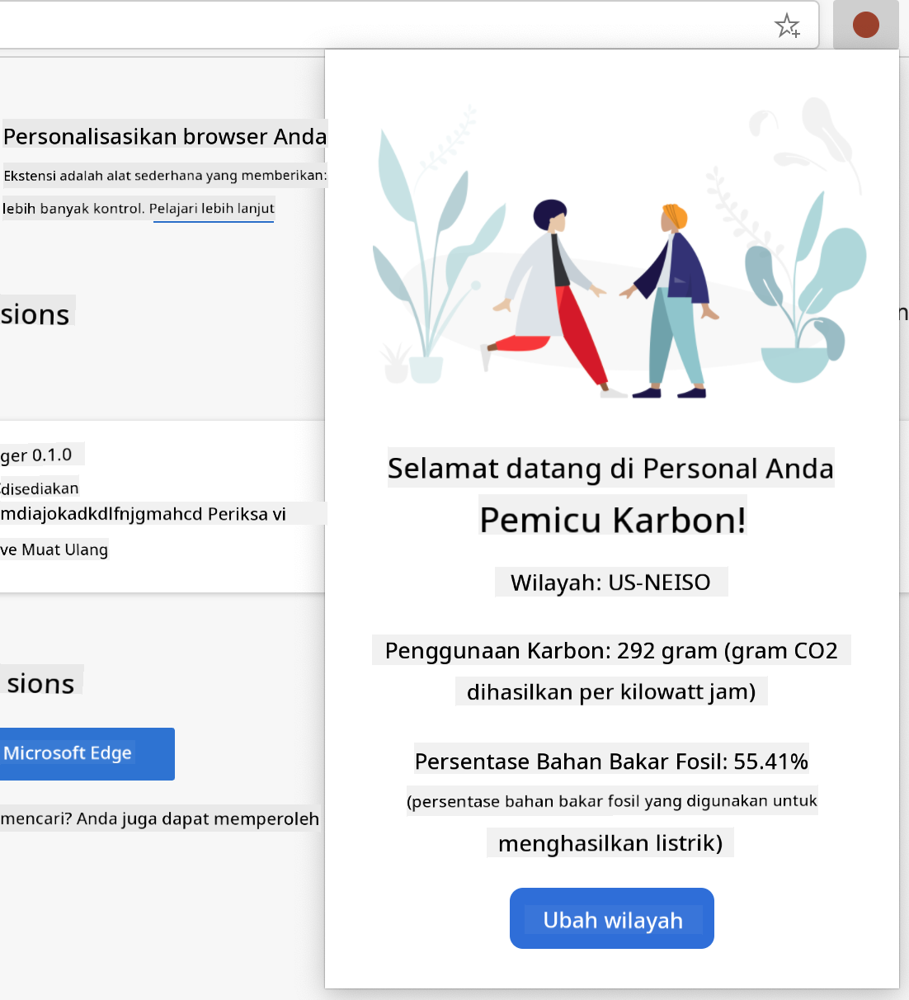

<!--
CO_OP_TRANSLATOR_METADATA:
{
  "original_hash": "2326d04e194a10aa760b51f5e5a1f61d",
  "translation_date": "2025-08-29T09:08:20+00:00",
  "source_file": "5-browser-extension/1-about-browsers/README.md",
  "language_code": "id"
}
-->
# Proyek Ekstensi Browser Bagian 1: Semua Tentang Browser


> Sketchnote oleh [Wassim Chegham](https://dev.to/wassimchegham/ever-wondered-what-happens-when-you-type-in-a-url-in-an-address-bar-in-a-browser-3dob)

## Kuis Pra-Kuliah

[Kuis pra-kuliah](https://ff-quizzes.netlify.app/web/quiz/23)

### Pendahuluan

Ekstensi browser menambahkan fungsionalitas tambahan ke browser. Namun sebelum Anda membuatnya, Anda perlu mempelajari sedikit tentang cara kerja browser.

### Tentang Browser

Dalam rangkaian pelajaran ini, Anda akan belajar cara membuat ekstensi browser yang dapat digunakan di browser Chrome, Firefox, dan Edge. Pada bagian ini, Anda akan mempelajari cara kerja browser dan membuat kerangka elemen-elemen ekstensi browser.

Tapi apa sebenarnya browser itu? Browser adalah aplikasi perangkat lunak yang memungkinkan pengguna akhir mengakses konten dari server dan menampilkannya di halaman web.

✅ Sedikit sejarah: browser pertama disebut 'WorldWideWeb' dan dibuat oleh Sir Timothy Berners-Lee pada tahun 1990.


> Beberapa browser awal, via [Karen McGrane](https://www.slideshare.net/KMcGrane/week-4-ixd-history-personal-computing)

Ketika seorang pengguna terhubung ke internet menggunakan alamat URL (Uniform Resource Locator), biasanya menggunakan Hypertext Transfer Protocol melalui alamat `http` atau `https`, browser berkomunikasi dengan server web dan mengambil halaman web.

Pada titik ini, mesin perenderan browser menampilkannya di perangkat pengguna, yang bisa berupa ponsel, desktop, atau laptop.

Browser juga memiliki kemampuan untuk menyimpan cache konten sehingga tidak perlu diambil dari server setiap saat. Mereka dapat merekam riwayat aktivitas penelusuran pengguna, menyimpan 'cookie', yaitu potongan data kecil yang berisi informasi untuk menyimpan aktivitas pengguna, dan banyak lagi.

Hal yang sangat penting untuk diingat tentang browser adalah bahwa mereka tidak semuanya sama! Setiap browser memiliki kelebihan dan kekurangannya, dan seorang pengembang web profesional perlu memahami cara membuat halaman web bekerja dengan baik di berbagai browser. Ini termasuk menangani tampilan kecil seperti ponsel, serta pengguna yang sedang offline.

Sebuah situs web yang sangat berguna dan mungkin perlu Anda tandai di browser favorit Anda adalah [caniuse.com](https://www.caniuse.com). Saat Anda membuat halaman web, sangat membantu untuk menggunakan daftar teknologi yang didukung oleh caniuse agar Anda dapat mendukung pengguna Anda dengan lebih baik.

✅ Bagaimana Anda bisa mengetahui browser apa yang paling populer di antara basis pengguna situs web Anda? Periksa analitik Anda - Anda dapat menginstal berbagai paket analitik sebagai bagian dari proses pengembangan web Anda, dan mereka akan memberi tahu Anda browser apa yang paling sering digunakan oleh pengguna.

## Ekstensi Browser

Mengapa Anda ingin membuat ekstensi browser? Ekstensi adalah alat yang berguna untuk ditambahkan ke browser Anda ketika Anda membutuhkan akses cepat ke tugas-tugas yang sering Anda ulangi. Misalnya, jika Anda sering memeriksa warna pada berbagai halaman web yang Anda kunjungi, Anda mungkin menginstal ekstensi browser pemilih warna. Jika Anda kesulitan mengingat kata sandi, Anda mungkin menggunakan ekstensi pengelola kata sandi.

Membuat ekstensi browser juga menyenangkan. Biasanya, ekstensi ini mengelola sejumlah tugas tertentu yang dilakukan dengan baik.

✅ Apa ekstensi browser favorit Anda? Tugas apa yang mereka lakukan?

### Menginstal Ekstensi

Sebelum Anda mulai membuat, lihat proses membangun dan menerapkan ekstensi browser. Meskipun setiap browser memiliki sedikit perbedaan dalam cara mereka mengelola tugas ini, prosesnya serupa di Chrome dan Firefox seperti contoh di Edge:


> Catatan: Pastikan untuk mengaktifkan mode pengembang dan izinkan ekstensi dari toko lain.

Secara garis besar, prosesnya adalah:

- buat ekstensi Anda menggunakan `npm run build` 
- navigasikan di browser ke panel ekstensi menggunakan tombol "Settings and more" (ikon `...`) di kanan atas
- jika ini adalah instalasi baru, pilih `load unpacked` untuk mengunggah ekstensi baru dari folder build-nya (dalam kasus kita adalah `/dist`) 
- atau, klik `reload` jika Anda memuat ulang ekstensi yang sudah diinstal

✅ Instruksi ini berlaku untuk ekstensi yang Anda buat sendiri; untuk menginstal ekstensi yang telah dirilis ke toko ekstensi browser masing-masing, Anda harus menavigasi ke [toko-toko tersebut](https://microsoftedge.microsoft.com/addons/Microsoft-Edge-Extensions-Home) dan menginstal ekstensi pilihan Anda.

### Mulai

Anda akan membuat ekstensi browser yang menampilkan jejak karbon wilayah Anda, menunjukkan penggunaan energi wilayah Anda dan sumber energinya. Ekstensi ini akan memiliki formulir yang mengumpulkan kunci API sehingga Anda dapat mengakses API CO2 Signal.

**Yang Anda butuhkan:**

- [kunci API](https://www.co2signal.com/); masukkan email Anda di kotak pada halaman ini dan kunci akan dikirimkan kepada Anda
- [kode untuk wilayah Anda](http://api.electricitymap.org/v3/zones) yang sesuai dengan [Electricity Map](https://www.electricitymap.org/map) (di Boston, misalnya, saya menggunakan 'US-NEISO').
- [kode awal](../../../../5-browser-extension/start). Unduh folder `start`; Anda akan melengkapi kode di folder ini.
- [NPM](https://www.npmjs.com) - NPM adalah alat manajemen paket; instal secara lokal dan paket-paket yang terdaftar di file `package.json` Anda akan diinstal untuk digunakan oleh aset web Anda

✅ Pelajari lebih lanjut tentang manajemen paket di [modul pembelajaran yang sangat baik ini](https://docs.microsoft.com/learn/modules/create-nodejs-project-dependencies/?WT.mc_id=academic-77807-sagibbon)

Luangkan waktu sejenak untuk melihat basis kode:

dist
    -|manifest.json (pengaturan default di sini)
    -|index.html (markup HTML front-end di sini)
    -|background.js (JS latar belakang di sini)
    -|main.js (JS yang telah dibangun)
src
    -|index.js (kode JS Anda di sini)

✅ Setelah Anda memiliki kunci API dan kode wilayah Anda, simpan di suatu tempat untuk digunakan di masa depan.

### Bangun HTML untuk Ekstensi

Ekstensi ini memiliki dua tampilan. Satu untuk mengumpulkan kunci API dan kode wilayah:



Dan yang kedua untuk menampilkan penggunaan karbon wilayah:



Mari kita mulai dengan membangun HTML untuk formulir dan menatanya dengan CSS.

Di folder `/dist`, Anda akan membuat formulir dan area hasil. Dalam file `index.html`, isi area formulir yang telah ditentukan:

```HTML
<form class="form-data" autocomplete="on">
	<div>
		<h2>New? Add your Information</h2>
	</div>
	<div>
		<label for="region">Region Name</label>
		<input type="text" id="region" required class="region-name" />
	</div>
	<div>
		<label for="api">Your API Key from tmrow</label>
		<input type="text" id="api" required class="api-key" />
	</div>
	<button class="search-btn">Submit</button>
</form>	
```
Ini adalah formulir tempat informasi yang disimpan akan dimasukkan dan disimpan ke penyimpanan lokal.

Selanjutnya, buat area hasil; di bawah tag formulir terakhir, tambahkan beberapa div:

```HTML
<div class="result">
	<div class="loading">loading...</div>
	<div class="errors"></div>
	<div class="data"></div>
	<div class="result-container">
		<p><strong>Region: </strong><span class="my-region"></span></p>
		<p><strong>Carbon Usage: </strong><span class="carbon-usage"></span></p>
		<p><strong>Fossil Fuel Percentage: </strong><span class="fossil-fuel"></span></p>
	</div>
	<button class="clear-btn">Change region</button>
</div>
```
Pada titik ini, Anda dapat mencoba membangun. Pastikan untuk menginstal dependensi paket dari ekstensi ini:

```
npm install
```

Perintah ini akan menggunakan npm, Manajer Paket Node, untuk menginstal webpack untuk proses pembangunan ekstensi Anda. Webpack adalah alat bundler yang menangani kompilasi kode. Anda dapat melihat output dari proses ini dengan melihat di `/dist/main.js` - Anda akan melihat kode telah dibundel.

Untuk saat ini, ekstensi harus dapat dibangun dan, jika Anda menerapkannya ke Edge sebagai ekstensi, Anda akan melihat formulir yang ditampilkan dengan rapi.

Selamat, Anda telah mengambil langkah pertama menuju pembuatan ekstensi browser. Dalam pelajaran berikutnya, Anda akan membuatnya lebih fungsional dan berguna.

---

## 🚀 Tantangan

Lihat toko ekstensi browser dan instal salah satu ke browser Anda. Anda dapat memeriksa file-filenya dengan cara yang menarik. Apa yang Anda temukan?

## Kuis Pasca-Kuliah

[Kuis pasca-kuliah](https://ff-quizzes.netlify.app/web/quiz/24)

## Tinjauan & Studi Mandiri

Dalam pelajaran ini, Anda mempelajari sedikit tentang sejarah browser web; manfaatkan kesempatan ini untuk mempelajari bagaimana para penemu World Wide Web membayangkan penggunaannya dengan membaca lebih lanjut tentang sejarahnya. Beberapa situs yang berguna meliputi:

[The History of Web Browsers](https://www.mozilla.org/firefox/browsers/browser-history/)

[History of the Web](https://webfoundation.org/about/vision/history-of-the-web/)

[Wawancara dengan Tim Berners-Lee](https://www.theguardian.com/technology/2019/mar/12/tim-berners-lee-on-30-years-of-the-web-if-we-dream-a-little-we-can-get-the-web-we-want)

## Tugas 

[Ubah gaya ekstensi Anda](assignment.md)

---

**Penafian**:  
Dokumen ini telah diterjemahkan menggunakan layanan penerjemahan AI [Co-op Translator](https://github.com/Azure/co-op-translator). Meskipun kami berusaha untuk memberikan hasil yang akurat, harap diingat bahwa terjemahan otomatis mungkin mengandung kesalahan atau ketidakakuratan. Dokumen asli dalam bahasa aslinya harus dianggap sebagai sumber yang otoritatif. Untuk informasi yang bersifat kritis, disarankan menggunakan jasa penerjemahan manusia profesional. Kami tidak bertanggung jawab atas kesalahpahaman atau penafsiran yang keliru yang timbul dari penggunaan terjemahan ini.