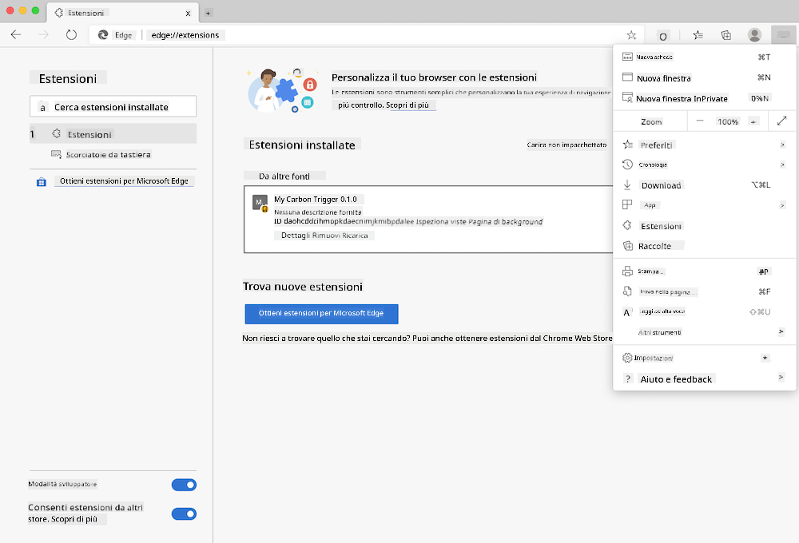

<!--
CO_OP_TRANSLATOR_METADATA:
{
  "original_hash": "9361268ca430b2579375009e1eceb5e5",
  "translation_date": "2025-08-25T23:58:30+00:00",
  "source_file": "5-browser-extension/solution/translation/README.fr.md",
  "language_code": "it"
}
-->
# Estensione del browser Carbon Trigger: Codice completato

Utilizzando l'API CO2 Signal di tmrow per monitorare il consumo di elettricità, crea un'estensione del browser in modo da avere un promemoria direttamente nel tuo browser sul consumo di elettricità della tua regione. L'uso di questa estensione ad hoc ti aiuterà a prendere decisioni sulle tue attività basandoti su queste informazioni.


## Iniziare

Dovrai avere [npm](https://npmjs.com) installato. Scarica una copia di questo codice in una cartella sul tuo computer.

Installa tutti i pacchetti richiesti:

```
npm install
```

Compila l'estensione con webpack

```
npm run build
```

Per installare su Edge, utilizza il menu 'tre puntini' nell'angolo in alto a destra del browser per trovare il pannello Estensioni. Da lì, seleziona 'Carica estensione non compressa' per caricare una nuova estensione. Apri la cartella 'dist' quando richiesto e l'estensione verrà caricata. Per utilizzarla, avrai bisogno di una chiave API per l'API di CO2 Signal ([ottienila qui via e-mail](https://www.co2signal.com/) - inserisci il tuo indirizzo e-mail nel campo su questa pagina) e del [codice per la tua regione](http://api.electricitymap.org/v3/zones) corrispondente alla [Mappa dell'elettricità](https://www.electricitymap.org/map) (a Boston, ad esempio, utilizzo 'US-NEISO').



Una volta inseriti la chiave API e la regione nell'interfaccia dell'estensione, il punto colorato nella barra delle estensioni del browser dovrebbe cambiare per riflettere il consumo di energia della tua regione e fornirti un indicatore sulle attività ad alto consumo energetico che sarebbe opportuno svolgere. Il concetto dietro questo sistema di 'punti' mi è stato ispirato dall'[estensione Energy Lollipop](https://energylollipop.com/) per le emissioni in California.

**Disclaimer**:  
Questo documento è stato tradotto utilizzando il servizio di traduzione automatica [Co-op Translator](https://github.com/Azure/co-op-translator). Sebbene ci impegniamo per garantire l'accuratezza, si prega di notare che le traduzioni automatiche possono contenere errori o imprecisioni. Il documento originale nella sua lingua nativa dovrebbe essere considerato la fonte autorevole. Per informazioni critiche, si raccomanda una traduzione professionale effettuata da un traduttore umano. Non siamo responsabili per eventuali incomprensioni o interpretazioni errate derivanti dall'uso di questa traduzione.