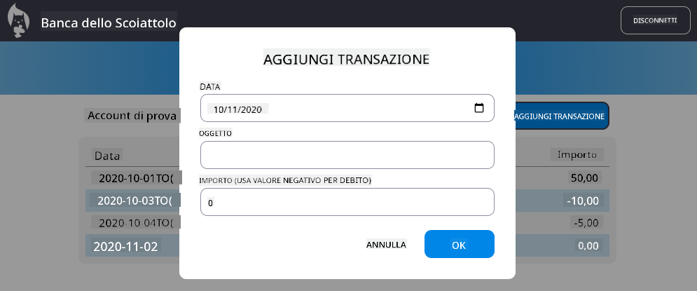

<!--
CO_OP_TRANSLATOR_METADATA:
{
  "original_hash": "f23a868536c07da991b1d4e773161e25",
  "translation_date": "2025-08-26T00:50:11+00:00",
  "source_file": "7-bank-project/4-state-management/assignment.md",
  "language_code": "it"
}
-->
# Implementare il dialogo "Aggiungi transazione"

## Istruzioni

La nostra app bancaria manca ancora di una funzionalità importante: la possibilità di inserire nuove transazioni.
Utilizzando tutto ciò che hai imparato nelle quattro lezioni precedenti, implementa un dialogo "Aggiungi transazione":

- Aggiungi un pulsante "Aggiungi transazione" nella pagina della dashboard
- Crea una nuova pagina con un template HTML oppure utilizza JavaScript per mostrare/nascondere l'HTML del dialogo senza lasciare la pagina della dashboard (puoi usare la proprietà [`hidden`](https://developer.mozilla.org/docs/Web/HTML/Global_attributes/hidden) per questo, o le classi CSS)
- Assicurati di gestire [l'accessibilità per tastiera e screen reader](https://developer.paciellogroup.com/blog/2018/06/the-current-state-of-modal-dialog-accessibility/) per il dialogo
- Implementa un modulo HTML per ricevere i dati di input
- Crea dati JSON a partire dai dati del modulo e inviali all'API
- Aggiorna la pagina della dashboard con i nuovi dati

Consulta le [specifiche dell'API del server](../api/README.md) per vedere quale API devi chiamare e qual è il formato JSON previsto.

Ecco un esempio del risultato dopo aver completato l'assegnazione:

## Rubrica

| Criteri  | Esemplare                                                                                         | Adeguato                                                                                                                | Da migliorare                               |
| -------- | ------------------------------------------------------------------------------------------------- | ----------------------------------------------------------------------------------------------------------------------- | ------------------------------------------- |
|          | L'aggiunta di una transazione è implementata completamente seguendo tutte le migliori pratiche viste nelle lezioni. | L'aggiunta di una transazione è implementata, ma non seguendo le migliori pratiche viste nelle lezioni, o funziona solo parzialmente. | L'aggiunta di una transazione non funziona affatto. |

**Disclaimer**:  
Questo documento è stato tradotto utilizzando il servizio di traduzione automatica [Co-op Translator](https://github.com/Azure/co-op-translator). Sebbene ci impegniamo per garantire l'accuratezza, si prega di tenere presente che le traduzioni automatiche possono contenere errori o imprecisioni. Il documento originale nella sua lingua nativa dovrebbe essere considerato la fonte autorevole. Per informazioni critiche, si raccomanda una traduzione professionale effettuata da un esperto umano. Non siamo responsabili per eventuali incomprensioni o interpretazioni errate derivanti dall'uso di questa traduzione.