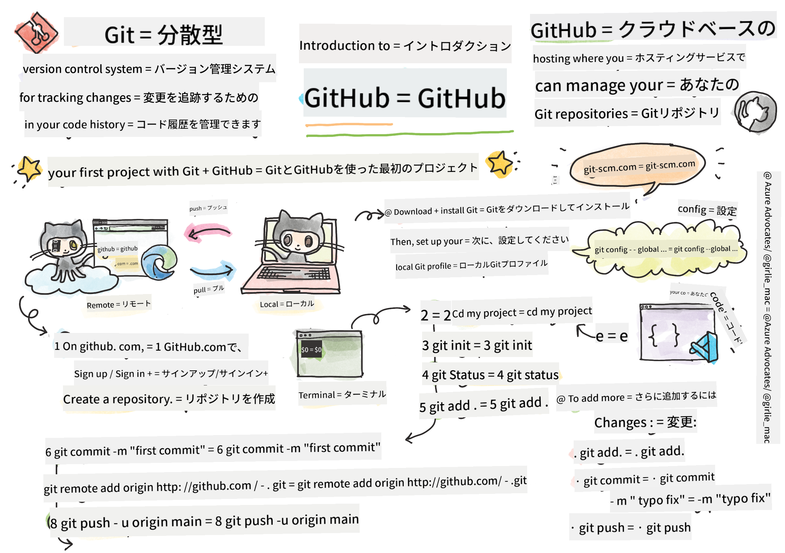

<!--
CO_OP_TRANSLATOR_METADATA:
{
  "original_hash": "361249da70432ddfd4741c917d1a6f50",
  "translation_date": "2025-08-28T18:03:29+00:00",
  "source_file": "1-getting-started-lessons/2-github-basics/README.md",
  "language_code": "ja"
}
-->
# GitHubの紹介

このレッスンでは、コードをホストし、変更を管理するためのプラットフォームであるGitHubの基本を学びます。


> スケッチノート: [Tomomi Imura](https://twitter.com/girlie_mac)

## 講義前クイズ
[講義前クイズ](https://ff-quizzes.netlify.app)

## はじめに

このレッスンでは以下を学びます：

- 自分のマシン上での作業の追跡
- 他の人とプロジェクトを進める方法
- オープンソースソフトウェアへの貢献方法

### 前提条件

始める前に、Gitがインストールされているか確認してください。ターミナルで以下を入力します：
`git --version`

Gitがインストールされていない場合は、[Gitをダウンロード](https://git-scm.com/downloads)してください。その後、ターミナルでローカルGitプロファイルを設定します：
* `git config --global user.name "your-name"`
* `git config --global user.email "your-email"`

Gitがすでに設定されているか確認するには、以下を入力します：
`git config --list`

また、GitHubアカウント、コードエディタ（例: Visual Studio Code）、ターミナル（またはコマンドプロンプト）も必要です。

[github.com](https://github.com/)にアクセスして、まだアカウントを作成していない場合は作成し、ログインしてプロフィールを埋めてください。

✅ GitHubは世界で唯一のコードリポジトリではありません。他にもありますが、GitHubが最もよく知られています。

### 準備

ローカルマシン（ノートPCまたはPC）にコードプロジェクトのフォルダを用意し、他の人のプロジェクトに貢献する方法を学ぶための例として、GitHub上に公開リポジトリを作成してください。

---

## コード管理

ローカルにコードプロジェクトのフォルダがあり、その進捗をバージョン管理システムであるgitを使って追跡したいとします。一部の人は、gitを使うことを「未来の自分へのラブレターを書くこと」に例えます。数日、数週間、または数か月後にコミットメッセージを読むことで、なぜその決定をしたのかを思い出したり、変更を「ロールバック」したりすることができます。ただし、良い「コミットメッセージ」を書いた場合に限ります。

### タスク: リポジトリを作成し、コードをコミットする  

> 動画をチェック
> 
> [](https://www.youtube.com/watch?v=9R31OUPpxU4)

1. **GitHubでリポジトリを作成**。GitHub.comで、リポジトリタブまたは右上のナビゲーションバーから**新しいリポジトリ**ボタンを見つけます。

   1. リポジトリ（フォルダ）に名前を付けます。
   1. **リポジトリを作成**を選択します。

1. **作業フォルダに移動**。ターミナルで、追跡を開始したいフォルダ（ディレクトリ）に移動します。以下を入力します：

   ```bash
   cd [name of your folder]
   ```

1. **gitリポジトリを初期化**。プロジェクトで以下を入力します：

   ```bash
   git init
   ```

1. **ステータスを確認**。リポジトリのステータスを確認するには、以下を入力します：

   ```bash
   git status
   ```

   出力は次のようになる場合があります：

   ```output
   Changes not staged for commit:
   (use "git add <file>..." to update what will be committed)
   (use "git checkout -- <file>..." to discard changes in working directory)

        modified:   file.txt
        modified:   file2.txt
   ```

   通常、`git status`コマンドは、リポジトリに保存する準備ができているファイルや、変更が加えられたファイルなどを教えてくれます。

1. **すべてのファイルを追跡対象に追加**
   これは、ファイルをステージングエリアに追加することとも呼ばれます。

   ```bash
   git add .
   ```

   `git add`に`.`を付けることで、すべてのファイルと変更を追跡対象に追加します。

1. **選択したファイルを追跡対象に追加**

   ```bash
   git add [file or folder name]
   ```

   すべてのファイルを一度にコミットしたくない場合に、選択したファイルだけをステージングエリアに追加できます。

1. **すべてのファイルをステージ解除**

   ```bash
   git reset
   ```

   このコマンドは、すべてのファイルを一度にステージ解除するのに役立ちます。

1. **特定のファイルをステージ解除**

   ```bash
   git reset [file or folder name]
   ```

   次のコミットに含めたくない特定のファイルだけをステージ解除するのに役立ちます。

1. **作業を永続化**。この時点で、ファイルをいわゆるステージングエリアに追加しました。Gitがファイルを追跡している場所です。変更を永続化するには、ファイルをコミットする必要があります。`git commit`コマンドを使用してコミットを作成します。コミットは、リポジトリの履歴における保存ポイントを表します。以下を入力してコミットを作成します：

   ```bash
   git commit -m "first commit"
   ```

   これにより、すべてのファイルがコミットされ、「first commit」というメッセージが追加されます。将来のコミットメッセージでは、どのような変更を行ったのかを伝えるために、より具体的な説明を記述することをお勧めします。

1. **ローカルGitリポジトリをGitHubと接続**。ローカルリポジトリはマシン上で便利ですが、ファイルのバックアップをどこかに保存したり、他の人を招待してリポジトリで作業してもらいたい場合があります。そのための素晴らしい場所がGitHubです。すでにGitHubでリポジトリを作成しているので、ローカルGitリポジトリをGitHubと接続するだけです。`git remote add`コマンドを使用します。以下のコマンドを入力します：

   > 注意：コマンドを入力する前に、GitHubリポジトリページに移動してリポジトリURLを見つけてください。このURLを以下のコマンドで使用します。```https://github.com/username/repository_name.git```をGitHubのURLに置き換えてください。

   ```bash
   git remote add origin https://github.com/username/repository_name.git
   ```

   これにより、「origin」という名前のリモート接続が作成され、先ほど作成したGitHubリポジトリを指します。

1. **ローカルファイルをGitHubに送信**。これまでにローカルリポジトリとGitHubリポジトリの間に接続を作成しました。次に、以下の`git push`コマンドを使用してファイルをGitHubに送信します：

   > 注意：デフォルトのブランチ名が```main```と異なる場合があります。

   ```bash
   git push -u origin main
   ```

   これにより、「main」ブランチのコミットがGitHubに送信されます。

2. **さらに変更を加える場合**。変更を続けてGitHubにプッシュしたい場合は、以下の3つのコマンドを使用するだけです：

   ```bash
   git add .
   git commit -m "type your commit message here"
   git push
   ```

   > ヒント：`.gitignore`ファイルを採用して、追跡したくないファイルがGitHubに表示されないようにすることも検討してください。例えば、同じフォルダに保存しているメモファイルなどで、公開リポジトリには不要なものです。`.gitignore`ファイルのテンプレートは[.gitignore templates](https://github.com/github/gitignore)で見つけることができます。

#### コミットメッセージ

優れたGitコミットの件名行は、次の文を完成させる形になります：
「このコミットが適用されると、<件名行>」

件名には命令形の現在形を使用します。「変更する」ではなく「変更した」や「変更すること」でもありません。  
件名と同様に、本文（任意）でも命令形の現在形を使用します。本文には変更の動機を含め、以前の動作と対比させます。`どうやって`ではなく、`なぜ`を説明します。

✅ GitHubを少し探索してみてください。特に優れたコミットメッセージを見つけられますか？非常に簡素なものはどうですか？コミットメッセージで伝えるべき最も重要で有用な情報は何だと思いますか？

### タスク: コラボレーション

GitHubにコードを置く主な理由は、他の開発者とコラボレーションを可能にすることです。

## 他の人とプロジェクトを進める

> 動画をチェック
>
> [](https://www.youtube.com/watch?v=bFCM-PC3cu8)

リポジトリ内で、`Insights > Community`に移動して、プロジェクトが推奨されるコミュニティ標準とどのように比較されるかを確認します。

以下は、GitHubリポジトリを改善するためのいくつかのポイントです：
- **説明**。プロジェクトの説明を追加しましたか？
- **README**。READMEを追加しましたか？GitHubは[READMEの書き方](https://docs.github.com/articles/about-readmes/?WT.mc_id=academic-77807-sagibbon)についてガイドを提供しています。
- **貢献ガイドライン**。プロジェクトに[貢献ガイドライン](https://docs.github.com/articles/setting-guidelines-for-repository-contributors/?WT.mc_id=academic-77807-sagibbon)がありますか？
- **行動規範**。[行動規範](https://docs.github.com/articles/adding-a-code-of-conduct-to-your-project/)がありますか？
- **ライセンス**。おそらく最も重要な[ライセンス](https://docs.github.com/articles/adding-a-license-to-a-repository/)がありますか？

これらのリソースは、新しいチームメンバーのオンボーディングに役立ちます。また、新しい貢献者がコードを見る前に、プロジェクトが自分の時間を費やす価値がある場所かどうかを判断するために通常確認するものです。

✅ READMEファイルは準備に時間がかかるものの、忙しいメンテナーによってしばしば軽視されます。特に詳細なREADMEの例を見つけられますか？注：良いREADMEを作成するための[ツール](https://www.makeareadme.com/)もありますので、試してみてください。

### タスク: コードをマージする

貢献ドキュメントは、人々がプロジェクトに貢献するのを助けます。どのような種類の貢献を求めているのか、プロセスがどのように機能するのかを説明します。貢献者は、GitHubのリポジトリに貢献するために一連のステップを実行する必要があります：

1. **リポジトリをフォークする**。通常、プロジェクトをフォークするように求めます。フォークとは、自分のGitHubプロファイルにリポジトリの複製を作成することを意味します。
1. **クローン**。そこからプロジェクトをローカルマシンにクローンします。
1. **ブランチを作成**。作業用のブランチを作成するように依頼します。
1. **変更を1つの領域に集中**。貢献者に、1回の貢献で1つのことに集中するよう依頼します。そうすることで、作業をマージする可能性が高くなります。例えば、バグ修正、新機能の追加、いくつかのテストの更新を同時に行った場合、3つのうち2つまたは1つしか実装できない場合があります。

✅ ブランチが特に重要になる状況を想像してみてください。どのようなユースケースが考えられますか？

> 注意：自分自身もブランチを作成して作業することで、他の人に良い例を示しましょう。現在「チェックアウト」しているブランチにコミットが行われます。どのブランチにいるかを確認するには、`git status`を使用します。

貢献者のワークフローを見てみましょう。貢献者がすでにリポジトリをフォークし、クローンしていると仮定します。つまり、ローカルマシンで作業可能なGitリポジトリが準備されています：

1. **ブランチを作成**。`git branch`コマンドを使用して、貢献する変更を含むブランチを作成します：

   ```bash
   git branch [branch-name]
   ```

1. **作業ブランチに切り替え**。指定したブランチに切り替え、`git switch`で作業ディレクトリを更新します：

   ```bash
   git switch [branch-name]
   ```

1. **作業を行う**。この時点で変更を加えます。以下のコマンドを使用してGitに変更を通知するのを忘れないでください：

   ```bash
   git add .
   git commit -m "my changes"
   ```

   コミットには良い名前を付けてください。自分のためにも、リポジトリのメンテナーのためにも役立ちます。

1. **作業を`main`ブランチと統合**。作業が完了したら、`main`ブランチと作業を統合したいとします。その間に`main`ブランチが変更されている可能性があるため、以下のコマンドで最新の状態に更新してください：

   ```bash
   git switch main
   git pull
   ```

   この時点で、_コンフリクト_（Gitが変更を簡単に統合できない状況）が作業ブランチで発生しないようにします。そのため、以下のコマンドを実行します：

   ```bash
   git switch [branch_name]
   git merge main
   ```

   これにより、`main`からのすべての変更がブランチに取り込まれ、通常はそのまま作業を続けることができます。そうでない場合は、VS CodeがGitが「混乱」している場所を教えてくれるので、影響を受けたファイルを変更して、どの内容が最も正確かを指定します。

1. **作業をGitHubに送信**。作業をGitHubに送信するには、2つのことを行います。ブランチをリポジトリにプッシュし、PR（プルリクエスト）を開きます。

   ```bash
   git push --set-upstream origin [branch-name]
   ```

   上記のコマンドは、フォークしたリポジトリにブランチを作成します。

1. **PRを開く**。次に、PRを開きます。GitHubのフォークしたリポジトリに移動します。GitHubで新しいPRを作成するかどうかを尋ねるインジケーターが表示されます。それをクリックすると、コミットメッセージのタイトルを変更したり、より適切な説明を追加したりできるインターフェースに移動します。これで、フォークしたリポジトリのメンテナーがこのPRを確認し、_うまくいけば_感謝してPRをマージしてくれるでしょう。これであなたは貢献者です。おめでとうございます :)

1. **クリーンアップ**。PRが正常にマージされた後は、クリーンアップするのが良い習慣とされています。ローカルブランチとGitHubにプッシュしたブランチの両方をクリーンアップします。まず、以下のコマンドでローカルで削除します：

   ```bash
   git branch -d [branch-name]
   ```

   次に、フォークしたリポジトリのGitHubページに移動し、プッシュしたリモートブランチを削除してください。
`Pull request`（プルリクエスト）という言葉は、一見すると少し変に思えるかもしれません。なぜなら、実際にはプロジェクトに変更を「プッシュ」したいからです。しかし、メンテナー（プロジェクトの所有者）やコアチームが、あなたの変更をプロジェクトの「メイン」ブランチにマージする前に、その変更を検討する必要があります。つまり、メンテナーに変更の判断を「リクエスト」しているわけです。

プルリクエストは、ブランチで導入された差分をレビュー、コメント、統合テストなどを通じて比較・議論する場です。良いプルリクエストは、コミットメッセージとほぼ同じルールに従います。例えば、作業が特定の課題を解決する場合、課題トラッカーの課題番号を参照として追加することができます。これは、`#`の後に課題番号を記載することで行います。例えば、`#97`のように記述します。

🤞すべてのチェックが通り、プロジェクト所有者があなたの変更をプロジェクトにマージしてくれることを祈りましょう🤞

現在のローカル作業ブランチを、GitHub上の対応するリモートブランチの最新コミットで更新するには、以下を実行します：

`git pull`

## オープンソースへの貢献方法

まずは、GitHubで興味のあるリポジトリ（**repo**）を見つけ、それに変更を加えたいと思ったら、その内容を自分のマシンにコピーしましょう。

✅ 初心者向けのリポジトリを見つける良い方法は、[「good-first-issue」タグで検索すること](https://github.blog/2020-01-22-browse-good-first-issues-to-start-contributing-to-open-source/)です。


コードをコピーする方法はいくつかあります。その一つは、HTTPS、SSH、またはGitHub CLI（コマンドラインインターフェース）を使用してリポジトリの内容を「クローン」する方法です。

ターミナルを開き、以下のようにリポジトリをクローンします：
`git clone https://github.com/ProjectURL`

プロジェクトで作業するには、正しいフォルダに移動します：
`cd ProjectURL`

また、[Codespaces](https://github.com/features/codespaces)（GitHubの埋め込みコードエディタ/クラウド開発環境）や[GitHub Desktop](https://desktop.github.com/)を使用してプロジェクト全体を開くこともできます。

最後に、コードをZIPフォルダとしてダウンロードすることも可能です。

### GitHubに関するいくつかの興味深いポイント

GitHub上の公開リポジトリは、スターを付けたり、ウォッチしたり、「フォーク」することができます。スターを付けたリポジトリは、右上のドロップダウンメニューから確認できます。これは、コードをブックマークするようなものです。

プロジェクトには、通常「Issues」タブにある課題トラッカー（特にGitHub上）があります。ここでは、プロジェクトに関連する問題について議論が行われます。また、「Pull Requests」タブでは、進行中の変更について議論やレビューが行われます。

プロジェクトによっては、フォーラム、メーリングリスト、Slack、Discord、IRCなどのチャットチャンネルで議論が行われることもあります。

✅ 新しいGitHubリポジトリを見て回り、設定を編集したり、リポジトリに情報を追加したり、プロジェクト（例えばカンバンボード）を作成したりしてみましょう。できることはたくさんあります！

---

## 🚀 チャレンジ

友達とペアを組んでお互いのコードに取り組みましょう。共同でプロジェクトを作成し、コードをフォークし、ブランチを作成し、変更をマージしてみてください。

## 講義後のクイズ
[講義後のクイズ](https://ff-quizzes.netlify.app/web/en/)

## 復習と自己学習

[オープンソースソフトウェアへの貢献についてもっと読む](https://opensource.guide/how-to-contribute/#how-to-submit-a-contribution)。

[Gitチートシート](https://training.github.com/downloads/github-git-cheat-sheet/)。

練習、練習、練習。GitHubには[skills.github.com](https://skills.github.com)で利用できる素晴らしい学習パスがあります：

- [GitHubでの最初の1週間](https://skills.github.com/#first-week-on-github)

さらに高度なコースも見つけることができます。

## 課題

[GitHubでの最初の1週間コース](https://skills.github.com/#first-week-on-github)を完了してください。

---

**免責事項**:  
この文書は、AI翻訳サービス [Co-op Translator](https://github.com/Azure/co-op-translator) を使用して翻訳されています。正確性を追求しておりますが、自動翻訳には誤りや不正確な部分が含まれる可能性があることをご承知ください。元の言語で記載された文書が正式な情報源とみなされるべきです。重要な情報については、専門の人間による翻訳を推奨します。この翻訳の使用に起因する誤解や誤解釈について、当方は責任を負いません。