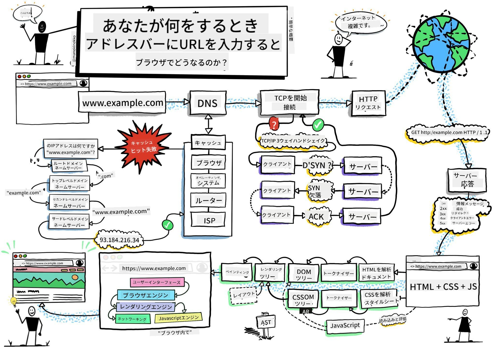
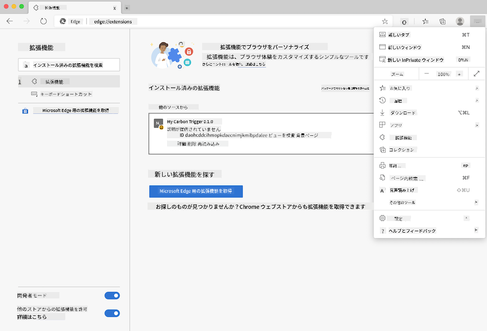
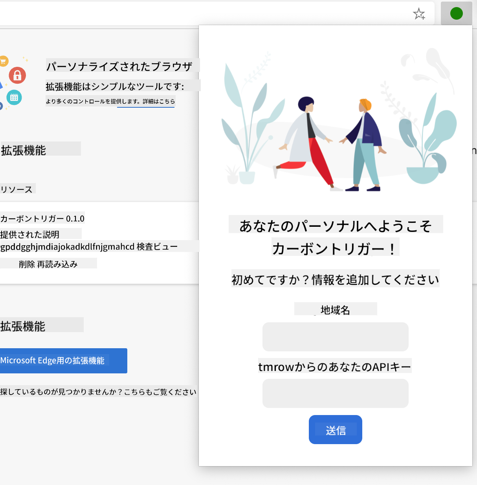
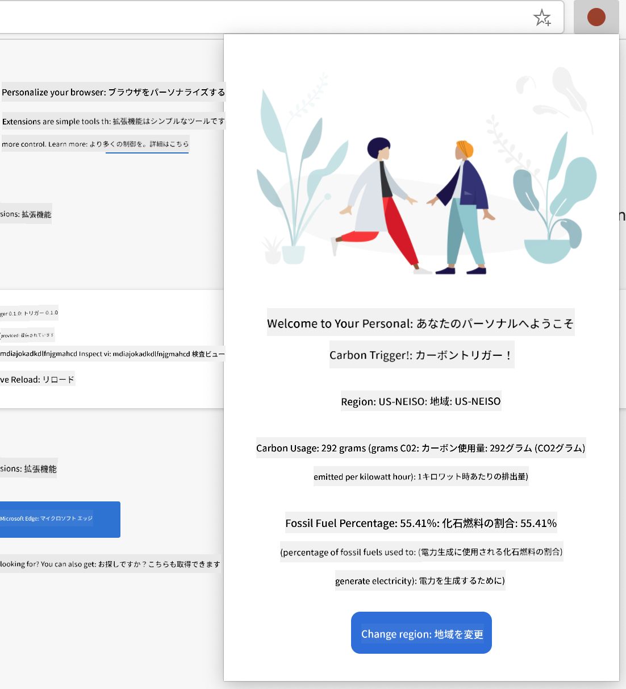

<!--
CO_OP_TRANSLATOR_METADATA:
{
  "original_hash": "2326d04e194a10aa760b51f5e5a1f61d",
  "translation_date": "2025-08-28T17:48:51+00:00",
  "source_file": "5-browser-extension/1-about-browsers/README.md",
  "language_code": "ja"
}
-->
# ブラウザ拡張プロジェクト パート1: ブラウザについて


> スケッチノート: [Wassim Chegham](https://dev.to/wassimchegham/ever-wondered-what-happens-when-you-type-in-a-url-in-an-address-bar-in-a-browser-3dob)

## 講義前クイズ

[講義前クイズ](https://ff-quizzes.netlify.app/web/quiz/23)

### はじめに

ブラウザ拡張機能は、ブラウザに追加の機能を提供します。しかし、拡張機能を作成する前に、まずブラウザがどのように動作するかを少し学ぶ必要があります。

### ブラウザについて

このレッスンシリーズでは、Chrome、Firefox、Edgeブラウザで動作するブラウザ拡張機能の作成方法を学びます。このパートでは、ブラウザがどのように動作するかを理解し、ブラウザ拡張機能の要素を構築していきます。

そもそもブラウザとは何でしょうか？ ブラウザは、エンドユーザーがサーバーからコンテンツを取得し、それをウェブページとして表示するためのソフトウェアアプリケーションです。

✅ 少し歴史を振り返ると、最初のブラウザは「WorldWideWeb」と呼ばれ、1990年にティム・バーナーズ＝リー卿によって作られました。


> 初期のブラウザのいくつか, via [Karen McGrane](https://www.slideshare.net/KMcGrane/week-4-ixd-history-personal-computing)

ユーザーがURL（Uniform Resource Locator）アドレスを使用してインターネットに接続するとき、通常は`http`または`https`アドレスを介してハイパーテキスト転送プロトコルを使用します。このとき、ブラウザはウェブサーバーと通信し、ウェブページを取得します。

その後、ブラウザのレンダリングエンジンがそれをユーザーのデバイス（スマートフォン、デスクトップ、またはノートパソコンなど）に表示します。

ブラウザには、コンテンツをキャッシュして毎回サーバーから取得する必要がないようにする機能もあります。また、ユーザーの閲覧履歴を記録したり、「クッキー」と呼ばれる小さなデータを保存してユーザーの活動情報を保持したりすることもできます。

重要な点として、すべてのブラウザが同じではありません！ 各ブラウザには長所と短所があり、プロのウェブ開発者はウェブページをクロスブラウザでうまく動作させる方法を理解する必要があります。これには、スマートフォンのような小さなビューポートや、オフライン状態のユーザーへの対応も含まれます。

非常に便利なウェブサイトとして、[caniuse.com](https://www.caniuse.com)があります。ウェブページを作成する際には、caniuseのサポートされている技術のリストを使用することで、ユーザーを最適にサポートすることができます。

✅ あなたのウェブサイトのユーザーがどのブラウザを最も使用しているかを知るにはどうすればよいでしょうか？ 分析ツールを確認してください。ウェブ開発プロセスの一環としてさまざまな分析ツールをインストールすることで、どのブラウザが最も使用されているかを知ることができます。

## ブラウザ拡張機能

なぜブラウザ拡張機能を作成したいのでしょうか？ 繰り返し行うタスクにすばやくアクセスする必要がある場合に便利だからです。たとえば、さまざまなウェブページで色を確認する必要がある場合、カラーピッカーのブラウザ拡張機能をインストールするかもしれません。パスワードを覚えるのが苦手な場合は、パスワード管理のブラウザ拡張機能を使用するかもしれません。

ブラウザ拡張機能の開発は楽しいものです。通常、特定のタスクを効率的に管理するために設計されています。

✅ あなたのお気に入りのブラウザ拡張機能は何ですか？ それらはどのようなタスクを実行しますか？

### 拡張機能のインストール

作成を始める前に、ブラウザ拡張機能の構築とデプロイのプロセスを見てみましょう。各ブラウザでこのタスクの管理方法は少し異なりますが、ChromeやFirefoxでのプロセスは、Edgeでの以下の例と似ています。



> 注: 開発者モードをオンにし、他のストアからの拡張機能を許可することを忘れないでください。

基本的なプロセスは以下の通りです：

- `npm run build`を使用して拡張機能をビルドする
- ブラウザで右上の「設定とその他」ボタン（`...`アイコン）を使用して拡張機能のペインに移動する
- 新しいインストールの場合は、`load unpacked`を選択してビルドフォルダ（この場合は`/dist`）から新しい拡張機能をアップロードする
- 既にインストールされている場合は、`reload`をクリックして拡張機能を再読み込みする

✅ これらの手順は、自分で作成した拡張機能に適用されます。各ブラウザに関連付けられたブラウザ拡張機能ストアでリリースされた拡張機能をインストールするには、それらの[ストア](https://microsoftedge.microsoft.com/addons/Microsoft-Edge-Extensions-Home)に移動して、好きな拡張機能をインストールしてください。

### 始めましょう

あなたは、自分の地域のカーボンフットプリントを表示するブラウザ拡張機能を作成します。この拡張機能は、地域のエネルギー使用量とエネルギーの供給源を表示します。また、CO2 SignalのAPIにアクセスするためのAPIキーを収集するフォームを備えています。

**必要なもの:**

- [APIキー](https://www.co2signal.com/) - このページのボックスにメールアドレスを入力すると、APIキーが送信されます
- [地域コード](http://api.electricitymap.org/v3/zones) - [Electricity Map](https://www.electricitymap.org/map)に対応するコード（例: ボストンでは「US-NEISO」を使用）
- [スターターコード](../../../../5-browser-extension/start) - `start`フォルダをダウンロードし、このフォルダ内のコードを完成させます
- [NPM](https://www.npmjs.com) - NPMはパッケージ管理ツールです。ローカルにインストールすると、`package.json`ファイルに記載されたパッケージがウェブアセットで使用できるようにインストールされます

✅ パッケージ管理についてもっと学びたい場合は、この[優れた学習モジュール](https://docs.microsoft.com/learn/modules/create-nodejs-project-dependencies/?WT.mc_id=academic-77807-sagibbon)を参照してください。

コードベースをざっと見てみましょう：

dist
    -|manifest.json (デフォルト設定)
    -|index.html (フロントエンドのHTMLマークアップ)
    -|background.js (バックグラウンドJS)
    -|main.js (ビルドされたJS)
src
    -|index.js (ここにJSコードを記述)

✅ APIキーと地域コードを手元に用意したら、それらをメモに保存しておきましょう。

### 拡張機能のHTMLを作成する

この拡張機能には2つのビューがあります。1つはAPIキーと地域コードを収集するためのもの：



もう1つは地域のカーボン使用量を表示するためのものです：



まず、フォームを作成し、CSSでスタイリングします。

`/dist`フォルダ内で、フォームと結果表示エリアを作成します。`index.html`ファイル内で、フォームエリアを以下のように記述します：

```HTML
<form class="form-data" autocomplete="on">
	<div>
		<h2>New? Add your Information</h2>
	</div>
	<div>
		<label for="region">Region Name</label>
		<input type="text" id="region" required class="region-name" />
	</div>
	<div>
		<label for="api">Your API Key from tmrow</label>
		<input type="text" id="api" required class="api-key" />
	</div>
	<button class="search-btn">Submit</button>
</form>	
```
このフォームは、保存された情報を入力し、ローカルストレージに保存するためのものです。

次に、結果表示エリアを作成します。最後のフォームタグの下にいくつかのdivを追加します：

```HTML
<div class="result">
	<div class="loading">loading...</div>
	<div class="errors"></div>
	<div class="data"></div>
	<div class="result-container">
		<p><strong>Region: </strong><span class="my-region"></span></p>
		<p><strong>Carbon Usage: </strong><span class="carbon-usage"></span></p>
		<p><strong>Fossil Fuel Percentage: </strong><span class="fossil-fuel"></span></p>
	</div>
	<button class="clear-btn">Change region</button>
</div>
```
この時点でビルドを試すことができます。拡張機能のパッケージ依存関係をインストールしてください：

```
npm install
```

このコマンドは、Node Package Manager（npm）を使用して、拡張機能のビルドプロセスに必要なwebpackをインストールします。このプロセスの出力は、`/dist/main.js`で確認できます。コードがバンドルされているのがわかるでしょう。

現時点では、拡張機能をビルドし、Edgeに拡張機能としてデプロイすれば、フォームがきれいに表示されるはずです。

おめでとうございます！ ブラウザ拡張機能の作成に向けた最初のステップを踏み出しました。次のレッスンでは、これをさらに機能的で便利なものにしていきます。

---

## 🚀 チャレンジ

ブラウザ拡張機能ストアを見て、1つインストールしてみましょう。そのファイルを調べてみると、興味深い発見があるかもしれません。何を見つけましたか？

## 講義後クイズ

[講義後クイズ](https://ff-quizzes.netlify.app/web/quiz/24)

## 復習と自己学習

このレッスンでは、ウェブブラウザの歴史について少し学びました。この機会に、ワールドワイドウェブの発明者たちがその利用をどのように想定していたかについて、さらに学んでみましょう。役立つサイトには以下があります：

[The History of Web Browsers](https://www.mozilla.org/firefox/browsers/browser-history/)

[History of the Web](https://webfoundation.org/about/vision/history-of-the-web/)

[ティム・バーナーズ＝リーとのインタビュー](https://www.theguardian.com/technology/2019/mar/12/tim-berners-lee-on-30-years-of-the-web-if-we-dream-a-little-we-can-get-the-web-we-want)

## 課題

[拡張機能をリスタイルする](assignment.md)

---

**免責事項**:  
この文書は、AI翻訳サービス [Co-op Translator](https://github.com/Azure/co-op-translator) を使用して翻訳されています。正確性を追求しておりますが、自動翻訳には誤りや不正確な部分が含まれる可能性があることをご承知ください。元の言語で記載された文書が正式な情報源とみなされるべきです。重要な情報については、専門の人間による翻訳を推奨します。この翻訳の使用に起因する誤解や誤解釈について、当方は責任を負いません。