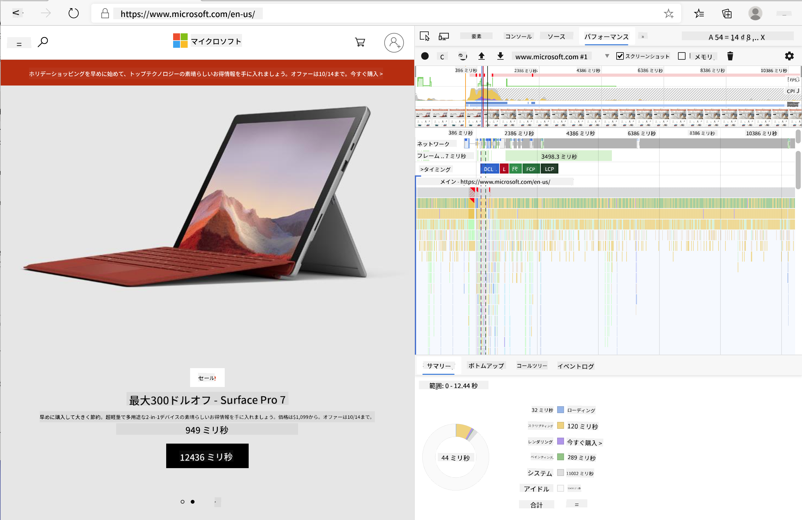
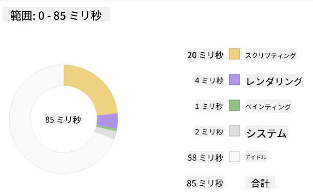

<!--
CO_OP_TRANSLATOR_METADATA:
{
  "original_hash": "49b58721a71cfda824e2f3e1f46908c6",
  "translation_date": "2025-08-28T17:50:03+00:00",
  "source_file": "5-browser-extension/3-background-tasks-and-performance/README.md",
  "language_code": "ja"
}
-->
# ブラウザ拡張プロジェクト パート3: バックグラウンドタスクとパフォーマンスについて学ぶ

## 講義前クイズ

[講義前クイズ](https://ff-quizzes.netlify.app/web/quiz/27)

### はじめに

このモジュールの前回の2つのレッスンでは、APIから取得したデータを表示するためのフォームと表示エリアを作成する方法を学びました。これは、ウェブ上で存在感を示す非常に標準的な方法です。また、非同期でデータを取得する方法も学びました。これでブラウザ拡張機能はほぼ完成です。

残る課題は、拡張機能のアイコンの色を更新するなどのバックグラウンドタスクを管理することです。このタイミングで、ブラウザがこの種のタスクをどのように管理するかについて考えるのは良い機会です。これらのブラウザタスクを、ウェブ資産のパフォーマンスの観点から考えてみましょう。

## ウェブパフォーマンスの基本

> 「ウェブサイトのパフォーマンスは2つのことに関するものです: ページがどれだけ速く読み込まれるか、そしてその上でコードがどれだけ速く実行されるか。」 -- [Zack Grossbart](https://www.smashingmagazine.com/2012/06/javascript-profiling-chrome-developer-tools/)

ウェブサイトをあらゆるデバイス、あらゆるユーザー、あらゆる状況で驚くほど速くする方法についての話題は、当然ながら広範です。標準的なウェブプロジェクトやブラウザ拡張機能を構築する際に覚えておくべきポイントを以下に示します。

サイトが効率的に動作していることを確認するために最初に行うべきことは、そのパフォーマンスに関するデータを収集することです。これを行う最初の場所は、ウェブブラウザの開発者ツールです。Edgeでは、ブラウザ右上の「設定とその他」ボタン（三点アイコン）を選択し、「その他のツール > 開発者ツール」に移動して「パフォーマンス」タブを開きます。Windowsでは`Ctrl` + `Shift` + `I`、Macでは`Option` + `Command` + `I`のキーボードショートカットでも開発者ツールを開くことができます。

「パフォーマンス」タブにはプロファイリングツールがあります。ウェブサイトを開き（例: [https://www.microsoft.com](https://www.microsoft.com/?WT.mc_id=academic-77807-sagibbon)）、「記録」ボタンをクリックしてサイトを更新します。記録をいつでも停止すると、サイトを「スクリプト」、「レンダー」、「ペイント」するために生成されたルーチンを見ることができます。



✅ [Microsoft Documentation](https://docs.microsoft.com/microsoft-edge/devtools-guide/performance/?WT.mc_id=academic-77807-sagibbon)でEdgeの「パフォーマンス」パネルについて学びましょう

> ヒント: サイトの起動時間を正確に測定するには、ブラウザのキャッシュをクリアしてください

プロファイルタイムラインの要素を選択して、ページが読み込まれる間に発生するイベントをズームインして確認します。

プロファイルタイムラインの一部を選択して、ページのパフォーマンスのスナップショットを取得し、概要ペインを確認します。



イベントログペインを確認して、15ms以上かかったイベントがあるかどうかを確認します。


✅ このサイトで開発者ツールを開き、ボトルネックがあるかどうか確認してみましょう。最も遅く読み込まれる資産は何ですか？最も速いものは？

## プロファイリングチェック

一般的に、ウェブ開発者がサイトを構築する際に注意すべき「問題領域」がいくつかあります。これにより、プロダクションにデプロイする際の予期せぬ問題を回避できます。

**資産サイズ**: 過去数年間でウェブは「重く」なり、その結果遅くなりました。この重さの一部は画像の使用に関連しています。

✅ [Internet Archive](https://httparchive.org/reports/page-weight)を見て、ページの重さの歴史的な変化やその他の情報を確認しましょう。

良いプラクティスとして、画像を最適化し、ユーザーに適したサイズと解像度で配信することを心がけましょう。

**DOMのトラバーサル**: ブラウザは、あなたが書いたコードに基づいてDocument Object Modelを構築する必要があります。そのため、タグを最小限に抑え、ページが必要とするものだけを使用してスタイリングすることが、良いページパフォーマンスのために重要です。この点で、ページに関連する余分なCSSは最適化されるべきです。例えば、特定のページでのみ使用されるスタイルは、メインのスタイルシートに含める必要はありません。

**JavaScript**: すべてのJavaScript開発者は、DOMがトラバーサルされてブラウザにペイントされる前にロードされる必要がある「レンダーブロッキング」スクリプトに注意を払うべきです。インラインスクリプトに`defer`を使用することを検討してください（Terrariumモジュールで行われているように）。

✅ [Site Speed Test website](https://www.webpagetest.org/)でいくつかのサイトを試して、サイトパフォーマンスを判断するために行われる一般的なチェックについて学びましょう。

ブラウザが送信された資産をどのようにレンダリングするかについての理解が深まったところで、拡張機能を完成させるために必要な最後のいくつかのことを見てみましょう。

### 色を計算する関数を作成する

`/src/index.js`で、DOMにアクセスするために設定した一連の`const`変数の後に、`calculateColor()`という関数を追加します。

```JavaScript
function calculateColor(value) {
	let co2Scale = [0, 150, 600, 750, 800];
	let colors = ['#2AA364', '#F5EB4D', '#9E4229', '#381D02', '#381D02'];

	let closestNum = co2Scale.sort((a, b) => {
		return Math.abs(a - value) - Math.abs(b - value);
	})[0];
	console.log(value + ' is closest to ' + closestNum);
	let num = (element) => element > closestNum;
	let scaleIndex = co2Scale.findIndex(num);

	let closestColor = colors[scaleIndex];
	console.log(scaleIndex, closestColor);

	chrome.runtime.sendMessage({ action: 'updateIcon', value: { color: closestColor } });
}
```

ここで何が起こっているのでしょうか？前回のレッスンで完了したAPI呼び出しから炭素強度の値を渡し、その値がcolors配列に提示されたインデックスにどれだけ近いかを計算します。そして、その最も近い色の値をchrome runtimeに送信します。

chrome.runtimeには、さまざまなバックグラウンドタスクを処理する[API](https://developer.chrome.com/extensions/runtime)があります。あなたの拡張機能はこれを活用しています。

> 「chrome.runtime APIを使用して、バックグラウンドページを取得し、マニフェストの詳細を返し、アプリまたは拡張機能のライフサイクル内のイベントをリッスンして応答します。また、このAPIを使用して、URLの相対パスを完全修飾URLに変換することもできます。」

✅ Edge用にこのブラウザ拡張機能を開発している場合、chrome APIを使用していることに驚くかもしれません。新しいEdgeブラウザバージョンはChromiumブラウザエンジン上で動作しているため、これらのツールを活用できます。

> 注意: ブラウザ拡張機能をプロファイリングする場合、拡張機能自体から開発者ツールを起動してください。拡張機能は独自のブラウザインスタンスとして動作します。

### デフォルトのアイコン色を設定する

次に、`init()`関数内で、chromeの`updateIcon`アクションを再度呼び出して、アイコンを最初は汎用的な緑色に設定します。

```JavaScript
chrome.runtime.sendMessage({
	action: 'updateIcon',
		value: {
			color: 'green',
		},
});
```

### 関数を呼び出し、API呼び出しを実行する

次に、前回作成した関数をC02Signal APIから返されるPromiseに追加して呼び出します。

```JavaScript
//let CO2...
calculateColor(CO2);
```

最後に、`/dist/background.js`で、これらのバックグラウンドアクション呼び出しをリッスンするリスナーを追加します。

```JavaScript
chrome.runtime.onMessage.addListener(function (msg, sender, sendResponse) {
	if (msg.action === 'updateIcon') {
		chrome.browserAction.setIcon({ imageData: drawIcon(msg.value) });
	}
});
//borrowed from energy lollipop extension, nice feature!
function drawIcon(value) {
	let canvas = document.createElement('canvas');
	let context = canvas.getContext('2d');

	context.beginPath();
	context.fillStyle = value.color;
	context.arc(100, 100, 50, 0, 2 * Math.PI);
	context.fill();

	return context.getImageData(50, 50, 100, 100);
}
```

このコードでは、バックエンドタスクマネージャーに送信されるメッセージをリッスンしています。メッセージが「updateIcon」と呼ばれる場合、次のコードが実行され、Canvas APIを使用して適切な色のアイコンを描画します。

✅ [Space Game lessons](../../6-space-game/2-drawing-to-canvas/README.md)でCanvas APIについてさらに学びましょう。

次に拡張機能を再構築します（`npm run build`）、拡張機能を更新して起動し、色の変化を確認します。今がちょっとした用事を済ませたり皿洗いをするのに良いタイミングかもしれませんね！これでわかります。

おめでとうございます！便利なブラウザ拡張機能を構築し、ブラウザの動作やそのパフォーマンスをプロファイリングする方法についてさらに学びました。

---

## 🚀 チャレンジ

長い間存在しているオープンソースウェブサイトを調査し、そのGitHub履歴に基づいて、パフォーマンスのためにどのように最適化されてきたかを特定できるか試してみましょう。最も一般的な問題点は何ですか？

## 講義後クイズ

[講義後クイズ](https://ff-quizzes.netlify.app/web/quiz/28)

## 復習と自己学習

[パフォーマンスニュースレター](https://perf.email/)に登録することを検討してください。

ブラウザがウェブパフォーマンスをどのように評価するかについて、ウェブツールのパフォーマンスタブを調査してみましょう。大きな違いは見つかりますか？

## 課題

[サイトのパフォーマンスを分析する](assignment.md)

---

**免責事項**:  
この文書はAI翻訳サービス[Co-op Translator](https://github.com/Azure/co-op-translator)を使用して翻訳されています。正確性を追求しておりますが、自動翻訳には誤りや不正確な部分が含まれる可能性があります。元の言語で記載された文書が正式な情報源とみなされるべきです。重要な情報については、専門の人間による翻訳を推奨します。この翻訳の使用に起因する誤解や誤解釈について、当方は責任を負いません。