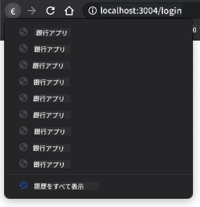

<!--
CO_OP_TRANSLATOR_METADATA:
{
  "original_hash": "8a07db14e75ac62f013b7de5df05981d",
  "translation_date": "2025-08-28T17:48:06+00:00",
  "source_file": "7-bank-project/1-template-route/README.md",
  "language_code": "ja"
}
-->
# 銀行アプリを作成する Part 1: HTMLテンプレートとWebアプリのルート設定

## 講義前クイズ

[講義前クイズ](https://ff-quizzes.netlify.app/web/quiz/41)

### はじめに

ブラウザでJavaScriptが登場して以来、ウェブサイトはこれまで以上にインタラクティブで複雑になっています。現在では、ブラウザ内で直接動作する完全な機能を備えたアプリケーション、つまり[ウェブアプリケーション](https://en.wikipedia.org/wiki/Web_application)を作成するためにウェブ技術が一般的に使用されています。ウェブアプリは非常にインタラクティブであるため、ユーザーはアクションを実行するたびにページ全体をリロードするのを待ちたくありません。そのため、JavaScriptを使用してDOMを介してHTMLを直接更新し、スムーズなユーザー体験を提供します。

このレッスンでは、HTMLテンプレートを使用して複数の画面を作成し、HTMLページ全体をリロードすることなく表示および更新できる銀行ウェブアプリの基礎を構築します。

### 前提条件

このレッスンで作成するウェブアプリをテストするには、ローカルウェブサーバーが必要です。まだインストールしていない場合は、[Node.js](https://nodejs.org)をインストールし、プロジェクトフォルダーでコマンド `npx lite-server` を使用してください。これによりローカルウェブサーバーが作成され、ブラウザでアプリが開きます。

### 準備

コンピュータ上で、`bank`という名前のフォルダーを作成し、その中に`index.html`という名前のファイルを作成してください。以下のHTML[ボイラープレート](https://en.wikipedia.org/wiki/Boilerplate_code)から始めます：

```html
<!DOCTYPE html>
<html lang="en">
  <head>
    <meta charset="UTF-8">
    <meta name="viewport" content="width=device-width, initial-scale=1.0">
    <title>Bank App</title>
  </head>
  <body>
    <!-- This is where you'll work -->
  </body>
</html>
```

---

## HTMLテンプレート

ウェブページに複数の画面を作成したい場合、1つの画面ごとにHTMLファイルを作成するという方法があります。しかし、この方法にはいくつかの不便があります：

- 画面を切り替えるたびにHTML全体をリロードする必要があり、これが遅い場合があります。
- 異なる画面間でデータを共有するのが難しいです。

別の方法として、1つのHTMLファイルだけを使用し、`<template>`要素を使用して複数の[HTMLテンプレート](https://developer.mozilla.org/docs/Web/HTML/Element/template)を定義する方法があります。テンプレートはブラウザによって表示されない再利用可能なHTMLブロックであり、JavaScriptを使用して実行時にインスタンス化する必要があります。

### タスク

銀行アプリを作成し、ログインページとダッシュボードの2つの画面を用意します。まず、HTMLのボディ内にアプリの異なる画面をインスタンス化するためのプレースホルダー要素を追加します：

```html
<div id="app">Loading...</div>
```

JavaScriptで後で簡単に見つけられるように`id`を付けています。

> ヒント：この要素の内容は置き換えられるため、アプリが読み込まれている間に表示されるローディングメッセージやインジケーターを入れることができます。

次に、ログインページ用のHTMLテンプレートを追加します。現時点では、タイトルとナビゲーションを実行するためのリンクを含むセクションだけを入れます。

```html
<template id="login">
  <h1>Bank App</h1>
  <section>
    <a href="/dashboard">Login</a>
  </section>
</template>
```

その後、ダッシュボードページ用のHTMLテンプレートを追加します。このページには以下のセクションが含まれます：

- タイトルとログアウトリンクを含むヘッダー
- 銀行口座の現在の残高
- テーブルで表示される取引のリスト

```html
<template id="dashboard">
  <header>
    <h1>Bank App</h1>
    <a href="/login">Logout</a>
  </header>
  <section>
    Balance: 100$
  </section>
  <section>
    <h2>Transactions</h2>
    <table>
      <thead>
        <tr>
          <th>Date</th>
          <th>Object</th>
          <th>Amount</th>
        </tr>
      </thead>
      <tbody></tbody>
    </table>
  </section>
</template>
```

> ヒント：HTMLテンプレートを作成する際、どのように見えるか確認したい場合は、`<template>`と`</template>`行を`<!-- -->`で囲んでコメントアウトすることができます。

✅ なぜテンプレートに`id`属性を使用するのでしょうか？クラスなど他のものを使用することは可能でしょうか？

## JavaScriptでテンプレートを表示する

現在のHTMLファイルをブラウザで試してみると、`Loading...`の表示で止まってしまいます。これは、HTMLテンプレートをインスタンス化して表示するためのJavaScriptコードが必要だからです。

テンプレートをインスタンス化する手順は通常以下の3ステップです：

1. DOM内でテンプレート要素を取得します（例：[`document.getElementById`](https://developer.mozilla.org/docs/Web/API/Document/getElementById)を使用）。
2. テンプレート要素を[`cloneNode`](https://developer.mozilla.org/docs/Web/API/Node/cloneNode)を使用して複製します。
3. 可視要素の下にテンプレートをDOMに追加します（例：[`appendChild`](https://developer.mozilla.org/docs/Web/API/Node/appendChild)を使用）。

✅ なぜテンプレートをDOMに追加する前に複製する必要があるのでしょうか？このステップを省略した場合、何が起こると思いますか？

### タスク

プロジェクトフォルダーに`app.js`という名前の新しいファイルを作成し、そのファイルをHTMLの`<head>`セクションにインポートします：

```html
<script src="app.js" defer></script>
```

次に、`app.js`内で新しい関数`updateRoute`を作成します：

```js
function updateRoute(templateId) {
  const template = document.getElementById(templateId);
  const view = template.content.cloneNode(true);
  const app = document.getElementById('app');
  app.innerHTML = '';
  app.appendChild(view);
}
```

ここで行っているのは、上記の3ステップそのものです。`templateId`を持つテンプレートをインスタンス化し、その複製された内容をアプリのプレースホルダー内に配置します。テンプレート全体のサブツリーをコピーするために`cloneNode(true)`を使用する必要があります。

次に、この関数をテンプレートの1つで呼び出し、結果を確認してください。

```js
updateRoute('login');
```

✅ このコード`app.innerHTML = '';`の目的は何でしょうか？これがない場合、何が起こるでしょうか？

## ルートの作成

ウェブアプリについて話す際、*ルーティング*とは、**URL**を表示すべき特定の画面にマッピングする意図を指します。複数のHTMLファイルを持つウェブサイトでは、ファイルパスがURLに反映されるため、これが自動的に行われます。例えば、プロジェクトフォルダーに以下のファイルがある場合：

```
mywebsite/index.html
mywebsite/login.html
mywebsite/admin/index.html
```

`mywebsite`をルートとしてウェブサーバーを作成すると、URLマッピングは以下のようになります：

```
https://site.com            --> mywebsite/index.html
https://site.com/login.html --> mywebsite/login.html
https://site.com/admin/     --> mywebsite/admin/index.html
```

しかし、今回のウェブアプリでは、すべての画面を含む単一のHTMLファイルを使用しているため、このデフォルトの動作は役に立ちません。これを手動でマッピングし、JavaScriptを使用して表示されるテンプレートを更新する必要があります。

### タスク

URLパスとテンプレートをマッピングするために、シンプルなオブジェクトを使用します。このオブジェクトを`app.js`ファイルの先頭に追加してください。

```js
const routes = {
  '/login': { templateId: 'login' },
  '/dashboard': { templateId: 'dashboard' },
};
```

次に、`updateRoute`関数を少し変更します。引数として直接`templateId`を渡す代わりに、まず現在のURLを確認し、その後マップを使用して対応するテンプレートID値を取得します。[`window.location.pathname`](https://developer.mozilla.org/docs/Web/API/Location/pathname)を使用してURLからパスセクションだけを取得できます。

```js
function updateRoute() {
  const path = window.location.pathname;
  const route = routes[path];

  const template = document.getElementById(route.templateId);
  const view = template.content.cloneNode(true);
  const app = document.getElementById('app');
  app.innerHTML = '';
  app.appendChild(view);
}
```

ここで宣言したルートを対応するテンプレートにマッピングしました。ブラウザでURLを手動で変更して正しく動作するか試してみてください。

✅ URLに未知のパスを入力するとどうなりますか？これを解決する方法は何でしょうか？

## ナビゲーションの追加

次に、URLを手動で変更することなくページ間を移動できるようにします。これには以下の2つのことが必要です：

1. 現在のURLを更新する
2. 新しいURLに基づいて表示されるテンプレートを更新する

2番目の部分については`updateRoute`関数で既に対応しているため、現在のURLを更新する方法を考える必要があります。

JavaScript、特に[`history.pushState`](https://developer.mozilla.org/docs/Web/API/History/pushState)を使用します。このメソッドは、HTMLをリロードせずにURLを更新し、ブラウザ履歴に新しいエントリを作成することができます。

> 注：HTMLアンカー要素[`<a href>`](https://developer.mozilla.org/docs/Web/HTML/Element/a)は単独で異なるURLへのハイパーリンクを作成できますが、デフォルトでブラウザがHTMLをリロードしてしまいます。`preventDefault()`関数をクリックイベントで使用して、この動作を防ぐ必要があります。

### タスク

アプリ内でナビゲーションに使用できる新しい関数を作成します：

```js
function navigate(path) {
  window.history.pushState({}, path, path);
  updateRoute();
}
```

このメソッドは、与えられたパスに基づいて現在のURLを更新し、その後テンプレートを更新します。`window.location.origin`プロパティはURLのルートを返し、与えられたパスから完全なURLを再構築することができます。

この関数ができたので、定義されたルートに一致しないパスがある場合の問題に対処します。`updateRoute`関数を変更し、マッチが見つからない場合に既存のルートの1つにフォールバックするようにします。

```js
function updateRoute() {
  const path = window.location.pathname;
  const route = routes[path];

  if (!route) {
    return navigate('/login');
  }

  ...
```

ルートが見つからない場合、`login`ページにリダイレクトするようになりました。

次に、リンクがクリックされたときにURLを取得し、ブラウザのデフォルトのリンク動作を防ぐ関数を作成します：

```js
function onLinkClick(event) {
  event.preventDefault();
  navigate(event.target.href);
}
```

ナビゲーションシステムを完成させるために、HTML内の*ログイン*リンクと*ログアウト*リンクにバインディングを追加します。

```html
<a href="/dashboard" onclick="onLinkClick(event)">Login</a>
...
<a href="/login" onclick="onLinkClick(event)">Logout</a>
```

上記の`event`オブジェクトは、`click`イベントをキャプチャし、それを`onLinkClick`関数に渡します。

[`onclick`](https://developer.mozilla.org/docs/Web/API/GlobalEventHandlers/onclick)属性を使用して`click`イベントをJavaScriptコードにバインドします。ここでは`navigate()`関数の呼び出しです。

これらのリンクをクリックしてみてください。アプリの異なる画面間を移動できるようになったはずです。

✅ `history.pushState`メソッドはHTML5標準の一部であり、[すべての最新ブラウザ](https://caniuse.com/?search=pushState)で実装されています。古いブラウザ向けにウェブアプリを構築する場合、このAPIの代わりに使用できるトリックがあります：パスの前に[ハッシュ（`#`）](https://en.wikipedia.org/wiki/URI_fragment)を使用することで、通常のアンカーナビゲーションで動作し、ページをリロードしないルーティングを実装できます。このハッシュはページ内の内部リンクを作成する目的で使用されていました。

## ブラウザの戻るボタンと進むボタンの処理

`history.pushState`を使用すると、ブラウザのナビゲーション履歴に新しいエントリが作成されます。ブラウザの*戻るボタン*を長押しすると、以下のようなものが表示されるはずです：



戻るボタンを数回クリックしてみると、現在のURLが変更され履歴が更新されますが、同じテンプレートが表示され続けます。

これは、履歴が変更されるたびに`updateRoute()`を呼び出す必要があることをアプリケーションが認識していないためです。[`history.pushState`のドキュメント](https://developer.mozilla.org/docs/Web/API/History/pushState)を見ると、状態が変更された場合（つまり異なるURLに移動した場合）、[`popstate`](https://developer.mozilla.org/docs/Web/API/Window/popstate_event)イベントがトリガーされることがわかります。このイベントを使用して問題を修正します。

### タスク

ブラウザ履歴が変更されたときに表示されるテンプレートが更新されるようにするため、`updateRoute()`を呼び出す新しい関数を追加します。これを`app.js`ファイルの末尾に追加します：

```js
window.onpopstate = () => updateRoute();
updateRoute();
```

> 注：ここでは簡潔さのために[アロー関数](https://developer.mozilla.org/docs/Web/JavaScript/Reference/Functions/Arrow_functions)を使用して`popstate`イベントハンドラーを宣言しましたが、通常の関数でも同じように動作します。

アロー関数についてのリフレッシュ動画はこちら：

[](https://youtube.com/watch?v=OP6eEbOj2sc "アロー関数")

> 🎥 上の画像をクリックするとアロー関数についての動画が再生されます。

ブラウザの戻るボタンと進むボタンを使用してみてください。今回は表示されるルートが正しく更新されることを確認してください。

---

## 🚀 チャレンジ

このアプリのクレジットを表示するための3番目のページ用の新しいテンプレートとルートを追加してください。

## 講義後クイズ

[講義後クイズ](https://ff-quizzes.netlify.app/web/quiz/42)

## 復習と自己学習

ウェブ開発の中でもルーティングは意外と難しい部分の1つです。特にウェブがページリフレッシュの動作からシングルページアプリケーションのリフレッシュに移行するにつれてです。[Azure Static Web Appサービス](https://docs.microsoft.com/azure/static-web-apps/routes/?WT.mc_id=academic-77807-sagibbon)がルーティングをどのように処理しているかについて少し読んでみてください。このドキュメントで説明されているいくつかの決定がなぜ必要なのか説明できますか？

## 課題

[ルーティングを改善する](assignment.md)

---

**免責事項**:  
この文書は、AI翻訳サービス [Co-op Translator](https://github.com/Azure/co-op-translator) を使用して翻訳されています。正確性を追求しておりますが、自動翻訳には誤りや不正確な部分が含まれる可能性があります。元の言語で記載された文書を正式な情報源としてご参照ください。重要な情報については、専門の人間による翻訳を推奨します。この翻訳の使用に起因する誤解や誤解釈について、当方は責任を負いません。