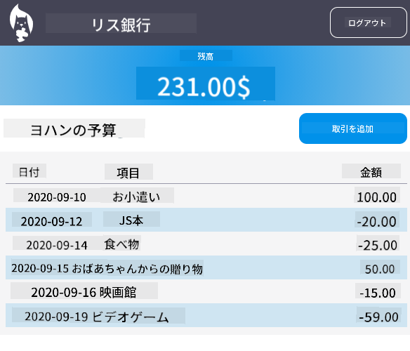

<!--
CO_OP_TRANSLATOR_METADATA:
{
  "original_hash": "89d0df9854ed020f155e94882ae88d4c",
  "translation_date": "2025-08-28T17:45:34+00:00",
  "source_file": "7-bank-project/3-data/README.md",
  "language_code": "ja"
}
-->
# 銀行アプリを作成する Part 3: データの取得と利用方法

## 講義前クイズ

[講義前クイズ](https://ff-quizzes.netlify.app/web/quiz/45)

### はじめに

すべてのウェブアプリケーションの中心には*データ*があります。データはさまざまな形を取りますが、その主な目的は常にユーザーに情報を表示することです。ウェブアプリがますますインタラクティブで複雑になるにつれ、ユーザーが情報にアクセスし、操作する方法はウェブ開発の重要な部分となっています。

このレッスンでは、サーバーから非同期でデータを取得し、そのデータを使用してHTMLを再読み込みせずにウェブページに情報を表示する方法を学びます。

### 前提条件

このレッスンのためにウェブアプリの[ログインと登録フォーム](../2-forms/README.md)を作成している必要があります。また、[Node.js](https://nodejs.org)をインストールし、[サーバーAPI](../api/README.md)をローカルで実行してアカウントデータを取得する必要があります。

サーバーが正しく動作しているかどうかは、ターミナルで次のコマンドを実行して確認できます。

```sh
curl http://localhost:5000/api
# -> should return "Bank API v1.0.0" as a result
```

---

## AJAXとデータ取得

従来のウェブサイトでは、ユーザーがリンクを選択したりフォームを使用してデータを送信したりすると、HTMLページ全体を再読み込みすることで表示内容を更新します。新しいデータを読み込むたびに、ウェブサーバーは新しいHTMLページを返し、ブラウザがそれを処理する必要があります。このプロセスは現在のユーザー操作を中断し、再読み込み中のインタラクションを制限します。このワークフローは*マルチページアプリケーション (MPA)*とも呼ばれます。


ウェブアプリケーションがより複雑でインタラクティブになるにつれ、[AJAX (Asynchronous JavaScript and XML)](https://en.wikipedia.org/wiki/Ajax_(programming))という新しい技術が登場しました。この技術により、ウェブアプリはJavaScriptを使用してサーバーから非同期でデータを送受信し、HTMLページを再読み込みせずに更新を行うことが可能になり、より迅速な更新とスムーズなユーザーインタラクションを実現しました。サーバーから新しいデータを受信すると、現在のHTMLページをJavaScriptを使用して[DOM](https://developer.mozilla.org/docs/Web/API/Document_Object_Model) APIで更新することができます。このアプローチは進化を遂げ、現在では[*シングルページアプリケーション (SPA)*](https://en.wikipedia.org/wiki/Single-page_application)と呼ばれています。


AJAXが初めて導入された際、非同期でデータを取得するために利用可能な唯一のAPIは[`XMLHttpRequest`](https://developer.mozilla.org/docs/Web/API/XMLHttpRequest/Using_XMLHttpRequest)でした。しかし、現在のブラウザでは、より便利で強力な[`Fetch` API](https://developer.mozilla.org/docs/Web/API/Fetch_API)が実装されており、プロミスを使用し、JSONデータの操作に適しています。

> すべての最新ブラウザが`Fetch API`をサポートしていますが、ウェブアプリケーションを古いブラウザでも動作させたい場合は、[caniuse.comの互換性表](https://caniuse.com/fetch)を事前に確認することをお勧めします。

### タスク

[前回のレッスン](../2-forms/README.md)では、アカウントを作成するための登録フォームを実装しました。今回は既存のアカウントを使用してログインし、そのデータを取得するコードを追加します。`app.js`ファイルを開き、新しい`login`関数を追加してください。

```js
async function login() {
  const loginForm = document.getElementById('loginForm')
  const user = loginForm.user.value;
}
```

ここでは、`getElementById()`を使用してフォーム要素を取得し、次に`loginForm.user.value`を使用して入力からユーザー名を取得します。すべてのフォームコントロールは、HTMLで`name`属性を使用して設定された名前をプロパティとしてフォームからアクセスできます。

登録時に行った操作と同様に、サーバーリクエストを実行するための別の関数を作成しますが、今回はアカウントデータを取得するためのものです。

```js
async function getAccount(user) {
  try {
    const response = await fetch('//localhost:5000/api/accounts/' + encodeURIComponent(user));
    return await response.json();
  } catch (error) {
    return { error: error.message || 'Unknown error' };
  }
}
```

`fetch` APIを使用してサーバーから非同期でデータをリクエストしますが、今回はデータをクエリするだけなので、URL以外の追加パラメータは必要ありません。デフォルトでは、`fetch`は[`GET`](https://developer.mozilla.org/docs/Web/HTTP/Methods/GET) HTTPリクエストを作成しますが、これが今回求めているものです。

✅ `encodeURIComponent()`はURL内の特殊文字をエスケープする関数です。この関数を呼び出さずに直接`user`値をURLに使用すると、どのような問題が発生する可能性があるでしょうか？

次に、`login`関数を更新して`getAccount`を使用します。

```js
async function login() {
  const loginForm = document.getElementById('loginForm')
  const user = loginForm.user.value;
  const data = await getAccount(user);

  if (data.error) {
    return console.log('loginError', data.error);
  }

  account = data;
  navigate('/dashboard');
}
```

まず、`getAccount`が非同期関数であるため、サーバーの結果を待つために`await`キーワードを使用する必要があります。サーバーリクエストでは常にエラーケースに対処する必要がありますが、現時点ではエラーメッセージをログに表示するだけにしておき、後で戻ってきます。

次に、後でダッシュボード情報を表示するためにデータを保存する必要があります。`account`変数がまだ存在しないため、ファイルの先頭にグローバル変数を作成します。

```js
let account = null;
```

ユーザーデータが変数に保存された後、既存の`navigate()`関数を使用して*ログイン*ページから*ダッシュボード*に移動できます。

最後に、ログインフォームが送信されたときに`login`関数を呼び出す必要があります。HTMLを次のように変更してください。

```html
<form id="loginForm" action="javascript:login()">
```

新しいアカウントを登録し、同じアカウントを使用してログインを試みることで、すべてが正しく動作していることを確認してください。

次の部分に進む前に、`register`関数を完成させるために、関数の最後に次のコードを追加できます。

```js
account = result;
navigate('/dashboard');
```

✅ デフォルトでは、表示しているウェブページと*同じドメインとポート*からのみサーバーAPIを呼び出すことができます。これはブラウザによって強制されるセキュリティメカニズムです。しかし、ウェブアプリは`localhost:3000`で動作しているのに対し、サーバーAPIは`localhost:5000`で動作しているのに、なぜ動作するのでしょうか？[クロスオリジンリソース共有 (CORS)](https://developer.mozilla.org/docs/Web/HTTP/CORS)という技術を使用することで、サーバーが特定のドメインに対する例外を許可する特別なヘッダーをレスポンスに追加することで、クロスオリジンHTTPリクエストを実行することが可能になります。

> APIについてさらに学ぶには、この[レッスン](https://docs.microsoft.com/learn/modules/use-apis-discover-museum-art/?WT.mc_id=academic-77807-sagibbon)を受講してください。

## HTMLを更新してデータを表示する

ユーザーデータを取得したので、既存のHTMLを更新して表示する必要があります。例えば`document.getElementById()`を使用してDOMから要素を取得する方法はすでに知っています。ベースとなる要素を取得した後、以下のAPIを使用してその内容を変更したり子要素を追加したりできます。

- [`textContent`](https://developer.mozilla.org/docs/Web/API/Node/textContent)プロパティを使用すると、要素のテキストを変更できます。この値を変更すると、要素の子要素（存在する場合）がすべて削除され、指定されたテキストに置き換えられます。そのため、空の文字列`''`を割り当てることで、指定された要素のすべての子要素を効率的に削除することもできます。

- [`document.createElement()`](https://developer.mozilla.org/docs/Web/API/Document/createElement)と[`append()`](https://developer.mozilla.org/docs/Web/API/ParentNode/append)メソッドを組み合わせることで、新しい子要素を作成して追加できます。

✅ [`innerHTML`](https://developer.mozilla.org/docs/Web/API/Element/innerHTML)プロパティを使用すると、要素のHTML内容を変更することも可能ですが、これは[クロスサイトスクリプティング (XSS)](https://developer.mozilla.org/docs/Glossary/Cross-site_scripting)攻撃に対して脆弱であるため避けるべきです。

### タスク

ダッシュボード画面に進む前に、*ログイン*ページでやるべきことがもう一つあります。現在、存在しないユーザー名でログインしようとすると、コンソールにメッセージが表示されますが、通常のユーザーには何も変化がなく、何が起こっているのか分かりません。

ログインフォームにエラーメッセージを表示するためのプレースホルダー要素を追加しましょう。適切な場所はログイン`<button>`の直前です。

```html
...
<div id="loginError"></div>
<button>Login</button>
...
```

この`<div>`要素は空であり、何も表示されません。JavaScriptでコンテンツを追加するまで画面には何も表示されません。また、`id`を付けることでJavaScriptで簡単に取得できるようにしています。

`app.js`ファイルに戻り、新しいヘルパー関数`updateElement`を作成してください。

```js
function updateElement(id, text) {
  const element = document.getElementById(id);
  element.textContent = text;
}
```

この関数は非常に簡単です。要素の*id*と*text*を指定すると、対応する`id`を持つDOM要素のテキスト内容を更新します。このメソッドを使用して、`login`関数内の以前のエラーメッセージを置き換えます。

```js
if (data.error) {
  return updateElement('loginError', data.error);
}
```

これで無効なアカウントでログインしようとすると、次のような表示がされるはずです。


これでエラーテキストが視覚的に表示されるようになりましたが、スクリーンリーダーで試してみると何も読み上げられないことに気付くでしょう。ページに動的に追加されたテキストがスクリーンリーダーで読み上げられるようにするには、[ライブリージョン](https://developer.mozilla.org/docs/Web/Accessibility/ARIA/ARIA_Live_Regions)を使用する必要があります。ここでは、アラートと呼ばれる特定のタイプのライブリージョンを使用します。

```html
<div id="loginError" role="alert"></div>
```

同じ動作を`register`関数のエラーにも実装してください（HTMLの更新を忘れずに）。

## ダッシュボードに情報を表示する

先ほど見た技術を使用して、ダッシュボードページにアカウント情報を表示する処理を行います。

サーバーから受信したアカウントオブジェクトは次のような形式です。

```json
{
  "user": "test",
  "currency": "$",
  "description": "Test account",
  "balance": 75,
  "transactions": [
    { "id": "1", "date": "2020-10-01", "object": "Pocket money", "amount": 50 },
    { "id": "2", "date": "2020-10-03", "object": "Book", "amount": -10 },
    { "id": "3", "date": "2020-10-04", "object": "Sandwich", "amount": -5 }
  ],
}
```

> 注: すでにデータが入力されている`test`アカウントを使用すると、作業が簡単になります。

### タスク

まず、HTMLの「残高」セクションをプレースホルダー要素に置き換えます。

```html
<section>
  Balance: <span id="balance"></span><span id="currency"></span>
</section>
```

また、アカウントの説明を表示するためにその下に新しいセクションを追加します。

```html
<h2 id="description"></h2>
```

✅ アカウントの説明はその下のコンテンツのタイトルとして機能するため、セマンティックに見出しとしてマークアップされています。[見出し構造](https://www.nomensa.com/blog/2017/how-structure-headings-web-accessibility)がアクセシビリティにとって重要である理由を学び、ページを批判的に見て他に見出しとして適切な箇所がないか検討してください。

次に、`app.js`に新しい関数を作成してプレースホルダーを埋めます。

```js
function updateDashboard() {
  if (!account) {
    return navigate('/login');
  }

  updateElement('description', account.description);
  updateElement('balance', account.balance.toFixed(2));
  updateElement('currency', account.currency);
}
```

まず、必要なアカウントデータがあることを確認してから進みます。その後、先ほど作成した`updateElement()`関数を使用してHTMLを更新します。

> 残高表示をより見やすくするために、[`toFixed(2)`](https://developer.mozilla.org/docs/Web/JavaScript/Reference/Global_Objects/Number/toFixed)メソッドを使用して小数点以下2桁を強制的に表示します。

ダッシュボードが読み込まれるたびに`updateDashboard()`関数を呼び出す必要があります。[レッスン1の課題](../1-template-route/assignment.md)をすでに完了している場合は簡単ですが、次の実装を使用することもできます。

`updateRoute()`関数の最後に次のコードを追加してください。

```js
if (typeof route.init === 'function') {
  route.init();
}
```

そして、ルート定義を次のように更新します。

```js
const routes = {
  '/login': { templateId: 'login' },
  '/dashboard': { templateId: 'dashboard', init: updateDashboard }
};
```

この変更により、ダッシュボードページが表示されるたびに`updateDashboard()`関数が呼び出されます。ログイン後、アカウントの残高、通貨、説明が表示されるはずです。

## HTMLテンプレートを使用してテーブル行を動的に作成する

[レッスン1](../1-template-route/README.md)では、HTMLテンプレートと[`appendChild()`](https://developer.mozilla.org/docs/Web/API/Node/appendChild)メソッドを使用してアプリのナビゲーションを実装しました。テンプレートはより小さく、ページの繰り返し部分を動的に埋めるためにも使用できます。

同様のアプローチを使用して、HTMLテーブル内のトランザクションリストを表示します。

### タスク

HTMLの`<body>`に新しいテンプレートを追加してください。

```html
<template id="transaction">
  <tr>
    <td></td>
    <td></td>
    <td></td>
  </tr>
</template>
```

このテンプレートは単一のテーブル行を表し、埋めたい3つの列（*日付*、*内容*、*金額*）を持っています。

次に、JavaScriptで簡単に見つけられるようにするために、ダッシュボードテンプレート内のテーブルの`<tbody>`要素にこの`id`プロパティを追加します。

```html
<tbody id="transactions"></tbody>
```

HTMLの準備が整ったので、JavaScriptコードに切り替えて新しい関数`createTransactionRow`を作成します。

```js
function createTransactionRow(transaction) {
  const template = document.getElementById('transaction');
  const transactionRow = template.content.cloneNode(true);
  const tr = transactionRow.querySelector('tr');
  tr.children[0].textContent = transaction.date;
  tr.children[1].textContent = transaction.object;
  tr.children[2].textContent = transaction.amount.toFixed(2);
  return transactionRow;
}
```

この関数はその名前が示す通りのことを行います。先ほど作成したテンプレートを使用して新しいテーブル行を作成し、トランザクションデータを使用してその内容を埋めます。この関数を`updateDashboard()`関数内で使用してテーブルを埋めます。

```js
const transactionsRows = document.createDocumentFragment();
for (const transaction of account.transactions) {
  const transactionRow = createTransactionRow(transaction);
  transactionsRows.appendChild(transactionRow);
}
updateElement('transactions', transactionsRows);
```

ここでは、[`document.createDocumentFragment()`](https://developer.mozilla.org/docs/Web/API/Document/createDocumentFragment)メソッドを使用して新しいDOMフラグメントを作成し、それを操作してから最終的にHTMLテーブルに添付します。

このコードが動作する前にもう一つやるべきことがあります。現在の`updateElement()`関数はテキストコンテンツのみをサポートしています。そのコードを少し変更しましょう。

```js
function updateElement(id, textOrNode) {
  const element = document.getElementById(id);
  element.textContent = ''; // Removes all children
  element.append(textOrNode);
}
```

[`append()`](https://developer.mozilla.org/docs/Web/API/ParentNode/append)メソッドを使用すると、テキストまたは[DOMノード](https://developer.mozilla.org/docs/Web/API/Node)を親要素に添付することができ、すべてのユースケースに適しています。
`test`アカウントを使用してログインを試みると、ダッシュボードに取引リストが表示されるはずです 🎉。

---

## 🚀 チャレンジ

チームで協力して、ダッシュボードページを本物の銀行アプリのように見せましょう。すでにアプリをスタイリングしている場合は、[メディアクエリ](https://developer.mozilla.org/docs/Web/CSS/Media_Queries)を使用して、デスクトップとモバイルデバイスの両方で快適に動作する[レスポンシブデザイン](https://developer.mozilla.org/docs/Web/Progressive_web_apps/Responsive/responsive_design_building_blocks)を作成してみてください。

以下は、スタイリング後のダッシュボードページの例です：



## 講義後のクイズ

[講義後のクイズ](https://ff-quizzes.netlify.app/web/quiz/46)

## 課題

[コードをリファクタリングし、コメントを追加する](assignment.md)

---

**免責事項**:  
この文書は、AI翻訳サービス [Co-op Translator](https://github.com/Azure/co-op-translator) を使用して翻訳されています。正確性を追求しておりますが、自動翻訳には誤りや不正確な部分が含まれる可能性があることをご承知ください。元の言語で記載された文書が正式な情報源とみなされるべきです。重要な情報については、専門の人間による翻訳を推奨します。この翻訳の使用に起因する誤解や誤認について、当方は一切の責任を負いません。