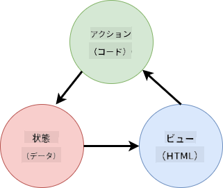
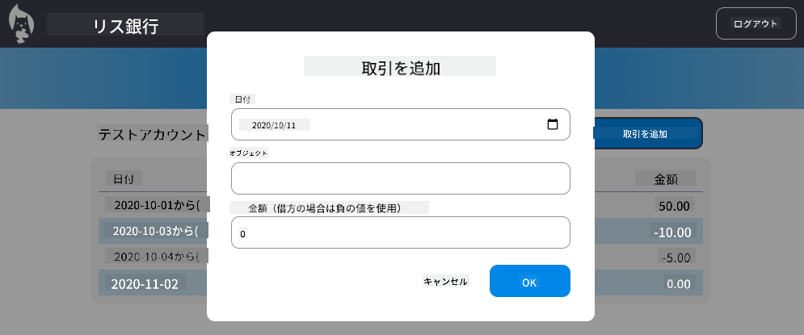

<!--
CO_OP_TRANSLATOR_METADATA:
{
  "original_hash": "5d2efabbc8f94d89f4317ee8646c3ce9",
  "translation_date": "2025-08-28T17:47:19+00:00",
  "source_file": "7-bank-project/4-state-management/README.md",
  "language_code": "ja"
}
-->
# 銀行アプリを作る Part 4: 状態管理の概念

## 講義前クイズ

[講義前クイズ](https://ff-quizzes.netlify.app/web/quiz/47)

### はじめに

ウェブアプリケーションが成長するにつれて、データフローを追跡するのが難しくなります。どのコードがデータを取得し、どのページがそれを使用し、どこでいつ更新が必要なのか...コードが散らかり、保守が困難になることがあります。特に、アプリの異なるページ間でデータを共有する必要がある場合、例えばユーザーデータなどでは、この問題が顕著です。*状態管理*の概念は、あらゆる種類のプログラムで常に存在していましたが、ウェブアプリがますます複雑化するにつれて、開発中に考慮すべき重要なポイントとなっています。

この最終パートでは、これまでに作成したアプリを見直し、状態管理を再考し、ブラウザのリフレッシュをサポートし、ユーザーセッション間でデータを保持できるようにします。

### 前提条件

このレッスンでは、ウェブアプリの[データ取得](../3-data/README.md)パートを完了している必要があります。また、[Node.js](https://nodejs.org)をインストールし、[サーバーAPI](../api/README.md)をローカルで実行してアカウントデータを管理できるようにする必要があります。

サーバーが正しく動作しているかどうかは、ターミナルで次のコマンドを実行して確認できます。

```sh
curl http://localhost:5000/api
# -> should return "Bank API v1.0.0" as a result
```

---

## 状態管理を再考する

[前回のレッスン](../3-data/README.md)では、現在ログインしているユーザーの銀行データを含むグローバル変数`account`を使用して、アプリの基本的な状態の概念を紹介しました。しかし、現在の実装にはいくつかの欠点があります。ダッシュボードでページをリフレッシュしてみてください。何が起こりますか？

現在のコードには3つの問題があります：

- 状態が保持されていないため、ブラウザをリフレッシュするとログインページに戻ってしまいます。
- 状態を変更する関数が複数あり、アプリが成長するにつれて変更を追跡するのが難しくなり、更新を忘れることが容易になります。
- 状態がクリーンアップされないため、*ログアウト*をクリックしてもログインページにいる間にアカウントデータが残っています。

これらの問題を一つずつ解決するためにコードを更新することもできますが、それではコードの重複が増え、アプリがより複雑で保守が難しくなります。そこで、数分間立ち止まって戦略を再考することができます。

> ここで本当に解決しようとしている問題は何でしょうか？

[状態管理](https://en.wikipedia.org/wiki/State_management)は、次の2つの特定の問題を解決するための良いアプローチを見つけることに関するものです：

- アプリ内のデータフローを理解しやすくするにはどうすればよいか？
- 状態データを常にユーザーインターフェースと同期させるにはどうすればよいか（その逆も同様）？

これらを解決すれば、他の問題もすでに解決されているか、解決が容易になる可能性があります。これらの問題を解決するためのアプローチは多数ありますが、ここでは**データとその変更方法を中央集約化する**という一般的な解決策を採用します。データフローは次のようになります：



> データが自動的にビュー更新をトリガーする部分については、[リアクティブプログラミング](https://en.wikipedia.org/wiki/Reactive_programming)のより高度な概念に関連しているため、ここでは取り上げません。深く掘り下げたい場合には良いフォローアップのテーマです。

✅ 状態管理にはさまざまなアプローチを持つ多くのライブラリがありますが、[Redux](https://redux.js.org)はその中でも人気のある選択肢です。大規模なウェブアプリで直面する可能性のある問題とその解決方法を学ぶために、使用される概念やパターンを確認してみてください。

### タスク

まずは少しリファクタリングを行います。`account`の宣言を次のように置き換えます：

```js
let account = null;
```

次のように：

```js
let state = {
  account: null
};
```

このアイデアは、アプリのすべてのデータを単一の状態オブジェクトに*中央集約化*することです。現在の状態には`account`しかないため、あまり変わりませんが、進化の道筋を作ります。

また、それを使用する関数を更新する必要があります。`register()`および`login()`関数では、`account = ...`を`state.account = ...`に置き換えます。

`updateDashboard()`関数の冒頭に次の行を追加します：

```js
const account = state.account;
```

このリファクタリング自体は大きな改善をもたらしませんでしたが、次の変更の基盤を整えることが目的でした。

## データ変更を追跡する

`state`オブジェクトをデータの保存に使用するようにしたので、次のステップは更新を中央集約化することです。これにより、変更内容とその発生時期を追跡しやすくすることが目的です。

`state`オブジェクトに変更を加えないようにするために、それを[*不変*](https://en.wikipedia.org/wiki/Immutable_object)と見なすことも良いプラクティスです。つまり、まったく変更できないということです。また、状態オブジェクトを変更したい場合は、新しい状態オブジェクトを作成する必要があります。これにより、望ましくない[*副作用*](https://en.wikipedia.org/wiki/Side_effect_(computer_science))を防ぐ保護が構築され、アプリに新しい機能（例えば、元に戻す/やり直しの実装）を追加する可能性が開かれます。また、デバッグが容易になります。例えば、状態に加えられたすべての変更をログに記録し、変更履歴を保持してバグの原因を理解することができます。

JavaScriptでは、[`Object.freeze()`](https://developer.mozilla.org/docs/Web/JavaScript/Reference/Global_Objects/Object/freeze)を使用してオブジェクトの不変バージョンを作成できます。不変オブジェクトに変更を加えようとすると、例外が発生します。

✅ *浅い*不変オブジェクトと*深い*不変オブジェクトの違いを知っていますか？[こちら](https://developer.mozilla.org/docs/Web/JavaScript/Reference/Global_Objects/Object/freeze#What_is_shallow_freeze)で読むことができます。

### タスク

新しい`updateState()`関数を作成します：

```js
function updateState(property, newData) {
  state = Object.freeze({
    ...state,
    [property]: newData
  });
}
```

この関数では、新しい状態オブジェクトを作成し、[*スプレッド演算子 (`...`)*](https://developer.mozilla.org/docs/Web/JavaScript/Reference/Operators/Spread_syntax#Spread_in_object_literals)を使用して前の状態からデータをコピーします。その後、[ブラケット記法](https://developer.mozilla.org/docs/Web/JavaScript/Guide/Working_with_Objects#Objects_and_properties) `[property]`を使用して状態オブジェクトの特定のプロパティを新しいデータで上書きします。最後に、`Object.freeze()`を使用してオブジェクトをロックし、変更を防ぎます。現在の状態には`account`プロパティしか保存されていませんが、このアプローチを使用すれば、状態に必要なプロパティをいくらでも追加できます。

初期状態も不変であることを確認するために、`state`の初期化を更新します：

```js
let state = Object.freeze({
  account: null
});
```

その後、`register`関数を更新し、`state.account = result;`の代わりに次のコードを使用します：

```js
updateState('account', result);
```

同様に、`login`関数を更新し、`state.account = data;`の代わりに次のコードを使用します：

```js
updateState('account', data);
```

次に、ユーザーが*ログアウト*をクリックしたときにアカウントデータがクリアされないという問題を修正します。

新しい`logout()`関数を作成します：

```js
function logout() {
  updateState('account', null);
  navigate('/login');
}
```

`updateDashboard()`では、リダイレクト`return navigate('/login');`を`return logout();`に置き換えます。

新しいアカウントを登録し、ログアウトして再度ログインして、すべてが正しく動作することを確認してください。

> ヒント：ブラウザの開発ツールでコンソールを開き、`updateState()`の最後に`console.log(state)`を追加して、すべての状態変更を確認できます。

## 状態を保持する

ほとんどのウェブアプリは、正しく動作するためにデータを保持する必要があります。すべての重要なデータは通常データベースに保存され、サーバーAPIを介してアクセスされます。例えば、私たちの場合はユーザーアカウントデータです。しかし、ブラウザで実行されているクライアントアプリにデータを保持することも、ユーザーエクスペリエンスを向上させたり、読み込みパフォーマンスを改善したりするために興味深い場合があります。

ブラウザにデータを保持したい場合、いくつかの重要な質問を自問する必要があります：

- *データは機密性が高いか？* ユーザーパスワードなどの機密データをクライアントに保存することは避けるべきです。
- *このデータをどのくらいの期間保持する必要があるか？* このデータを現在のセッションでのみアクセスする予定ですか、それとも永続的に保存したいですか？

ウェブアプリ内で情報を保存する方法は、目的に応じてさまざまです。例えば、検索クエリをURLに保存し、ユーザー間で共有可能にすることができます。また、[HTTPクッキー](https://developer.mozilla.org/docs/Web/HTTP/Cookies)を使用して、サーバーと共有する必要があるデータ（例えば[認証](https://en.wikipedia.org/wiki/Authentication)情報）を保存することもできます。

もう一つの選択肢は、データを保存するためのブラウザAPIのいずれかを使用することです。特に興味深いものが2つあります：

- [`localStorage`](https://developer.mozilla.org/docs/Web/API/Window/localStorage)：現在のウェブサイトに特化したデータをセッション間で永続的に保存できる[キー/値ストア](https://en.wikipedia.org/wiki/Key%E2%80%93value_database)。保存されたデータは期限切れになりません。
- [`sessionStorage`](https://developer.mozilla.org/docs/Web/API/Window/sessionStorage)：`localStorage`と同じように動作しますが、保存されたデータはセッション終了時（ブラウザが閉じられたとき）にクリアされます。

これらのAPIはどちらも[文字列](https://developer.mozilla.org/docs/Web/JavaScript/Reference/Global_Objects/String)のみを保存できることに注意してください。複雑なオブジェクトを保存したい場合は、[`JSON.stringify()`](https://developer.mozilla.org/docs/Web/JavaScript/Reference/Global_Objects/JSON/stringify)を使用して[JSON](https://developer.mozilla.org/docs/Web/JavaScript/Reference/Global_Objects/JSON)形式にシリアル化する必要があります。

✅ サーバーを使用しないウェブアプリを作成したい場合、[`IndexedDB` API](https://developer.mozilla.org/docs/Web/API/IndexedDB_API)を使用してクライアントにデータベースを作成することも可能です。これは高度なユースケースや大量のデータを保存する必要がある場合に予約されていますが、使用するのはより複雑です。

### タスク

ユーザーが*ログアウト*ボタンを明示的にクリックするまでログイン状態を維持したいので、`localStorage`を使用してアカウントデータを保存します。まず、データを保存するために使用するキーを定義します。

```js
const storageKey = 'savedAccount';
```

次に、`updateState()`関数の最後に次の行を追加します：

```js
localStorage.setItem(storageKey, JSON.stringify(state.account));
```

これにより、ユーザーアカウントデータが保持され、以前に中央集約化したすべての状態更新のおかげで常に最新の状態になります。この時点で、これまでのリファクタリングの恩恵を受け始めています 🙂。

データが保存されるので、アプリが読み込まれたときにそれを復元することも重要です。初期化コードが増え始めるので、`app.js`の下部にある以前のコードも含めて新しい`init`関数を作成するのが良いアイデアかもしれません：

```js
function init() {
  const savedAccount = localStorage.getItem(storageKey);
  if (savedAccount) {
    updateState('account', JSON.parse(savedAccount));
  }

  // Our previous initialization code
  window.onpopstate = () => updateRoute();
  updateRoute();
}

init();
```

ここでは保存されたデータを取得し、データがあれば状態を適切に更新します。ページ更新中に状態に依存するコードがある可能性があるため、ルートを更新する*前に*これを行うことが重要です。

また、アカウントデータを保持するようになったので、*ダッシュボード*ページをアプリケーションのデフォルトページにすることもできます。データが見つからない場合、ダッシュボードはログインページへのリダイレクトを処理します。`updateRoute()`では、フォールバック`return navigate('/login');`を`return navigate('/dashboard');`に置き換えます。

アプリにログインしてページをリフレッシュしてみてください。ダッシュボードに留まるはずです。この更新により、すべての初期問題を解決しました...

## データをリフレッシュする

...しかし、新しい問題を作り出してしまったかもしれません。おっと！

`test`アカウントを使用してダッシュボードに移動し、次のコマンドをターミナルで実行して新しいトランザクションを作成します：

```sh
curl --request POST \
     --header "Content-Type: application/json" \
     --data "{ \"date\": \"2020-07-24\", \"object\": \"Bought book\", \"amount\": -20 }" \
     http://localhost:5000/api/accounts/test/transactions
```

ブラウザでダッシュボードページをリフレッシュしてみてください。何が起こりますか？新しいトランザクションが表示されますか？

状態は`localStorage`のおかげで無期限に保持されますが、それはログアウトして再度ログインするまで更新されないことも意味します！

これを修正するための一つの戦略は、ダッシュボードが読み込まれるたびにアカウントデータを再読み込みし、古いデータを避けることです。

### タスク

新しい`updateAccountData`関数を作成します：

```js
async function updateAccountData() {
  const account = state.account;
  if (!account) {
    return logout();
  }

  const data = await getAccount(account.user);
  if (data.error) {
    return logout();
  }

  updateState('account', data);
}
```

このメソッドは、現在ログインしていることを確認し、サーバーからアカウントデータを再読み込みします。

次に、`refresh`という名前の別の関数を作成します：

```js
async function refresh() {
  await updateAccountData();
  updateDashboard();
}
```

この関数はアカウントデータを更新し、その後ダッシュボードページのHTMLを更新します。これはダッシュボードルートが読み込まれたときに呼び出す必要があります。ルート定義を次のように更新します：

```js
const routes = {
  '/login': { templateId: 'login' },
  '/dashboard': { templateId: 'dashboard', init: refresh }
};
```

ダッシュボードをリロードしてみてください。更新されたアカウントデータが表示されるはずです。

---

## 🚀 チャレンジ

ダッシュボードが読み込まれるたびにアカウントデータを再読み込みするようになった今、*すべてのアカウント*データを保持する必要があると思いますか？

チームで協力して、`localStorage`に保存および読み込む内容をアプリが動作するために絶対に必要なものだけに変更してみてください。

## 講義後クイズ

[講義後クイズ](https://ff-quizzes.netlify.app/web/quiz/48)

## 課題
[「取引を追加」ダイアログの実装](assignment.md)

以下は、課題を完了した後の例としての結果です：



---

**免責事項**:  
この文書は、AI翻訳サービス [Co-op Translator](https://github.com/Azure/co-op-translator) を使用して翻訳されています。正確性を追求しておりますが、自動翻訳には誤りや不正確な部分が含まれる可能性があることをご承知ください。元の言語で記載された文書が正式な情報源とみなされるべきです。重要な情報については、専門の人間による翻訳を推奨します。この翻訳の使用に起因する誤解や誤解釈について、当社は責任を負いません。