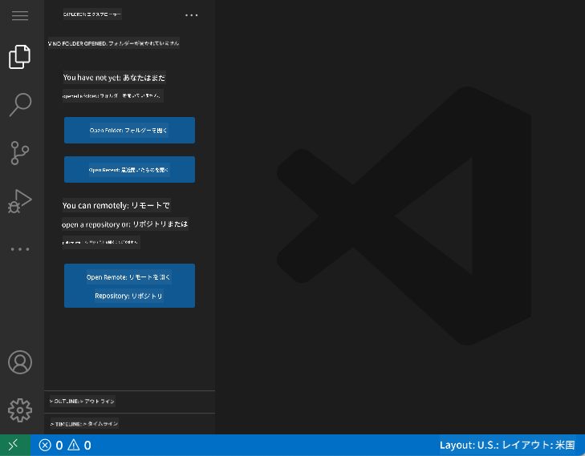
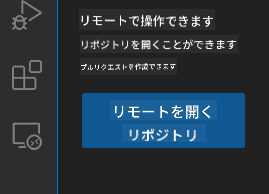
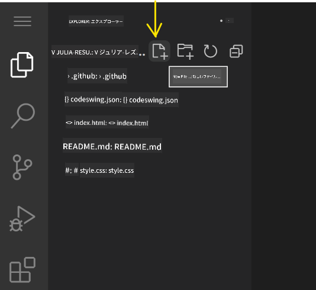
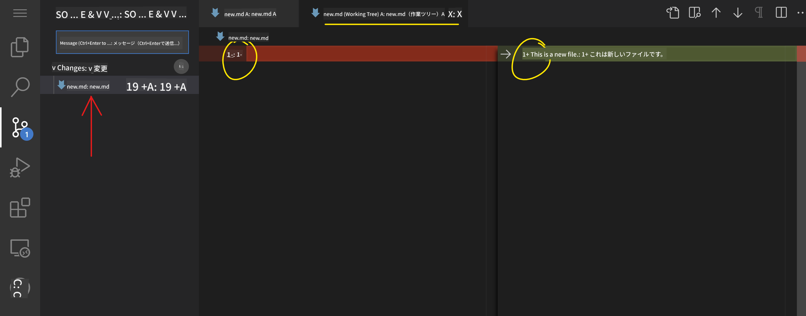
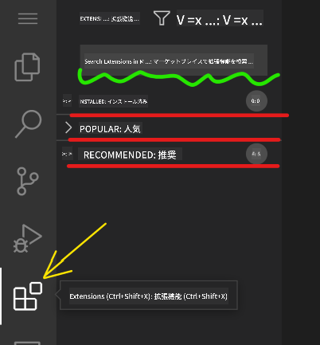
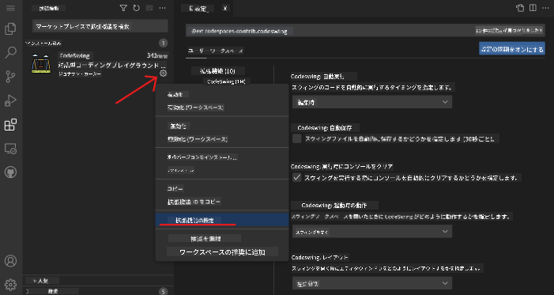

<!--
CO_OP_TRANSLATOR_METADATA:
{
  "original_hash": "1ba61d96a11309a2a6ea507496dcf7e5",
  "translation_date": "2025-08-28T17:58:51+00:00",
  "source_file": "8-code-editor/1-using-a-code-editor/README.md",
  "language_code": "ja"
}
-->
# コードエディタの使用

このレッスンでは、[VSCode.dev](https://vscode.dev) というウェブベースのコードエディタの基本を学びます。これにより、コンピュータに何もインストールせずにコードを変更したり、プロジェクトに貢献したりすることができます。

## 学習目標

このレッスンでは以下を学びます：

- コードプロジェクトでコードエディタを使用する方法
- バージョン管理で変更を追跡する方法
- 開発のためにエディタをカスタマイズする方法

### 前提条件

始める前に、[GitHub](https://github.com) のアカウントを作成する必要があります。[GitHub](https://github.com/) にアクセスし、まだアカウントを持っていない場合は作成してください。

### はじめに

コードエディタは、プログラムを書くための基本的なツールであり、既存のコーディングプロジェクトに協力するためにも重要です。エディタの基本とその機能の使い方を理解すれば、コードを書く際にそれらを活用できるようになります。

## VSCode.dev の使い方

[VSCode.dev](https://vscode.dev) はウェブ上で動作するコードエディタです。ウェブサイトを開くのと同じように、何もインストールせずに使用できます。エディタを使い始めるには、次のリンクを開いてください：[https://vscode.dev](https://vscode.dev)。[GitHub](https://github.com/) にサインインしていない場合は、指示に従ってサインインするか、新しいアカウントを作成してサインインしてください。

ロードが完了すると、次のような画面が表示されます：



画面は左から右に向かって、主に以下の3つのセクションに分かれています：

1. _アクティビティバー_：虫眼鏡アイコン（🔎）、歯車アイコン（⚙️）などのアイコンが含まれています。
2. 展開されたアクティビティバー（デフォルトでは _エクスプローラー_）で、_サイドバー_ と呼ばれます。
3. 右側のコードエリア。

各アイコンをクリックすると、異なるメニューが表示されます。すべて確認したら、_エクスプローラー_ をクリックして元の状態に戻してください。

コードを作成したり既存のコードを変更したりする際は、右側の最も大きなエリアを使用します。このエリアを使って既存のコードを確認することもできます。次にそれを行います。

## GitHub リポジトリを開く

最初に必要なのは、GitHub リポジトリを開くことです。リポジトリを開く方法はいくつかあります。このセクションでは、リポジトリを開いて変更作業を始めるための2つの方法を紹介します。

### 1. エディタを使う

エディタ自体を使ってリモートリポジトリを開きます。[VSCode.dev](https://vscode.dev) にアクセスすると、_"Open Remote Repository"_ ボタンが表示されます：



また、コマンドパレットを使用することもできます。コマンドパレットは、コマンドやアクションの一部の単語を入力して、実行するコマンドを見つけるための入力ボックスです。左上のメニューから _View_ を選択し、_Command Palette_ を選択します。または、次のキーボードショートカットを使用します：Ctrl-Shift-P（MacOS の場合は Command-Shift-P）。


メニューが開いたら、_open remote repository_ と入力し、最初のオプションを選択します。あなたが参加している、または最近開いたリポジトリが複数表示されます。完全な GitHub URL を使用して選択することもできます。次の URL をボックスに貼り付けてください：

```
https://github.com/microsoft/Web-Dev-For-Beginners
```

✅ 成功すると、このリポジトリのすべてのファイルがテキストエディタに読み込まれます。

### 2. URL を使用する

URL を直接使用してリポジトリを読み込むこともできます。たとえば、現在のリポジトリの完全な URL は [https://github.com/microsoft/Web-Dev-For-Beginners](https://github.com/microsoft/Web-Dev-For-Beginners) ですが、GitHub ドメインを `VSCode.dev/github` に置き換えることで、リポジトリを直接読み込むことができます。結果として得られる URL は次のようになります：[https://vscode.dev/github/microsoft/Web-Dev-For-Beginners](https://vscode.dev/github/microsoft/Web-Dev-For-Beginners)。

## ファイルを編集する

リポジトリをブラウザまたは vscode.dev で開いたら、次のステップはプロジェクトの更新や変更を行うことです。

### 1. 新しいファイルを作成する

既存のフォルダ内にファイルを作成するか、ルートディレクトリ/フォルダに作成することができます。新しいファイルを作成するには、保存したい場所/ディレクトリを開き、アクティビティバー（左側）の _'New file ...'_ アイコンを選択し、名前を付けて Enter を押します。



### 2. リポジトリ内のファイルを編集して保存する

vscode.dev を使用すると、ローカルにソフトウェアをロードすることなく、プロジェクトを迅速に更新するのに便利です。コードを更新するには、アクティビティバーにある 'Explorer' アイコンをクリックして、リポジトリ内のファイルとフォルダを表示します。ファイルを選択してコードエリアで開き、変更を加えて保存します。


プロジェクトの更新が完了したら、リポジトリに加えた新しい変更を含む _`source control`_ アイコンを選択します。

プロジェクトに加えた変更を確認するには、展開されたアクティビティバー内の `Changes` フォルダ内のファイルを選択します。これにより、変更内容を視覚的に確認できる 'Working Tree' が開きます。赤はプロジェクトからの削除を示し、緑は追加を示します。



変更に満足したら、`Changes` フォルダにカーソルを合わせて `+` ボタンをクリックして変更をステージングします。ステージングとは、変更を GitHub にコミットする準備をすることを意味します。

変更に満足できない場合や破棄したい場合は、`Changes` フォルダにカーソルを合わせて `undo` アイコンを選択します。

その後、`commit message`（プロジェクトに加えた変更の説明）を入力し、`check icon` をクリックして変更をコミットしてプッシュします。

作業が完了したら、左上の `ハンバーガーメニューアイコン` を選択して github.com 上のリポジトリに戻ります。


## 拡張機能の使用

VSCode に拡張機能をインストールすると、エディタに新しい機能を追加したり、開発環境をカスタマイズしたりして、開発ワークフローを向上させることができます。これらの拡張機能は、複数のプログラミング言語をサポートするのにも役立ち、一般的な拡張機能や言語ベースの拡張機能があります。

利用可能なすべての拡張機能のリストを閲覧するには、アクティビティバーの _`Extensions icon`_ をクリックし、_`Search Extensions in Marketplace`_ とラベル付けされたテキストフィールドに拡張機能の名前を入力します。拡張機能のリストには、**拡張機能名、発行者名、1文の説明、ダウンロード数**、および **星評価** が表示されます。


また、_`Installed folder`_ に展開して以前にインストールしたすべての拡張機能を表示したり、_`Popular folder`_ にある多くの開発者が使用している人気の拡張機能を確認したり、同じワークスペースのユーザーや最近開いたファイルに基づいて推奨される拡張機能を _`recommended folder`_ で確認したりできます。



### 1. 拡張機能をインストールする

拡張機能をインストールするには、検索フィールドに拡張機能の名前を入力し、展開されたアクティビティバーに表示されたらクリックして、コードエリアで拡張機能の追加情報を表示します。

展開されたアクティビティバーの _青いインストールボタン_ をクリックするか、拡張機能を選択してコードエリアに追加情報を読み込んだ後に表示されるインストールボタンを使用してインストールします。


### 2. 拡張機能をカスタマイズする

拡張機能をインストールした後、その動作を変更し、好みに応じてカスタマイズする必要がある場合があります。これを行うには、拡張機能アイコンを選択し、_Installed folder_ に表示される拡張機能をクリックして _**Gear icon**_ を選択し、_Extensions Setting_ に移動します。



### 3. 拡張機能を管理する

拡張機能をインストールして使用した後、vscode.dev はさまざまなニーズに基づいて拡張機能を管理するオプションを提供します。たとえば、以下のような選択が可能です：

- **無効化する:**  _(一時的に拡張機能を無効化し、完全にアンインストールする必要がない場合に使用します)_

    展開されたアクティビティバーでインストール済みの拡張機能を選択 > ギアアイコンをクリック > 'Disable' または 'Disable (Workspace)' を選択 **または** コードエリアで拡張機能を開き、青い Disable ボタンをクリックします。

- **アンインストールする:** 展開されたアクティビティバーでインストール済みの拡張機能を選択 > ギアアイコンをクリック > 'Uninstall' を選択 **または** コードエリアで拡張機能を開き、青い Uninstall ボタンをクリックします。

---

## 課題

[VSCode.dev を使用して履歴書ウェブサイトを作成する](https://github.com/microsoft/Web-Dev-For-Beginners/blob/main/8-code-editor/1-using-a-code-editor/assignment.md)

## 復習と自己学習

[VSCode.dev](https://code.visualstudio.com/docs/editor/vscode-web?WT.mc_id=academic-0000-alfredodeza) とその他の機能についてさらに学びましょう。

---

**免責事項**:  
この文書は、AI翻訳サービス [Co-op Translator](https://github.com/Azure/co-op-translator) を使用して翻訳されています。正確性を追求しておりますが、自動翻訳には誤りや不正確な部分が含まれる可能性があります。元の言語で記載された文書を正式な情報源としてお考えください。重要な情報については、専門の人間による翻訳を推奨します。この翻訳の使用に起因する誤解や誤解釈について、当方は一切の責任を負いません。