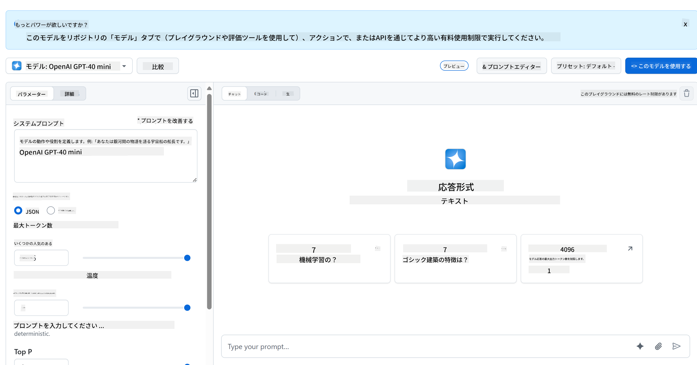
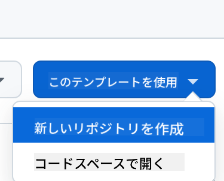
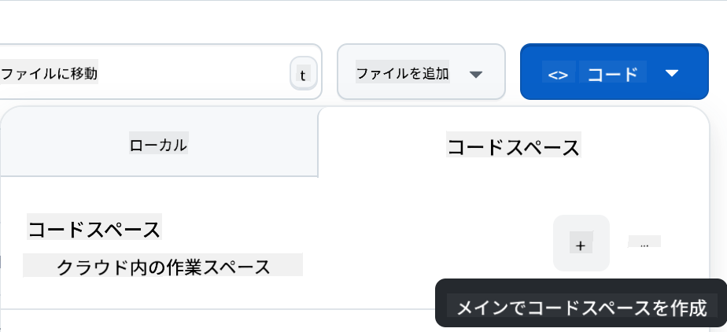

<!--
CO_OP_TRANSLATOR_METADATA:
{
  "original_hash": "11cf36165c243947b6cd85b88cf6faa6",
  "translation_date": "2025-09-01T16:50:47+00:00",
  "source_file": "9-chat-project/README.md",
  "language_code": "ja"
}
-->
# チャットプロジェクト

このチャットプロジェクトでは、GitHub Modelsを使用してチャットアシスタントを構築する方法を示します。

完成したプロジェクトは以下のようになります：


少し背景を説明すると、生成AIを使用してチャットアシスタントを構築することは、AIについて学び始める素晴らしい方法です。このレッスンを通じて、生成AIをウェブアプリに統合する方法を学びます。それでは始めましょう。

## 生成AIへの接続

バックエンドにはGitHub Modelsを使用します。これは無料でAIを利用できる素晴らしいサービスです。プレイグラウンドにアクセスして、選択したバックエンド言語に対応するコードを取得してください。以下はその例です：[GitHub Models Playground](https://github.com/marketplace/models/azure-openai/gpt-4o-mini/playground)



先ほど述べたように、「Code」タブと選択したランタイムを選びます。


### Pythonを使用する場合

この場合、Pythonを選択します。すると以下のコードを取得します：

```python
"""Run this model in Python

> pip install openai
"""
import os
from openai import OpenAI

# To authenticate with the model you will need to generate a personal access token (PAT) in your GitHub settings. 
# Create your PAT token by following instructions here: https://docs.github.com/en/authentication/keeping-your-account-and-data-secure/managing-your-personal-access-tokens
client = OpenAI(
    base_url="https://models.github.ai/inference",
    api_key=os.environ["GITHUB_TOKEN"],
)

response = client.chat.completions.create(
    messages=[
        {
            "role": "system",
            "content": "",
        },
        {
            "role": "user",
            "content": "What is the capital of France?",
        }
    ],
    model="openai/gpt-4o-mini",
    temperature=1,
    max_tokens=4096,
    top_p=1
)

print(response.choices[0].message.content)
```

このコードを少し整理して再利用可能にしましょう：

```python
def call_llm(prompt: str, system_message: str):
    response = client.chat.completions.create(
        messages=[
            {
                "role": "system",
                "content": system_message,
            },
            {
                "role": "user",
                "content": prompt,
            }
        ],
        model="openai/gpt-4o-mini",
        temperature=1,
        max_tokens=4096,
        top_p=1
    )

    return response.choices[0].message.content
```

この関数`call_llm`を使用すると、プロンプトとシステムプロンプトを渡して結果を返すことができます。

### AIアシスタントのカスタマイズ

AIアシスタントをカスタマイズしたい場合は、以下のようにシステムプロンプトを設定して動作を指定できます：

```python
call_llm("Tell me about you", "You're Albert Einstein, you only know of things in the time you were alive")
```

## Web APIを介して公開

素晴らしいですね。AI部分が完成したので、これをWeb APIに統合する方法を見てみましょう。Web APIにはFlaskを使用しますが、他のウェブフレームワークでも問題ありません。以下はそのコードです：

### Pythonを使用する場合

```python
# api.py
from flask import Flask, request, jsonify
from llm import call_llm
from flask_cors import CORS

app = Flask(__name__)
CORS(app)   # *   example.com

@app.route("/", methods=["GET"])
def index():
    return "Welcome to this API. Call POST /hello with 'message': 'my message' as JSON payload"


@app.route("/hello", methods=["POST"])
def hello():
    # get message from request body  { "message": "do this taks for me" }
    data = request.get_json()
    message = data.get("message", "")

    response = call_llm(message, "You are a helpful assistant.")
    return jsonify({
        "response": response
    })

if __name__ == "__main__":
    app.run(host="0.0.0.0", port=5000)
```

ここでは、Flask APIを作成し、デフォルトルート「/」と「/chat」を定義します。「/chat」はフロントエンドが質問を送信するために使用されます。

*llm.py*を統合するには以下を行います：

- `call_llm`関数をインポート：

   ```python
   from llm import call_llm
   from flask import Flask, request
   ```

- 「/chat」ルートから呼び出す：

   ```python
   @app.route("/hello", methods=["POST"])
   def hello():
      # get message from request body  { "message": "do this taks for me" }
      data = request.get_json()
      message = data.get("message", "")

      response = call_llm(message, "You are a helpful assistant.")
      return jsonify({
         "response": response
      })
   ```

   ここでは、受信リクエストを解析してJSONボディから`message`プロパティを取得します。その後、以下の呼び出しでLLMを使用します：

   ```python
   response = call_llm(message, "You are a helpful assistant")

   # return the response as JSON
   return jsonify({
      "response": response 
   })
   ```

素晴らしいですね。必要なことはこれで完了です。

## Corsの設定

バックエンドとフロントエンドが異なるポートで動作するため、フロントエンドがバックエンドにアクセスできるようにするためにCORS（クロスオリジンリソース共有）を設定する必要があります。

### Pythonを使用する場合

*api.py*には以下のコードが含まれています：

```python
from flask_cors import CORS

app = Flask(__name__)
CORS(app)   # *   example.com
```

現在はすべてのオリジンを許可する「*」に設定されていますが、これは安全ではないため、運用環境では制限する必要があります。

## プロジェクトを実行する

プロジェクトを実行するには、まずバックエンドを起動し、その後フロントエンドを起動します。

### Pythonを使用する場合

*llm.py*と*api.py*を使用してバックエンドを動作させるには以下を行います：

- 依存関係をインストール：

   ```sh
   cd backend
   python -m venv venv
   source ./venv/bin/activate

   pip install openai flask flask-cors openai
   ```

- APIを起動：

   ```sh
   python api.py
   ```

   Codespacesを使用している場合は、エディタの下部にあるPortsに移動し、右クリックして「Port Visibility」を選択し、「Public」を選択してください。

### フロントエンドの作成

APIが動作しているので、これに対応するフロントエンドを作成しましょう。最低限のフロントエンドを作成し、段階的に改善していきます。*frontend*フォルダに以下を作成します：

```text
backend/
frontend/
index.html
app.js
styles.css
```

まず**index.html**を見てみましょう：

```html
<html>
    <head>
        <link rel="stylesheet" href="styles.css">
    </head>
    <body>
      <form>
        <textarea id="messages"></textarea>
        <input id="input" type="text" />
        <button type="submit" id="sendBtn">Send</button>  
      </form>  
      <script src="app.js" />
    </body>
</html>    
```

上記はチャットウィンドウをサポートするための最低限の構成です。メッセージを表示するテキストエリア、メッセージを入力するための入力フィールド、バックエンドにメッセージを送信するボタンで構成されています。次に*app.js*のJavaScriptを見てみましょう。

**app.js**

```js
// app.js

(function(){
  // 1. set up elements  
  const messages = document.getElementById("messages");
  const form = document.getElementById("form");
  const input = document.getElementById("input");

  const BASE_URL = "change this";
  const API_ENDPOINT = `${BASE_URL}/hello`;

  // 2. create a function that talks to our backend
  async function callApi(text) {
    const response = await fetch(API_ENDPOINT, {
      method: "POST",
      headers: { "Content-Type": "application/json" },
      body: JSON.stringify({ message: text })
    });
    let json = await response.json();
    return json.response;
  }

  // 3. add response to our textarea
  function appendMessage(text, role) {
    const el = document.createElement("div");
    el.className = `message ${role}`;
    el.innerHTML = text;
    messages.appendChild(el);
  }

  // 4. listen to submit events
  form.addEventListener("submit", async(e) => {
    e.preventDefault();
   // someone clicked the button in the form
   
   // get input
   const text = input.value.trim();

   appendMessage(text, "user")

   // reset it
   input.value = '';

   const reply = await callApi(text);

   // add to messages
   appendMessage(reply, "assistant");

  })
})();
```

コードをセクションごとに説明します：

- 1) ここでは後で参照するすべての要素を取得します。
- 2) このセクションでは、組み込みの`fetch`メソッドを使用してバックエンドを呼び出す関数を作成します。
- 3) `appendMessage`は、ユーザーが入力した内容やレスポンスを追加するのに役立ちます。
- 4) ここではsubmitイベントを監視し、入力フィールドを読み取り、ユーザーのメッセージをテキストエリアに配置し、APIを呼び出し、レスポンスをテキストエリアに表示します。

次にスタイリングを見てみましょう。ここでは自由にデザインできますが、以下は一例です：

**styles.css**

```
.message {
    background: #222;
    box-shadow: 0 0 0 10px orange;
    padding: 10px:
    margin: 5px;
}

.message.user {
    background: blue;
}

.message.assistant {
    background: grey;
} 
```

これらの3つのクラスを使用して、アシスタントからのメッセージとユーザーからのメッセージを異なるスタイルで表示します。インスピレーションを得たい場合は、`solution/frontend/styles.css`フォルダをチェックしてください。

### Base Urlの変更

ここで設定していないものが1つあります。それは`BASE_URL`です。これはバックエンドが起動するまでわかりません。設定方法：

- APIをローカルで実行する場合、`http://localhost:5000`のように設定します。
- Codespacesで実行する場合、`[name]app.github.dev`のようになります。

## 課題

*project*というフォルダを作成し、以下のような内容を含めます：

```text
project/
  frontend/
    index.html
    app.js
    styles.css
  backend/
    ...
```

上記の指示に従って内容をコピーしますが、自由にカスタマイズしてください。

## 解答

[解答](./solution/README.md)

## ボーナス

AIアシスタントの性格を変更してみましょう。

### Pythonの場合

*api.py*で`call_llm`を呼び出す際に、第2引数を変更して好きな内容に設定できます。例えば：

```python
call_llm(message, "You are Captain Picard")
```

### フロントエンド

CSSやテキストも変更してみましょう。*index.html*や*styles.css*で変更を加えてください。

## まとめ

ゼロからAIを使用したパーソナルアシスタントを作成する方法を学びました。GitHub Models、Pythonのバックエンド、HTML、CSS、JavaScriptのフロントエンドを使用して構築しました。

## Codespacesでのセットアップ

- 以下に移動：[Web Dev For Beginners repo](https://github.com/microsoft/Web-Dev-For-Beginners)
- テンプレートから作成（GitHubにログインしていることを確認してください）右上：

    

- リポジトリ内でCodespaceを作成：

    

    これで作業可能な環境が開始されます。

---

**免責事項**:  
この文書は、AI翻訳サービス [Co-op Translator](https://github.com/Azure/co-op-translator) を使用して翻訳されています。正確性を追求しておりますが、自動翻訳には誤りや不正確な部分が含まれる可能性があることをご承知ください。元の言語で記載された文書が正式な情報源とみなされるべきです。重要な情報については、専門の人間による翻訳を推奨します。この翻訳の使用に起因する誤解や誤解釈について、当方は一切の責任を負いません。