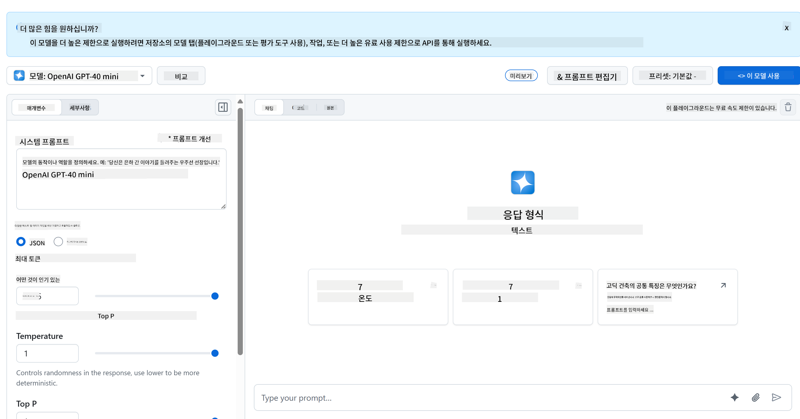
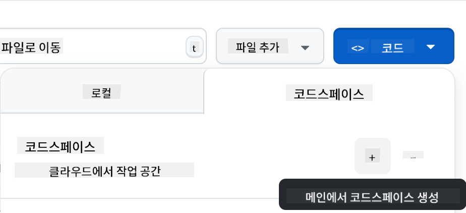

<!--
CO_OP_TRANSLATOR_METADATA:
{
  "original_hash": "11cf36165c243947b6cd85b88cf6faa6",
  "translation_date": "2025-09-01T16:51:08+00:00",
  "source_file": "9-chat-project/README.md",
  "language_code": "ko"
}
-->
# 채팅 프로젝트

이 채팅 프로젝트는 GitHub Models를 사용하여 채팅 어시스턴트를 구축하는 방법을 보여줍니다.

완성된 프로젝트는 다음과 같은 모습입니다:


생성형 AI를 사용하여 채팅 어시스턴트를 만드는 것은 AI를 배우기 시작하는 훌륭한 방법입니다. 이번 레슨에서는 생성형 AI를 웹 앱에 통합하는 방법을 배울 것입니다. 시작해봅시다.

## 생성형 AI 연결하기

백엔드로는 GitHub Models를 사용합니다. 이 서비스는 무료로 AI를 사용할 수 있게 해주는 훌륭한 도구입니다. GitHub Models Playground에 접속하여 선택한 백엔드 언어에 해당하는 코드를 가져오세요. [GitHub Models Playground](https://github.com/marketplace/models/azure-openai/gpt-4o-mini/playground)에서 확인할 수 있습니다.



"Code" 탭과 원하는 런타임을 선택하세요.


### Python 사용하기

이 경우 Python을 선택하면 다음 코드를 가져오게 됩니다:

```python
"""Run this model in Python

> pip install openai
"""
import os
from openai import OpenAI

# To authenticate with the model you will need to generate a personal access token (PAT) in your GitHub settings. 
# Create your PAT token by following instructions here: https://docs.github.com/en/authentication/keeping-your-account-and-data-secure/managing-your-personal-access-tokens
client = OpenAI(
    base_url="https://models.github.ai/inference",
    api_key=os.environ["GITHUB_TOKEN"],
)

response = client.chat.completions.create(
    messages=[
        {
            "role": "system",
            "content": "",
        },
        {
            "role": "user",
            "content": "What is the capital of France?",
        }
    ],
    model="openai/gpt-4o-mini",
    temperature=1,
    max_tokens=4096,
    top_p=1
)

print(response.choices[0].message.content)
```

이 코드를 조금 정리하여 재사용 가능하게 만들어봅시다:

```python
def call_llm(prompt: str, system_message: str):
    response = client.chat.completions.create(
        messages=[
            {
                "role": "system",
                "content": system_message,
            },
            {
                "role": "user",
                "content": prompt,
            }
        ],
        model="openai/gpt-4o-mini",
        temperature=1,
        max_tokens=4096,
        top_p=1
    )

    return response.choices[0].message.content
```

이 `call_llm` 함수는 프롬프트와 시스템 프롬프트를 받아 결과를 반환합니다.

### AI 어시스턴트 커스터마이징

AI 어시스턴트를 커스터마이징하고 싶다면 시스템 프롬프트를 다음과 같이 설정하여 원하는 동작을 지정할 수 있습니다:

```python
call_llm("Tell me about you", "You're Albert Einstein, you only know of things in the time you were alive")
```

## 웹 API를 통해 노출하기

AI 부분은 완료되었습니다. 이제 이를 웹 API에 통합하는 방법을 살펴봅시다. 웹 API로는 Flask를 사용하지만, 다른 웹 프레임워크도 괜찮습니다. 코드를 살펴보겠습니다:

### Python 사용하기

```python
# api.py
from flask import Flask, request, jsonify
from llm import call_llm
from flask_cors import CORS

app = Flask(__name__)
CORS(app)   # *   example.com

@app.route("/", methods=["GET"])
def index():
    return "Welcome to this API. Call POST /hello with 'message': 'my message' as JSON payload"


@app.route("/hello", methods=["POST"])
def hello():
    # get message from request body  { "message": "do this taks for me" }
    data = request.get_json()
    message = data.get("message", "")

    response = call_llm(message, "You are a helpful assistant.")
    return jsonify({
        "response": response
    })

if __name__ == "__main__":
    app.run(host="0.0.0.0", port=5000)
```

여기서는 Flask API를 생성하고 기본 경로 "/"와 "/chat"을 정의합니다. "/chat"은 프론트엔드에서 질문을 전달하기 위해 사용됩니다.

*llm.py*를 통합하려면 다음을 수행해야 합니다:

- `call_llm` 함수 가져오기:

   ```python
   from llm import call_llm
   from flask import Flask, request
   ```

- "/chat" 경로에서 호출하기:

   ```python
   @app.route("/hello", methods=["POST"])
   def hello():
      # get message from request body  { "message": "do this taks for me" }
      data = request.get_json()
      message = data.get("message", "")

      response = call_llm(message, "You are a helpful assistant.")
      return jsonify({
         "response": response
      })
   ```

   여기서는 들어오는 요청을 파싱하여 JSON 본문에서 `message` 속성을 가져옵니다. 그런 다음 LLM을 호출합니다:

   ```python
   response = call_llm(message, "You are a helpful assistant")

   # return the response as JSON
   return jsonify({
      "response": response 
   })
   ```

좋습니다. 필요한 작업을 완료했습니다.

## Cors 설정

백엔드와 프론트엔드가 서로 다른 포트에서 실행되기 때문에 프론트엔드가 백엔드에 호출할 수 있도록 CORS(교차 출처 리소스 공유)를 설정해야 합니다.

### Python 사용하기

*api.py*에 다음 코드가 설정되어 있습니다:

```python
from flask_cors import CORS

app = Flask(__name__)
CORS(app)   # *   example.com
```

현재는 모든 출처를 허용하는 "*"로 설정되어 있습니다. 이는 안전하지 않으므로 프로덕션 환경에서는 제한해야 합니다.

## 프로젝트 실행하기

프로젝트를 실행하려면 먼저 백엔드를 시작한 후 프론트엔드를 시작해야 합니다.

### Python 사용하기

*llm.py*와 *api.py*를 가지고 백엔드를 실행하려면 다음을 수행해야 합니다:

- 의존성 설치:

   ```sh
   cd backend
   python -m venv venv
   source ./venv/bin/activate

   pip install openai flask flask-cors openai
   ```

- API 시작하기:

   ```sh
   python api.py
   ```

   Codespaces를 사용하는 경우 편집기 하단의 Ports로 이동하여 오른쪽 클릭 후 "Port Visibility"를 선택하고 "Public"을 클릭하세요.

### 프론트엔드 작업하기

API가 실행 중이라면 이제 프론트엔드를 만들어봅시다. 최소한의 프론트엔드를 단계적으로 개선해 나갈 것입니다. *frontend* 폴더에 다음을 생성하세요:

```text
backend/
frontend/
index.html
app.js
styles.css
```

먼저 **index.html**을 살펴봅시다:

```html
<html>
    <head>
        <link rel="stylesheet" href="styles.css">
    </head>
    <body>
      <form>
        <textarea id="messages"></textarea>
        <input id="input" type="text" />
        <button type="submit" id="sendBtn">Send</button>  
      </form>  
      <script src="app.js" />
    </body>
</html>    
```

위 코드는 채팅 창을 지원하기 위해 필요한 최소한의 코드입니다. 메시지가 렌더링될 textarea, 메시지를 입력할 input, 메시지를 백엔드로 보내는 버튼으로 구성되어 있습니다. 다음으로 *app.js*의 JavaScript를 살펴봅시다.

**app.js**

```js
// app.js

(function(){
  // 1. set up elements  
  const messages = document.getElementById("messages");
  const form = document.getElementById("form");
  const input = document.getElementById("input");

  const BASE_URL = "change this";
  const API_ENDPOINT = `${BASE_URL}/hello`;

  // 2. create a function that talks to our backend
  async function callApi(text) {
    const response = await fetch(API_ENDPOINT, {
      method: "POST",
      headers: { "Content-Type": "application/json" },
      body: JSON.stringify({ message: text })
    });
    let json = await response.json();
    return json.response;
  }

  // 3. add response to our textarea
  function appendMessage(text, role) {
    const el = document.createElement("div");
    el.className = `message ${role}`;
    el.innerHTML = text;
    messages.appendChild(el);
  }

  // 4. listen to submit events
  form.addEventListener("submit", async(e) => {
    e.preventDefault();
   // someone clicked the button in the form
   
   // get input
   const text = input.value.trim();

   appendMessage(text, "user")

   // reset it
   input.value = '';

   const reply = await callApi(text);

   // add to messages
   appendMessage(reply, "assistant");

  })
})();
```

코드를 섹션별로 살펴보겠습니다:

- 1) 여기서는 나중에 참조할 모든 요소를 가져옵니다.
- 2) 이 섹션에서는 내장된 `fetch` 메서드를 사용하여 백엔드를 호출하는 함수를 생성합니다.
- 3) `appendMessage`는 사용자 입력과 응답을 추가하는 데 도움을 줍니다.
- 4) 여기서는 submit 이벤트를 감지하여 입력 필드를 읽고, 사용자의 메시지를 textarea에 추가하고, API를 호출하여 응답을 textarea에 렌더링합니다.

다음으로 스타일링을 살펴봅시다. 원하는 대로 디자인할 수 있지만, 다음은 몇 가지 제안입니다:

**styles.css**

```
.message {
    background: #222;
    box-shadow: 0 0 0 10px orange;
    padding: 10px:
    margin: 5px;
}

.message.user {
    background: blue;
}

.message.assistant {
    background: grey;
} 
```

이 세 가지 클래스는 메시지가 어시스턴트에서 왔는지 사용자에서 왔는지에 따라 다르게 스타일링합니다. 영감을 얻고 싶다면 `solution/frontend/styles.css` 폴더를 확인하세요.

### Base Url 변경하기

여기서 설정하지 않은 한 가지는 `BASE_URL`입니다. 이는 백엔드가 시작될 때까지 알 수 없습니다. 설정 방법은 다음과 같습니다:

- API를 로컬에서 실행하는 경우 `http://localhost:5000`으로 설정해야 합니다.
- Codespaces에서 실행하는 경우 "[name]app.github.dev"와 같은 형태가 됩니다.

## 과제

*project* 폴더를 생성하고 다음과 같은 내용을 포함하세요:

```text
project/
  frontend/
    index.html
    app.js
    styles.css
  backend/
    ...
```

위에서 설명한 내용을 복사하되, 원하는 대로 커스터마이징하세요.

## 솔루션

[Solution](./solution/README.md)

## 보너스

AI 어시스턴트의 성격을 변경해보세요.

### Python의 경우

*api.py*에서 `call_llm`을 호출할 때 두 번째 인수를 원하는 대로 변경할 수 있습니다. 예를 들어:

```python
call_llm(message, "You are Captain Picard")
```

### 프론트엔드

CSS와 텍스트도 변경하여 *index.html*과 *styles.css*에서 원하는 대로 수정하세요.

## 요약

처음부터 AI를 사용하여 개인 어시스턴트를 만드는 방법을 배웠습니다. GitHub Models, Python 백엔드, HTML, CSS, JavaScript 프론트엔드를 사용하여 이를 구현했습니다.

## Codespaces로 설정하기

- 다음으로 이동하세요: [Web Dev For Beginners repo](https://github.com/microsoft/Web-Dev-For-Beginners)
- 템플릿에서 생성하기(로그인 상태여야 함): 오른쪽 상단에서 선택하세요.

    

- 자신의 저장소에서 Codespace를 생성하세요:

    

    이제 작업할 수 있는 환경이 시작됩니다.

---

**면책 조항**:  
이 문서는 AI 번역 서비스 [Co-op Translator](https://github.com/Azure/co-op-translator)를 사용하여 번역되었습니다. 정확성을 위해 최선을 다하고 있으나, 자동 번역에는 오류나 부정확성이 포함될 수 있습니다. 원본 문서의 원어 버전을 신뢰할 수 있는 권위 있는 자료로 간주해야 합니다. 중요한 정보의 경우, 전문적인 인간 번역을 권장합니다. 이 번역 사용으로 인해 발생하는 오해나 잘못된 해석에 대해 책임을 지지 않습니다.